**Андрей Полянский**

*От редакции: В скором времени будет опубликована вторая часть.*

{/* TODO: добавить <DownloadPDFButton pdfUrl="/pdf/…" /> после публикации PDF статьи */}

## Введение

Основная цель настоящей работы — анализ российской экономики как специфического случая зависимого развития. Насколько известно автору, это первая попытка рассмотреть экономическую зависимость России системно, т. е. с разных сторон и на разных уровнях (включая историю её формирования, в т. ч. обусловленность зависимого развития тем, каким образом происходила трансформация экономики в первые годы после распада СССР). Ранее в экономической литературе как правило рассматривались отдельные стороны и проявления зависимого развития[^1], либо изучалась отечественная экономика в целом, тогда как её зависимость рассматривалась только как один из побочных сюжетов[^2] или вообще оставалась за рамками анализа; кроме того, основная часть работ на эту тему была написана в 90-х и 2000-х, когда новая система взаимоотношений с внешним миром только складывалась, не все её составляющие были окончательно сформированы и явно заметны. В настоящем исследовании сделана попытка проанализировать экономику с точки зрения зависимого развития, но при этом в комплексе, рассмотрев взаимосвязь и взаимное влияние отдельных его составляющих, а также последствия для разных аспектов экономики (в т. ч. объединив результаты существующих исследований в единую систему); кроме того более глубоко проработан ряд тем, которым в существующей литературе уделялось недостаточное внимание.

В первых главах последовательно рассматриваются две ключевые особенности российской экономики: первая — экспортно-сырьевая ориентация — на материале, касающемся внешней торговли, концентрации производства основных экспортных товаров и их ценообразования, вторая — неустойчивость прав собственности, феномен инсайдерского контроля и извлечения инсайдерской ренты — на основе данных об использовании прибыли, накоплении капитала и чистом экспорте. Третья глава посвящена роли государства и влиянию экономической политики на ценообразование на внутреннем рынке, концентрацию капитала в ключевых отраслях, внешнеэкономические отношения, накопление и отток капитала. В четвёртой рассматривается то, как особенности экономики, проанализированные в первых главах, влияют на доходы, личное потребление населения и ситуацию на внутреннем рынке. В пятой — развитие основных отраслей в последние десятилетия, в т. ч. роль импорта в их деятельности, а также экономическая динамика в целом. Заключительная глава посвящена наиболее общим проблемам экономики и некоторым её особенностям, затронутым в первых главах лишь поверхностно.

Надо подчеркнуть, что настоящая работа не является всеобъемлющим исследованием отечественной экономики, а анализирует лишь ключевые определяющие её особенности — т. е. оказывающие наибольшее влияние на её структуру, динамику и т. д. По ходу изложения детально рассматриваются отношения с остальным миром (торговые, финансовые, технологические), поскольку, как будет показано, именно они в наибольшей степени определяют траекторию и особенности экономического развития. При этом многие важные сюжеты пропущены или затронуты только в отдельных аспектах: так, не рассматривается активность российского капитала за рубежом (на постсоветском пространстве, в Восточной Европе, Африке и пр.), положение многих отраслей и секторов экономики (например, НИОКР и науки в целом, сектора информационно-коммуникационных технологий (ИКТ), многих других отраслей сферы услуг). Государственная экономическая политика, а также связи между крупным бизнесом и государством проанализированы лишь в некоторых аспектах (регулирование отношений собственности, ценовое и антимонопольное регулирование, отдельные составляющие финансовой политики — в первую очередь регулирование движения капитала и денежно-кредитная политика, в меньшей степени налоговая и бюджетная политика). Малый и средний бизнес (и в целом хозяйственная деятельность за рамками отраслей и секторов, где доминируют олигополии) рассмотрены достаточно поверхностно — главным образом в контексте вопроса об уровне концентрации капитала и монополизации экономики. Среди отраслей основное внимание уделено тем, чья динамика, на наш взгляд, наиболее ярко характеризует как тенденции, господствовавшие в постсоветский период, так и положение России в мире: промышленности (особенно некоторым её отраслям — например, нефтегазовой), а также, в несколько меньшей степени, посредническим отраслям — торговле и финансовой деятельности.

Основной теоретической рамкой исследования является марксистская экономическая теория с включением некоторых элементов теории зависимого развития. Исходным фактическим материалом служит официальная социально-экономическая статистика российских государственных органов и международных организаций, а также данные исследований и мониторингов — как официальных, так и независимых, включая материалы прессы. Наряду с самостоятельным исследованием текст содержит обобщение работ авторов, изучавших отечественную экономику в первые десятилетия её существования и актуализацию проделанного ими анализа. Основная их часть была написана в 2000-х или посвящена периоду до 2014 года; с тех пор прошло достаточно много времени, но, как будет показано, большинство оценок и выводов по рассматриваемым вопросам подтверждается более новыми данными.

В основном ниже рассматривается период с 2000 по 2021 годы, но нередко затрагивается и более ранний временной отрезок — с начала 90-х или с конца 80-х. В некоторых разделах также будет дан краткий анализ ситуации, складывающейся после 2022 года; при этом тенденции последних лет проанализированы выборочно — в первую очередь в части государственной политики, внешнеэкономических отношений и источников роста, тогда как остальные сюжеты рассмотрены лишь в общих чертах.

## 1. Экспортно-сырьевая ориентация экономики {#ch-1}

### 1.1. Положение российской экономики и её роль на мировом рынке после распада СССР {#sec-1-1}

Для понимания того, как положение России в мировом разделении труда влияет на структуру и особенности её экономики, сначала нужно кратко проследить самые важные изменения, характеризующие её развитие и взаимоотношения с внешним миром, которые произошли после распада СССР.

Вхождение российской экономики в мировой рынок на условиях её подчинения странам центра[^3] привело к разрушению самостоятельной промышленной базы. Основными механизмами этого разрушения были:

1\) Разрыв хозяйственных связей с республиками бывшего СССР и странами СЭВ;

2\) Дробление единых производственных комплексов на отдельные предприятия в ходе приватизации;

3\) Либерализация и резкий рост цен на сырьё, электроэнергию, грузоперевозки и другие товары и услуги (следствием в т. ч. этого стала гиперинфляция, подорвавшая внутренний спрос — как со стороны населения, так и со стороны производственного сектора, который фактически лишился оборотных средств);

4\) Недостаточная доступность кредитов для предприятий реального сектора[^4];

5\) Острая конкуренция со стороны импортной промышленной продукции;

6\) Финансово-экономическая политика правительства:

- крайне высокие налоги для предприятий (в начале-середине 90-х могли составлять 70% и более от их прибыли[^5]);
- жёсткая денежно-кредитная политика, усугублявшая нехватку кредитных средств для производственного сектора[^6];
- задержки выплат заработной платы работникам государственных предприятий и оплаты приобретаемой у частных предприятий продукции[^7];
- преференции для импорта: долгое время пошлины на значительную часть импорта отсутствовали вообще или были крайне низкими[^8], а в середине 90-х курс рубля поддерживался на завышенном уровне[^9], что также давало преимущества импортёрам.

По мнению ряда авторов, многие составляющие этой политики и были нацелены на банкротство предприятий с целью их передачи другим собственникам (в частности, на борьбу с «красными директорами»)[^10]. Но её следствием во многих случаях стало их полное разрушение или резкое сокращение объёмов производства, качества и ассортимента продукции, капиталовложений и т. п.

Результатом обвала промышленного производства стало высвобождение значительной части сырья, ранее использовавшегося для выпуска продукции для внутреннего потребления, и перенаправление этого сырья на внешние рынки. Особенно резко снизилось производство сложной промышленной продукции (в машиностроении, электронной промышленности и т. п.), стало нарастать её технологическое отставание от зарубежных аналогов, что ухудшило её конкурентоспособность. В результате в экспорте стали абсолютно преобладать сырьевые товары (нефть, газ, уголь, лес) и продукция низкого передела (металлы, нефтепродукты, минеральные удобрения и т. д.), а в импорте — машины, оборудование и другая продукция высокого передела. Одновременно с этим резко выросла доля экспорта в экономике: при сокращении валового внутреннего продукта (ВВП) к 1998 году примерно на 40%, а промышленного производства — на 50% величина экспорта уже в середине 90-х превышала показатели 1989-1990 годов в долларовом выражении (в 1995-1997 годах — на 10-20%)[^11].

Надо отметить, что вхождение в мировой рынок и мировое разделение труда именно на этих условиях — т. е. значительная часть вышеперечисленных мер — было прямым следствием плана Международного валютного фонда по переустройству российской экономики, выполнение которого было условием предоставления финансовой помощи российскому правительству[^12]. Навязываемая в таких ситуациях неолиберальная экономическая политика (т. н. «Вашингтонский консенсус»), традиционно приводит к росту сырьевого экспорта и преимущественному развитию соответствующих отраслей, с одной стороны, и упадку отраслей, ориентированных на внутренний спрос из-за ослабления поддержки отечественных производителей и мер по защите внутреннего рынка (импортных пошлин, субсидий и т. д.) — с другой[^13]. Короче говоря, российской экономике предоставляли возможность встроиться в мировой рынок лишь в роли поставщика сырья и полуфабрикатов.

В результате пришли в упадок те отрасли и предприятия, которые не были нужны мировому рынку (т. е. в основном странам центра), тогда как выжили и преуспели те, которые представляли для него интерес — по большей части производители сырья и полуфабрикатов. Таким образом, уже к концу 90-х российская экономика однозначно стала экспортоориентированной и импортозависимой, иначе говоря — вошла в колею зависимого развития или, в терминах мир-системного анализа, стала полупериферийной. В то же время у неё появились и свои специфические особенности, которые также будут рассмотрены далее.

В чём проявляется зависимость или полупериферийность российской экономики[^14]? Её можно проанализировать на разных уровнях и в различных аспектах, таких как:

- структура внешнего товарооборота, роль экспорта и импорта в экономике;
- уровень концентрации капитала в основных отраслях;
- ценообразование на продукцию различных отраслей на внутреннем рынке;
- отношения собственности, их влияние на накопление капитала внутри страны и его вывоз за рубеж;
- государственное регулирование экономики, экономическая и финансовая политика;
- структура экономики (по производству ВВП, первичным доходам и конечному использованию[^15]);
- структура и динамика личного потребления, дифференциация доходов населения;
- отраслевая структура и динамика инвестиций, особенности технологического развития;
- роль иностранного капитала в экономике.

Сначала рассмотрим то, как на экономику влияет торговля с остальным миром, в первую очередь экспорт.

*Рисунок 1. Экспорт и импорт в 1997-2021 годах, % ВВП*[^16]

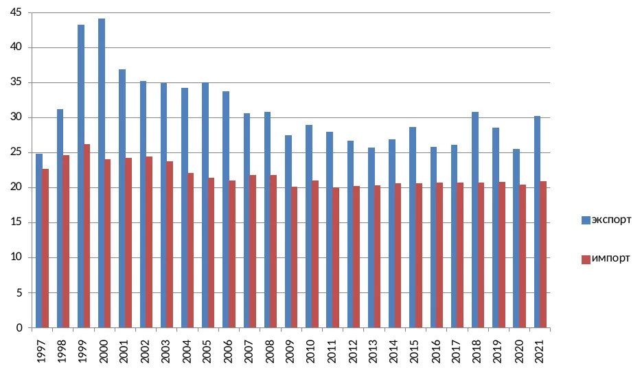

С 1998 по 2008 годы на экспорт приходилось порядка 1/3 ВВП (в отдельные годы — более 40%). В 2010-х его доля сократилась (в основном из-за снижения цен на сырьё) и колебалась в диапазоне 26-31%, в среднем за 2010-2020 годы она составляла 27,4%. Для страны с такой большой экономикой и населением это достаточно высокий показатель; для сравнения, у Китая, одного из двух крупнейших экспортёров мира, она была почти на четверть меньше — 21,8% ВВП в среднем за те же годы[^17]. В прошлом десятилетии по уровню экспортоориентированности Россия была сопоставима с блоком АСЕАН (объединяет страны Юго-Восточной Азии): так, в 2018 году было экспортировано 29% всей созданной внутри страны добавленной стоимости против 30% у АСЕАН[^18].

С 2000 года и практически до настоящего времени полезные ископаемые и металлургическая продукция составляют порядка 3/4 всего экспорта в денежном выражении, ещё около 10% приходится на продовольствие, сельскохозяйственное сырьё, продукцию химической и нефтехимической промышленности (в основном минеральные удобрения, каучук и другие полуфабрикаты); с середины 2000-х экспорт на 85-90% состоит из сырья и полуфабрикатов. Характерна роль российского экспорта в мировой торговле: почти четверть добавленной стоимости, созданной в стране, используется для производства конечной продукции за рубежом, что также является очень высоким показателем[^19]. При этом порядка 40% добавленной стоимости, используемой для производства экспортных товаров, используется не в России, а в других странах — проще говоря, другие страны используют импорт из России для производства своих товаров на экспорт[^20]. Из-за такой высокой доли сырья и полуфабрикатов не менее 20% российского ВВП напрямую зависит от сырьевых цен на мировом рынке[^21], которые весьма нестабильны и определяются экономической конъюнктурой в ведущих потребителях, главным образом — в странах центра и Китае[^22].

*Рисунок 2. Доля сырья и полуфабрикатов в экспорте в 1999-2021 годах, %*[^23]

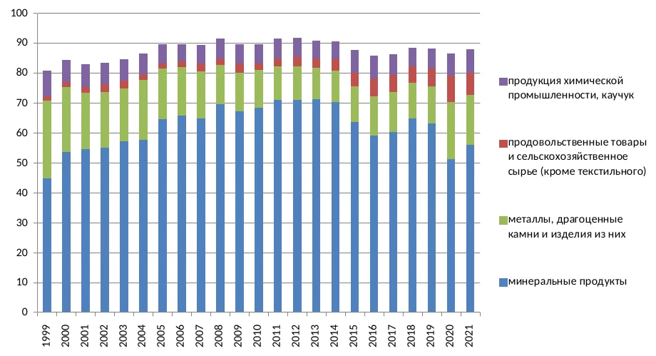

Почему Россия со времён распада СССР экспортирует именно сырьё и полуфабрикаты[^24]? Среди основных факторов, действовавших изначально и продолжающих действовать до сих пор, можно назвать следующие:

1\. Это произошло из-за перечисленных выше событий: приватизации, шоковой терапии, разрыва экономических связей и т. д. Сырьё можно было быстро и выгодно экспортировать[^25]: на него был хороший спрос на внешних рынках, а мировые цены были намного выше внутренних, т. к. в рамках плановой экономики они устанавливались на низком уровне для поддержки обрабатывающей промышленности. Чтобы экспортировать сложную продукцию, надо было, во-первых, восстановить нарушенные производственные связи между предприятиями для её выпуска, а во-вторых, успешно конкурировать на мировом рынке с ТНК стран центра, которые, разумеется, не были в этом заинтересованы[^26].

2\. Даже после стабилизации экономики и возобновления её роста производство и экспорт сырья в любом случае были более простым и прибыльным занятием, т. к. разрыв между его ценами производства в России и ценами мирового рынка сохранялся. К тому же в сырьевых отраслях можно было не тратить время и ресурсы на НИОКР, разработку и продвижение новой продукции, бороться с конкурентами и т. д.[^27]

3\. Есть ещё одна важная причина (неустойчивость прав собственности), которая будет подробно рассмотрена в следующей главе.

Такое внимание к внешней торговле и её структуре обусловлено тем, что её доминирование в экономике и структура товарооборота определяют многие другие аспекты экономического развития, что и будет показано далее.

### 1.2. Экспортная сверхприбыль (рента) {#sec-1-2}

Понятием «экспортная рента» в современной экономической науке определяют разницу между внутренними издержками производства в той или иной стране и ценами мирового рынка[^28]. Чем ниже издержки экспортёров (на рабочую силу, сырьё, расходные материалы и т. д.) внутри страны, тем больше при прочих равных их прибыль. Иначе говоря, для получателей этой ренты выгодно, во-первых, поставлять товары на мировой рынок, в том случае, когда цены там выше, чем на внутреннем, во-вторых, максимально сокращать издержки (или, как минимум сдерживать их рост), например, на заработную плату, поскольку тем самым они удерживают норму прибыли на более высоком уровне[^29].

В марксистской политэкономии понятие «рента» обычно имеет несколько другой смысл, и там описанное явление как правило называется экспортной сверхприбылью. Но суть та же — благодаря более низким затратам (на постоянный или переменный капитал), та или иная продукция имеет меньшие издержки производства, чем в других странах (или по сравнению с условным среднемировым уровнем), и производитель может продавать её на мировом рынке по ценам, более высоким, чем её цена производства, тем самым получая добавочную прибыль[^30].

Надо сказать несколько слов о факторах конкурентоспособности российских экспортёров сырьевых товаров на мировом рынке, т. е. о том, почему их издержки ниже, чем у производителей из других стран. Наряду с относительно невысокой ценой рабочей силы[^31] важную роль играют более низкие издержки на постоянный капитал: во-первых, из-за энергетической и транспортной инфраструктуры, унаследованной от СССР и частично оставшейся в государственной собственности, а частично приватизированной ими, во-вторых, из-за экономии на масштабах — многие предприятия в советское время сразу строились с очень большими объёмами производственных мощностей[^32].

Рассмотрим экспортную сверхприбыль на примере нефти. На рис. 3-4 показан не весь её объём, поскольку приводится не себестоимость добычи[^33], а только внутренние и экспортные цены, но они дают примерное представление о её масштабах. Также из графиков видно, что сверхприбыль резко растёт после падения курса рубля, которое привело к увеличению разрыва между издержками производства и ценами мирового рынка (в т. ч. из-за обесценивания зарплат в реальном выражении) в 1998-1999 годах.

*Рисунок 3. Внутренние и экспортные цены на нефть в 1992-2007 годах, долл.*[^34]

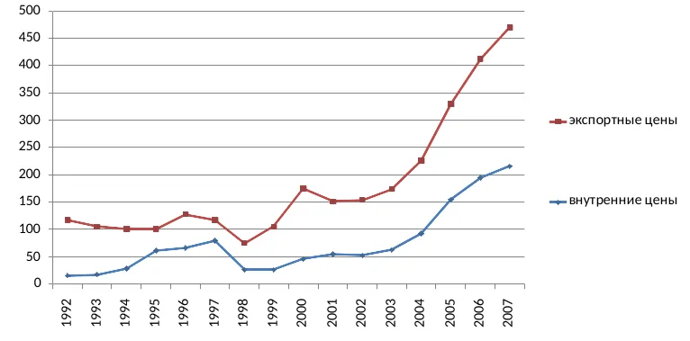

*Рисунок 4. Разница между экспортными и внутренними ценами на нефть в 1992-2007 годах, раз*

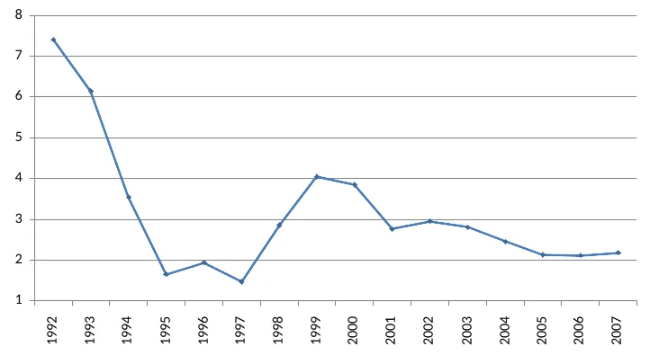

Объёмы и значимость экспортной ренты в масштабах всей экономики можно показать на том же примере энергоносителей — нефти и нефтепродуктов. Если в 1993 году экспортировалось 35% добытой нефти (123 из 354 млн тонн), то в 1998 году — 45% (137 из 303), а с 2003 года — уже больше половины всей добычи. Иначе говоря, в 90-х экспорт был стабилен или рос при снижении производства, а когда производство начало восстанавливаться, он стал расти опережающими темпами. Аналогичная тенденция наблюдается по нефтепродуктам. С середины 2000-х с учётом нефтепродуктов на экспорт уходит около 3/4 всей добытой в стране нефти (для сравнения, к концу советского периода с учётом нефтепродуктов экспортировалось 33% добываемой нефти)[^35].

*Рисунок 5. Производство, внутреннее потребление и экспорт нефти, нефтепродуктов и каменного угля\* в постсоветский период, млн тонн*[^36]

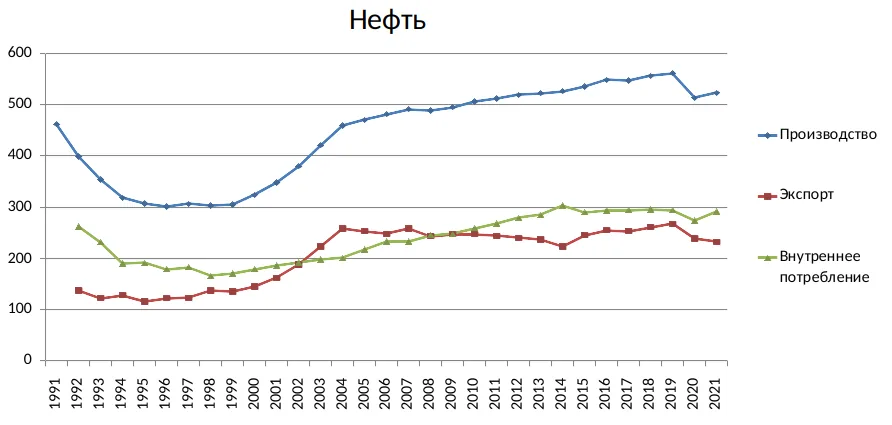

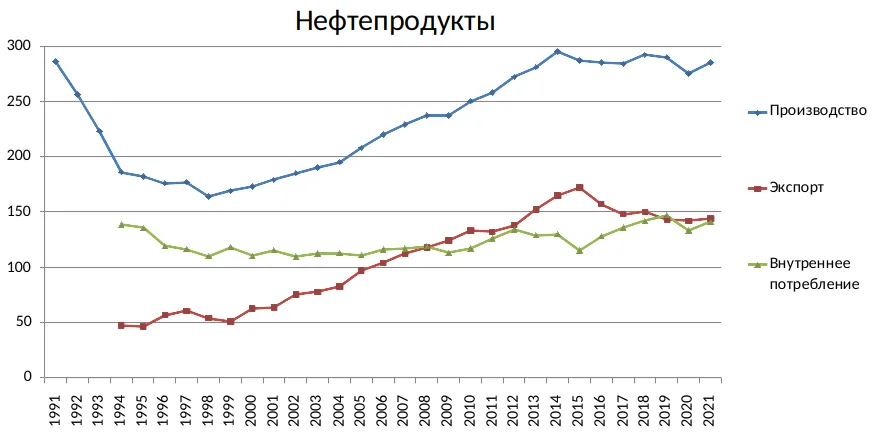

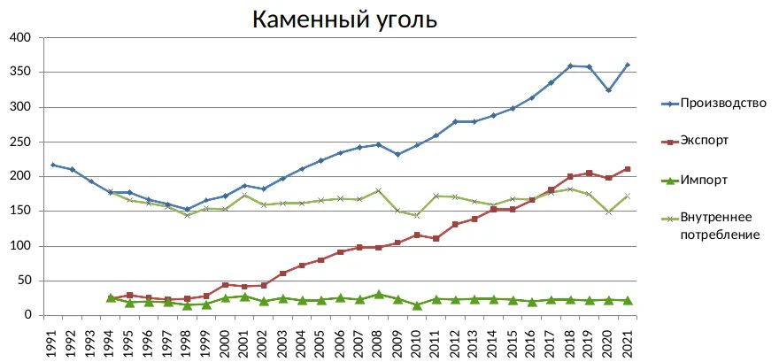

*\* Данные об экспорте и внутреннем потреблении нефти приведены с 1992 года, нефтепродуктов и каменного угля — с 1994 года.*

Похожая ситуация с другой топливно-энергетической продукцией, например, каменным углём, экспорт которого с середины 2010-х составляет более половины всей добычи. Можно заметить, что внутреннее потребление углеводородов во второй половине 2010-х было на уровне начала-середины 90-х (т. е. ниже, чем в последние годы СССР) и в последние годы прошлого десятилетия оно почти не росло, а практически весь прирост производства уходил на экспорт. У многих других товаров значительная или даже основная часть производства также уходит на внешние рынки. Так, минеральных удобрений с 2011 по 2020 годы экспортировалось от 50 до 70% по разным группам; до введения санкций экспорт стали составлял более 40% от её производства; в 2013-2022 годах экспорт алюминия составлял от 70 до 90%; до 2022 года экспортировалось около 2/3 газетной бумаги и фанеры[^37].

Итак, основные особенности производства и экспорта сырьевой продукции: а) большой разрыв между издержками производства внутри страны и мировыми ценами; б) значительная доля экспорта в общем производстве. Для многих отраслей, производящих сырьё и полуфабрикаты, внешние рынки имеют бóльшую привлекательность, чем внутренний рынок страны, т. е. чем внутренний спрос, поскольку объёмы продаж сопоставимы, а цены на первых выше[^38]. В этом отношении экономика страны производит не то, что потребляется внутри неё, а точнее, производит многие товары в объёмах, значительно больших, чем потребляется[^39]. Соответственно, приоритетным для экономики становится не развитие внутреннего рынка, а снижение издержек при производстве экспортных товаров.

### 1.3. Монополизация производства сырья. Ценовой диспаритет {#sec-1-3}

В то же время значительная доля экспорта в общем производстве таких товаров сказывается и на ценах внутреннего рынка. Зачастую производители стремятся к равной или близкой к равной доходности от продаж на мировом и на внутреннем рынке, что ведёт к соответствующему повышению цен на последнем. Отсюда происходит вторая составляющая сверхприбыли сырьевых компаний.

Для понимания того, как формируются цены на такую продукцию на внутреннем рынке, надо учитывать, что производство большинства видов сырья и полуфабрикатов в России сконцентрировано в руках нескольких корпораций. 5 компаний добывают 80% нефти[^40]. Один Газпром добывает около 2/3 всего газа[^41] и является монопольным собственником магистральных газопроводов. 6 корпораций производят 80% стали[^42]. 5 компаний контролируют больше половины добычи угля[^43]. 4 компании контролируют более 70% нефтепереработки. Схожее положение в отрасли минеральных удобрений — от 1 до 3 компаний контролируют более половины производства практически по всем их видам[^44]. Ещё выше концентрация в производстве цветных металлов: почти везде бόльшая часть производства приходится на долю одной компании. Так, практически всё производство российского алюминия контролирует Русал, титана — ВСМПО-АВИСМА, никеля и палладия — Норильский Никель[^45], цинка — УГМК[^46]. Производство меди контролируется тремя компаниями — Норильским Никелем, УГМК и РМК, причём первые две совокупно контролируют более 80%[^47]. Схожая ситуация наблюдается и по некоторым другим видам сырья и полуфабрикатов, например, алмазам, целлюлозе, нефтехимической продукции (бóльшая часть производства которых приходится на компании Алроса, Группа Илим и Сибур соответственно).

Концентрация производства в электроэнергетике несколько меньше, но тоже очень высока. Вся атомная энергетика (около 19% всей выработки) контролируется компанией Росэнергоатом. Вся гидроэнергетика (около 20% выработки) контролируется двумя компаниями — Русгидро и Евросибэнерго (каждая из них также контролирует несколько крупных теплоэлектростанций). Больше половины тепловой энергетики (составляющей около 60% всей выработки) контролируется четырьмя компаниями — Газпром энергохолдинг, Интер РАО, Т Плюс и Юнипро. Таким образом, семь компаний контролируют более 70% общей выработки, а четыре из них (Росэнергоатом, Русгидро, Газпром энергохолдинг и Интер РАО) — более 50%[^48].

*Таблица 1. Концентрация производства некоторых видов сырья и полуфабрикатов*

| Вид продукции | Крупнейшие производители | Контролируемая ими доля производства |
| --- | --- | --- |
| Нефть | Роснефть (включая Башнефть)  Лукойл  Сургутнефтегаз  Газпром (включая Газпром нефть)  Татнефть | около 80% |
| Газ | Газпром | около 2/3 |
| Медь | УГМК  Норильский Никель  РМК | более 90% |
| Сталь | НЛМК  ЕВРАЗ  Северсталь  ММК  Металлоинвест  Мечел | около 80% |
| Уголь | СУЭК  Кузбассразрезуголь  ЕВРАЗ  СДС-Уголь  Сибантрацит | более 50% |
| Переработка нефти | Роснефть (включая Башнефть)  Лукойл  Сургутнефтегаз  Газпром (включая Газпром нефть) | более 70% |

Монополизация в первую очередь в сырьевом секторе обусловлена процессами, происходившими после распада СССР и предопределившими его высокую доходность[^49]. В 90-х наиболее прибыльные предприятия, имевшие больше возможностей для экспорта (т. е. спрос на продукцию которых на мировом рынке был наиболее высок) попадали в руки наиболее сильных криминальных или олигархических групп и лиц, имевших связи с самыми влиятельными чиновниками; все они пытались консолидировать в своих руках максимальное число производств, выпускавших тот или иной вид продукции[^50]. После 2000 года тенденция к монополизации усилилась, когда государственные компании (в первую очередь Роснефть и Газпром) стали разными способами брать под контроль других производителей (самые известные примеры — ЮКОС, Сибнефть, ТНК-BP, Башнефть). В нефтегазовой отрасли их было ещё много[^51], но схожие процессы происходили и в других: например, приобретение Русалом СУАЛа — второго крупнейшего производителя алюминия или расширение других металлургических корпораций за счёт покупки прежде независимых предприятий.

В обрабатывающей промышленности также существуют корпорации, контролирующие значительную долю производства того или иного вида продукции. Но, во-первых, таких компаний куда меньше (и они контролируют производство гораздо меньшей номенклатуры товаров), а во-вторых, как правило, они не могут полностью контролировать рынок из-за конкуренции с импортной продукцией[^52].

Так, по некоторым оценкам, по состоянию на 2010 год 32 крупнейшие финансово-промышленные группы (ФПГ) контролировали практически всё производство нефти и газа, цветных металлов, стали и проката, почти 90% энергетики, более 60% химического производства, 55% горнодобывающей промышленности. При этом те же 32 ФПГ контролировали лишь 1/3 производства в машиностроении, тогда как остальные 2/3 принадлежали независимым компаниям, включая малые и средние, а также иностранным фирмам[^53].

Намного более высокий уровень концентрации в экспортоориентированных сырьевых отраслях подтверждается и официальной статистикой. По данным Росстата, в 2004 году в топливной промышленности (добыча угля, нефти и газа, нефтепереработка) 6 компаний контролировали 39% общего объёма производства, в чёрной и цветной металлургии — 47,5% и 37,5% соответственно, тогда как в химической и нефтехимической промышленности — 18,5%, в машиностроении и металлообработке — 14,5%, в производстве стройматериалов — 8%, в лёгкой и пищевой промышленности — 12 и 8 процентов соответственно[^54]. Данные за более поздний период представлены в табл. 2.

*Таблица 2. Доля крупнейших предприятий в общем объёме производства в некоторых отраслях промышленности в среднем за 2017-2022 годы*[^55]

|  | 3 предприятия | 6 предприятий |
|----|----:|----:|
| **Экспортоориентированные отрасли** |  |  |
| Добыча металлических руд | 60,0 | 83,1 |
| Производство нефтепродуктов | 64,0 | 77,1 |
| Металлургическое производство | 37,3 | 51,8 |
| Производство бумаги и картона | 36,9 | 54,2 |
| **Отрасли внутреннего рынка** |  |  |
| Производство пищевых продуктов | 6,5 | 10,6 |
| Производство текстильных изделий | 16,1 | 25,3 |
| Производство химических веществ и химических продуктов | 20,1 | 30,8 |
| Производство лекарственных средств и материалов, применяемых в медицинских целях и ветеринарии | 17,8 | 28,3 |
| Производство резиновых и пластмассовых изделий | 9 | 15,4 |
| Производство готовых металлических изделий, кроме машин и оборудования | 9,4 | 15,6 |
| Производство компьютеров, электронных и оптических изделий | 22,7 | 29,1 |
| Производство электрического оборудования | 12,9 | 19 |
| Производство машин и оборудования, не включённых в другие группировки | 11,3 | 16,7 |
| Производство автотранспортных средств, прицепов и полуприцепов | 28,6 | 43,5 |
| Производство прочих транспортных средств и оборудования | 23,3 | 39,5 |

Что означает такая концентрация производства сырья и полуфабрикатов для российской экономики? Сырьевые монополии и олигополии могут устанавливать цены на свою продукцию на внутреннем рынке, лишь в небольшой степени учитывая соотношение спроса и предложения, зачастую — на уровне цен мирового рынка, а в некоторых случаях даже выше. В то же время производители конечной продукции не могут поступать так же, поскольку на их рынках существует достаточно высокая конкуренция, в т. ч. со стороны продукции иностранных компаний. Зачастую российские производители в этих отраслях удовлетворяют лишь небольшую часть внутреннего спроса, а основная доля рынка приходится на зарубежные производства — как находящиеся в России, так и импортирующие сюда свои товары[^56].

Таким образом проявляется ключевой для всей российской экономики феномен — *ценовой диспаритет*. Его суть в том, что производители конечной продукции — в основном для внутреннего рынка — систематически передают часть произведённой прибавочной стоимости производителям сырья — экспортёрам. Здесь надо отметить, что для обрабатывающей промышленности сырьё и полуфабрикаты, в т. ч. топливно-энергетические ресурсы, являются основной составляющей затрат, поэтому рост цен на них резко повышает её издержки[^57] (и сократить их без больших затрат на модернизацию невозможно). Таким образом, в экономике (в частности, в промышленности) существуют два сектора. Первый — экспортоориентированный и, как правило, высокомонополизированный. Второй — в большей степени ориентированный на внутренний рынок, при этом достаточно конкурентный, в т. ч. за счёт участия иностранных производителей. Отрасли первого сектора можно назвать *бенефициарами* ценового диспаритета (т. е. получающими выгоду от него), отрасли второго — его *жертвами*[^58]. Таким образом, основная часть прибыли от ценового диспаритета является монопольной сверхприбылью предприятий-экспортёров сырья за счёт отраслей внутреннего рынка[^59].

Установление компаниями из таких отраслей цен на внутреннем рынке в первую очередь из соображений равной доходности с экспортом, а не в зависимости от издержек или внутреннего спроса можно проиллюстрировать множеством примеров. Один из них, уже знакомый — нефть[^60].

*Рисунок 6. Внутренние и экспортные цены на нефть в 1998-2021 годах, долл. за тонну*[^61]

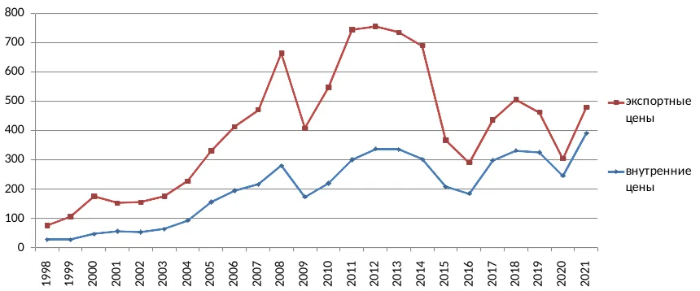

На графике видно, что внутренние цены следуют за экспортными, т. е. на внутреннем рынке производители сырья поднимают и опускают их в зависимости от конъюнктуры мирового рынка. Но также заметно, что разрыв между ними постепенно сокращается: с 3 раз в начале 2000-х до 2-2,5 с середины 2000-х до середины 2010-х и до 1,2-1,5 в конце 2010-х. Так, при почти двукратном падении экспортных цен в 2014-2015 годах внутренние цены (в рублях) продолжили расти, и разрыв между ними снизился с 2,3 до 1,8 раз (при том, что внутреннее потребление нефти в 2015 году по сравнению с 2014 годом сократилось на 5%). Иными словами, производители нефти стали компенсировать потерю части экспортной сверхприбыли за счёт потребителей на внутреннем рынке, повышая цены[^62]. В 2021 году экспортные цены на нефть в долларовом выражении были в полтора раза ниже, чем в 2012-2013 годах, тогда как внутренние — на 15% выше, а разрыв между ними составил всего 1,2 раза[^63].

*Рисунок 7. Разница между экспортными и внутренними ценами на нефть в 1998-2021 годах, раз*

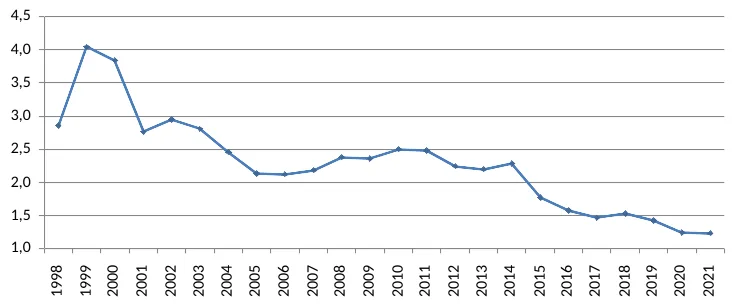

По данным Росстата, в 2022-2023 годах разница между ценами производителей для внутреннего рынка и для экспорта колебалась в диапазоне 15-20%[^64], но с 2022 года экспортные цены перестали публиковаться в статистических сборниках, а доступная статистика цен может не отражать реального положения из-за введённых странами центра санкций (в т. ч. «ценового потолка» на нефть) и мер по их обходу с помощью продаж через посредников. В то же время примечательно, что в 2023 году биржевые цены в России временами превышали цены мирового рынка и были значительно выше экспортных цен: так, в среднем за август цена за баррель Urals на Петербургской товарно-сырьевой бирже составила 85,1 долл., цена Brent на мировом рынке — 86 долл., а экспортная цена Urals — 74 долл.[^65]; в сентябре биржевая цена Urals была немногим выше 95 долл.[^66], тогда как мировые цены на Brent составляли 94 долл., а экспортная цена на Urals — 83 долл.[^67]. Разница между внутренними ценами по данным Росстата и биржевыми ценами обусловлена тем, что на продажи на бирже приходится лишь небольшая долю внутреннего рынка нефти, а основная её часть продаётся внутри вертикально-интегрированных корпораций по внутрифирменным или трансфертным ценам (таким образом эти корпорации могут устанавливать более низкие цены для собственных производств конечной продукции, например, нефтепереработки и нефтехимии)[^68], либо по прямым контрактам.

В прошлом десятилетии цены на бензин на внутреннем рынке были лишь немногим ниже цен экспорта (в 2013-2018 годах разница не превышала 12%), а в 2016 и 2020 годах они были даже выше экспортных цен. В 2020 году внутренние цены на бензин выросли, при том что цены на мировом рынке и экспортные цены рухнули (о причинах этого «феномена» будет сказано ниже). Внутренние цены на дизельное топливо, половина всего производства которого экспортировалась за рубеж, в основном были даже выше экспортных: в 2012-2017 годах — на 8-12%, а в 2020 году — больше чем на треть[^69]. Стоит учитывать, что цены, по которым нефтепродукты покупаются потребителями, например промышленными или сельскохозяйственными предприятиями (в статистике — цены приобретения), намного выше цен производителей, т. к. в них входят транспортные расходы, акцизы и налоги[^70]. Так, в 2017-2019 годах цены приобретения бензина для промышленных и сельскохозяйственных предприятий были в среднем примерно в 1,9 раза выше, чем цены производителей, дизельного топлива — примерно в 1,6 раза выше; ещё больше разница между ценами производителей и ценами приобретения на газ и электричество — 2,5-3 раза и около 2,5 раз соответственно[^71].

*Рисунок 8. Внутренние и экспортные цены на бензин и дизельное топливо в 2012-2021 годах, тыс. руб. за тонну*

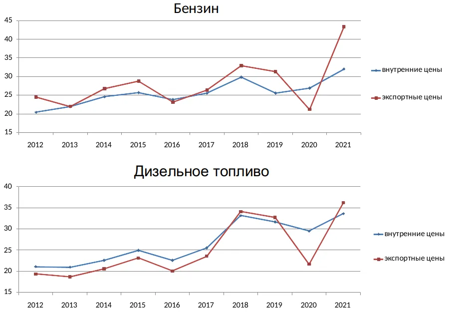

Схожая ситуация с ценами на многие металлы, например, медь и алюминий. На графиках видно, что их производители удерживают внутренние цены приблизительно на одном уровне с экспортными, а зачастую даже несколько выше (так, в 2010-2019 годах внутренние цены на алюминий постоянно превышали экспортные)[^72]. Экспортные цены, в свою очередь, следуют за мировыми (ценами Лондонской биржи)[^73].

*Рисунок 9. Внутренние и экспортные цены на медь и алюминий в 2010-2019 годах, долл. за тонну*

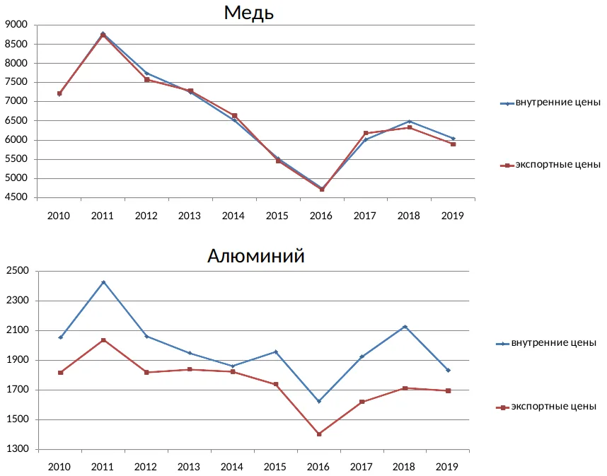

Поддержанию высоких цен на внутреннем рынке при снижении мировых цен также способствуют некоторые государственные меры — от ввозных пошлин до введения полного запрета на импорт определённых товаров (подробнее см. [раздел 3.1](#sec-3-1)).

В некоторых случаях монопольная сверхприбыль также обусловлена другими факторами, например, большой территориальной протяжённостью. Так, в отдельных частях страны продукцию можно купить только у одного-двух производителей, в противном случае её надо транспортировать на очень большие расстояния. Особенно заметен региональный монополизм на рынке нефтепродуктов[^74]. Например, на Дальнем Востоке, где есть всего два НПЗ, контролируемые двумя компаниями, цены на них заметно выше, чем в остальных частях страны[^75]; схожая ситуация наблюдалась в некоторых сибирских регионах[^76].

Стоит отметить, что внутренние цены на многие другие товары — даже если их производство не монополизировано — в большей или меньшей степени зависят от цен мирового рынка в том случае, когда есть возможность выгодно их экспортировать. Если значительная (а тем более основная) часть продукции экспортируется, внутренние цены на неё определяются в первую очередь спросом на мировом рынке и могут приближаться к мировым или даже превышать их (примеры последних лет — древесина[^77] и красная рыба[^78]). Таким образом, причина не в одном только монополизме — в ценообразовании также играет роль доля экспорта в общем производстве или неудовлетворённый спрос на мировом рынке. В конечном счёте движущий мотив производителей в этой ситуации — стремление к получению экспортной сверхприбыли, а его первопричина — разница между их издержками производства в России и ценами мирового рынка[^79]. Но монополизация производства тех или иных товаров значительно усугубляет положение, поскольку в таком случае ценовая конкуренция на внутреннем рынке сокращается или полностью устраняется, и в случае резкого падения цен на мировом рынке внутренние цены могут быть удержаны на более высоком уровне[^80].

Так, по данным Федеральной антимонопольной службы, в каждой пятой отрасли предприятия имеют предрасположенность к картельным соглашениям. В числе отраслей, где такая проблема стоит наиболее остро, назывались, например, торговля нефтепродуктами, металлургия и химическая промышленность[^81]. Ведомство неоднократно выявляло факты картельного сговора и завышения цен в производстве сырья и полуфабрикатов: например, в нефтепереработке, металлургии (расследование против крупнейших компаний отрасли — ММК, Северстали, НЛМК по делу об установлении монопольно высокой цены на металлопродукцию в 2021-2022 годах), угледобыче (с участием крупнейших производителей, таких как СУЭК и «Русский Уголь»), химической промышленности[^82].

Можно предположить, что при капитализме внутренние цены на сырьё в любом случае будут стремиться к мировым. Но это не совсем так. Во многих странах с богатой ресурсной базой, в т. ч. экспортирующих сырьё, внутренние цены на него стабильно ниже цен мирового рынка. Так, среди экспортёров нефти и нефтепродуктов есть те, где внутренние цены примерно равны мировым или выше них, но в основном это богатые страны центра, где высокие цены обусловлены уровнем производственных издержек (как в США и Канаде)[^83] и/или налогами (как в Норвегии). Например, в США оптовые цены на бензин и дизель соответствуют мировым, а розничные цены многие годы (до обесценивания рубля в 2020 и 2023 годах) по номинальному курсу находились примерно на одном уровне с российскими или на 20-30% выше них, а в некоторые периоды (например, в 2009-2010 и 2012 годах) цены на бензин были даже ниже российских[^84]. При этом доходы и покупательная способность населения в США выше в разы, так что по паритету покупательной способности (ППС) бензин в России гораздо дороже, чем в США[^85].

Во многих крупных производителях и нетто-экспортёрах[^86] нефти и нефтепродуктов (Саудовской Аравии, Кувейте, Катаре, Казахстане, Алжире, Малайзии и т. д.) цены на последние значительно ниже мировых[^87]. Так, в Саудовской Аравии, одном из лидеров по экспорту, розничные цены на бензин многие годы были заметно ниже российских и сравнялись с ними только после девальвации рубля в 2023 году и запрета на экспорт нефтепродуктов из России, а цены на дизельное топливо намного ниже до сих пор. Схожая ситуация, например, в Малайзии, где основная часть производства углеводородов потребляется внутри страны, но экспортируются заметные объёмы нефтепродуктов. Сравнивая Россию с относительно крупными по численности населения и/или размеру экономики странами, экспортирующими нефть и нефтепродукты (например, Саудовской Аравией, Малайзией, Алжиром), можно заметить, что розничные цены на последние здесь в основном выше, чем там[^88].

Стоимость электроэнергии для конечных потребителей в России по ППС в 2 раза выше, чем в США, а доля затрат на неё в ВВП страны одна из самых высоких среди крупных экономик — в 2018 году она была выше, чем в США, Канаде, любой из стран ЕС (при том, что электроёмкость ВВП в России, по некоторым оценкам, выше, чем в США всего в 1,14 раза)[^89]. С 2000 по 2015 годы цены на газ и электроэнергию выросли в 2,5 и 1,7 раза выше уровня инфляции соответственно (они продолжали расти быстрее темпов инфляции и в 2016-2020 годах)[^90]. Розничные цены на электроэнергию для промышленности в России по номинальному курсу сравнялись с ценами в США в 2013 году[^91]. Затем из-за падения рубля они стали относительно ниже, но уже в 2019 году разница была незначительной[^92], а в 2020 году 70% промышленных предприятий покупали её по более высокой цене, чем в среднем для промышленности США[^93]. Примечательно, что в том же году цены продолжали расти — причём рост был выше уровня инфляции — несмотря на снижение спроса из-за кризиса[^94]. В 2021 году цены на электроэнергию для предприятий в России по номинальному курсу были примерно такими же, как в Норвегии, Канаде и Китае и выше, чем в Турции и Казахстане (причём с последним разница составляла более полутора раз)[^95]. В 2022-2023 годах они снизились из-за падения курса рубля, но уже в конце 2024 года цены были выше, чем в Норвегии и Китае и почти в полтора раза выше, чем в Казахстане[^96]. Экспорт электроэнергии составляет лишь небольшую долю её производства, поэтому основным фактором ценообразования является уровень монополизма (контроля над рынком) и государственное регулирование отрасли, причём второе, очевидно, в большей степени, чем первое. Тарифы на электроэнергию устанавливаются государственными органами, а крупнейшие компании отрасли, на которые приходится более 50% производства, контролируются государством непосредственно (Русгидро, Интер РАО) или через владеющие ими компании (Росэнергоатом, Газпром энергохолдинг).

*Таблица 3. Индексы цен производителей по отраслям добывающей, обрабатывающей промышленности и в электроэнергетике за 2000-2016 годы*[^97]

<table>
<tbody>
<tr><td>Добыча топливно-энергетических полезных ископаемых</td><td className="num">12,9</td></tr>
<tr><td>Добыча полезных ископаемых, кроме топливно-энергетических</td><td className="num">8,9</td></tr>
<tr><td>Производство, передача и распределение электроэнергии</td><td className="num">8,8</td></tr>
<tr><td>Производство кокса и нефтепродуктов</td><td className="num">7,1</td></tr>
<tr><td>Металлургическое производство и производство готовых металлических изделий</td><td className="num">6,7</td></tr>
<tr><td>Производство прочих неметаллических минеральных продуктов</td><td className="num">6,6</td></tr>
<tr><td>Химическое производство</td><td className="num">6,3</td></tr>
<tr><td>Производство машин и оборудования</td><td className="num">5,8</td></tr>
<tr><td>Производство транспортных средств и оборудования</td><td className="num">5,4</td></tr>
<tr><td>Производство кожи, изделий из кожи и производство обуви</td><td className="num">5,4</td></tr>
<tr><td>Производство пищевых продуктов, включая напитки, и табака</td><td className="num">5,4</td></tr>
<tr><td>Обработка древесины и производство изделий из дерева</td><td className="num">4,6</td></tr>
<tr><td>Текстильное и швейное производство</td><td className="num">4,1</td></tr>
<tr><td>Производство электрооборудования, электронного и оптического оборудования</td><td className="num">4,1</td></tr>
<tr><td>Производство резиновых и пластмассовых изделий</td><td className="num">3,8</td></tr>
<tr><td>Целлюлозно-бумажное производство; издательская и полиграфическая деятельность</td><td className="num">3,3</td></tr>
</tbody>
</table>

Схожая тенденция (за редкими исключениями) наблюдается при сравнении динамики цен в других отраслях промышленности. Чем сильнее ориентация на экспорт и/или монополизация, тем сильнее росли цены: первые места занимают добывающие отрасли, электроэнергетика, нефтепереработка, металлургия и производство металлоизделий[^98]. Наименьший рост цен демонстрировали отрасли с высокой конкуренцией, ориентированные на внутренний рынок — производство изделий из резины и пластмассы, деревообработка, лёгкая промышленность, электронная и электротехническая промышленность. Показательно, что за 2000-2016 годы индекс цен в добыче углеводородов более чем в 2 раза превышает индекс в среднем по обрабатывающей промышленности (12,9 против 5,7)[^99]. Соответственно, со временем ценовой диспаритет возрастал, т. е. доля прибыли, которую отдавали производители конечной продукции, увеличивалась[^100].

Издержки российских потребителей экспортируемого сырья не ограничиваются закупками по более высоким ценам. Зачастую они также вынуждены приобретать продукцию более низкого качества, тогда как лучшее сырьё уходит на экспорт — как это происходило с нефтью[^101]. Кроме того, российский нефтегазовый сектор, по некоторым данным, является крупнейшим потребителем продукции отечественного машиностроения[^102], т. е. выступает не только практически монопольным поставщиком топливно-энергетических ресурсов, но и практически монопсонным покупателем многих видов машиностроительной продукции, что даёт ему дополнительные возможности перераспределять прибавочную стоимость от таких отраслей в свою пользу. То же самое касается различных подрядчиков, которые вынуждены сдерживать рост цен на свои услуги, несмотря на рост издержек, дабы не потерять клиентов[^103].

Разумеется, на уровень цен таких базовых для экономики товаров, как топливо и электроэнергия, в большинстве стран мира прямо или косвенно влияет государство. Но регулирование этой сферы в России (его направленность и эффективность) имеет заметные особенности по сравнению со многими другими странами[^104]. Этот вопрос будет подробно проанализирован в [главе 3](#ch-3), а прежде необходимо рассмотреть ещё один фактор, специфический для российской экономики и отличающий её от большинства стран мира.

## 2. Использование прибыли: накопление[^105] и отток капитала {#ch-2}

### 2.1. Накопление капитала. Неустойчивость прав собственности {#sec-2-1}

Выше говорилось, что экспортно-сырьевая ориентация российской экономики оказывает влияние практически на все её аспекты. В то же время существуют другие важные факторы, определяющие многие её особенности (как сами по себе, так и в сочетании с первым). Фактор, анализу которого посвящена эта глава, наиболее ярко проявляется при рассмотрении одного из основополагающих экономических процессов, определяющих развитие большинства отраслей — накопления капитала[^106].

*Рисунок 10. Валовое накопление и валовое накопление основного капитала в 1989-2021 годах, % ВВП*[^107]

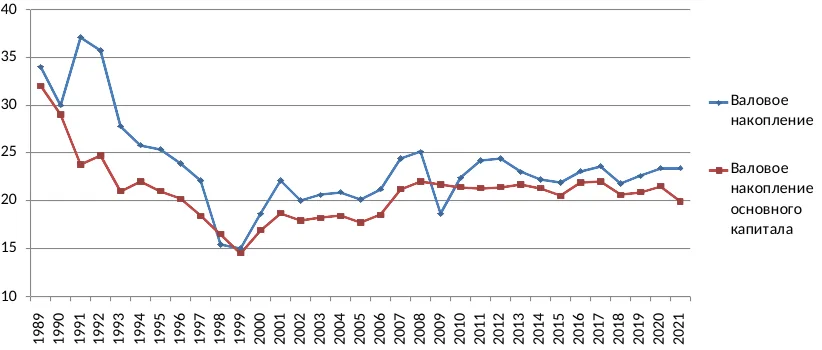

На рис. 10 видно, что доля валового накопления и валового накопления основного капитала в ВВП в постсоветский период даже по официальным данным ниже, чем в последние годы СССР примерно в полтора раза. С 2007 года доля валового накопления основного капитала в ВВП стабилизировалась на уровне, приблизительно соответствующем середине 90-х, оставаясь ниже, чем в 1991-1992 годы. По данным Росстата, уровень инвестиций в основной капитал[^108] в сопоставимых ценах превысил показатели 1991 года только в 2022 году (при том, что в 1991 году он упал почти на 15% по сравнению с предыдущим годом)[^109]. Экономисты, опирающиеся на альтернативные оценки, утверждают, что на деле объём вложений в основной капитал значительно меньше из-за занижения расходов на амортизацию (заниженная оценка стоимости основных фондов ведёт к занижению размера амортизационных отчислений и завышению объёма новых вложений в основной капитал)[^110]. Так, согласно вычислениям на основе данных Евростата, уровень инвестиций в основной капитал в 2002-2011 годах колебался между 10 и 14% ВВП, т. е. был примерно в полтора раза ниже, чем по данным Росстата[^111]. В лучшем случае это соответствует простому воспроизводству основного капитала, т. е. отсутствию его реального роста (расширенного воспроизводства)[^112]. По мировым меркам даже официальный уровень валового накопления основного капитала в России достаточно низок: в 1993-2022 годах он не превышал 18-22% ВВП (а в отдельные годы был ещё ниже), тогда как среднемировой уровень колебался в диапазоне 24-26%, а, например, в Китае в разные годы он составлял от 31 до 44 процентов ВВП[^113].

*Рисунок 11. Отношение валового накопления к валовой прибыли в 1991-2021 годах*[^114]

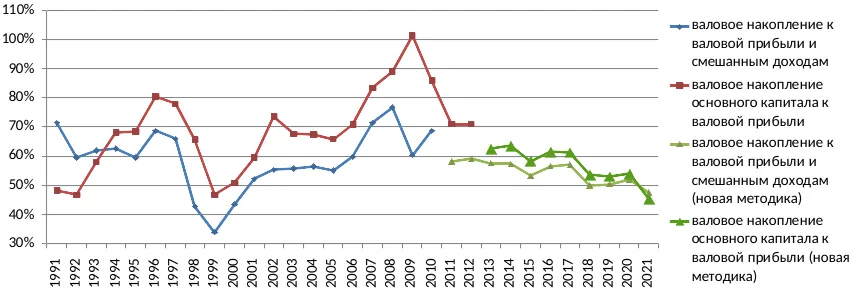

Как можно увидеть на рис. 11, значительная часть прибыли российской экономики не включается в накопление и не расходуется на производственные нужды (включая расширенное воспроизводство капитала). По данным официальной статистики, бóльшую часть постсоветского периода доля валового накопления капитала составляла менее 2/3 валовой прибыли и смешанных доходов[^115], т. е. больше трети расходовалось на другие цели; на валовое накопление основного капитала, как правило, расходовалось не более 70% валовой прибыли, а в 2010-х годах (согласно данным, рассчитанным по новой методике Росстата[^116]) — порядка 55-65% валовой прибыли.

Однако в реальности на накопление уходит ещё меньшая часть прибыли, поскольку российский бизнес разными способами занижает (т. е. частично скрывает) её. Существует множество способов сокрытия прибыли, они хорошо известны и неоднократно описаны в экономической литературе и деловой прессе: завышение текущих издержек (как материальных, так и оплаты разного рода услуг — фиктивных или реальных, но с завышенной стоимостью), использование расходов предприятий на личные нужды руководства и прочие цели, не связанные с производством или сбытом, завышение официальных зарплат менеджмента, завышение стоимости импорта и занижение стоимости экспорта при купле-продаже через контролируемые фирмы[^117] (также существует способ занижения прибыли, связанный со статистическим показателем скрытой оплаты труда, он будет рассмотрен в [разделе 4.1](#sec-4-1)). Примечательно, что в этом отношении поведение российских компаний, особенно экспортёров (занижение стоимости экспорта, завышение стоимости импорта и другие способы сокрытия и вывода прибыли из производственных филиалов за границу) практически идентично поведению корпораций из стран центра в зависимых странах, описанному ещё в середине прошлого века[^118].

По оценкам С. Меньшикова, в начале 2000-х занижение прибыли, не учитываемое официальной статистикой, составляло порядка 10-13% ВВП[^119]. Можно считать, что в дальнейшем оно вряд ли стало намного меньше, поскольку основные способы сокрытия прибыли по-прежнему используются (примеры будут приведены в дальнейшем изложении; один из них, характерный для экспортных производств, подробно рассматривается в [разделе 2.3](#sec-2-3)). Учитывая это, можно оценить долю валовой прибыли и смешанных доходов, используемую для накопления как самое большее 50%. Почему это происходит, и куда уходит оставшаяся часть прибыли?

Есть несколько причин столь низкого уровня накопления. Сначала, в условиях тяжелейшего экономического спада 90-х, не было смысла вкладываться в основной капитал — для тогдашнего уровня спроса существовавшие мощности были излишними[^120]. Но можно заметить, что даже во время бурного роста 2000-х доля накопления была не выше, чем в середине 90-х. Дело в том, что практически сразу начал действовать ещё один фактор, специфический для российской экономики (и экономик некоторых других постсоветских стран) и очень важный для понимания принципов её функционирования. Речь о том, как происходил переход России к капитализму, а именно приватизация средств производства. Поскольку в предшествующий период практически все предприятия находились в государственной собственности, то, каким образом были созданы условия для капиталистического производства, оказало огромное влияние на дальнейшее экономическое развитие[^121].

Итак, в чём особенность российской приватизации? Она была организована частью бывшей советской партгосхозбюрократии (в основном исполнительной властью: на начальном этапе — руководителями министерств экономического блока, в дальнейшем — политическим руководством страны, президентом и правительством), происходила по установленным ей правилам, она же так или иначе контролировала их соблюдение. В результате, с одной стороны, приватизация проводилась в основном в интересах этого слоя и приближенных к нему лиц из нарождающейся буржуазии, а с другой — спровоцировала борьбу за власть и собственность между группами внутри господствующих классов, в частности, бюрократическими, олигархическими и криминальными группировками[^122].

И первоначальный переход госсобственности в частные руки, и дальнейшее её перераспределение происходили с многочисленными нарушениями[^123], что было зафиксировано в известном докладе Счётной палаты под руководством бывшего премьер-министра Степашина[^124]. По сути этот процесс представлял собой экспроприацию государственной собственности (государство выручило от приватизации менее 5% рыночной стоимости своей бывшей собственности, предприятия были проданы по цене, в 20-30 раз меньшей, чем их реальная стоимость[^125]) в пользу дирекции предприятий, представителей государственной бюрократии и лиц, имеющих связи в бюрократических кругах. В большинстве случаев законность владения теми или иными активами можно поставить под сомнение и даже законные права собственности можно оспорить благодаря коррумпированности госаппарата, в частности, судебной системы[^126]. Куда большее значение для осуществления контроля приобретают неформальные связи. Таким образом, при изменении расстановки сил во властных структурах или криминальных кругах, собственность может быть с лёгкостью экспроприирована как в пользу частных лиц, так и в пользу государства или подконтрольных ему компаний (квази-национализация).

Рейдерство или захват бизнеса с использованием силовых методов — вовсе не пережиток прошлого, как можно было бы подумать. Так, по статистике Следственного комитета (СК), в середине 2010-х число уголовных дел о рейдерстве, по которым было завершено следствие, колебалось в диапазоне 100-110 в год, в 2019 году по факту рейдерских захватов было возбуждено 101 дело[^127]. Важно отметить, что термин рейдерство в российском его понимании практически не применяется за пределами бывшего СССР. Английским выражением corporate raid и его аналогами в других языках обозначается недружественное поглощение, как правило, происходящее в рамках закона (во всяком случае, без применения насилия)[^128].

С начала 2000-х для рейдерских захватов в основном используются связи во властных структурах и заказные уголовные дела[^129]. По данным статистики МВД, в конце 2000-х и в середине 2010-х по статьям об экономических преступлениях лишь около 30% возбуждённых уголовных дел передавались в суды и только 10-15% заканчивались приговорами. Это значит, что более 80% возбуждённых уголовных дел либо закрывалось на какой-либо стадии, либо разваливалось в суде[^130]. Немалая часть из них, очевидно, использовалась для давления на предпринимателей.

Собственность не всегда изымается у них полностью — иногда злоумышленники довольствуются долей прибыли, получая её путём вымогательства — в обмен на «крышу». В последние 20-25 лет эта форма рэкета преимущественно используется чиновниками (в т. ч. сотрудниками силовых структур), которые пришли на смену преступным группировкам 90-х[^131]. Соответственно, «взамен» предоставляется мнимое или реальное покровительство, либо игнорируются реальные нарушения закона со стороны бизнеса[^132].

Квази-национализация или передача частных активов в собственность государства в последние годы, как правило, происходит через решения судов о незаконности приватизации или сделок, в результате которых они были получены их нынешними собственниками. Ранее этой передаче зачастую также способствовали уголовные дела против собственников, которые обычно прекращались, когда их активы переходили государству или близким к нему бизнесменам. Наиболее известные случаи — уголовное дело против М. Гуцериева, связанное с его компанией Русснефть[^133], дело против В. Евтушенкова, связанное с компанией Башнефть (изъятие акций Башнефти у принадлежащей ему АФК Система и последующий иск Роснефти о взыскании убытков с последней)[^134]. Характерно, что бывшие государственные активы изымаются не только у тех, кто сам приватизировал их, но и у тех, кто приобрёл их уже у частных собственников[^135]. Другие яркие примеры квази-национализации: банкротство ЮКОСа и приобретение его активов государственными компаниями; переход под контроль госкорпорации Ростех АвтоВАЗа и ВСМПО-АВИСМА[^136]; изъятие в пользу Газпрома активов компаний Нортгаз и Итера[^137]; перераспределение в пользу Газпрома долей в проекте Сахалин-2[^138]. Во всех этих случаях в процессе перераспределения собственности были активно задействованы государственные органы — МВД, прокуратура и другие силовые структуры, суды и даже Минприроды и Росприроднадзор.

Волны перераспределения собственности, инструментами которого становятся рейдерство и квази-национализация, проходят регулярно[^139]. Последняя и одна из самых заметных — изъятие предприятий, приватизированных в 90-х обратно в собственность государства — началась в 2022 году и длится до сих пор; параллельно началось «перераспределение» активов, созданных или приобретённых в России иностранными компаниями[^140]. По некоторым оценкам, за 2022-2025 годы было национализировано более 400 компаний с активами общей стоимостью до 6,5 трлн руб.[^141].

### 2.2. Инсайдерская рента. Отток капитала из страны {#sec-2-2}

Таким образом, положение собственников большинства предприятий в России достаточно неустойчиво[^142]. Вследствие этого многие из них не стремятся к инвестициям с долгим сроком окупаемости, поскольку неизвестно, будет ли предприятие принадлежать им к моменту, когда вложения начнут приносить прибыль[^143]. Гораздо более выгодным становится прямо противоположное — вывод всей прибыли за границу (где её труднее отобрать), расхищение фонда амортизации, распродажа активов, которые не приносят быструю прибыль и т. д.

Именно в этом состоит одна из основных причин того, что значительная доля прибавочной стоимости (прибыли) не идёт на накопление капитала, т. е. не вкладывается в производство. В т. ч. поэтому недостаточен уровень инвестиций даже на многих предприятиях наиболее прибыльных экспортных отраслей — которые, казалось бы, имеют все возможности для выгодных капиталовложений — поскольку они же являются наиболее привлекательными для захвата.

Часть прибыли, которая не идёт на инвестиции, в основном представляет собой отток капитала[^144]. Для обозначения прибавочной стоимости, которая выводится из капитала предприятий их собственниками или менеджментом и не используется для нужд этих предприятий, Р. Дзарасовым и Д. Новоженовым был введён термин инсайдерская рента. Это, разумеется, не рента в привычном понимании слова — речь идёт о том, что предприятие используется главным образом как источник «пассивного» дохода, схожего с рентой землевладельца и не всегда напрямую связанного с производственной деятельностью, а новые вложения в него минимальны. Авторы определяют инсайдерскую ренту как «доход лиц, контролирующих фирму (инсайдеров — *А. П.*), вытекающий из полного или частичного распоряжения финансовыми потоками». «Рента обусловлена не предпринимательской деятельностью как таковой, а контролем над активами»[^145], т. е. не обязательно владеть компанией для её получения. В частности, инсайдерскую ренту могут извлекать менеджеры (например, организуя снабжение или сбыт через подконтрольные им фирмы или вступая в сговор с подрядчиками), обкрадывая таким образом её собственников[^146]:

> «Инсайдерская рента извлекается благодаря увеличению эксплуатации рядовых наёмных работников, сокращению объёмов инвестиций, притеснению миноритарных акционеров, нарушению контрактных обязательств и уклонению от уплаты налогов. Основой таких действий инсайдеров является сочетание экономического и внеэкономического принуждения»[^147].

Для извлечения ренты, как правило, создаётся т. н. система инсайдерского контроля. Она включает в себя многоуровневую и высокоцентрализованную структуру согласования и принятия решений, службы безопасности и аудита внутри предприятия, связи с государственными чиновниками и криминалитетом для защиты от конкурентов, контролирующих органов и других угроз господствующему положению инсайдеров[^148]. Одна из важнейших составляющих такой системы — непрозрачная структура собственности и большая доля офшорных компаний в капитале крупных компаний. Их задача состоит в сокрытии и выводе прибыли, а также в создании препятствий для выявления реальных собственников, предъявления им юридических претензий и возможного отъёма активов[^149].

*Таблица 4. Объём прямых иностранных инвестиций (ПИИ) в Россию и из неё, их основные источники и получатели в 2007-2019 годах, млрд долл.*[^150]

<table>
<tbody>
<tr><td>Из России — всего</td><td className="num">592,4</td></tr>
<tr><td>в т. ч.</td><td className="num"></td></tr>
<tr><td>Кипр</td><td className="num">199,3</td></tr>
<tr><td>Британские Виргинские острова</td><td className="num">91,7</td></tr>
<tr><td><em>Доля 2-х офшоров в исходящих ПИИ</em></td><td className="num"><em>49%</em></td></tr>
<tr><td>В Россию — всего</td><td className="num">484,2</td></tr>
<tr><td>в т. ч.</td><td className="num"></td></tr>
<tr><td>Кипр</td><td className="num">74,2</td></tr>
<tr><td>Британские Виргинские острова</td><td className="num">40,4</td></tr>
<tr><td>Багамские острова</td><td className="num">33,5</td></tr>
<tr><td>Бермудские острова</td><td className="num">31,3</td></tr>
<tr><td><em>доля 4-х офшоров во входящих ПИИ</em></td><td className="num"><em>37%</em></td></tr>
</tbody>
</table>

Так, в 2007-2019 годах 74% прямых инвестиций из России шли в офшоры (Кипр, Британские Виргинские, Каймановы, Багамские острова и пр.) и офшоропроводящие страны (Люксембург, Ирландия, Нидерланды, Великобритания, Сингапур и пр.), 54% — в явные офшоры. То же самое с инвестициями в российскую экономику — 36% прямых инвестиций за эти годы пришло из явных офшоров, а вместе с офшоропроводящими странами — 72%[^151]. В 2000-х богатейшие 0,01% населения держали в офшорах более половины своих активов, а во второй половине 2010-х в таких юрисдикциях хранились капиталы, эквивалентные порядка 50% ВВП страны[^152].

По данным Министерства финансов России, в 2020 году через офшорные компании осуществлялось свыше 40% внешнеторговых операций. По разным оценкам, в середине-конце 2010-х от 60 до 90 процентов крупных частных компаний страны были зарегистрированы в офшорах[^153]. Так, на Кипре зарегистрированы фирмы, владеющие долями в Норникеле, Роснефти, Лукойле. В Швейцарии зарегистрированы экспортные подразделения Газпрома, Северстали, Лукойла, Мечела и других корпораций[^154]. В схожих юрисдикциях располагаются и многие несырьевые компании. Так, в Нидерландах до 2024 года были зарегистрированы компании Яндекс (затем разделённая на нидерландскую и российскую части) и X5 Retail Group (владеющая сетями «Пятёрочка» и «Перекрёсток»), там же расположена штаб-квартира зарегистрированной на Бермудских островах компании Veon, до конца 2022 года владевшей сотовым оператором Вымпелком (Билайн); в Люксембурге зарегистрирован холдинг, контролирующий Альфа-банк, здесь же располагалась группа компаний, до 2025 года владевшая сетью магазинов «О’Кей».

### 2.3. Чистый экспорт и его составляющие {#sec-2-3}

Итак, лишь около половины прибыли уходит на накопление капитала внутри страны, а остальное по большей части выводится за границу. Структура российского ВВП наряду с низкой долей накопления отличается высокой долей чистого экспорта[^155], который характеризует в т. ч. отток капитала (в частности, вывод инсайдерской ренты). Чистый экспорт можно определить как денежный эквивалент тех товаров и услуг, которые страна продаёт на внешние рынки, но взамен которых там товары и услуги не приобретаются. В России весь постсоветский период он был положительным и почти всегда достаточно большим (например, в первой половине 2000-х — 10-13% ВВП, в 2006-2021 годах — 5-10% ВВП). Это значит, что в экономике ежегодно образуется значительный излишек валюты (десятки миллиардов долларов), который не используется внутри неё.

*Рисунок 12. Чистый экспорт товаров и услуг в 1991-2022 годах, % ВВП*

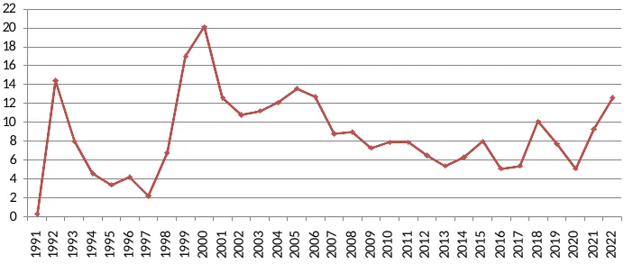

Этот излишек в российской экономике состоит из нескольких частей:

1\. Репатриация прибыли от иностранных инвестиций, т. е. прибыль, которую иностранцы получают от вложений в российскую экономику и не реинвестируют, а выводят обратно в свои страны.

2\. Отток капитала, т. е. его вывоз российскими компаниями и частными лицами — как правило, в офшоры, на счета в зарубежные банки или для покупки зарубежных активов. Главным образом это делается с целью ухода от налогообложения, защиты своих средств от конфискации, использования для финансовых спекуляций на зарубежных рынках. Определённую роль в оттоке капитала также играют спекуляции на российском валютном и фондовом рынках, что было особенно заметно, например, в кризис 2014 года.

Поскольку свыше половины иностранных инвестиций приходит из офшоров и офшоропроводящих стран и по большей части является прежде выведенным и реинвестируемым национальным капиталом, эти две составляющих в значительной мере совпадают.

3\. Накопление валютных резервов государством и Центробанком.

4\. Также к чистому экспорту относятся выплаты по внешним долгам государства и частных компаний. Первая составляющая после погашения к середине 2000-х основной части кредитов, доставшихся в наследство от СССР и взятых в 90-х, не играет большой роли, тогда как выплаты по внешним долгам частного сектора в некоторые периоды (в конце 2000-х, в начале и середине 2010-х) были достаточно существенными — порядка десятков миллиардов долларов в год[^156]. Сюда, в частности, входят выплаты российских компаний по долговым бумагам (облигациям и т. п.), купленным иностранными держателями или размещённым на зарубежных фондовых рынках.

Одно из подтверждений того, что чистый экспорт в основном представляет собой отток капитала (причём в значительной степени нелегальный) — огромная разница между профицитом внешней торговли и объёмом официальных иностранных активов российских компаний и частных лиц. Так, накопленный с начала 90-х до середины 2010-х профицит торгового баланса почти в 8 раз больше чистых иностранных активов (т. е. иностранных активов за вычетом внешних обязательств)[^157].

На рис. 12 видно, что доля чистого экспорта растёт или при падении курса рубля (в начале 90-х, после дефолта 1998 года и в 2014-2015 годах), которое повышает сверхприбыль экспортёров и издержки импортёров, из-за чего сокращается импорт, или при росте сырьевых цен (в середине 2000-х, конце 2010-х и в начале 2020-х). Интересно, что схожая тенденция — пропорциональность оттока капитала из зависимых экономик объёму их внешней торговли (в т. ч. обусловленному изменением цен экспорта) — отмечалась исследователями ещё в середине прошлого века[^158].

*Рисунок 13. Прибыль за вычетом накопления капитала и чистый экспорт в 1991-2015 годах, % ВВП*

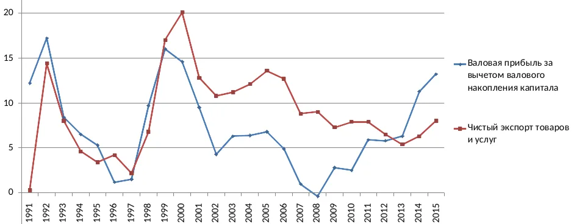

При сопоставлении динамики чистого экспорта и доли прибыли, не потраченной на накопление капитала, явно заметна их корреляция, особенно до 2008 года; после нескольких более или менее аномальных лет наблюдается возврат к прежней тенденции (примерно с 2013 года). Но также видно, что с 1999 до 2012 года чистый экспорт превышал прибыль. Одна из причин этого, вероятно, занижение прибыли (иными способами помимо занижения стоимости экспорта), вторая *—* государственная финансовая политика (в частности, накопление резервов в иностранной валюте и ценных бумагах), которая будет рассмотрена в [разделе 3.2](#sec-3-2).

Как говорилось выше, российские компании разными способами занижают прибыль, и занижение суммарно может достигать 10-13% ВВП. Значительная часть скрытой прибыли как раз приходится на чистый экспорт. Так, одна из основных составляющих оттока капитала (наряду с официальным вывозом, фиксируемым статистикой как иностранные инвестиции) — нерепатриированная часть экспортной выручки[^159]. Нелегальный вывод капитала таким способом происходит при продаже сырья по заниженным ценам[^160] (что является частным случаем трансфертного ценообразования): продукция продаётся из филиала корпорации, расположенного в России, в её же филиал, зарегистрированный в другой стране (например, в офшоре), по заниженной цене для экономии на уплате налога на прибыль и экспортных пошлин. Затем зарубежный филиал продаёт эту продукцию уже по ценам мирового рынка, а полученная прибыль, соответственно, остаётся за границей[^161]. Занижение экспортных цен на основные сырьевые товары по сравнению с мировыми видно из официальной статистики и неоднократно отмечалось исследователями. Например, в 2001 году экспортные цены на нефть и алюминий были занижены почти на 20%, на медь и нефтепродукты — на 7-8%, а на некоторые другие сырьевые товары (уголь, железную руду, необработанный лес) — на 45-50% и более. Общее занижение прибыли только по основным видам экспортного сырья в том году составило порядка 12 млрд долл.[^162] Это соответствует примерно 12% официальной стоимости экспорта за 2001 год или около 32% чистого экспорта (и составляет 4% от всего ВВП страны в том году)[^163]. Иначе говоря, соответствующая доля экспортной выручки была выведена из-под налогообложения и, очевидно, по большей части осталась за границей. В 2010-х разница между экспортными и мировыми ценами (и, соответственно, занижение прибыли экспортёрами) была несколько меньше, но она сохранялась[^164].

Точно так же офшорный филиал может закупать необходимое оборудование и материалы по ценам мирового рынка, а затем продавать их своей материнской компании в России по завышенной цене — таким образом, прибыль последней тоже занижается и её часть уводится в офшор[^165].

Занижение прибыли и вывод её части из экономики продолжаются и после 2022 года, чему поспособствовало введение странами центра и их союзниками «ценового потолка» на нефть. Зачастую нефть официально продаётся российскими компаниями по ценам ниже него, но её покупатели — их же структуры (трейдеры и другие посредники), зарегистрированные за рубежом — затем продают её по более высокой цене, оставляя разницу себе[^166].

### 2.4. Экспортно-сырьевая ориентация экономики, монополизация производства сырья и неустойчивость прав собственности: их взаимное влияние и последствия для накопления капитала {#sec-2-4}

Неустойчивость прав собственности и краткосрочность горизонта планирования становятся ещё одной причиной большей заинтересованности крупного российского капитала в развитии сырьевых отраслей и экспорте их продукции. Большой спрос на сырьё на мировом рынке позволяет получать быструю прибыль (которую можно сразу оставить за рубежом, благодаря торговле через подразделения и подконтрольные компании, расположенные в офшорах), тогда как производство и продвижение на рынок (и на внутренний, и тем более на внешний) конкурентоспособной конечной продукции требует долгой подготовки и значительных вложений: исследований, конструкторских разработок, испытаний, сертификации и т. п. К тому же любой технологичный товар неизбежно столкнётся с ожесточённой конкуренцией со стороны транснациональных корпораций стран центра, которые монополизировали производство многих промышленных товаров[^167].

С другой стороны, положение, которое Россия заняла в международном разделении труда, само по себе делает более выгодным захват и максимально интенсивную эксплуатацию существующих средств производства, в противоположность накоплению производственного капитала, созданию новых активов и модернизации старых. Добыча и первичная переработка сырья, как правило, требуют меньших вложений, чем высокотехнологичные обрабатывающие производства *—* во всяком случае в России и других республиках бывшего СССР, где уже существует большой объём соответствующих мощностей, которые достаточно поддерживать и расширять в случае благоприятной конъюнктуры[^168]. Для получения экспортной ренты от эксплуатации имеющихся мощностей и продажи ресурсов не нужны ни передовые технологии, т. е. большие вложения в НИОКР[^169], ни значительное число высококвалифицированных работников[^170], главное — удержать контроль над её источниками. Соответственно, гораздо более важным для успешной экономической деятельности становится не накопление капитала, а административный и силовой ресурсы — факторы преимущественно внеэкономические[^171]. Таким образом, экспортно-сырьевая структура экономики становится одним из обстоятельств, определяющих существующую расстановку сил внутри господствующих классов — доминирование государственной бюрократии и необходимость связей с ней для успешного ведения дел[^172].

Другой важный фактор, предопределяющий низкий уровень инвестиций — стремление снизить расходы на постоянный капитал в целях увеличения экспортной сверхприбыли. Выше говорилось, что во многих сырьевых производствах эти издержки изначально были ниже, чем у конкурентов из других стран, благодаря созданной в советское время относительно развитой инфраструктуре (и в некоторых случаях — экономии на масштабах). Отсюда очевидное стремление сохранить их низкий уровень и в дальнейшем, невзирая на необходимость нести расходы на обновление больших объёмов существующего капитала. Первые годы после приватизации вложения в постоянный капитал были незначительными (вложения в основные фонды вообще могли быть близкими к нулю). Это предопределило дальнейшее поведение многих собственников, не желающих снижать норму прибыли из-за расходов на то, что в ходе приватизации или первое время после неё стоило им очень дёшево. Судя по всему, также влияют социально-психологические факторы, отличающие новых владельцев средств производства от классической буржуазии других стран, которая сама создала или унаследовала свои предприятия и воспринимает их как своё дело и своё достояние. В нашем случае собственность, полученная за бесценок благодаря связям и сомнительным приватизационным схемам, воспринималась как средство получения лёгких прибылей здесь и сейчас, без больших вложений в её развитие[^173]. Зачастую такое отношение приводит не только к отсутствию новых инвестиций, но и к снижению амортизационных отчислений до уровня меньшего, чем необходимо даже для простого воспроизводства основного капитала[^174] (на распространённость этой стратегии указывает как официальная статистика износа основных фондов в производственных отраслях, так и результаты опросов руководителей предприятий[^175]).

Доминирование и борьба инсайдеров разного уровня на крупных предприятиях также сдерживают инвестиционную активность и снижают её эффективность. Выстраивание системы инсайдерского контроля (а также конфликты из-за распоряжения финансовыми потоками и извлечения ренты) способствует назначению руководителей и специалистов разных уровней в первую очередь по принципу лояльности, а не компетентности, что приводит к снижению качества управления. В сочетании со сложной и многоуровневой системой согласований и проверок это замедляет инвестиционные процессы и увеличивает соответствующие издержки[^176].

Низким капиталовложениям и техническому застою в экспортно-сырьевых отраслях наряду с привлекательностью активов для захвата также способствует монополизм, т. е. низкий уровень конкуренции между производителями (а в некоторых случаях практически полное её отсутствие)[^177]. Монополизацию как одно из основных препятствий для технологического прогресса и роста производительности выделяют как экономисты[^178], так и технические специалисты — например, в области автоматизации[^179].

Можно в очередной раз привести пример нефтяной отрасли. Инновационная активность в российской нефтедобыче и её технологичность находятся на сравнительно низком уровне. Так, по состоянию на середину 2010-х около 40% всех буровых комплексов были устаревшими, произведёнными ещё в 80-х годах[^180]. В те же годы прирост нефтедобычи в результате применения новых технологий составлял лишь 5-6% всего производства. Как отмечают исследователи,

> «в рамках существующих институциональных условий крупным компаниям ... быстрее и проще — эффективнее с их позиций — нарастить ресурсную базу за счёт преференций при получении новых лицензий, поглощения мелких игроков, а не проведения геологоразведочных работ на основе новых методов с принятием значительных рисков»[^181].

По данным опроса руководителей промышленных предприятий, проведённого компанией Делойт в 2018 году, нефтегазовый сектор был аутсайдером в плане сложности внедрённых и внедряемых технологий среди всех отраслей экономики[^182]. Как следствие — низкая производительность по сравнению с сопоставимыми по размеру компаниями не только из стран центра, но и из полупериферийной Бразилии. Так, в 2016 году Газпром, Роснефть и Лукойл добывали 18-21 баррелей нефтяного эквивалента в сутки в расчёте на одного занятого, тогда как BP и Shell — 41-43, ExxonMobil — 56, Chevron — 47, Petrobras — 39. В денежном выражении разница была ещё выше: 0,2 млн. долл. выручки в год на одного занятого у Роснефти и Газпрома, 0,8 у Лукойла против 2,7-2,9 у Shell, BP и ExxonMobil, 2 у Chevron и 1,1 у Petrobras[^183].

В некоторых случаях у монополистов-экспортёров стагнирует не только технологический уровень, но и объёмы производства. К примеру, у Газпрома добыча газа не росла или даже снижалась в течение большей части прошлого десятилетия — в 2019 и 2021 годах было добыто примерно столько же, сколько в 2010-2011 годах и меньше, чем в 2006-2008 годах. Хотя объёмы добычи газа в России постепенно росли, весь этот рост происходил за счёт других производителей (в т. ч. независимых компаний)[^184]. При этом внутри страны есть значительный неудовлетворённый спрос со стороны населения, однако газификация продвигается крайне медленно[^185] и, как правило, под давлением государства, поскольку как минимум до 2022 года внутренний рынок был для Газпрома гораздо менее привлекательным по сравнению с внешними.

Важный фактор — связи многих крупных корпораций с государством, что позволяет им добиваться экономических преимуществ, применяя административный ресурс или получая государственную поддержку вместо повышения эффективности и технологичности производства. Свою роль также играет неэффективная антимонопольная политика, особенно в производственной сфере[^186].

Забегая вперёд, также можно отметить ещё одну причину низкого уровня накопления капитала в российской экономике — отсутствие стимулов к капиталовложениям для модернизации и повышения производительности труда из-за низкой стоимости рабочей силы. Она значительно снизилась в постсоветский период (подробнее об этом будет сказано в [главе 4](#ch-4)), кроме того, благодаря деиндустриализации образовалась большая резервная рабочая армия, что также позволяет удерживать зарплаты на низком уровне[^187].

Следствие низкого уровня накопления — недостаточный спрос на продукцию отраслей, производящих средства производства. Это также ведёт к технологическому отставанию промышленности: в одних отраслях — непосредственно, из-за отсутствия их модернизации и зачастую даже простого воспроизводства основного капитала, в других (в производстве средств производства) — опосредованно, из-за недозагрузки мощностей, низкой прибыльности, нехватки средств для модернизации и разработки новой, более современной продукции.

## 3. Государственная экономическая политика {#ch-3}

Третий из основных факторов, определяющих специфические особенности российской экономики — действия государства. При поверхностном взгляде он может показаться чисто надстроечным, но это не так. Как в целом действия государства не относятся только к области надстройки (особенно начиная с эпохи монополистического капитализма)[^188], так и конкретно в нашем случае, государственное регулирование экономики и зачастую прямое управление её субъектами и экономическими отношениями вообще оказывают непосредственное воздействие как на экономические процессы внутри страны, так и на внешнюю торговлю, трансграничное движение капитала и т. п. Можно даже сказать, что совокупность трёх указанных факторов образует то основание, на котором в России стоят экономические отношения в целом и производственные отношения в частности.

### 3.1. Особенности регулирования внутреннего рынка {#sec-3-1}

Как уже было сказано, большое значение для ценообразования на внутреннем рынке сырья и некоторых других базовых товаров имеет государственная экономическая политика (в частности, регулирование[^189]), т. е. в конечном счёте — интересы господствующих классов. В России наряду с монополизацией сырьевых производств и сложившейся в 90-х ориентацией на экспорт свою роль сыграли стремление лидирующей фракции правящего класса, завладевшей государственным аппаратом, поставить под контроль доходы от самых прибыльных экспортных предприятий и незаинтересованность (или по меньшей мере очень небольшая реальная заинтересованность) в развитии производства сложной продукции[^190].

Государство контролирует значительную часть монополий и олигополий в производстве сырья и полуфабрикатов, а также энергетике — например, Роснефть, Газпром (а также Газпром нефть и другие дочерние компании Газпрома, такие как упомянутый выше Газпром энергохолдинг), Алросу, ВСМПО-АВИСМА, Росатом, Русгидро, Интер РАО. Некоторые из них находятся под контролем властей регионов (например, Татнефть — одна из крупнейших нефтяных компаний страны[^191]). Также в собственности государства находятся естественные монополии, управляющие транспортной и энергетической инфраструктурой: Транснефть, обладающая монополией на магистральные трубопроводы для перекачки нефти и нефтепродуктов, Российские железные дороги (РЖД), владеющая железнодорожной инфраструктурой общего пользования[^192], и Россети, по сетям которой передаётся более 80% всей вырабатываемой в стране электроэнергии[^193].

Кроме того, часть крупнейших и наиболее прибыльных компаний, формально находящихся в собственности государства (например, Роснефть, Газпром, Интер РАО), контролирует и использует в своих экономических и политических интересах ведущая группировка правящего класса во главе с президентом и его окружением[^194] (впрочем, с ними связаны и некоторые частные сырьевые корпорации[^195]).

Таким образом, высокая прибыль этих компаний обеспечивает большие поступления в бюджет государства как их крупнейшего акционера или единоличного владельца, а также способствует росту доходов курирующих соответствующие отрасли и компании чиновников и их окружения (как премий и других официальных выплат, так и инсайдерской ренты, извлекаемой из подопечных компаний). Но это не единственная и зачастую не основная причина. Не менее важно, что в нынешней конфигурации налоговой системы государству выгодны высокие цены на сырьё. В 2002 году для наполнения бюджета был введён налог на добычу полезных ископаемых (НДПИ), ставка которого для нефти была установлена в долларах и привязана к мировым ценам[^196]. Благодаря этому произошло перераспределение части прибыли нефтяных компаний в пользу государства. Но также налог спровоцировал рост цен на внутреннем рынке, поскольку он взимается не с одной только экспортируемой нефти, а со всей, добытой на территории страны; как следствие, его ставка стала закладываться в стоимость всей продукции вне зависимости от того, где она реализуется[^197]. Таким образом, мировые цены на нефть становятся фактором роста внутренних цен[^198].

В ценообразование на рынке нефтепродуктов помимо НДПИ вносят вклад акцизы на топливо, которые по сути являются косвенным налогом на эту продукцию (в дополнение к НДС). Они также приводят к удорожанию для потребителей, в т. ч. промышленных, т. е. к дополнительному перераспределению их доходов в пользу государства. Достаточно красноречиво государственную экономическую политику характеризует то, что акцизы, НДПИ и другие налоги составляют около 70% розничной цены бензина. Для сравнения, в Канаде на налоги приходится около 30% розничной цены бензина, в США — 15-18%[^199].

В середине 2000-х и почти все 2010-е годы добыча полезных ископаемых давала около 30% всех налоговых платежей и сборов, поступивших в консолидированный бюджет, в конце прошлого десятилетия — около 35%[^200] (и это без учёта налогов и акцизов на нефтепродукты). Нефтегазовые доходы (НДПИ и налог на прибыль для нефтегазовых компаний, таможенные пошлины на экспорт углеводородов, акцизы) в 2003-2019 и 2021-2024 годах составляли более 30% доходов федерального бюджета, а в 2012-2014 годах они превышали 50%[^201].

Согласно одному из подходов к анализу ценообразования при продаже нефти на внутреннем рынке можно определить природную ренту как разность между экспортной ценой и суммой цены самофинансирования (текущие затраты на добычу и транспортировку с учётом амортизации) и нормативной прибыли. В этом случае рента делится между нефтяными компаниями (их сверхприбыль), государством (налоги и сборы) и потребителями нефти (разница между ценой, по которой они покупают её на внутреннем рынке, и ценой мирового рынка). При таком подходе можно сказать, что чем ближе внутренняя цена к цене мирового рынка, тем большая доля ренты достаётся нефтяникам и государству и тем меньшая — потребителям, т. е. всей остальной экономике, включая обрабатывающую промышленность (и, соответственно, тем большая доля ренты получается первыми за счёт вторых)[^202].

Исходя из всего вышесказанного, видно, что как финансовые (фискальные) интересы государства, так и интересы сырьевых компаний состоят в поддержании высоких цен на их продукцию. Как следствие, государство зачастую действует в их интересах, чему способствует как его участие в капитале части корпораций, так и связи с ним (точнее, с высшими чиновниками — как правило, личные и/или коррупционные[^203]) собственников большинства остальных, благодаря которым они обладают большими лоббистскими возможностями. Яркий пример — запрет на импорт нефтепродуктов для поддержки их производителей в 2020 году[^204]. Он был введён в интересах основных нефтепереработчиков (не в последнюю очередь — государственных Роснефти и Газпром нефти), которые в отсутствие конкуренции смогли поднять цены на свою продукцию внутри страны, скомпенсировав их резкое падение на мировом рынке (см. рис. 8).

Среди мер государственного регулирования, способствующих поддержанию российскими сырьевыми олигополиями внутренних цен на более высоком уровне, стоит отметить пошлины на импорт соответствующих товаров: например, ставки импортных пошлин на чёрные металлы, медь и изделия из неё — 5%, изделия из алюминия — 9% и выше[^205]. Другой аспект — экспортные пошлины на сырьё — представляет особый интерес с точки зрения ценообразования на рынке нефти и нефтепродуктов. В середине 2010-х начался т. н. налоговый манёвр, состоявший из постепенного снижения экспортной пошлины на нефть до нуля (что произошло в 2024 году) и одновременного повышения НДПИ. Эти меры объяснялись необходимостью прекратить субсидирование нефтепереработки, чтобы стимулировать повышение её эффективности[^206]. При этом они сделали более выгодным экспорт нефти и поспособствовали росту внутренних цен как на нефть, так и на нефтепродукты во второй половине 2010-х[^207].

Опора государственного бюджета на доходы от экспорта сырья (и как следствие, приоритет в увеличении добычи, экспорта и росте цен) отвечает интересам той фракции правящего класса, которая контролирует госаппарат, поскольку увеличивает её экономическую власть благодаря перераспределению бюджетных поступлений в соответствии с её целями[^208]. Увеличение рентного дохода государства — один из стимулов для первоочередного развития этих отраслей, т. е. их привилегированного положения (подробнее об этом см. раздел 5.1). Таким образом, можно заключить, что высокие внутренние цены на сырьё — это следствие не только монополизма и экспортной ориентации соответствующих отраслей, но и государственной экономической политики. Однако заинтересованность в высоких ценах и допущение (или поощрение, как в случае нефтегазовых госкомпаний) монополизма — это тоже следствие государственной политики, т. е. интересов доминирующей фракции правящего класса. Иначе говоря, существует совокупность факторов, взаимно влияющих и усугубляющих действие друг друга.

Выше говорилось об участии государства и чиновников разных уровней в перераспределении активов, которое также внесло свой вклад в рост концентрации в экспортных производствах. Оно включает не только административные (в т. ч. силовые) меры[^209], но и финансовую поддержку — например, льготные кредиты госкомпаниям на покупку предприятий или погашение государством их долгов[^210]. Другая составляющая — антимонопольная политика, точнее, явно заметная избирательность в этой области. Антимонопольное ведомство и другие государственные органы далеко не всегда препятствуют слияниям и поглощениям в сырьевых отраслях — зачастую, видимо, потому что не имеют достаточного аппаратного веса, чтобы противостоять руководству государственных нефтегазовых компаний, регулярно нарушающих закон[^211]. Яркие примеры: покупка Газпромом крупного комплекса нефтепереработки и нефтехимии без согласования с ФАС, что является прямым нарушением антимонопольного законодательства[^212]; покупка контрольного пакета акций приватизируемой Башнефти контролируемой государством Роснефтью, что также противоречит закону[^213]. Впрочем, есть случаи подобных слияний и поглощений и со стороны частных компаний из других сырьевых отраслей — например, металлургии и нефтехимии[^214].

Важно, что сами госкомпании зачастую действуют сугубо в своих корпоративных интересах, и это делает их поведение (в особенности на внутреннем рынке) практически неотличимым от частных корпораций из тех же отраслей[^215]. Тому есть множество примеров: наиболее яркие из них — возбуждение ФАС антимонопольных дел по факту завышения цен на нефтепродукты против Роснефти и Газпром нефти одновременно с частными Лукойлом и ТНК-BP[^216]; неоднократное использование Газпромом его монопольного положения в газотранспортной системе (все магистральные газопроводы страны принадлежат ему) для решения своих проблем в ущерб независимым производителям газа, в т. ч. для их поглощения[^217]; стремление Газпрома максимально нарастить свою капитализацию в 2000-х[^218].

Схожее поведение демонстрируют инфраструктурные монополии, принадлежащие государству — РЖД, Транснефть и Россети. В 90-х рост тарифов на железнодорожные грузоперевозки значительно опережал рост цен в промышленности[^219], но и после выхода из кризиса положение не изменилось: за 2000-2016 годы индекс тарифов на грузоперевозки железнодорожным транспортом составил 11,4 раза. Это лишь немногим меньше, чем индекс цен в добыче полезных ископаемых, и намного больше, чем в любой из отраслей обрабатывающей промышленности (см. табл 3). За те же годы индекс тарифов на транспортировку по трубопроводам составил 14,7, что даже больше индекса цен в добыче углеводородов[^220]. В начале 2020-х от 20 до 60 процентов оптовой цены электроэнергии составляла оплата за услуги по её передаче, кроме того, эта цена включает различные надбавки к плате за мощность. Тарифы на услуги по передаче электроэнергии также растут быстрее инфляции, из-за чего крупным потребителям становится выгоднее переходить на собственную генерацию, несмотря на её более высокую себестоимость. В свою очередь руководство Россетей лоббирует дополнительные наценки и ограничения для них, в т. ч. оплату не по фактическому потреблению, а по максимальной мощности, заявленной при присоединении, а также обязанность выплачивать компенсацию при отключении от общей сети и переходе на собственную генерацию[^221].

При этом инсайдерская рента в компаниях, связанных с государством, может извлекаться (и выводиться за рубеж, в т. ч. в офшоры) в не меньшем объёме, чем в частных из-за худшего контроля над топ-менеджментом со стороны формального собственника — государства. Так, ущерб от завышенных цен при закупках государственных компаний (которые в 95% случаев осуществлялись без торгов, у единственного поставщика) в 2010-х составлял сотни миллиардов рублей в год[^222].

Более того, некоторые промышленные и инфраструктурные компании (например, Ростех и Росатом) имеют статус государственных корпораций, и их деятельность регулируется особым законодательством. Госкорпорации формально являются некоммерческими организациями, и их работа не оценивается по рыночным критериям; переданное им имущество становится собственностью госкорпораций (в отличие от государственной или акционерной собственности, распоряжение которой регулируется более строго); формально ими управляет наблюдательный совет, назначаемый правительством, однако, в силу преобладания в нём действующих чиновников и бизнесменов, зачастую работающих в других областях и занятых выполнением обязанностей на основном рабочем месте, реальный контроль осуществляется правлением и гендиректором. Всё это облегчает извлечение инсайдерской ренты из таких компаний и её вывод из страны[^223].

Из приведённых данных и анализа можно сделать следующий вывод. Доминирующие сырьевые и инфраструктурные (энергетические и транспортные) компании, формально принадлежащие государству, в основном контролируются их топ-менеджерами и различными группировками высших чиновников. Обе эти группы преследуют личные и корпоративные интересы, которые, как правило, состоят в повышении выручки этих компаний любыми средствами *—* поскольку это позволяет им как повышать свой официальный доход (премии, дивиденды по акциям и т. д.), так и извлекать бóльшие объёмы инсайдерской ренты[^224]. Финансовые интересы государства, как их понимает высшее руководство (особенно применительно к нефтегазовой отрасли), состоят в том же. Ценовая политика этих компаний выстраивается соответствующим образом, в результате чего они регулярно оказываются в числе наиболее прибыльных[^225]. Но поскольку издержки на топливо, электроэнергию и грузоперевозки составляют значительную часть расходов других отраслей, высокая прибыльность этих компаний является фактором, снижающим конкурентоспособность остальной экономики[^226]. В первую очередь она ухудшает конкурентоспособность обрабатывающей промышленности — как на внешнем, так и на внутреннем рынке[^227].

Отличие экономической политики российских господствующих классов от политики буржуазии стран центра и некоторых полупериферийных индустриальных стран состоит в том, что их интересы — дорогое сырьё и большие поступления от его продажи[^228] — затрудняют развитие отраслей высокого передела, т. е. в конечном счёте развитие экономики в качественном отношении[^229]. Основное следствие высоких внутренних цен на сырьё, электроэнергию, полуфабрикаты (которые у некоторых товаров доходят до уровня мировых цен и даже превышают их) — удорожание постоянного капитала, которое при этом не сопровождается ростом производительности труда и соответствующим удешевлением переменного капитала[^230]. Как уже было сказано, во многих индустриальных странах с богатой ресурсной базой внутренние цены на промежуточные товары ниже мировых и зачастую даже ниже российских (например, в США — на газ[^231], в Норвегии, Китае, Канаде и некоторых других странах — на электроэнергию для промышленности, в странах Персидского залива, Малайзии, других крупных производителях углеводородов — на нефть и газ). Это способствует более низким издержкам на постоянный капитал[^232] и, соответственно, повышает конкурентоспособность их обрабатывающей промышленности (например, металлургии в США и Канаде, химической промышленности в США и странах Персидского залива[^233], машиностроения в Китае[^234]).

Завышение цен на топливо, электричество и некоторые другие виды продукции (например, удобрения), производство которых контролируется монополиями и олигополиями, также приводит к дополнительному изъятию средств у населения из-за более высоких потребительских цен[^235]. Удорожание этих товаров ведёт к повышению цен на продовольствие, коммунальных платежей и расходов на другие товары и услуги повседневного спроса[^236]. Таким образом, отрасли-бенефициары ценового диспаритета получают сверхприбыль на внутреннем рынке не только за счёт отраслей-жертв, присваивая часть их прибыли, но и за счёт населения, попутно снижая его покупательную способность[^237].

При этом государство одновременно пытается решать задачи, связанные со стимулированием экономического роста (в обрабатывающей промышленности, сельском хозяйстве и других отраслях), для которого высокие цены на сырьё являются серьёзным препятствием. Так, на протяжении всего постсоветского периода правительство разными способами пыталось сдержать рост цен на нефтепродукты, но в основном не очень успешно[^238], а временами из-за отправки больших объёмов топлива на экспорт в отдельных регионах даже образуется его дефицит[^239]. Более того, некоторые меры по регулированию топливного рынка дополнительно играют на руку вертикально-интегрированным корпорациям и наносят ущерб независимым компаниям, а также производителям из других отраслей. Так, рост розничных цен в последние годы контролирует ФАС, в отличие от цен оптового рынка, в результате чего оптовые цены иногда превышали розничные[^240]. В этих условиях нефтяные корпорации могут пользоваться трансфертными ценами[^241] для поставок на свои заправки, получая прибыль от других видов деятельности, тогда как независимые заправочные сети вынуждены покупать топливо на НПЗ и нефтебазах по оптовым ценам, но продавать его по регулируемым розничным. Такая ценовая политика сильно бьёт и по мелкооптовым потребителям, например, сельскохозяйственным предприятиям, которые зачастую не могут покупать топливо на АЗС[^242]. Примечательно, что заморозка цен на топливо в сочетании с упомянутым выше налоговым манёвром (который, как было заявлено, вводился для повышения эффективности нефтепереработки) привела к сдерживанию развития нефтепереработки и у крупных компаний. Например, в 2019 году Роснефть заявила об отказе от строительства нефтехимического комплекса на Дальнем Востоке и модернизации других НПЗ из-за снижения рентабельности производства нефтепродуктов и нефтехимии[^243] (впрочем, есть предположение, что отказ от строительства был попыткой выторговать у правительства налоговые льготы для проекта). Как следствие, в последние годы между крупными нефтяными корпорациями и правительством ведётся постоянный торг за компенсацию прибыли, которую они недополучают из-за ограничения цен на внутреннем рынке — т. н. демпферные выплаты[^244]. Посредством этого механизма нефтяники фактически получают от государства обратно часть средств, которые оно же собирает с них в виде налогов, акцизов и пошлин[^245], тогда как система налогообложения всё более усложняется: для сдерживания цен и компенсации недополученной прибыли из-за растущих сборов вводятся льготы, обратные акцизы и прочие выплаты.

#### *Монополизм и государственное регулирование в других отраслях*

Наряду с тяжёлой промышленностью есть и другие отрасли, где несколько фирм контролируют большую долю рынка. В некоторых из них это также ведёт к завышению цен на товары и услуги, хотя государственное регулирование нередко может более эффективно сдерживать их рост, чем в минерально-сырьевых отраслях. В то же время, как и в случае нефтегазового сектора, государство своими действиями зачастую способствует росту концентрации и монополизации рынков.

Так, в одном из докладов ФАС среди отраслей, где наиболее остро стоит проблема антикартельного регулирования, наряду с производствами минерального сырья и полуфабрикатов, отмечены агропромышленный комплекс, розничная торговля и банковская сфера[^246].

В агропромышленном комплексе достаточно высока концентрация в производстве некоторых видов продукции — например, сахара[^247], подсолнечного масла[^248], куриного мяса[^249]. Агрохолдинги доминируют в производстве мяса птицы (на них приходится 62% объёма производства всех категорий хозяйств), свинины и сахарной свёклы (по 59%). Концентрация в отрасли быстро растёт: за 2010-е годы доля агрохолдингов в общей выручке сельхозпроизводителей выросла в 2 раза, в прибыли — в 3 раза[^250].

При активном экспорте продукции возникает уже знакомая ситуация: рост мировых цен ведёт к росту внутренних. Яркий пример последних лет — подсолнечное масло[^251]. Россия — один из ведущих его экспортёров и крупный экспортёр подсолнечника, экспортируется более 50% всего производства масла[^252]. Когда в 2020 году курс рубля снизился, а мировые цены выросли из-за засухи в некоторых странах, экспорт стал намного более выгодным и резко вырос (подсолнечного масла — почти на 20% по сравнению с предыдущим годом, фасованного растительного масла — более чем на 22%). Как следствие, цены на внутреннем рынке за 11 месяцев выросли на 23%[^253].

Впрочем, продовольствие может дорожать и при небольшой доле экспорта в общем производстве.

Более того, на отдельные виды продукции, которые практически полностью производятся и потребляются внутри страны, внутренние цены близки к мировым или даже выше них. Так, оптовые цены на сахар в России нередко превышают цены мирового рынка[^254], при том что его экспорт составляет менее 20% производства[^255]. Внутренние цены нередко превышают мировые и на другие продукты — например, на мясо птицы (экспорт которого также составляет незначительную долю в общем производстве)[^256].

Достаточно высока концентрация в розничной торговле. Так, по состоянию на 2018 год совокупная выручка 7 крупнейших торговых сетей была в четыре раза больше, чем следующих за ними 60 вместе взятых. Годом ранее на 7 этих сетей пришлось около 60% всех инвестиций в основной капитал в розничной торговле, тогда как на следующие 60 — 6%. В отдельных сегментах концентрация ещё выше. Например, в 2019 году 5 крупнейших розничных продавцов электроники получили 82% выручки в этом секторе[^257]; в 2024 году две компании контролировали более 50% рынка интернет-торговли[^258]; среди розничных торговых сетей, продающих строительные материалы, более 50% общих продаж приходится на одну компанию[^259]. В других сегментах концентрация ниже, но быстро растёт: в торговле товарами повседневного спроса[^260] доля выручки 10 крупнейших компаний за 2010-2019 годы выросла с 18,5 до 42%; доля розничного товарооборота продуктов питания, приходящаяся на 5 крупнейших торговых сетей, за 2017-2025 годы выросла с 22,5% до почти 40%, а доля 3 крупнейших сетей выросла с 20% до 35%[^261]. По оценкам исследователей концентрация в торгово-посреднических отраслях растёт заметно быстрее, чем в производстве потребительских товаров. Темпы роста продаж крупнейших продовольственных сетей в среднем в 2 раза выше, чем рост общего оборота торговли продуктами, что означает постепенное выдавливание ими с рынка малых и средних торговых фирм[^262]. Так, с 2010 по 2020 год численность организаций розничной торговли снизилась более чем на треть (причём основное сокращение произошло после 2016 года)[^263], а численность объектов торговли крупнейших розничных сетей (X5 Retail Group, Магнит, Лента) за прошедшее десятилетие выросла в 8-16 раз[^264].

Монополизация розничной торговли ведёт к большим наценкам на потребительские товары, включая продовольствие. Так, в 2021 году торговая наценка на овощи т. н. «борщевого набора» (морковь, капуста, свёкла, лук) составляла 80-170%, в 2022 году — 50-100%[^265], примерно такой же она была в середине 2010-х. В розничной продаже наценка на картофель составляет около 100% (по сравнению с оптовыми ценами)[^266], на молоко, по разным данным, — от 30 до 70% и выше[^267]. Основная часть наценки приходится именно на торговые сети, хотя посредники, которых по пути от производителя до прилавка может быть несколько, также вносят свой вклад (особенно значительный по некоторым видам продукции)[^268]. Кроме того, доминирующие торговые сети нередко оказывают давление на поставщиков продовольствия с требованием удерживать цены поставок под угрозой вывода товара из ассортимента[^269]. В тех случаях, когда крупные ритейлеры имеют дело с множеством разрозненных производителей, т. е. занимают положение, близкое к монопсонистическому, эта угроза вполне осуществима и очень серьёзна для последних.

Цены на многие продовольственные товары в России по ППС значительно выше, чем в странах центра (США, Германия) и в Китае — для некоторых разница составляет порядка 2 раз и более (см. табл. 5)[^270]. Отдельные продукты первой необходимости в России стоят почти столько же, сколько в странах центра даже по номинальному курсу. Так, в последние годы разница с ценами на молоко в США была менее 10%, а стоимость стандартной продуктовой корзины в Германии в 2021 году была выше всего лишь на 7%[^271].

*Таблица 5. Потребительские цены на некоторые виды продовольствия в России и других странах весной 2021 года по ППС их валют относительно доллара США*[^272]

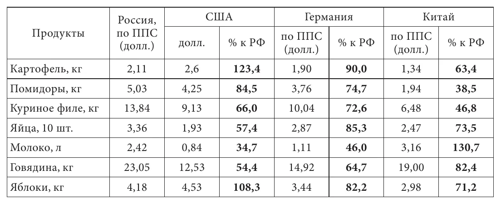

Из сказанного выше видно, что этому способствуют как производители, так и торговые сети[^273]. На те виды продукции, уровень концентрации производства которых высок, цены в большей степени завышаются производителями, для остальных основной вклад вносят розничные сети (и в отдельных случаях — посредники между первыми и вторыми)[^274]. Таким образом, рост концентрации в торговле потребительскими товарами также приводит к дополнительному изъятию доходов населения, но в данном случае в пользу не производителей, а торгового капитала.

Завышению цен на продовольствие также в немалой степени способствует государственная политика, достаточно противоречивая, но в целом благоприятствующая именно крупным сельскохозяйственным и торговым компаниям (что снижает уровень конкуренции). Так, некоторые действия государства способствовали росту концентрации в агросекторе. Например, в конце 2010-х и в начале 2020-х получали субсидии от половины до 3/4 крупных предприятий отрасли, тогда как среди крестьянско-фермерских хозяйств и ИП — лишь около трети. Для крупных компаний выше доступность кредитов: их получают около 40%, тогда как среди малых предприятий — 20-30%, крестьянско-фермерских хозяйств и ИП — 10-14%[^275]. При этом значительная часть кредитов в отрасли — льготные и субсидируются государством, ставки по ним гораздо ниже ключевой ставки ЦБ и зачастую ниже уровня инфляции[^276]. Более того, крупнейшие агрохолдинги платят буквально мизерные налоги на прибыль, пользуясь льготами и специальными налоговыми режимами. Например, компании Мираторг, Группа Черкизово и Русагро, на которые в 2021 году пришлось 17% всей прибыли сельского хозяйства, выплатили за три предшествующих года налоги на прибыль в размере, равном 0,6, 1 и 7,4 процентов её объёма соответственно[^277].

По некоторым оценкам, регулирование продовольственного рынка в России большую часть постсоветского периода способствовало повышению внутренних цен относительно мировых, что фактически означало субсидирование производителей за счёт потребителей[^278]. На рост цен повлияло и продовольственное эмбарго, введённое российскими властями в 2014 году: производители оказались избавлены от сильных конкурентов, что не могло не сказаться на стимулах к снижению себестоимости и сдерживанию наценок.

Также исследователи отмечают неэффективность антимонопольного регулирования розничной торговли, в т. ч. предотвращения картельных сговоров (например, по сравнению со странами ЕС)[^279]. Среди особенностей регулирования этой отрасли можно выделить безусловную законодательную защиту монополии иностранных компаний на поставку их товаров в Россию, действовавшую с начала 2000-х до 2022 года (сейчас она отменена только для продукции, разрешённой к параллельному импорту)[^280].

В то же время государство стремится сдерживать рост цен на продовольствие в тех случаях, когда он становится слишком заметным. Тогда в ход идёт целый арсенал различных мер. Среди них экспортные пошлины и квоты (например, на подсолнечник, зерно, сахар), квоты на беспошлинный импорт продовольствия (сахар, мясо). В отдельных случаях дело доходит до прямого ценового регулирования — установления предельных цен (впрочем, с выплатой субсидий производителям, ограничивающим цены на свою продукцию)[^281]. В этой сфере меры более решительные, поэтому более успешные по сравнению с регулированием цен на топливо: власти без больших колебаний вводят пошлины на экспорт продовольствия и ограничивают рост цен, т. к. это не наносит большого ущерба бюджетным поступлениям, в отличие от торговли углеводородами. Можно предположить, что причина этой решительности также в меньших лоббистских возможностях аграриев по сравнению с нефтяниками и энергетиками (которые, впрочем, обусловлены в т. ч. меньшей важностью прибыли сельскохозяйственных предприятий для бюджета)[^282]. В целях сдерживания роста цен власти нередко оказывают давление и на ритейлеров для ограничения наценок на некоторые продукты[^283].

Очень высока концентрация в банковском секторе. На 5 крупнейших банков по итогам 2021 года приходилось 64% активов, 69% общего капитала и 73% общей прибыли сектора, на их балансах находилось около 2/3 общей суммы выданных кредитов, 68% привлечённых средств физических лиц и 58% привлечённых средств юридических лиц[^284]. По итогам 2020 года прибыль одного ведущего банка составила более 47% прибыли всего банковского сектора[^285]. Концентрация резко выросла за прошлое десятилетие: количество банков сократилось в 2,5 раза; на банки с государственным участием в начале 2022 года приходилось 76% активов банковской системы, тогда как десятью годами раньше — 58%[^286].

В отрасли явно заметна поляризация: в начале 2022 года на 13 банков приходилось более 75% активов, более 93% капитала и 85% прибыли, тогда как на все региональные банки вместе взятые (166 банков) — 5,6% активов. За 2013-2021 годы число региональных банков сократилось более чем в 2,5 раза. В конце 2021 года в 25 регионах не было ни одного регионального банка и ещё в 25 было лишь по одному такому банку; для сравнения, в 2013 году всего в 16 регионах было по одному региональному банку или не было ни одного[^287]. Очевидное следствие — снижение конкуренции за клиентов. Из-за роста концентрации и сокращения числа банков — в первую очередь региональных — у предприятий менее прибыльных отраслей, ориентированных на внутренний рынок (особенно малых и средних), сокращаются возможности кредитования[^288]. Для больших банков более привлекательны займы крупным предприятиям, производящим продукцию на экспорт, отраслям торговли и услуг, а также потребительское кредитование как более простое и менее рискованное (поскольку предоставляются меньшие суммы и/или по кредитам есть ликвидный залог — например, недвижимость и автомобили; таким образом, зачастую нет необходимости досконально оценивать платёжеспособность заёмщика, в отличие от долгосрочных кредитов предприятиям реального сектора)[^289].

Так, в среднем за 2009-2018 годы отрасли «торговля и ремонт» выдавалось 24% всего объёма кредитов юридическим лицам и ИП; это больше, чем всем отраслям обрабатывающей промышленности, вместе взятым, которые получили 17,5%. Более 5% получила отрасль «операции с недвижимостью и аренда». Иными словами, почти треть всего кредитования пришлось на две непроизводственные отрасли. При этом со временем росло кредитование экспортоориентированных отраслей: доля добычи полезных ископаемых увеличилась с 1-2% в 2009-2015 годах до 3-6% в 2016-2018 годах, нефтепереработки — с 0,5-1% в 2009-2014 годах до 2-5% в 2015-2018 годах (этот рост во многом был вызван санкциями стран центра, вводившимися с 2014 года и ограничившими доступ к зарубежному финансированию)[^290]. Одновременно значительно выросла доля кредитов физическим лицам (потребительских, ипотечных и т. п.): с 20% всего кредитного портфеля в начале 2007 года до 32% в начале 2022 года. Кредитование населения выросло с 1,1% ВВП в 2001 году до 18,6% в 2020 году, тогда как кредитование предприятий — с 13,6% до 33,9%, снизившись с максимума 2015 года в 39,5%[^291]. Не в меньшей степени, чем концентрацией банковской системы, низкая доступность кредитов для реального сектора обусловлена государственной финансовой политикой, которой посвящён следующий раздел; подробнее этот вопрос рассматривается там.

В банковском секторе государственные меры также способствуют росту концентрации. Среди них приоритетный доступ к государственным программам поддержки, дешёвому фондированию и субсидиям для т. н. системно значимых банков (к которым относятся крупнейшие из них), несоразмерность штрафов обороту крупных и небольших банков. Также большей привлекательности крупных (и в особенности государственных) банков по сравнению с остальными поспособствовала «чистка» банковской системы Центробанком в 2010-х[^292].

### 3.2. Экспорт капитала государством. Государственная финансовая политика и её последствия для реального сектора {#sec-3-2}

Как было показано на рис. 13, с начала 2000-х до начала 2010-х чистый экспорт превышал объём той части прибыли, которая не расходовалась на накопление капитала. Это происходило в т. ч. из-за того, что в него также вкладывались государственные средства (т. е. в основном поступления от налогов). Таким образом, государственная финансовая политика была одним из факторов, способствующих передаче произведённой внутри страны прибавочной стоимости за рубеж. Как будет показано ниже, она благоприятствовала экспортёрам сырья (и даже способствовала его экспорту); вместе с этим она сама является неизбежным следствием экспортно-сырьевой ориентации экономики.

Причина в том, что мировой рынок сырья и полуфабрикатов, а также некоторых других (в основном потребительских) товаров достаточно конкурентный. Поэтому страны-экспортёры вынуждены занижать курс своих валют, чтобы обеспечивать более низкие цены на свою продукцию на мировом рынке, выраженные в валютах стран центра[^293]. Почему и каким образом это происходит? Сначала стоит рассмотреть ситуацию в более общем виде. Для этого надо сделать отступление и коротко описать финансовую сторону мировой капиталистической экономики (или мир-системы, выражаясь терминами соответствующей школы)[^294].

Страны центра доминируют в мировой экономике в нескольких аспектах. Один из важнейших — их полная или частичная монополия на производство высокотехнологичных товаров, включая многие передовые средства производства[^295]. Другой аспект состоит в том, что основные мировые платёжные средства — валюты стран центра, в первую очередь доллар и евро (а также фунт стерлингов и японская иена); на расчёты в национальных валютах остальных стран приходится очень небольшая доля мировой торговли[^296]. Таким образом, для приобретения жизненно необходимых товаров (продовольствия, медикаментов, энергоносителей и т. д.) у какой бы то ни было страны в первую очередь необходимы эти валюты. В результате страны периферии и полупериферии вынуждены конкурировать между собой за доступ на внутренний рынок стран метрополии для получения их валюты и высокотехнологичных товаров в обмен на свою продукцию. Эта конкуренция — в первую очередь ценовая, что вынуждает их ослаблять свои валюты.

Рассмотрим этот процесс на примере России в первые десятилетия XXI века. Из-за больших объёмов экспорта на российский рынок постоянно поступает валюта. Её необходимо продать для уплаты налогов, зарплат, выплат поставщикам, подрядчикам и т. д. Таким образом, в условиях положительного баланса текущих операций[^297] предложение валюты постоянно и очень велико, как правило, оно превышает спрос на неё[^298]. При прочих равных это должно привести к удешевлению валюты и, соответственно, к укреплению рубля[^299]. Но тогда снизится, во-первых, экспортная сверхприбыль производителей сырья, во-вторых — конкурентоспособность российского экспорта (как сырьевого, так и несырьевого) на мировом рынке, а в-третьих — конкурентоспособность отечественных производителей (в особенности конечной продукции) на внутреннем рынке по сравнению с импортом. Это нередкое в новейшей мировой истории явление известно как «голландская болезнь»[^300].

Описанную тенденцию можно проследить на примере динамики экспортных и внутренних цен на нефть, а также курса рубля в 2000-х. До кризиса 2008 года разрыв между внутренними и экспортными ценами сокращался именно тогда, когда рубль значительно укреплялся — в 2004-2006 годах. Это снижало сверхприбыль экспортёров, а цены на внутреннем рынке также росли значительными темпами из-за их стремления скомпенсировать её снижение за счёт российских потребителей: так, к 2006 году внутренние цены выросли по сравнению с 2003 годом в 2,8 раза в рублях и в 3,1 раза в долларах, тогда как экспортные — только в 2,4 раза.

*Таблица 6. Внутренние и экспортные цены на нефть и курс доллара в 2000-2007 годах*

|  | 2000 | 2001 | 2002 | 2003 | 2004 | 2005 | 2006 | 2007 |
|----|---:|---:|---:|---:|---:|---:|---:|---:|
| внутренние цены, руб. за тонну | 1279 | 1592 | 1637 | 1903 | 2655 | 4374 | 5278 | 5503 |
| курс долл. | 28,1 | 29,1 | 31,4 | 30,7 | 28,8 | 28,3 | 27,1 | 25,6 |
| внутренние цены, долл. за тонну | 45,5 | 54,7 | 52,2 | 62,0 | 92,2 | 155 | 195 | 215 |
| экспортные цены, долл. за тонну | 175 | 151 | 154 | 174 | 226 | 330 | 412 | 470 |
| разница между экспортными и внутренними ценами | 3,8 | 2,8 | 3,0 | 2,8 | 2,5 | 2,14 | 2,12 | 2,18 |

Важно отметить, что рост сверхприбыли экспортных отраслей при ослаблении курса рубля, о котором говорилось в [разделе 1.2](#sec-1-2), в немалой степени происходит за счёт отраслей (и населения), нуждающихся в валюте — например, для оплаты импорта. В такой ситуации более высокая выручка, получаемая за счёт продажи валюты на внутреннем рынке, фактически оплачивается из средств её покупателей, вынужденных платить за неё больше в рублях[^301].

Другой важный фактор — более низкий курс рубля выгоден для бюджета, поскольку он сводится из расчёта экспортной цены на нефть в рублях, тогда как сама нефть продаётся за валюту[^302]. Таким образом, у государства есть постоянная необходимость удерживать курс национальной валюты на заниженном уровне[^303]. Российское правительство, с одной стороны, стремится поддерживать курс рубля, выгодный экспортёрам (среди которых заметную роль играют госкомпании) и бюджету, т. е. ослаблять его, с другой — избежать чрезмерного его падения, поскольку из-за большой доли импорта во внутреннем потреблении это угрожает всплеском инфляции (как это было, например, в кризис 2014-2016 годов). Для этого при положительном сальдо торгового баланса и притоке иностранных инвестиций используется изъятие валюты из финансового оборота страны. А когда спрос на валюту превышает предложение, Центробанк, наоборот, продаёт её для компенсации оттока капиталов (это происходит относительно реже, в основном во время кризисов — например, в 2008 и 2014 годах). С начала 2000-х изъятая валюта использовалась для досрочной выплаты внешнего государственного долга, а затем стала накапливаться в резервных фондах и резервах ЦБ, как в денежной форме, так и в виде зарубежных ценных бумаг (так, за 2007-2013 годы объем средств, вложенных Россией в одни только казначейские облигации США, возрос с 8 до 164 млрд долл.)[^304].

Результаты такой политики можно увидеть в табл. 7. В 2005-2007 годах, когда приток иностранного капитала в частный сектор превышал его отток за границу, государство усиливало вывоз капитала в форме накопления валютных резервов. Также видно, что и в 2003-2004 годах правительство вывозило в разы бóльшие объёмы капитала, чем частный сектор (по крайней мере, официально), т. е. основная часть чистого экспорта приходилась на него.

*Таблица 7. Чистый экспорт, чистое кредитование остального мира (-), чистое заимствование у остального мира (+), % ВВП*[^305]

|                     | 2003 | 2004 | 2005  | 2006  | 2007  | 2008 | 2009 | 2011 | 2012\* |
|:--------------------|:-----|:-----|:------|:------|:------|:-----|:-----|:-----|:-------|
| Чистый экспорт      | 10,9 | 12,3 | 13,7  | 12,7  | 8,6   | 9,3  | 7,5  | 8,7  | 8,6    |
| Чистое кредитование | -7,9 | -10  | -11,1 | -9,6  | -6    | -6,2 | -4   | -5,3 | -5,3   |
| В т. ч.:            |      |      |       |       |       |      |      |      |        |
| Частным сектором    | -0,4 | -1,5 | 0,2   | 4,2   | 6,2   | -8   | -4,7 | -4,4 | -4,2   |
| Правительством      | -7,5 | -8,5 | -11,3 | -13,8 | -12,2 | 1,8  | 0,7  | 0,9  | -1,1   |

*\* За январь-сентябрь.*

Таким образом, денежная эмиссия и профицит бюджета используются для скупки валюты и её вывода из экономики[^306]. Проще говоря, ресурсы государства тратятся на покупку и, по сути, замораживание средств, полученных из-за границы, недопущение их обращения внутри экономики страны. Именно в этом был основной смысл создания резервных фондов[^307] и именно поэтому они создавались в иностранной валюте — надо было снизить её приток на внутренний рынок. При этом средства в основном вкладываются в валюты и ценные бумаги (гособлигации, акции и в финансовый рынок в целом) США и некоторых других стран центра. На то есть причины, которые также обусловлены тем, как функционирует мировая капиталистическая экономика, точнее, мировой финансовый рынок.

Такие бумаги имеют очень высокую ликвидность, на них есть устойчивый спрос. Странам периферии в свою очередь постоянно требуется иметь большой объём максимально ликвидных резервов[^308], которые можно быстро и без дисконта продать для защиты их валют от резкого обесценивания при неблагоприятной внешней конъюнктуре и спекулятивных атаках (как это было в России в кризис 2014-2016 годов, когда ЦБ продавал значительные объёмы валюты)[^309]. В этом состоит отличие резервов периферийных и полупериферийных стран от фондов типа Норвежского — последние могут позволить себе вкладывать в более прибыльные, но менее ликвидные и более рискованные активы[^310].

Другая причина — бумаги стран центра признаются надёжными во всём мире (это одно из основных требований российского ЦБ наряду с ликвидностью[^311]). Практика показывает, что это не всегда так, но остальные инструменты ещё менее надёжны или менее ликвидны (как золото, которое невозможно выбросить на рынок в больших объёмах, не спровоцировав падения его цены)[^312].

В то же время вложенные средства в буквальном смысле замораживаются — они выводятся из экономик периферийных стран, не работая в них ни как средство обращения, ни как средство платежа, не используясь ни для производственных инвестиций, ни для других насущных целей. Поскольку реальная процентная ставка по вкладам близка к нулю или вовсе отрицательная, доход от них практически отсутствует, в противоположность инвестициям в производственный сектор[^313]. Лучше всего это видно на примере вложений в ценные бумаги США. В 2000-х реальные ставки по долларовым займам были отрицательными из-за непрерывного ослабления американской валюты[^314], после 2008 года они стали отрицательными уже буквально из-за резкого понижения (ниже уровня инфляции). В Еврозоне реальные ставки были отрицательными практически всё время с 2009 года[^315].

Фактически получается, что значительная часть прибыли, образующаяся в российской экономике и экономиках других полупериферийных и периферийных стран, идёт на финансирование экономик стран центра, т. е. инвестируется в них, при этом реальный процент по этим вложениям близок к нулю или даже отрицателен из-за ослабления их валют или инфляции. Страны центра по сути получают бесплатные (или почти бесплатные) деньги для закупки товаров по всему миру, инвестиций и т. п., а приток капитала через вложения в их ценные бумаги компенсирует их отрицательный торговый баланс (в первую очередь это характерно для США)[^316]. Это является одним из основных способов эксплуатации зависимых экономик со стороны метрополии в настоящее время, наряду с выплатами по внешнему долгу[^317]. В то же время вывоз капитала является одним из важнейших факторов, снижающих уровень накопления во многих периферийных странах, что ведёт к преобладанию низкопроизводительных и трудозатратных технологий[^318].

#### *Влияние государственной финансовой политики на отток и накопление капитала*

С учётом сказанного вполне объяснима динамика государственных расходов, в частности государственного потребления[^319]. Его уровень по сравнению с последними годами СССР ожидаемо низок. В РСФСР на государственное потребление приходилось 23% ВВП в 1988 году и 21% в 1991 году[^320]. За весь постсоветский период оно превышало 20% ВВП лишь четыре раза, из них дважды после 2000 года, когда его резко нарастили для борьбы с кризисами 2008 и 2020 годов.

*Рисунок 14. Расходы на государственное потребление в 1988 и 1991-2021 годах, % ВВП*

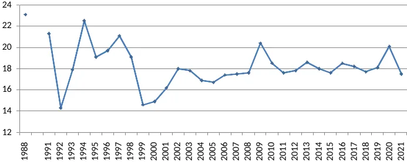

Высокие расходы на покупку валюты приводят к тому, что государство тратит свои ресурсы на увеличение чистого экспорта. Из-за этого снижается та их доля, которая используется для создания спроса внутри экономики, как за счёт непосредственно государственного потребления (в этом плане характерно, что в 2000-х и 2010-х его доля в ВВП была заметно ниже, чем в 1994-1998 годах), так и за счёт различных стимулирующих мер[^321]. Государственные средства (в т. ч. денежная эмиссия) не используются для кредитования производственного сектора, устанавливаются высокие процентные ставки; урезаются государственные расходы на развитие экономики и социальные нужды; повышаются налоги на внутреннее потребление — например, НДС, акцизы на топливо и т. д.

*Рисунок 15. Расходы консолидированного бюджета в 2005-2021 годах, % ВВП*

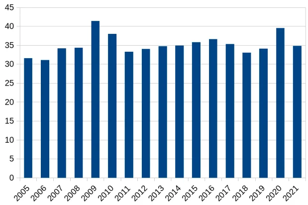

Можно увидеть взаимосвязь между этими процессами, сравнив динамику государственных расходов и объёма золотовалютных резервов в прошлом десятилетии. Расходы консолидированного бюджета сократились с почти 35% ВВП в 2013-2014 годах и 36-36,5% в 2015-2016 годах до 33-34% в 2018-2019 годах[^322]. Объёмы валютных резервов значительно снизились в начале кризиса (на 35% к маю 2015 года по сравнению с январём 2014 года), но уже в середине 2015 года их расходование практически прекратилось, а за 2017-2019 годы они выросли почти на 40%. С учётом золота международные резервы росли с начала 2016 года и к концу 2019 года превысили уровень 2013 года[^323], тогда как расходы бюджета в реальном выражении (с учётом инфляции) в 2019 году были не выше, чем в 2013 году. Хотя в 2020 году из-за введения антикризисных мер уровень государственных расходов вырос на 7,5% (в постоянных ценах), объёмы резервов не снизились, а выросли более чем на 7% за год (в долларовом выражении в текущих ценах)[^324].

*Рисунок 16. Международные золотовалютные резервы России в 2012-2021 годах, млрд долл.*

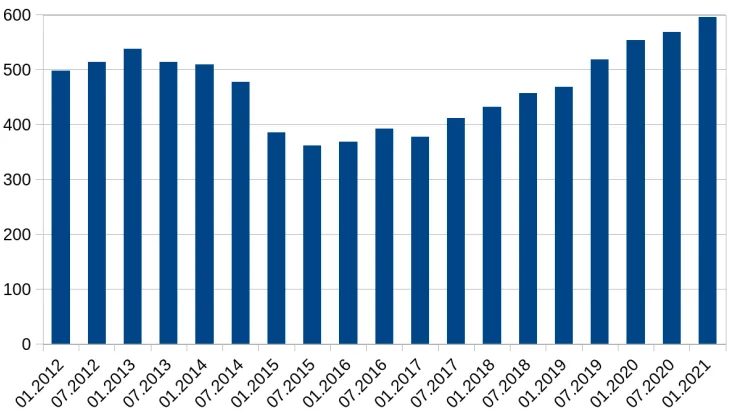

Ещё более показательна динамика расходов бюджета на инвестиции (т. е. вклад государства в валовое накопление основного капитала). После короткого подъёма государственных инвестиций до почти 3,5% ВВП в конце 2000-х началось снижение, особенно резкое — в 2014 году (до 2,2% против 2,8-2,9% в 2010-2013 годах), и до конца десятилетия они составляли чуть больше 2% ВВП[^325]. Частный случай этой тенденции — расходы бюджета на инфраструктуру. На протяжении 2010-х их доля в ВВП неуклонно сокращалась: за 2012-2016 годы она снизилась в полтора раза и затем оставалась примерно на одном уровне. В начале периода российские показатели примерно соответствовали уровню Бразилии, тогда как в конце они были уже почти в полтора раза ниже, а по сравнению с показателями другой крупной полупериферийной страны, Индии, отставание было более чем двукратным (2,1% ВВП в России против 3% и более 4,5% в Бразилии и Индии соответственно в 2018 году)[^326].

#### *Влияние денежно-кредитной политики на развитие реального сектора*

Государственная денежно-кредитная политика с начала 2000-х до 2022 года (в значительной степени определяемая стабильно высокими расходами на покупку поступающей на российский рынок валюты и её замораживание в резервных фондах) является одной из основных причин нехватки средств у производственного сектора, в особенности у отраслей, работающих на внутренний рынок, низкого уровня накопления капитала, и как следствие *—* их стагнации или деградации[^327].

Так, на российском финансовом рынке нередко не было достаточного объёма кредитных средств из-за того, что Центробанк не предоставлял банкам нужную ликвидность[^328]. Кроме того, с 2014 года ЦБ поддерживает ключевую ставку на высоком уровне, объясняя это борьбой с инфляцией, так что с начала 2016 года она была не только намного выше уровня инфляции, но и выше рентабельности большинства производственных отраслей, что сделало кредиты по рыночным ставкам недоступными для большей части предприятий, за исключением экспортёров[^329].

Свой вклад в нехватку ликвидности в банковской системе также внёс практически постоянный отток частного капитала. При этом долгое время большую роль в финансировании экономики играл иностранный капитал, в частности, займы за рубежом: крупные российские компании, в особенности экспортёры, активно занимали деньги в банках стран центра, в т. ч. потому что проценты по кредитам были ниже, чем в России (хотя, в отличие от вкладов, реальная ставка по ним была выше нуля)[^330]. Таким образом, прибыль, созданная в российской экономике, уходила из страны и вкладывалась в активы за границей, при этом российские предприятия и банки занимали деньги у иностранных банков, тем самым дополнительно отдавая им часть своей прибыли в виде процента[^331].

На протяжении последних десятилетий главным источником инвестиций в основной капитал в российской экономике были собственные средства предприятий: в среднем за 2000-2021 годы на них приходилось почти 47%, тогда как на кредиты российских банков — 7%, кредиты иностранных банков — 2%. Доля собственных средств предприятий в инвестициях выросла с 37-45% в 2002-2013 годах до 50-56% в 2015-2021 годах[^332], что связано в т. ч. с рестриктивной монетарной и бюджетной политикой. По данным обследований Росстата, с начала 2000-х до 2014 года высокий процент коммерческого кредита был фактором, ограничивающим инвестиционную деятельность для 25-30% промышленных предприятий, сложный механизм получения кредитов на инвестиционные цели — для 12-24%. С наступлением кризиса ситуация значительно ухудшилась, и в 2015-2020 годах эти факторы стали ограничениями инвестиционной активности для 53-58% и 42-48% предприятий соответственно[^333]. Таким образом, ограничение кредитования стало одной из причин спада накопления капитала.

Хотя на долгосрочные займы приходится достаточно высокая доля общего объёма кредитования[^334], пользуется ими небольшая часть предприятий, причём со временем она снижалась. Об этом, наряду с данными Росстата о доле кредитов в инвестиционных средствах, свидетельствуют опросы представителей предприятий реального сектора, которые проводят сотрудники ИНП РАН. В 1999-2009 годах кредитами на инвестиционные проекты сроком на 1-2 года пользовались 10-20% опрошенных, в 2010-2014 — 9-14%, в 2015-2017 годах — уже 6-7%, а в 2018-2019 годах — 2-4%; кредиты на инвестиционные проекты на срок более 3 лет с середины 2000-х до конца 2010-х брали 10-15%[^335]. В ходе этих же опросов на протяжении 2000-х и 2010-х в числе причин, мешающих использовать больше внешнего финансирования для инвестиций, около половины респондентов отмечали неприемлемые финансовые условия — например, слишком высокие ставки или готовность выдавать только краткосрочные кредиты[^336]. Характерно, что одновременно с сокращением использования долгосрочных кредитов предприятиями выросла доля кредитов физлицам: с 20% всего кредитного портфеля в начале 2007 года до 32% в начале 2022 года[^337]. Руководство ЦБ неоднократно признавало недостаточную привлекательность корпоративного кредитования для банков, но не считало нужным (или возможным) предпринимать меры для исправления ситуации[^338].

Сокращение государственных расходов в начале 2010-х сопровождалось переходом к рестриктивной денежно-кредитной политике, т. е. ограничением денежного предложения со стороны государства и ЦБ[^339]. Также было сокращено инвестиционное кредитование со стороны государственных банков[^340]. Вследствие этого компании (в первую очередь государственные, но не только они) сократили инвестирование[^341] и нарастили заимствование за рубежом. За 2010-2013 годы внешний долг банков и других компаний, подконтрольных государству, вырос более чем на 160 млрд долл., остальных банков и компаний — на 65 млрд[^342]. Примерно в это же время вырос вывоз капитала (как частными компаниями, так и государством[^343]), в т. ч. за счёт выплат по кредитам, взятым государственными и частными компаниями за рубежом[^344]. При этом бюджетный дефицит покрывался заимствованиями, объём которых временами значительно превышал его размер, а дополнительные средства по большей части направлялись на накопление резервов в иностранной валюте или оставались на балансе ЦБ (то же самое происходило в случае профицита бюджета, например, в 2011 году)[^345]. Из-за сокращения инвестиций со стороны бюджета и компаний, подконтрольных государству, в 2013 году начал снижаться объём накопления основного капитала[^346]. По оценкам некоторых экономистов, кризис начался уже тогда — ещё до введения санкций и падения цен на нефть в 2014 году[^347] (подробнее об этом см. раздел 5.4).

Нехватка средств на российском финансовом рынке заметна не только в разрезе кредитования. Из-за постоянного оттока капитала за границу и из-за стремления получить валюту российские компании предпочитали проводить размещение акций на внешних рынках. По доле размещений на иностранных биржах Россия опережает многие крупные экономики центра и периферии[^348]. Так, с 1996 по 2024 годы на них пришлось 56% всех сделок, причём в наиболее успешный для российских компаний период — 2004-2013 годы, когда было размещено акций на 109 млрд долл. (80% от всего объёма размещений постсоветского периода), на них приходилось почти 60% сделок[^349].

Рассматривая финансовое регулирование, нужно отметить ещё один важный элемент государственной политики, благоприятствующей инсайдерам (в первую очередь в компаниях-экспортёрах, но также и в любых других) — отсутствие ограничений на вывоз капитала с середины 2000-х до 2022 года[^350]. Это способствовало его оттоку как в периоды роста, так и в кризисы: с 2008 года объём вывозимых инвестиционных доходов был близок к объёму ввозимого капитала, а с начала 2010-х вывоз доходов иностранных кредиторов и инвесторов уже значительно превышал ввоз капитала[^351].

В конечном счёте в течение практически всего постсоветского периода компании-экспортёры и государство выступали основными агентами передачи прибыли в страны центра. Можно говорить о своего рода цепочке безвозмездной передачи прибавочной стоимости — от населения, отраслей-жертв ценового диспаритета через торговый капитал, предприятия отраслей-бенефициаров ценового диспаритета и государство в банки, другие финансовые институты и корпорации метрополии[^352]. В основном (но не исключительно) прибавочная стоимость передаётся двумя способами, рассмотренными выше. Первый *—* вывод прибыли в филиалы, зарегистрированные в офшорах и офшоропроводящих странах; среди последних преобладают страны центра (Нидерланды, Великобритания, Швейцария, Люксембург и т. д.); основной механизм здесь — занижение стоимости экспорта посредством трансфертного ценообразования. Второй способ — помещение прибыли российских корпораций и государственных средств в банки метрополии, их инвестирование в акции и другие ценные бумаги компаний и правительств этих стран, покупка российскими компаниями и их руководством активов — например, недвижимости — в этих странах (до недавнего времени вклад в вывоз капитала также вносили выплаты по кредитам, взятым в банках стран центра). Именно эти средства в значительной степени оказались заморожены в 2022 году (впрочем, под арест и/или передачу под внешнее управление также попали некоторые предприятия, купленные российскими корпорациями в этих странах). После этого место стран метрополии как пункта назначения для вывода капитала (как первым, так и вторым из указанных способов) в значительной степени заняли ОАЭ, Турция и некоторые другие азиатские страны (подробнее об этом см. в следующем разделе).

Именно поэтому доминирующие в российском правящем классе группы можно характеризовать как компрадорские. Суть их политики так или иначе сводится к посредничеству в экспортно-импортной деятельности, т. е. фактически к передаче разными способами прибавочной стоимости из своей страны в страны центра (или, ситуативно, в Китай и некоторые другие страны) и в результате — к эксплуатации ресурсов и рабочей силы в их интересах. Это в основном и характеризует их, несмотря на всю патриотическую риторику и даже на нынешнее противостояние с Западом.

Из сказанного выше также следует фундаментальное отличие российского капитализма от классического монополистического капитализма или от послевоенного капитализма в странах метрополии (который в СССР было принято называть государственно-монополистическим капитализмом):

> «Монополистический капитализм в начале XX века базировался на национальном хозяйстве, в связи с чем монополия использовалась в таких среднеразвитых странах как Российская империя в качестве средства накопления капитала для развития тяжёлой индустрии. Классический монополистический капитализм, сформировавшийся в результате Первой мировой войны, базировался на высокоразвитой промышленной индустрии, которая частично национализировалась для концентрации ресурсов и лучшего управления в руках государства ... В российской экономике присутствуют монополии, но ... цель их работы не соответствует основной парадигме классического государственно-монополистического капитализма — накоплению капитала в рамках национального хозяйства. Экономическая модель современной России в силу ценового диспаритета и иных факторов выступает просто донором крупнейших капиталистических стран. В данной схеме госкорпорации — средства не накопления капитала внутри России, а его вывода за рубеж и концентрации в странах центра»[^353].

Можно сказать, что российские корпорации (монополии и олигополии) и государство выступают агентами накопления капитала в рамках мировой экономики, но основная часть накопляемого капитала приходится на страны центра и лишь небольшая доля — на российскую экономику.

Проделанный анализ также позволяет утверждать, что высокий уровень эксплуатации труда (если рассматривать его с чисто экономической точки зрения), характерный для российской экономики, является следствием погони за экспортной сверхприбылью для экспортёров сырья и полуфабрикатов и следствием ценового диспаритета для остальных отраслей. Для первых он главным образом является способом сохранить разрыв между экспортными ценами и издержками производства, тогда как для вторых — хотя бы частично компенсировать потерю прибавочной стоимости в результате действия ценового диспаритета.

### 3.3. Изменения в экономической политике с 2022 года и их последствия {#sec-3-3}

В результате вводимых с 2022 года масштабных санкций, ответных регуляторных мер в сфере торговли и движения капитала, а также из-за необходимости значительно нарастить расходы на вооружённые силы и ВПК экономическая политика заметно изменилась, что отразилось в т. ч. на структуре экономики[^354]. Мы не будем рассматривать этот сюжет во всех подробностях, отметим лишь изменения, наиболее важные в контексте нашего исследования[^355].

В первую очередь к ним относится регулирование движения капитала, внешней торговли и внутреннего рынка, а также более активная бюджетная политика:

1\) Меры по ограничению движения капитала:

- ограничения на переводы и вывод средств за рубеж, в т. ч. запрет на выход иностранных владельцев из капитала российских компаний без одобрения правительства, а также ограничение на снятие наличной валюты со счетов[^356];
- обязанность российских компаний ввозить в страну и продавать часть валютной выручки (40-80% в разные периоды)[^357];
- принудительный делистинг акций российских компаний с зарубежных бирж, запрет иностранным компаниям и гражданам вести торговлю ценными бумагами на российских биржах[^358];
- принудительный перевод части крупных компаний в российскую юрисдикцию — в 2023 году был принят закон об экономически значимых организациях (ЭЗО), позволяющий переводить из зарубежных юрисдикций активы на территории страны, контролируемые российскими резидентами через иностранные холдинговые структуры[^359].

2\) Приостановка бюджетного правила (направления части поступлений от экспорта в резервные фонды), а затем его пересмотр[^360], сокращение накопления резервов; использование поступлений от экспорта и средств резервных фондов на текущие расходы бюджета.

3\) Разрешение параллельного импорта некоторых товаров, подрывающее монополию иностранных поставщиков.

4\) Ограничения на экспорт некоторых товаров (в первую очередь нефтепродуктов).

Также в этот период происходило активное перераспределение активов иностранных собственников: передача под внешнее управление, принуждение к продаже по ценам значительно ниже рыночных или прямая национализация (данные о масштабах приводились в [разделе 2.1](#sec-2-1)). Хотя до 2022 года подобные действия в отношении иностранного капитала имели место, они происходили гораздо реже по сравнению с изъятием активов государством у российских собственников.

При этом нельзя сказать, что произошёл полный разрыв с курсом предшествующих десятилетий. Экономическая политика остаётся достаточно противоречивой, поскольку некоторые из введённых ограничений были временными и/или частичными. Яркий пример — регулирование экспорта топлива. В сентябре 2023 года во избежание срыва сельскохозяйственных работ в южных регионах из-за дефицита нефтепродуктов был введён практически полный запрет на их вывоз за рубеж[^361]. Однако он продлился лишь до ноября, поскольку нефтепродукты составляют значительную часть всего российского экспорта, и остановка поставок сразу сказалась на внешнеторговом балансе и курсе рубля. После этого запрет несколько раз вводился (в основном как частичный) и вновь приостанавливался[^362]. То же самое касается вывоза капитала иностранными собственниками — были разрешены отдельные сделки по продаже ими российских активов по ценам, близким к рыночным, с последующим выводом полученной выручки[^363], а отдельные компании получали и выводили прибыль от российских проектов ещё как минимум несколько лет после 2022 года[^364].

Разрыв экономических связей со странами центра и ограничительные меры с обеих сторон привели к значительному сокращению доли экспорта и чистого экспорта — в 2023-2024 годах она составила 22-23% и около 4% ВВП соответственно[^365]. Доля чистого экспорта стала минимальной с 1997 года, доля экспорта — по меньшей мере с середины 90-х (а по некоторым данным — за весь постсоветский период)[^366]. Во многом за счёт этого резко выросло валовое накопление (до 27,5% ВВП — максимального уровня с 1993 года). Накопление основного капитала выросло не столь значительно, но его уровень — чуть больше 22% ВВП — стал одним из наивысших в постсоветский период: он был выше только в начале 90-х и примерно таким же — лишь трижды (в 1994, 2008 и 2017 годах).

Отток капитала после рекордного всплеска в 2022 году заметно снизился. Этому способствовало значительное сокращение вывоза капитала государством, ограничения на его вывоз частным сектором и сокращение вывода средств за рубеж населением[^367]. Также повлияли масштабное перераспределение активов от иностранных компаний или российских собственников, владевших ими через офшорные структуры, к государству или через него к российским собственникам и принудительный перевод некоторых крупных предприятий (ЭЗО) из иностранных юрисдикций в российскую. В 2023-2024 годах отток капитала составил 39 и 53 млрд долл. соответственно — ниже, чем, например, в 2021 году и в первой половине 2010-х[^368]. Тем не менее он сохранился, стабилизировавшись на уровне около 4% ВВП — по меркам последних десятилетий достаточно низком, но не минимальном (он был ниже, например, в 2017 и 2019 годах)[^369].

В то же время вывод прибыли российскими производителями продолжается, хотя, судя по всему, в меньшем объёме[^370]. Продолжает действовать и механизм занижения цен на экспорт — в т. ч. путём продажи подконтрольным трейдерам нефти ниже «ценового потолка», с последующей перепродажей по рыночным ценам[^371]. Взамен привычных офшоров и офшоропроводящих стран, ограничивших работу с российскими компаниями, экспортёры стали создавать торговые подразделения в новых юрисдикциях — ОАЭ, Гонконге и т. д.[^372]

Благодаря отказу от накопления поступлений от экспорта в резервах несколько выросли государственные расходы (до 35,7-36,9% ВВП в 2023-2024 годах) и государственное потребление (до 18,3-18,9% ВВП в те же годы)[^373]. Это привело к росту спроса государства на продукцию частного сектора и инвестиций в основной капитал. За 2022-2024 годы рост последних составил почти 26% в сопоставимых ценах. Только за 2022 год инвестиции за счёт средств бюджета в текущих ценах выросли почти на 40%, а за 2022-2023 годы — более чем на 60%. Частные инвестиции (из которых 2/3 составляли собственные средства предприятий) за 2022-2024 годы выросли в текущих ценах на 85%[^374]. При этом рост инвестиций в значительной степени был вынужденным. Существенная их часть расходовалась на замещение прежних поставщиков, т. е. продукции, производство и импорт которой сократились из-за санкций и ухода иностранных фирм, и/или адаптацию производств к новым условиям, в т. ч. к сырью и материалам от поставщиков из «дружественных стран» (в частности, заметная доля инвестиций пришлась на замену программного обеспечения после потери доступа к зарубежным продуктам)[^375]. В то же время часть их была направлена на механизацию труда в условиях дефицита кадров в некоторых отраслях[^376]. Короче говоря, далеко не все из этих инвестиций расходовались на модернизацию и повышение технологического уровня[^377].

Импорт, после некоторого спада в 2022 году, практически восстановился[^378]. В частности, стоимость ввозимых машин и оборудования в 2023-2024 годах была ненамного ниже рекордных показателей 2011-2013 и 2021 годов[^379]. В то же время из-за торговых и финансовых ограничений и необходимости работать через посредников в «нейтральных» или «дружественных» странах для закупок необходимых товаров из стран центра значительно возросли издержки внешнеэкономической деятельности (и, соответственно, выросли доходы посредников)[^380]. Таким образом, в натуральном выражении объёмы ввозимой продукции (особенно в части подсанкционных товаров, к которым относится бóльшая часть промышленного оборудования) скорее всего были несколько ниже прежнего уровня. Оценивая внешнеэкономические отношения с 2022 года в целом, можно предположить, что снижение оттока капитала в большей или меньшей степени уравновешивается ростом издержек внешнеторговых операций (экспорта и в особенности импорта).

В последние годы экономическая политика резко и в основном вынужденно изменилась по сравнению с предшествующими десятилетиями, хотя некоторые элементы прошлого курса в том или ином виде сохранились. Как следствие, заметно изменилась и структура экономики в некоторых её аспектах; наиболее важное изменение — резкое сокращение чистого экспорта, благодаря чему валовое накопление значительно выросло и приблизилось к валовому сбережению[^381]. Ситуация, сложившаяся после 2022 года, с одной стороны показывает, что российская экономика имеет возможности для роста: благодаря обвалу чистого экспорта — т. е. в основном вывода капитала из страны — высвободились средства и для значительного увеличения накопления капитала, и для роста потребления (в первую очередь государственного). С другой стороны она показывает, что зависимость экономики от внешней торговли (в первую очередь от экспорта сырья и импорта инвестиционных товаров) сохранилась и практически не снизилась: в 2022 году обвального спада во многом удалось избежать благодаря рекордному экспорту, который и в 2023-2024 годах оставался значительно выше кризисных уровней 2009, 2015-2016 и 2020 годов[^382]. При этом импорт после короткого спада почти восстановился, в т. ч. благодаря активному ввозу промышленного оборудования. Таким образом, сохранение экспортных поступлений на достаточно высоком уровне, в сочетании с сокращением оттока капитала позволило активно расходовать средства (в т. ч. государственного бюджета) на инвестиции. Но в случае сокращения объёмов экспорта (из-за более масштабных внешнеторговых ограничений или длительного снижения сырьевых цен) даже при поддержании низкого уровня оттока капитала неизбежно снизятся возможности для инвестиций (соответственно, и для будущего экономического роста), поскольку они обусловлены с одной стороны доходами экспортёров и государства (в первую очередь нефтегазовыми), а с другой — импортом средств производства[^383].

## 4. Оплата труда и потребление населения {#ch-4}

### 4.1. Доля личного потребления, оплаты труда и прибыли в экономике {#sec-4-1}

Для понимания того, как описанные особенности российской экономики влияют на доходы и потребление разных слоёв населения, вновь обратимся к структуре ВВП по конечному использованию[^384]. Выше были рассмотрены накопление капитала, чистый экспорт и государственное потребление, теперь же мы остановимся на следующей составляющей — расходах на личное потребление. Эта категория буквально обозначает, сколько потрачено домохозяйствами (населением) на приобретение товаров и оплату услуг (т. е. в основном на предметы потребления, а также разного рода бытовые и личные услуги).

*Рисунок 17. Расходы на потребление домохозяйств в 1989 и 1991-2023 годах, % ВВП*[^385]

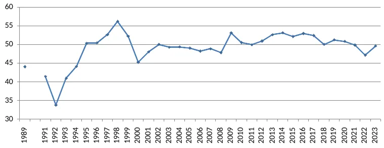

В экономике СССР удельный вес расходов на личное потребление был относительно невысоким: заработная плата и личное потребление населения были ниже, чем в странах центра[^386] (что активно педалировалось во время перестройки), поскольку значительную долю прибавочной стоимости государство изымало и направляло на другие нужды — накопление основного капитала, военные расходы и т. д. Но при этом значительная часть услуг (социальных, культурных и пр.) предоставлялись населению бесплатно или по субсидируемым ценам[^387]. Статистика классифицирует это как социальные трансферты в натуральной форме. Так, в 1989 году фактическое конечное потребление составляло 53,5% ВВП, из которых 44% — расходы домохозяйств и 9,5% — трансферты, в 1991 году — 51%, из них 40,5% расходы домохозяйств и 10,5% — трансферты. Доля конечного потребления рухнула в 1992 году, затем выросла к концу 90-х, но после дефолта вновь обвалилась до уровня 1991 года. С тех пор она несколько восстановилась, но, что характерно, так и не превысила уровень 1997-1998 годов[^388] и остаётся на уровне середины 90-х или даже чуть ниже (как в последние годы). Примечательно также, что доля социальных трансфертов в натуральной форме до кризиса 1998 года в среднем оставалась примерно на уровне последних лет СССР, но в 1999 году она также резко снизилась и с начала 2000-х в среднем составляет примерно 3/4 от уровня 90-х годов[^389].

*Рисунок 18. Фактическое конечное потребление домохозяйств, включая расходы на их потребление и социальные трансферты в натуральной форме в 1989 и 1991-2021 годах, % ВВП*[^390]

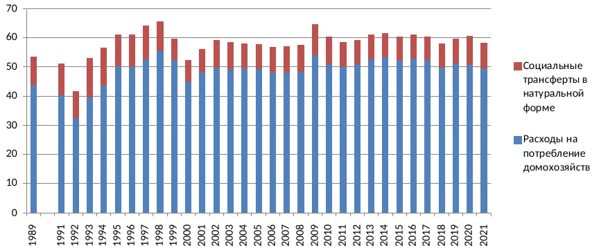

Надо подчеркнуть, что превышение удельного веса расходов на личное потребление в ВВП над советским уровнем не означает, что само потребление превысило советский уровень. Во-первых, потребительские расходы домохозяйств в значительной мере увеличились за счёт расходов на потребление услуг, которые выросли гораздо сильнее, чем расходы на приобретение товаров. Потребление услуг превысило уровень 1991 года уже в 1998 году, а в 2007 году оно было более чем в 2 раза выше, тогда как потребление товаров составило 49% и 94% от уровня 1991 года соответственно[^391]. В частности, значительно выросли расходы на жилищно-коммунальные, транспортные и социальные услуги, потребление части которых (например, ЖКУ) сократить практически невозможно. Так, доля расходов на ЖКУ с 1990 по 2016 годы выросла, по разным данным, в 3-7 раз и в последние годы составляет 11-12% потребительских расходов населения в целом и 14-15% расходов беднейших групп[^392]. К услугам, расходы на которые выросли, относятся и торгово-посреднические, чьё потребление зачастую является лишь оплатой наценки посредников. Во-вторых, государство практически перестало сдерживать цены на товары первой необходимости, включая бóльшую часть продовольствия и медикаментов. Таким образом, хотя *доля расходов* населения на потребление увеличилась по сравнению с СССР, *уровень потребления* большинства населения снизился[^393]. По оценкам А. Аганбегяна, к 2019 году у 50% населения реальные доходы были ниже, чем в СССР, у 30% остались на примерно таком же уровне, у 20% повысились в разы[^394]. С учётом роста доли платных услуг в потреблении[^395] можно считать, что для более чем половины населения его уровень снизился по сравнению с последними годами СССР.

Что это значит? Российский капитализм воспользовался низким уровнем личного потребления населения, частично доставшимся в наследство от СССР[^396], частично сформированным кризисом 90-х. В ситуации, когда большинство населения — наёмные работники, стоимость рабочей силы в основном определяется уровнем личного потребления. В результате экономического кризиса, сопровождавшего переход к капитализму, значительной части работников пришлось отказаться от потребления многих товаров и услуг, стоимость которых прежде входила в стоимость их рабочей силы[^397]. У тех, кто не оказался в резервной рабочей армии, потеряв прежние рабочие места вследствие сокращений и закрытия предприятий, это произошло из-за задержек зарплат и недостаточной их индексации в условиях гиперинфляции (по официальным данным, к концу 90-х средняя заработная плата в реальном выражении составляла чуть больше трети от уровня 1990 года)[^398]. В результате основанная на новом, снизившемся уровне личного потребления более низкая стоимость рабочей силы позволяет экономить на переменном капитале в масштабах всей экономики и тем самым держать норму прибавочной стоимости (а благодаря низкому уровню вложений в основной капитал — и норму прибыли) на высоком уровне.

Цену рабочей силы для бизнеса также понижают социальные трансферты от государства, поскольку население не несёт расходы на бесплатные услуги (или оплачивает только их часть, если они субсидируются) — соответственно, эти расходы не входят в стоимость рабочей силы. Часть её стоимости возмещается как с помощью частично бесплатной медицины[^399], образования и т. п. социальных услуг, так и посредством различных социальных выплат, льгот и субсидий[^400]. Кроме того, сокращению издержек бизнеса на рабочую силу поспособствовало снижение уровня отчислений в социальные фонды с примерно 40% в конце 90-х до 30-32% в середине 2000-х и 26% в конце десятилетия (в 2012 году они были вновь повышены до 30% и остаются примерно на этому уровне до настоящего времени)[^401].

При этом государство, руководствуясь политическими мотивами (сглаживанием социального напряжения и повышением поддержки правящего режима в кризисные периоды), иногда способствует некоторому росту стоимости рабочей силы и массового потребления — например, единовременно повышая МРОТ, что приводит к росту зарплат (в первую очередь в бюджетном секторе, но отчасти и в частном, поскольку по закону оплата труда не может быть ниже этой величины) и пенсий[^402] или вводя программы по поддержке занятости. Однако на долгом горизонте эти меры не меняют общей тенденции к удержанию стоимости рабочей силы на относительно низком уровне (что будет показано ниже) и скорее препятствуют обвальному снижению уровня жизни низкодоходных групп[^403].

Короче говоря, у господствующих классов нет экономической необходимости повышать оплату труда широких слоёв населения (поскольку это повысило бы издержки производства и снизило бы их доходы, в первую очередь экспортную сверхприбыль), и это делается лишь в исключительных случаях — по политическим мотивам или из-за дефицита работников в отдельных отраслях. Соответственно, бόльшая часть произведённой в экономике стоимости приходится на прибыль.

*Рисунок 19. Оплата труда, валовая прибыль и смешанные доходы в 1988 и 1991-2023 годах, % ВВП*[^404]

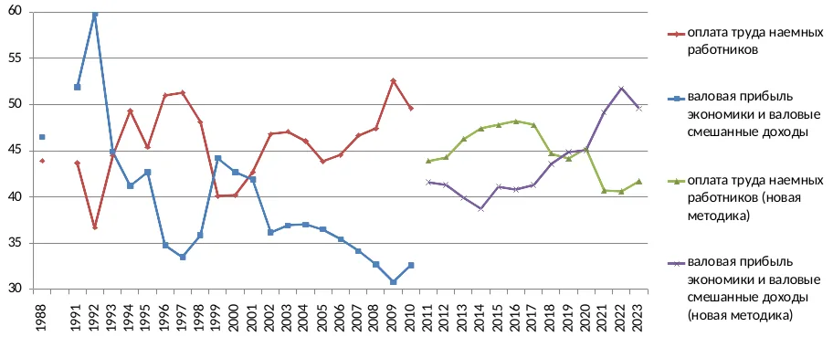

Об этом свидетельствует другой статистический показатель — доля валовой прибыли в экономике. На рис. 19 видно, что по данным Росстата с начала 2000-х и до начала 2020-х доля прибыли в ВВП была ниже, чем в конце 80-х и начале 90-х, а доля оплаты труда наёмных работников, наоборот, несколько выше[^405]. Но, как было показано, российский капитал разными способами занижает свою прибыль. Один из них напрямую связан с оплатой труда и тем, как она определяется российской статистикой. На рис. 20 видно, что в середине 90-х появляется, а затем резко возрастает новая составляющая — скрытая оплата труда. В неё входят не только теневые выплаты («зарплата в конвертах»), но и часть доходов собственников и топ-менеджмента предприятий, которые таким образом скрывают их. Проще говоря, этот показатель отчасти отражает одну из составляющих занижения прибыли (что косвенно подтверждает и Росстат — в некоторых публикациях он обозначается как «скрытые оплата труда и смешанные доходы»)[^406]. По оценкам Меньшикова, сделанным в начале 2000-х, примерно половина скрытой оплаты труда на деле относится к прибыли[^407]. Если в соответствии с ними скорректировать долю оплаты труда в ВВП (см. рис. 21), то будет видно, что в течение всего постсоветского периода она не превышает уровень последних лет СССР и с 2000 года составляет в лучшем случае чуть больше 40% ВВП[^408]. При этом доля официальной оплаты труда с начала 2000-х остаётся намного ниже, чем в 1991 году, и в течение практически всего этого периода она была ниже, чем в 1992-1998 годы. Поскольку в 2010-х Росстат изменил методику расчёта ВВП, данные о доле заработной платы и прибыли оказались несопоставимыми с предшествующим периодом. Однако разница в показателях официальной заработной платы значительно меньше (чуть больше 2 п. п. в 2011 году), что позволяет достаточно уверенно сравнивать её за оба периода[^409].

*Рисунок 20. Оплата труда наёмных работников, официальная и скрытая оплата труда в 1988 и 1991-2023 годах, % ВВП*

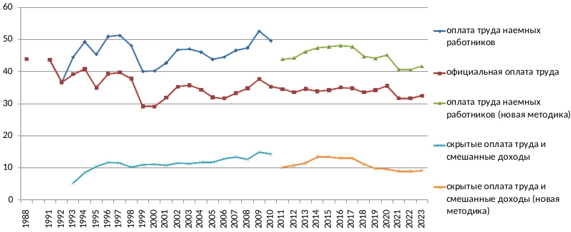

*Рисунок 21. Скорректированные прибыль и оплата труда в 1993-2023 годах\*, % ВВП*

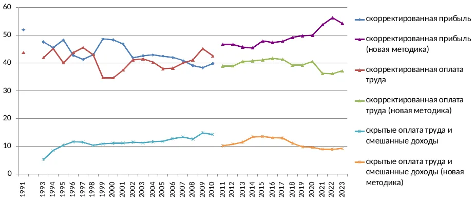

*\* Данные за 1991 год приведены в целях сравнения, без корректировок (до 1993 года Росстат не оценивал величину скрытой оплаты труда).*

Также надо учитывать, что к оплате труда статистика относит отчисления на социальное страхование, поэтому доля реально выплачиваемого заработка на самом деле ещё меньше. Если в 1990 году отчисления в социальные фонды составляли лишь 11% фонда оплаты труда, то с середины 90-х до середины 2000-х на них приходилось уже 25-30%, а начиная с 2005 года — около 20%. Таким образом, реально выплачиваемая заработная плата составляла 40,5% ВВП в 1990 году и лишь 26% в среднем за первые 20 постсоветских лет[^410].

Примечательно, что во второй половине 2010-х доля оплаты труда (включая скрытую) стала сокращаться, и чем дальше, тем больше: с 47-48% ВВП в середине 2010-х до 44-45% в конце десятилетия и до 40-41% в 2021-2023 годах. Одновременно выросла доля валовой прибыли и смешанных доходов, причём ещё сильнее: с 39-41% ВВП в первой половине 2010-х до 45% в 2019-2020 годах, а в 2021-2023 годах она составляла 49-52% ВВП, т. е. практически достигла уровня начала 90-х[^411]. Это можно объяснить ростом эксплуатации работников, сначала по мере сползания экономики в кризис и стагнацию середины 2010-х, а затем во время кризисов 2020 и 2022 годов[^412].

Надо сказать несколько слов о смешанных доходах, которые статистика зачастую объединяет с валовой прибылью. Под ними понимаются доходы «некорпорированных предприятий», т. е. главным образом домохозяйств и мелких предпринимателей, часть которых не использует наёмную рабочую силу. В таких доходах — полученных в некорпоративном секторе и зачастую от неформальной деятельности — стирается грань между оплатой труда и предпринимательским доходом[^413]. Доля смешанных доходов достигла максимума в конце 90-х (более 12% ВВП), а в 2000-х начала постепенно сокращаться и в середине 2010-х стабилизировалась на уровне 5-5,5% ВВП[^414]. Можно предположить, что это произошло из-за снижения удельного веса неформального сектора, а также малого и микробизнеса в национальном доходе[^415] (вероятно, также сыграла роль смена методики Росстата и возможный недоучёт производства в неформальном секторе). При этом доля валовой прибыли в отдельности уже в конце 2010-х была максимальной с начала 90-х (38,5-39,5% ВВП в 2018-2019 годах против 36% в 1993 году).

При сравнении официальных данных об удельном весе оплаты труда в ВВП до его сокращения в конце 2010-х (и с учётом отчислений на социальное страхование) со странами ОЭСР положение может показаться не самым плохим — по этому показателю Россия соседствовала с Венгрией и Южной Кореей и опережала, например, Италию и Норвегию. Но если взять официальную оплату труда, картина резко меняется: она была выше, чем показатели лишь двух стран — Мексики и Чили, причём по сравнению с последней разница невелика. Если оценивать долю скорректированной оплаты труда (официальная + 1/2 скрытой), изменения незначительны — Россия обгоняла (полу)периферийные Польшу и Словакию, а также экономически неблагополучную Грецию. Схожие результаты даёт сравнение доли оплаты труда в валовой добавленной стоимости (ВДС) обрабатывающей промышленности.

*Рисунок 22. Оплата труда наёмных работников в России и странах ОЭСР в 2007 году, % ВВП*

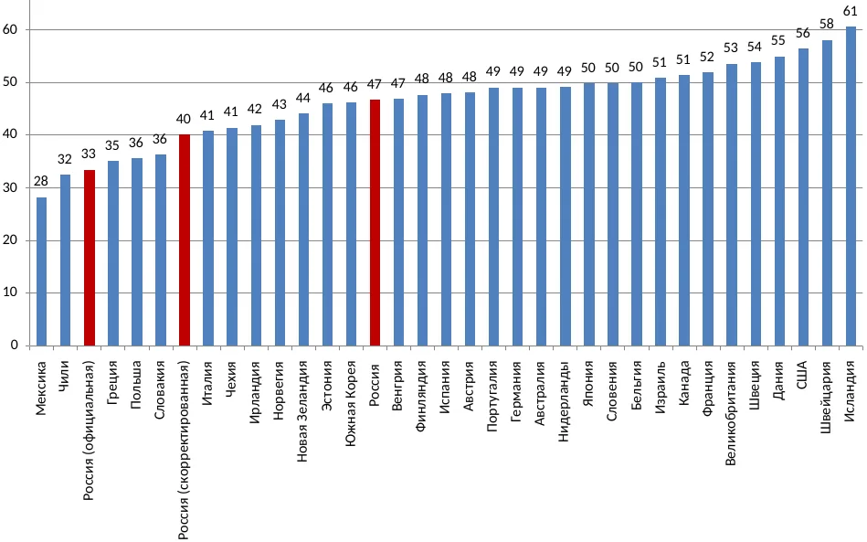

*Рисунок 23. Оплата труда в обрабатывающей промышленности в России и странах ОЭСР в 2010 году, % ВДС отрасли*[^416]

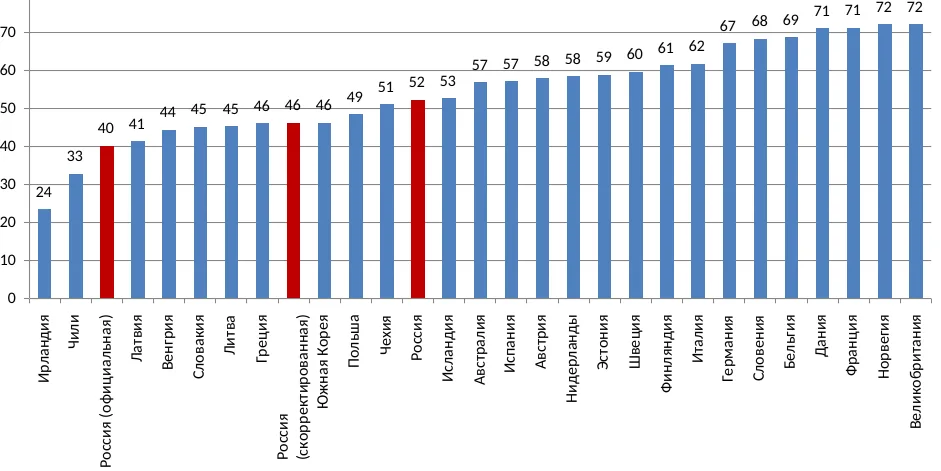

Таким образом, отличие российской экономики первых 30 постсоветских лет не в низкой доле оплаты труда как таковой, а в высокой доле скрытой оплаты. Но поскольку значительная часть последней на деле относится к предпринимательскому доходу, это и означает более низкую долю оплаты труда, чем в других странах, и, соответственно, более высокую долю прибыли.

При корректировке прибыли и учёте скрытых доходов, а также занижения с помощью других способов (как было сказано выше, в совокупности они могут составлять порядка 10-13% ВВП[^417]) видно, что с начала 2000-х её доля близка к 50% ВВП, что немногим ниже уровня 1991 года и, соответственно, превышает показатели последних лет СССР. Таким образом, при реальной доле прибыли в ВВП, близкой к 50%, на оплату труда приходится лишь порядка 40% (остальное — налоги на производство и импорт). После 2020 года прибыль составляет около 50% даже без всяких корректировок, а с их учётом приближается к рекордным уровням начала 90-х, а на долю оплаты труда, в свою очередь, приходится едва ли больше 35%.

Надо сказать, что высокая доля прибыли в экономике является характерной чертой полупериферийных и периферийных стран (что неоднократно отмечалось ещё с середины прошлого века[^418]). Исторически она была обусловлена большой и практически не снижающейся численностью резервной рабочей армии (в т. ч. из-за аграрного перенаселения), что позволяло капиталу удерживать заработную плату на более низком уровне, экономить на условиях труда и социальном обеспечении, а также активно эксплуатировать полупролетарские слои, поддерживающие воспроизводство своей рабочей силы за счёт подсобного хозяйства, надомной работы и т. п. Кроме того, к более высокой норме прибыли приводит более низкое органическое строение капитала в зависимых странах (вызванное в т. ч. его оттоком, ограничивающим инвестиции в производство)[^419]. Как было показано выше, многие из этих факторов действуют и в России: в первую очередь низкие издержки на рабочую силу из-за стабильно большой резервной рабочей армии, а также относительно невысокие расходы на постоянный капитал (точнее, на воспроизводство и модернизацию основного капитала)[^420]. Вследствие этого доля прибыли в экономике сопоставима с полупериферийными и периферийными странами: к примеру, в Колумбии в среднем за 2016-2021 годы на прибыль и смешанные доходы приходилось 53,5% ВВП, в Болгарии — 45,5%[^421] против 44% в России в среднем за тот же период без поправки на скрытую оплату труда и 49,5% с учётом этой поправки (но без учёта сокрытия прибыли другими способами). Для сравнения, в США и Германии в среднем за прошлое десятилетие доля валовой прибыли и смешанных доходов составляла около 40% ВВП, во Франции — 35%[^422].

Низкая доля оплаты труда и личного потребления в ВВП современной России являются статистическим отражением очень важного отличительного признака, который считается типичным для зависимых экономик. Это узость внутреннего рынка и очень медленный рост его ёмкости, проистекающие из низкого уровня доходов и потребления основной части населения. Из-за этого в экономике нет достаточного внутреннего источника для сбалансированного роста[^423], т. к. отечественные предприятия, производящие продукцию на внутренний рынок, имеют более низкую норму прибыли (по сравнению с их иностранными конкурентами и предприятиями из экспортных отраслей) из-за слабого спроса и отсутствия экономии на масштабе. Такое положение препятствует расширению производства, тормозит концентрацию капитала в этих отраслях и предрасполагает к перетоку капитала в отрасли с более высокой нормой прибыли (в особенности непроизводственные, поскольку в наиболее прибыльных производственных отраслях господствуют монополии) и/или за границу[^424]. Как следствие, другой внутренний источник роста, накопление капитала, также ограничен — как из-за слабости потребительского спроса, снижающей возможности накопления для предприятий, выпускающих соответствующие товары, так и в силу факторов, рассмотренных в предыдущих главах (в первую очередь экспортно-сырьевой ориентации). Кроме того, узость внутреннего рынка не позволяет развиваться промышленности, производящей высокотехнологичную продукцию, для которой требуются большие капиталовложения и, соответственно, большая выручка (тогда как на внешних рынках такой продукции доминируют корпорации стран центра, которые всеми силами препятствуют проникновению конкурентов). Т. е. образуется как бы замкнутый круг: экспортная ориентация экономики предрасполагает к низкому уровню потребления работающего населения, а он ведёт к неразвитости внутреннего рынка[^425], что, в свою очередь, побуждает производителей ориентироваться преимущественно или исключительно на внешние рынки. В лучшем случае они могут рассчитывать на государственный спрос, но его вклад во внутреннее потребление также ограничен из-за экспортной ориентации и участия государства в вывозе капитала. В любом случае при такой конфигурации экономики доминирующие отрасли лишь в очень незначительной степени зависят от роста личного потребления, т. е. от платёжеспособного спроса населения.

Этот вопрос тесно связан с одной из фундаментальных проблем капиталистического способа производства. Как известно, ключевым для капитализма является противоречие между общественным характером производства и частным характером присвоения его продуктов. Одно из наиболее заметных его проявлений, в свою очередь, — противоречие между неограниченным развитием производительных сил, постоянно растущими объёмами производства и ростом возможностей «конечных потребителей» (среди которых по мере развития капитализма постепенно растёт доля наёмных работников) к потреблению, ограниченным их платёжеспособным спросом (т. е. главным образом оплатой их труда) и потому значительно более медленным. Эти противоречия, как правило, проявляются через кризисы перепроизводства и перенакопления[^426]. В XIX-XX веках различные аспекты этого вопроса были предметом многочисленных дискуссий между экономистами разных направлений (в частности, в России — между народниками и марксистами), которые вошли в историю как споры о «проблеме реализации» — т. е. реализации прибавочного продукта или прибавочной стоимости[^427].

В XX веке в попытках сгладить кризисы и расширить рынок для всё возрастающего объёма продукции в капиталистической экономике было создано несколько механизмов. Первый — государственное перераспределение доходов и инвестиции, поддерживающие покупательную способность трудящегося населения и увеличивающие внутренний спрос на предметы потребления и на средства производства; в частности, важную роль здесь играет коллективное потребление (в т. ч. предоставляемые государством услуги) и контрциклическая экономическая политика. Второй — огромное расширение потребительского (в частности, ипотечного) кредитования, позволяющего населению приобретать товары, которые не были им предварительно оплачены[^428]. Важную роль также сыграло огромное по сравнению с XIX веком расширение мировой торговли, обусловленное в т. ч. ростом экспорта капиталов, благодаря которому появилась возможность сбывать товары на внешние рынки без необходимости закупать сопоставимые объёмы товаров там — в обмен на средства, привлечённые покупателями через государственные или частные займы и иностранные инвестиции[^429]. Разумеется, полностью разрешить указанное противоречие эти механизмы не могут, иначе капитализм перестал бы быть капитализмом[^430]. Происходящие время от времени кризисы перепроизводства и перенакопления (яркий пример — кризисы 1973 и 2008 годов) это явно демонстрируют[^431].

Как в этом плане функционирует российская экономика? Ведь доля прибыли в ней, как было показано, очень велика — около половины ВВП или даже больше, а заработки наёмных работников, напротив, достаточно низки и в совокупности составляют значительно меньше половины ВВП. Соответственно, покупательная способность основной части населения сильно ограничена. Посредством чего в таком случае реализуется прибавочная стоимость и каким образом это происходит? Это очевидно из сказанного выше. Наёмные работники не являются основными потребителями производимых товаров, т. е. лишь в небольшой степени задействованы в реализации создаваемого в экономике страны продукта (в т. ч. прибавочного[^432]). Как говорилось в [главе 1](#ch-1), производство многих видов сырья и полуфабрикатов (нефти и нефтепродуктов, угля, стали, алюминия, минеральных удобрений и т. д.) на протяжении долгого времени превосходит внутреннее потребление в 2 раза и более, а экспортные цены на большинство из них были выше внутренних; соответственно, во многих отраслях основная часть прибыли поступала из-за рубежа[^433]. Т. е. значительная часть созданной в экономике прибавочной стоимости реализуется за границей, куда сбываются эти товары.

Эта особенность периферийных экономик была отмечена авторами школы зависимого развития на примере стран Латинской Америки. Они же показали, что для экономик такого типа потребление наёмных работников имеет очень небольшое значение; соответственно, у господствующих классов нет заинтересованности в расширении внутреннего рынка (поскольку основная часть производимой продукции предназначена для экспорта, а не для приобретения широкими слоями населения). Таким образом, им постоянно нужно стремиться к понижению реальной заработной платы или по меньшей мере препятствовать её росту[^434]. То же самое касается государственных механизмов перераспределения доходов. Поскольку оно не отвечает экономическим интересам господствующих классов, эти механизмы работают лишь в минимальной степени — для компенсации (и то только частичной) недопотребления значительной части трудящегося населения[^435].

Итак, созданная в российской экономике прибавочная стоимость в значительной степени реализуется путём экспорта, не включаясь в расширенное воспроизводство, т. е. не накапливаясь как производственный капитал внутри страны. При этом взамен не приходит сопоставимый объём импорта, а денежный капитал выводится за границу *—* в офшоры и страны центра, что и показывает статистическая категория «чистый экспорт», рассмотренная выше[^436].

При такой экономической модели активный рост возможен только при огромном наращивании экспорта, что и происходило в России в 2000-х (за 2000-2008 годы его величина в текущих ценах выросла почти в 5 раз)[^437]. Но результаты этого роста практически полностью достаются узкому кругу отраслей, связанных с внешней торговлей, и небольшому слою населения, тогда как остальная экономика и большинство трудящихся получают от него очень мало. Мы рассмотрим эти вопросы далее, но прежде отметим ещё один важный аспект.

Экономика такого типа становится крайне зависимой от мировой конъюнктуры и уязвимой к внешним по отношению к ней экономическим кризисам, поскольку большинство из них ведут к глобальному спаду в потреблении сырья и полуфабрикатов. Это можно было наблюдать в ходе мировых кризисов — например, в 2008 и 2020 годах. В 2009 году под влиянием финансового кризиса, обвала мирового спроса и цен на основные экспортные товары падение ВВП составило почти 8% (один из самых больших спадов в мире), падение промышленного производства — более 9%. Резкое восстановление произошло главным образом из-за отскока цен на сырьё. Но дальнейшие события в полной мере показали тупиковость этой модели — стоило ценам сначала перестать расти, а затем снизиться, экономика вошла в полосу стагнации, из которой она, по сути, так и не вышла[^438].

### 4.2. Дифференциация доходов и её влияние на развитие внутреннего рынка {#sec-4-2}

Итак, высокая доля прибыли в ВВП фактически означает низкую долю оплаты труда и потребления широких слоёв населения. Но это ещё не всё. На рис. 24 видно, что начиная с 1998 года оплата труда заметно отстаёт от расходов на потребление домохозяйств[^439]. До кризиса 2008 года она составляла порядка 90-95% последних, с 2011 года — 86-92% (согласно расчётам по новой методике Росстата), а после 2020 года временами опускалась ниже 85%. Отношение официальной оплаты труда к личному потреблению с 2000 года практически всё время колебалось в диапазоне 65-70%. Это значит, что заметная часть расходов на личное потребление происходит не из заработной платы рядовых наёмных работников и социальных выплат (отчисления на которые статистика включает в оплату труда), а из других доходов: выплат (в т. ч. скрытых) топ-менеджерам компаний, дохода от предпринимательской деятельности, имущества, акций и т.д.[^440].

*Рисунок 24. Отношение расходов на личное потребление к оплате труда наёмных работников*

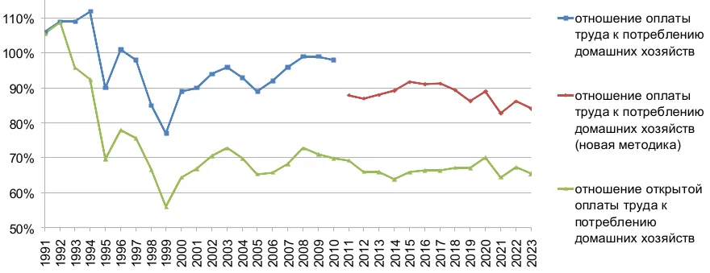

*Таблица 8. Распределение общего объёма денежных доходов населения по 20-процентным группам в среднем за 2000-2021 годы*[^441]

<table>
<tbody>
<tr><td>1-я (с наименьшими доходами)</td><td className="num">5,3</td></tr>
<tr><td>2-я</td><td className="num">10</td></tr>
<tr><td>3-я</td><td className="num">15</td></tr>
<tr><td>4-я</td><td className="num">22,6</td></tr>
<tr><td>5-я (с наибольшими доходами)</td><td className="num">47</td></tr>
<tr><td>из неё 10% населения с наивысшими доходами</td><td className="num">30,4</td></tr>
</tbody>
</table>

Очевидно, что такие источники доходов имеет лишь небольшая часть населения. Но в то же время доходы этого небольшого слоя очень велики. По данным Росстата, в среднем за 2000-2021 годы на 80% населения приходилось лишь 53% совокупного денежного дохода, тогда как на оставшиеся 20% — 47%, причём на 10% самых богатых — 30% (т. е. столько же, сколько на 60% населения с наименьшими доходами — см. табл. 8); для сравнения, в 1991 году на 80% населения приходилось почти 70% общего денежного дохода[^442]. Исследователи считают, что официальная статистика сильно недооценивает рост неравенства в постсоветский период[^443]. Так, по некоторым оценкам, доля богатейших 10% в национальном доходе выросла с 25% в 1990-1991 годах до 46% в 1996 году и осталась на этом уровне в 2016 году, оказавшись выше, чем в Китае и несколько ниже, чем в Бразилии и Индии. В то же время доля беднейших 50% снизилась с 30% в 1990-1991 годах до 10-15% в 1996-1998 годах и 18% в 2015 году, что сопоставимо с ситуацией, наблюдавшейся в Латинской Америке более чем полвека назад[^444]. Таким образом, почти половина платёжеспособного спроса приходится лишь на наиболее богатые 10-20% населения.

Это является ещё одной специфической особенностью российской экономики: вдобавок к тому, что доля потребления в ВВП достаточно низка, оно сконцентрировано в очень узком слое. А этот слой заметно отличается от основной массы населения по структуре своих расходов и потребления. Во-первых, он тратит на потребление далеко не все свои доходы — часть уходит на сбережения, вкладывается в различные активы (в первую очередь недвижимость), финансовые инструменты и т. п., причём в значительной степени за рубежом (что было особенно распространено до 2022 года, но и сейчас не прекратилось полностью)[^445]. Во-вторых, значительная часть его потребления приходится на импортные товары и услуги. При этом абсолютное большинство товаров и услуг роскошного потребления, характерного для этого слоя (премиальные автомобили, люксовая одежда, аксессуары, мебель, яхты, частные самолёты и т. п.), производится в странах центра или компаниями из этих стран. Таким образом, значительная доля его расходов в конечном счёте уходит за границу — как через покупку товаров роскошного потребления и оплату услуг за рубежом (туризм, медицинское обслуживание и т. д.), так и посредством приобретения зарубежной недвижимости, акций иностранных компаний и т. п. Иными словами, имущие классы, тратящие основную часть своих очень высоких доходов на непроизводительное потребление и сбережения, а также вывоз капитала за рубеж, тем самым вносят свой вклад в снижение производственного накопления внутри страны. Предметы престижного потребления, поставляемые в обмен на экспортируемые природные ресурсы, очевидно, не имеют отношения ни к накоплению производственного капитала, ни к воспроизводству рабочей силы трудящегося населения, а оплату многих зарубежных услуг можно считать каналом оттока капитала в буквальном смысле[^446].

Вследствие такой структуры платёжеспособного спроса сфера торговли и услуг в России в постсоветский период в значительной степени ориентируется на богатейшие 10-20% населения, т. е. на небольшой слой, который в основном потребляет не продукцию, произведённую внутри страны, а импортные товары и услуги за рубежом. Это опять же предопределяет узость внутреннего рынка, его крайне высокую зависимость от импорта[^447] и является ещё одним отличительным признаком зависимых экономик (эта особенность также была отмечена на примере стран Латинской Америки ещё в 60-х годах прошлого века[^448]). Кроме того, это ещё одна причина финансовой и технологической слабости отечественного производства, которое в основном вынуждено ориентироваться на спрос населения с низкими доходами, выпускать максимально дешёвую продукцию невысокого качества, и, как следствие, не может конкурировать с импортом за узкую прослойку с наибольшей покупательной способностью[^449].

Таким образом, низкая оплата труда и крайне ограниченное личное потребление основной массы населения, обусловленные экспортной ориентацией экономики, препятствуют развитию внутреннего рынка как непосредственно — из-за низкого платёжеспособного спроса, так и опосредованно — из-за ограниченных возможностей для капиталовложений в отраслях, производящих потребительские товары[^450], а также в немалой степени из-за отсутствия необходимости в них для большинства отраслей экономики, поскольку рабочая сила слишком дёшева для её замены машинами[^451]. В результате, как было сказано, в качестве основного источника роста экономики остаётся наращивание экспорта и инвестиции преимущественно в экспортных отраслях[^452]. Одни эти отрасли, как правило, не могут обеспечить такой спрос на средства производства, чтобы отечественные производители последних имели объёмы продаж и норму прибыли, достаточные для модернизации и расширения, что, в свою очередь, ведёт к их неконкурентоспособности и делает более выгодным импорт инвестиционной техники, нежели её производство внутри страны (тем более что многие экспортёры в силу ряда причин склонны использовать в первую очередь импортное оборудование и технологии)[^453].

Чем отличается эта ситуация от т. н. «развитых стран» или стран центра? Экономический рост крупных стран метрополии в большей степени зависит от потребления широких слоёв населения, т. е. в основном наёмных работников; яркий пример — США, где на потребление домохозяйств приходится более 2/3 ВВП. Соответственно, проблема поддержания спроса со стороны населения для их экономик стоит более остро[^454]. Поэтому он стимулируется самыми разными способами. Наряду с теми, о которых было сказано выше, это более высокие заработные платы; развитая система социального обеспечения, включающая высокие пособия по безработице, разного рода субсидии, социальные программы и государственные услуги (бесплатные или по субсидируемым ценам); субсидирование внутреннего производства (в первую очередь сельскохозяйственного — в т. ч. для снижения цен на продовольствие) и т. д.[^455]. В силу этого на оплату труда приходится значительно большая доля произведённой стоимости: например, в США с конца 80-х до конца 2000-х она составляла 56-58% ВВП[^456], тогда как в России в среднем с начала 90-х до конца 2010-х — 46-47% ВВП, включая скрытую оплату труда, и 41-42% с учётом поправки на занижение прибыли с использованием скрытой оплаты труда. При этом в таких странах малый бизнес имеет больший удельный вес в экономике, т. е. в ней выше доля смешанного дохода и ниже доля валовой прибыли[^457]. В большинстве крупных развитых европейских стран фактическое конечное потребление домохозяйств (включая социальные трансферты в натуральной форме) составляет 65-70% ВВП против менее 60% в России (см. табл. 9). Кроме того, в большинстве стран метрополии (за исключением США) уровень неравенства по доходам гораздо меньше, что распределяет покупательную способность более равномерно и даёт широким слоям населения бόльшие возможности для потребления[^458]. Надо отметить, что всё это становится возможным благодаря выкачиванию прибавочной стоимости из зависимых стран[^459] и последующему её перераспределению с помощью государственных механизмов.

*Таблица 9. Фактическое конечное потребление домохозяйств в России и в некоторых европейских странах в среднем за 2005-2015 годы, % ВВП*[^460]

<table>
<tbody>
<tr><td>Россия</td><td className="num">59,3</td></tr>
<tr><td>Нидерланды</td><td className="num">62,5</td></tr>
<tr><td>Германия</td><td className="num">66,6</td></tr>
<tr><td>Испания</td><td className="num">69,3</td></tr>
<tr><td>Франция</td><td className="num">69,8</td></tr>
<tr><td>Польша</td><td className="num">70,8</td></tr>
<tr><td>Италия</td><td className="num">71,6</td></tr>
<tr><td>Великобритания</td><td className="num">77,2</td></tr>
</tbody>
</table>

Крупные страны центра с одной стороны и Россия (как и подавляющее большинство зависимых экономик) с другой хорошо иллюстрируют дилемму, выражающую одно из основных противоречий капитализма — между облегчением проблемы реализации через поддержку внутреннего спроса (путём его стимулирования со стороны государства — что было одним из основных пунктов кейнсианской программы) и поддержанием высокой нормы прибыли (за что боролись его оппоненты, в первую очередь неолибералы). Добиться одновременно и того, и другого в долгосрочной перспективе невозможно[^461]. Страны центра в этом отношении очень ярко характеризует применение кейнсианской экономической политики для облегчения последствий кризиса 2008 года (например, процентные ставки, близкие к нулю, государственная поддержка банков и некоторых предприятий, вплоть до национализации части из них), несмотря на господствовавшую в предыдущие десятилетия неолиберальную идеологию[^462], а также наращивание (путём выделения государственных средств) внутреннего потребления для поддержания экономики в ходе кризиса, вызванного пандемией коронавируса.

[^1]: Из исследований такого плана, опубликованных в последние 10-15 лет, можно отметить работы Р. Дзарасова и некоторых его учеников (в частности, О. Комолова), а также книгу М. Лебского «Новый русский капитализм: От зарождения до кризиса (1986-2018 гг.)».

[^2]: В качестве примера можно привести книгу С. Меньшикова «Анатомия российского капитализма» и работы Г. Ханина по экономической истории современной России.

[^3]: В настоящей работе используются термины «центр», «полупериферия» и «периферия», позаимствованные из мир-системного анализа. Под центром или метрополией понимаются т. н. «развитые страны» — государства, обладающие полной или частичной монополией на наиболее современные технологии, финансовые ресурсы и инфраструктуру, в т. ч. мировые платёжные средства (подробнее см. [разделы 3.2](#sec-3-2) и 6.2), объединённые в формальные и неформальные блоки («Большая семёрка», ЕС, ОЭСР), господствующие в международных организациях (МВФ, Всемирный банк, ВТО и т. д.) и за счёт всего этого доминирующие в мировой экономике. Термином «полупериферия» обозначена зависимая экономика (в частности, безвозмездно передающая странам центра часть произведённой у себя прибавочной стоимости), которая в то же время в отдельных аспектах может быть самостоятельной — в противоположность периферийным странам, которые, как правило, всецело зависят от внешнеэкономических отношений — и кроме того имеет свою периферию из стран, экономики которых в большей или меньшей степени зависят от неё и передают ей часть произведённой прибавочной стоимости.

[^4]: Практически все 90-е абсолютное большинство займов, предоставляемых банками были краткосрочными (по некоторым данным, кредиты на срок до года составляли более 90%). Банки не были заинтересованы в кредитовании промышленности из-за гораздо большей прибыльности других операций — валютных спекуляций, вложений в ГКО и т. п. См.: Ханин Г. Экономическая история России в новейшее время. Российская экономика в 1992-1998 годы. Новосибирск, 2014. С. 191, 195, 198, 208. Меньшиков С. Анатомия российского капитализма. М., 2004. С. 27-28, 60, 76-77.

[^5]: «Для предприятий тяжесть установленных в конце 1991 года налогов была чрезвычайной. По весьма правдоподобным последующим оценкам Минфина РФ в 1995-1996 годах, "если бы строго выполнялось налоговое законодательство, сбор налогов приблизился бы к 40–45% ВВП" ... Российская гильдия финансовых аналитиков в 1990-е годы провела специальное исследование ... о влиянии налоговых платежей на финансовое положение предприятий. Согласно ему, "если взять за 100 % сумму средств, остающихся у предприятий после покрытия операционных расходов, то при существующей системе налогообложения, с учётом платежей во внебюджетные фонды (по сути это налоги на фонд заработной платы), они должны выплатить 124%. Специалисты ГИФА просчитали и другой вариант — для ... рентабельных предприятий. Выяснилось, что при рентабельности в 17% на налоги уйдёт две трети средств, оставшихся после покрытия операционных расходов"». Ханин Г. Экономическая история России в новейшее время. Российская экономика в 1992-1998 годы. С. 600. «Согласно подсчётам Татьяны Долгопятовой, для того чтобы заплатить работникам зарплату в размере одного рубля, предприятие должно было заплатить налоги государству в размере 99 копеек, а налог на прибыль при этом составлял 67-69% от прибыли». Волков В. Силовое предпринимательство, XXI век: экономико-социологический анализ. СПб, 2012. С. 288-289. См. также: Тарасов А. Постскриптум из 1994-го ([https://scepsis.net/library/id_2577.html](https://scepsis.net/library/id_2577.html)).

[^6]: В начале 1992 года Центральный Банк (ЦБ) ввёл очень жёсткие ограничения на кредитование, что сразу вызвало рост неплатежей среди предприятий (хотя в том же году они были смягчены, рост неплатежей это уже не остановило). С 1995 года (по другим данным, с 1994 года) ставка по кредитам поднялась до уровня, в 2-3 раза превышающего темпы инфляции и в некоторые годы составляла 15-30% и более в реальном выражении (Ханин Г. Экономическая история России в новейшее время. Российская экономика в 1992-1998 годы. С. 344-346. Меньшиков С. Указ. соч. С. 339).

[^7]: Неплатежи постепенно росли с 1992 года и достигли пика к концу десятилетия, хотя они были характерны не только для государственного бюджета, но и для частных предприятий. См.: Ильин В. Власть и уголь: шахтёрское движение Воркуты. М., 1998. Гл. 6 ([https://web.archive.org/web/20080926124014/http://socnet.narod.ru/library/authors/Ilyin/coal/6.htm](https://web.archive.org/web/20080926124014/http://socnet.narod.ru/library/authors/Ilyin/coal/6.htm)). Тарасов А. Постскриптум из 1994-го. Ханин Г. Экономическая история России в новейшее время. Российская экономика в 1992-1998 годы. С. 94, 261, 345. Меньшиков С. Указ. соч. С. 337.

[^8]: Ханин Г. Экономическая история России в новейшее время. Российская экономика в 1992-1998 годы. С. 17, 598, 600. Волконский В., Кузовкин А. Диспаритет цен в России и мире // Проблемы прогнозирования. 2002. № 6.

[^9]: В 1995-1998 годах курс рубля фиксировался Центробанком в рамках «валютного коридора». На момент его введения установленный курс приблизительно соответствовал рыночному, но впоследствии из-за инфляции разница между реальной покупательной способностью рубля и его курсом к доллару увеличилась многократно, что стало одной из причин девальвации 1998 года. См.: Меньшиков С. Указ. соч. С. 339. Ханин Г. Экономическая история России в новейшее время. Российская экономика в 1992-1998 годы. С. 346-347.

[^10]: Там же. С. 41, 45, 249. Тарасов А. Постскриптум из 1994-го. Лебский М. Новый русский капитализм: От зарождения до кризиса (1986-2018 гг.). М., 2019. С. 68-69, 81-82.

[^11]: В 1989-1990 годах экспорт составлял 74,7 и 71,1 млрд долл. соответственно, в 1995-1997 годах — 81,2-88,5 млрд. При этом импорт, хотя и оставался ниже рекордных показателей 1989-1990 годов (78-81,8 млрд долл.) до середины 2000-х, уже в 1997 году практически достиг уровня 1988 года (71,8 млрд против 72,2 млрд) и значительно превысил доперестроечные объёмы (60-63 млрд в 1986-1987 годах). Социально-экономические показатели Российской Федерации в 1991-2022 гг. Разд. 23 ([https://rosstat.gov.ru/storage/mediabank/pril-year_2023.rar](https://rosstat.gov.ru/storage/mediabank/pril-year_2023.rar)). Илларионов А. Внешняя торговля России в 1992-1993 годах // Вопросы экономики. 1994. № 6 ([https://web.archive.org/web/20220121003703/https://www.iea.ru/article/publ/vopr/1994_6.pdf](https://www.iea.ru/article/publ/vopr/1994_6.pdf)). Подробнее об удельном весе и структуре экспорта и импорта в экономике РСФСР и современной России см. далее в этом разделе и в разделе 5.2.

[^12]: Кляйн Н. Доктрина шока. М., 2011. С. 295-296, 301-302, 322-325. Кагарлицкий Б. Периферийная империя: циклы русской истории. М., 2009. С. 521-522, 534-535. Тарасов А. Постскриптум из 1994-го. См. также: Меньшиков С. Указ. соч. С. 348-349.

[^13]: Строго говоря, такая политика стимулирует экспорт (равно как и импорт) в целом, поскольку отменяет ограничения на движение капитала, меры по защите внутреннего рынка и предприятий, работающих на внутренний спрос, тем самым делая их более уязвимыми перед конкуренцией со стороны импорта транснациональных корпораций (ТНК). Но поскольку большинство стран, не относящихся к центру капиталистической мировой экономики, как правило не имеет возможности продавать на внешних рынках большие объёмы сложной промышленной продукции, в результате стимулируется экспорт сырья и полуфабрикатов; те страны, где природных ресурсов недостаточно, становятся производителями товаров массового потребления и/или местом расположения сборочных производств для корпораций стран центра. Таким образом, поощряется производство и экспорт продукции, наиболее востребованной странами центра, в т. ч. путём скупки местных предприятий транснациональным капиталом и их переориентации на производство экспортных товаров. Первая тенденция наиболее ярко проявилась в Латинской Америке, вторая — в Южной и Юго-Восточной Азии (хотя к ней также можно отнести, например, Мексику). О политике «Вашингтонского консенсуса» в отношении внешней торговли см.: Ждановская А. Что такое ВТО? В чьих интересах в ВТО принимаются решения? Чем опасна ВТО? ([https://scepsis.net/library/id_2546.html](https://scepsis.net/library/id_2546.html)). Грот А. «Глобальная Европа — крепкое партнёрство для открытия рынков европейским экспортёрам» ([https://scepsis.net/library/id_2299.html](https://scepsis.net/library/id_2299.html)). О последствиях неолиберальной политики в полупериферийных и периферийных странах см.: Коуп З. Разделенный мир. Разделенный класс. Глобальная политическая экономия и стратификация труда при капитализме. М., 2022. С. 244-245, 304, 358-359 ([https://lenincrew.com/divided-world-1/](https://lenincrew.com/divided-world-1/); [https://lenincrew.com/divided-world-2/](https://lenincrew.com/divided-world-2/)). Харви Д. Краткая история неолиберализма. Актуальное прочтение. М., 2007. С. 136-140. Labour Rights in High Tech Electronics: Case Studies of Workers’ Struggles in Samsung Electronics and its Asian Suppliers. Hong Kong, 2013. P. 80-83, 94-95. Hirschman A. The Political Economy of Latin American Development: Seven Exercises in Retrospection // Latin American Research Review. № 3. 1987. Gunder Frank A. Economic Genocide in Chile: Monetarist Theory Versus Humanity; Two Open Letters to Arnold Harberger and Milton Friedman. Nottingham, 1976.

[^14]: Все последствия изменений, происходящих с 2022 года, до конца не ясны, но, как будет показано ниже, ни ориентация на экспорт, ни зависимость от импорта кардинально не изменились — соответственно, в том или ином виде сохранится и влияние этих факторов на экономику.

[^15]: По ходу изложения мы неоднократно будем обращаться к обобщённым макроэкономическим показателям — в первую очередь к составляющим ВВП. Надо оговориться, что понятие ВВП, а также его составляющие не вполне соотносятся с категориями марксистской политэкономии, но их рассмотрение позволяет показать многие интересующие нас особенности экономики и закономерности её развития. При правильном анализе и интерпретации через них, как правило, можно выйти на понятия из марксистской экономической теории.

[^16]: Национальные счета России в 1997-2004 годах. С. 83. Социально-экономические показатели Российской Федерации в 1991-2022 гг. Разд. 11.

[^17]: Там же. Exports of goods and services (% of GDP) ([https://data.worldbank.org/indicator/NE.EXP.GNFS.ZS?end=2020&locations=RU-CN&start=2000&view=chart](https://data.worldbank.org/indicator/NE.EXP.GNFS.ZS?end=2020&locations=RU-CN&start=2000&view=chart)).

[^18]: Гнидченко А. Взаимосвязи России с ЕС, США, Китаем и АСЕАН в международных производственных цепочках // Экономический журнал ВШЭ. 2023. № 4.

[^19]: «... Россия в значительной мере ориентирована на экспорт добавленной стоимости на нужды выпуска конечной продукции в других странах и блоках — 23% той части российской добавленной стоимости, которая идёт на производство товаров и услуг, используется именно таким образом (для сравнения: в АСЕАН — 17%, в остальных странах (Китае, США, ЕС — *А. П.*) — менее 10%)». Гнидченко А. Взаимосвязи России с ЕС, США, Китаем и АСЕАН в международных производственных цепочках. Данные на 2018 год.

[^20]: «Это ... отражает экспортную специализацию на поставках сырьевых товаров и относительно невысокий объем экспорта переработанной продукции» (Там же). Схожая роль в мировых товарных цепочках, например, у Саудовской Аравии (См.: Структурные изменения в российской экономике и структурная политика. М., 2018. С. 75-76 ([https://www.hse.ru/data/2018/04/13/1150725828/Аналитический доклад по структурной политике.pdf](https://www.hse.ru/data/2018/04/13/1150725828/Аналитический%20доклад%20по%20структурной%20Υ))).

[^21]: Так, в среднем за 2011-2015 годы экспорт одних только нефти, газа и нефтепродуктов составлял 15,4% ВВП. Из-за падения цен его доля снизилась до 12,3% ВВП в среднем за 2016-2020 годы. Белоусов Д. Глобальные технологические тренды 2022-2040 годов (часть 1) // Горизонт 2040. М., 2023. С. 122.

[^22]: Зависимость экономического роста от внешней торговли и динамика цен на сырьё и несырьевые товары на мировом рынке рассматриваются в главах 5-6.

[^23]: Товарная структура экспорта и импорта Российской Федерации, годы (с 1995 г.) ([https://rosstat.gov.ru/storage/mediabank/99stru.xlsx](https://rosstat.gov.ru/storage/mediabank/99stru.xlsx)).

[^24]: В СССР в 1985-1990 годах на топливо, металлические руды и продукцию металлургии приходилось порядка 50-60% экспорта (Народное хозяйство СССР в 1990 г. С. 659. Меньшиков С. Указ. соч. С. 357), однако советская статистика включала в топливный экспорт электроэнергию, поэтому на деле доля сырья была несколько ниже (Тарасов А. «Второе издание» капитализма в России ([https://scepsis.net/library/id_2973.html](https://scepsis.net/library/id_2973.html))). При этом доля экспорта в ВВП РСФСР в 1989 году составляла около 22% — гораздо ниже, чем в постсоветской России (Exports of goods and services (% of GDP) ([https://data.worldbank.org/indicator/NE.EXP.GNFS.ZS?locations=RU](https://data.worldbank.org/indicator/NE.EXP.GNFS.ZS?locations=RU))).

[^25]: «Контроль над экспортом в сочетании с катастрофическим падением курса рубля гарантировал то, что в руках у олигархов сосредоточились "настоящие" финансовые ресурсы. Обесценение рубля вело к долларизации экономики. А это, в свою очередь, означало, что господствующие позиции в стране получают компании, которым гарантирован стабильный приток западной валюты». Кагарлицкий Б. Указ. соч. С. 532.

[^26]: Есть множество примеров того, как в 90-х они скупали российские предприятия, которые могли составить им конкуренцию, ликвидировали их или превращали в «отвёрточные» производства. См., например: "Новомосковскбытхиму" приделали крылышки ([https://www.kommersant.ru/doc/182251](https://www.kommersant.ru/doc/182251)). Максимов Б. Зарубежный опыт трудовых отношений на российской почве в 1990-е и начале 2000-х // Трудовые отношения: состояние и тенденции развития в России. Самара, 2013. С. 71-83. Пример более изощрённой борьбы иностранцев с российскими конкурентами см.: Как гибнут ярославский и московский заводы холодильного оборудования ([http://web.archive.org/web/20240519074503/https://www.promved.ru/articles/article.phtml?id=2084&nomer=1](http://web.archive.org/web/20240519074503/https://www.promved.ru/articles/article.phtml?id=2084&nomer=1)).

[^27]: Подробнее см.: Клочков В. Чем плоха сырьевая экономика ([https://scepsis.net/library/id_2121.html](https://scepsis.net/library/id_2121.html)).

[^28]: Меньшиков С. Указ. соч. С. 47-48, 50, 200-201. Дзарасов Р., Новоженов Д. Крупный бизнес и накопление капитала в современной России. М., 2009. С. 132, 135. Шмат В. Нефтегазовый цугцванг. Очерки экономических проблем российского нефтегазового сектора. Новосибирск, 2013. С. 375 ([https://web.archive.org/web/20201126202809/http://](https://web.archive.org/web/20201126202809/http://нефтегазовый-цугцванг-онлайн.рф/Petr-Zug_e_2013_12_23.pdf)[нефтегазовый-цугцванг-онлайн.рф](http://нефтегазовый-цугцванг-онлайн.рф/Petr-Zug_e_2013_12_23.pdf)[/Petr-Zug_e_2013_12_23.pdf](https://web.archive.org/web/20201126202809/http://нефтегазовый-цугцванг-онлайн.рф/Petr-Zug_e_2013_12_23.pdf)). Для минерального сырья также используются понятия «природная рента» или «сырьевая рента».

[^29]: Здесь уместна аналогия с тем, что говорилось о более высокой норме прибыли в колониях: «...что касается капиталов, вложенных в колониях и т. д., то они могут давать более высокие нормы прибыли, так как там вследствие низкого уровня развития норма прибыли выше вообще, а в связи с применением рабов, кули и т. п. выше и степень эксплуатации труда». Маркс К. Капитал. Критика политической экономии. Т. 3 // Маркс К., Энгельс Ф. Сочинения. М., 1961. Т. 25. Ч. 1. С. 260-261.

[^30]: Подробнее см.: Там же. С. 260. Меньшиков С. Указ. соч. С. 47-48. Т. е. можно сказать, что цена производства единицы товара внутри страны (включая среднюю для этой страны норму прибыли) оказывается ниже чем её цена на мировом рынке (см.: Маркс К. Капитал. Т. 3 // Маркс К., Энгельс Ф. Сочинения. Т. 25. Ч. 1. С. 171-172, 217-218).

[^31]: Подробнее об этом см. [раздел 4.1](#sec-4-1).

[^32]: «...преимущество основывалось на богатстве и доступности природных ресурсов, а также на высокой концентрации активов. Например, металлургические заводы, производившие первичный алюминий и рафинировавшие черновую медь, обычно строились в регионах, в которых генерировалось много дешёвой электроэнергии. Именно такая ситуация сложилась в Иркутской области и Красноярском крае после создания каскадов крупных ГЭС на Енисее и его притоках. Расходы на электроэнергию при выпуске упомянутой продукции значительны, поэтому предприятия цветной металлургии могли работать с низкими издержками». Дзарасов Р., Новоженов Д. Указ. соч. С. 131. См. также: Меньшиков С. Указ. соч. С. 102-103. Ханин Г. Экономическая история России в новейшее время. Российская экономика в 1992-1998 годы. С. 611.

[^33]: Данные о себестоимости добычи нефти в России сильно рознятся из-за различных критериев оценки. В среднем по отрасли и по крупнейшим нефтедобывающим корпорациям она оценивалась в диапазоне 10-20 долл. за баррель без учёта налогов во второй половине 2010-х годов. См.: Обзор нефтесервисного рынка России — 2019 ([https://www.csr.ru/upload/iblock/e6b/e6bbde49a62d90d36e5615b5c7b28094.pdf](https://www.csr.ru/upload/iblock/e6b/e6bbde49a62d90d36e5615b5c7b28094.pdf)). Минэнерго: себестоимость добычи нефти в России составляет 15-45 долл. за барр. ([https://neftegaz.ru/news/finance/716102-minenergo-sebestoimost-dobychi-nefti-v-rossii-sostavlyaet-15-45-doll-za-barr/](https://neftegaz.ru/news/finance/716102-minenergo-sebestoimost-dobychi-nefti-v-rossii-sostavlyaet-15-45-doll-za-barr/)). О себестоимости добычи и её составляющих см. также [раздел 1.3](#sec-1-3).

[^34]: На рис. 3-4, 6-9 и в табл. 6 внутренние цены — цены производителей. За 1993-1994 годы приведены цены на конец года, за 1992 и 1995-2007 годы — среднегодовые. Здесь и далее в данных о ценах на внутреннем рынке возможны некоторые неточности, т. к. Росстат приводит только их среднемесячные значения, и средние цены за год исчислены как среднеарифметическое цен за 12 месяцев. Рассчитано по: Средние цены производителей промышленных товаров до 2010 г. ([https://fedstat.ru/indicator/31453](https://fedstat.ru/indicator/31453)). Обменный курс (единица местной валюты за доллар США, среднегодовой период) ([https://fedstat.ru/indicator/62281](https://fedstat.ru/indicator/57606.https://fedstat.ru/indicator/62281)). Социально-экономические показатели Российской Федерации в 1991-2022 гг. Разд. 23. Российский статистический ежегодник. 2001. С. 596. Меньшиков С. Указ. соч. С. 47, 49.

[^35]: Российская экономика в 2005 году. Тенденции и перспективы. М., 2006. С. 217. Шмат В. Указ. соч. С. 443. bp Statistical Review of World Energy 2022 ([https://web.archive.org/web/20220709044744/https://www.bp.com/content/dam/bp/business-sites/en/global/corporate/pdfs/energy-economics/statistical-review/bp-stats-review-2022-full-report.pdf](https://web.archive.org/web/20220709044744/https://www.bp.com/content/dam/bp/business-sites/en/global/corporate/pdfs/energy-economics/statistical-review/bp-stats-review-2022-full-report.pdf)). Торговля в России. 2021. С. 107. Меньшиков С. Указ. соч. С. 357.

[^36]: Внутреннее потребление рассчитано как разность производства и экспорта. Для угля также учтён импорт: в постсоветский период только он ввозился в значимом количестве, тогда как импорт нефти и нефтепродуктов составлял порядка 5% от внутреннего производства во второй половине 90-х, 1-2% в начале 2000-х и менее 1% с середины 2000-х. В оценках по нефтепродуктам есть некоторая неточность, т. к. Росстат приводит данные только об объёмах первичной переработки нефти, но не о конечном выпуске. Однако разница между этими показателями не столь велика — к примеру, в 2017-2021 годах производство нефтепродуктов было примерно на 5% меньше объёмов первичной переработки (см.: За 2017-2021 гг производство нефтепродуктов в России выросло на 2,4%: с 268 до 274 млн т. ([https://marketing.rbc.ru/articles/13787/](https://marketing.rbc.ru/articles/13787/))); в то же время надо учитывать, что на деле их экспорт составляет несколько бóльшую долю их производства, а внутреннее потребление, соответственно, меньшую. Рассчитано по: Социально-экономические показатели Российской Федерации в 1991-2022 гг. Разд. 15. Российская Федерация в 1992 году. С. 57. Российский статистический ежегодник. 1994. С. 438. Там же. 1995. С. 438. Там же. 2022. С. 594, 600. Россия в цифрах. 1998. С. 377-378, 380. Промышленность России. 2000. С. 328-329, 338. Там же. 2005. С. 350-351, 360-361. Там же. 2010. С. 282-283, 286-287. Промышленное производство в России. 2016. С. 218-219, 224-225. Там же. 2019. С. 176, 180. Там же. 2021. С. 184, 188.

[^37]: Промышленное производство в России. 2016. С. 186, 190, 218-221. Там же. 2019. С. 155, 177. Там же. 2023. С. 125-127, 143. Обзор рынка рынка чёрной металлургии — 2020. С. 5 ([https://web.archive.org/web/20210601192114/https://www2.deloitte.com/content/dam/Deloitte/ru/Documents/research-center/Обзор рынка черной металлургии 2020.pdf](https://web.archive.org/web/20210601192114/https://www2.deloitte.com/content/dam/Deloitte/ru/Documents/research-center/Обзор%20рынка%20черной%20металлургии%202020.pdf)). Спрос на сталь в России в первом полугодии снизился на 15% ([https://www.vedomosti.ru/business/articles/2025/07/21/1125680-spros-na-stal](https://www.vedomosti.ru/business/articles/2025/07/21/1125680-spros-na-stal)). Алюминий: новые источники сырья и рынки сбыта ([https://morvesti.ru/themes/1694/105992/](https://morvesti.ru/themes/1694/105992/)).

[^38]: «Интерпретацию различий в уровне цен на взаимозаменяемые товары и услуги в бедных и богатых странах можно подытожить следующим образом. В бедных странах они создают благоприятные условия для развития производства продукции и ресурсов, необходимых для богатых стран, и максимального их вывоза (и минимального потребления внутри страны)». Волконский В., Кузовкин А. Диспаритет цен в России и мире.

[^39]: В т. ч. поэтому после февраля 2022 года производители, например, нефти или угля готовы были продавать свою продукцию в Азию с большими дисконтами — многие из них были ориентированы на экспорт практически полностью, поэтому полное закрытие внешних рынков для них означало бы обвал производства (как это произошло в Хакасии, где за полгода объёмы вывоза угля на экспорт сократились в 15 раз (см: Половина угольных предприятий Хакасии не платит зарплату сотрудникам — депутаты ([http://web.archive.org/web/20251001102947/https://tayga.info/179555](http://web.archive.org/web/20251001102947/https://tayga.info/179555)))) и огромные убытки, включая расходы на консервацию скважин и шахт.

[^40]: Российская экономика в 2018 году. Тенденции и перспективы. М., 2019. С. 244-245.

[^41]: Лебский М. Указ. соч. С. 149.

[^42]: Обзор рынка чёрной металлургии — 2020. С. 5, 20.

[^43]: Петренко И. Итоги работы угольной промышленности России за 2021 год // Уголь. 2022. № 3. Добыча нефти в России в 2018 году выросла на 1,6% ([https://tass.ru/ekonomika/5971425](https://tass.ru/ekonomika/5971425)<u>).</u>

[^44]: Рынок минеральных удобрений. 2017 год. С. 39 ([https://dcenter.hse.ru/data/2017/08/30/1173968029/Рынок минеральных удобрений 2017.pdf](https://dcenter.hse.ru/data/2017/08/30/1173968029/Рынок%20минеральных%20удобрений%202017.pdf)). Рынок минеральных удобрений. 2019 год. С. 32 ([https://dcenter.hse.ru/data/2019/12/26/1524652323/Рынок минеральных удобрений-2019.pdf](https://dcenter.hse.ru/data/2019/12/26/1524652323/Рынок%20минеральных%20удобрений-2019.pdf)).

[^45]: «Норникель» с 1 апреля останется единственным производителем никеля в России ([https://www.kommersant.ru/doc/3228971](https://www.kommersant.ru/doc/3228971)).

[^46]: В 2018-2022 гг производство цинка в России сократилось на 29%: с 255 до 182 тыс. т. ([https://marketing.rbc.ru/articles/14213/](https://marketing.rbc.ru/articles/14213/)).

[^47]: Производство меди и металлов платиновой группы сократится из-за коронавируса ([https://www.vedomosti.ru/business/articles/2020/03/24/826109-metallov-sokratitsya](https://www.vedomosti.ru/business/articles/2020/03/24/826109-metallov-sokratitsya)).

[^48]: Основные характеристики российской электроэнергетики ([https://minenergo.gov.ru/industries/power-industry/main-characteristics-russian-electric-power-industry](https://minenergo.gov.ru/industries/power-industry/main-characteristics-russian-electric-power-industry)). Крупнейшие компании электроэнергетики ([https://minenergo.gov.ru/industries/power-industry/largest-electric-power-companies](https://minenergo.gov.ru/industries/power-industry/largest-electric-power-companies)).

[^49]: Кроме того в отдельных отраслях (например, в производстве некоторых цветных металлов) в РСФСР вся продукция выпускалась одним-двумя предприятиями и такая ситуация сохранилась при их приватизации — т. е. монополизация была исторически обусловлена.

[^50]: Историю перераспределения этих активов в 90-х см.: Меньшиков С. Указ. соч. С. 88-122. Выше упоминалось о том, что обвальная девальвация рубля и долларизация экономики обеспечивали господствующие позиции тем, кто имел стабильный приток иностранной валюты (Кагарлицкий Б. Указ. соч. С. 532). Закономерно, что в такой ситуации владельцы компаний-экспортёров стремились любыми средствами упрочить своё господство и увеличить валютные поступления.

[^51]: Об основных слияниях и поглощениях 2000-х см.: Шмат В. Указ. соч. С. 204-205, 231.

[^52]: Примечательно, что зачастую такие компании связаны с сырьевыми монополиями общими владельцами. В качестве примера можно привести Трансмашхолдинг и группу Синара, которые контролируют производство практически всех видов продукции железнодорожного машиностроения, кроме вагонов и трамваев. Трансмашхолдинг принадлежит тем же собственникам, что УГМК, а группа Синара — тому же владельцу, что Трубная металлургическая компания (ТМК), один из крупнейших производителей чёрной металлургии, контролирующий бóльшую часть производства труб. Другие примеры — Силовые машины, одна из крупнейших компаний энергетического машиностроения, которая принадлежит владельцу Северстали Мордашову, и Группа ГАЗ, которая выпускает коммерческий транспорт (лёгкие и средние грузовики), а также контролирует львиную долю производства автобусов и принадлежит владельцу Русала Дерипаске.

[^53]: Who Owns Russia: 32 Largest Business Groups Make 51% of GDP ([https://web.archive.org/web/20131104144312/http://www.emergingmarketsvenue.com/2010/07/12/russian_business_groups](https://web.archive.org/web/20131104144312/http://www.emergingmarketsvenue.com/2010/07/12/russian_business_groups)).

[^54]: Промышленность России. 2005. С. 67.

[^55]: Рассчитано по: Коэффициенты концентрации производства по видам экономической деятельности с 2017 г. ([https://fedstat.ru/indicator/58999](https://fedstat.ru/indicator/58999)).

[^56]: Подробнее вопрос зависимости экономики от импорта будет рассмотрен в главах 5-6.

[^57]: «... отрасли, поставленные ценовым диспаритетом в привилегированное положение ... образуют основные элементы затрат российской обрабатывающей промышленности. Столь резкий относительный рост цен на \[их\] продукцию ... привёл к резкому росту затрат обрабатывающей промышленности...» (Дзарасов Р. Методология Н. А. Цаголова в исследовании накопления капитала в современной России // Вестник Московского университета. 2009. № 3). Потребление нефти, угля, газа и нефтепродуктов разными отраслями промышленности см.: Промышленность России. 2012. С. 154, 158-163, 166-167. Промышленное производство в России. 2016. С. 149, 152-157.

[^58]: Концепция двухсекторности экономики рассматривается подробнее в начале главы 5.

[^59]: Определяя это явление строго в терминах марксистской политэкономии, можно сказать, что стоимость продукции таких предприятий оказывается выше суммы их издержек производства и средней нормы прибыли; таким образом, благодаря полной или частичной монополии они получают добавочную прибыль или сверхприбыль (см., например: Маркс К. Капитал. Т. 3. // Маркс К., Энгельс Ф. Сочинения. Т. 25. Ч. 1. С. 194-195, 217-218. Ч. 2. С. 431-432).

[^60]: О таком принципе ценообразования на рынке нефти прямо пишет в своём докладе Федеральная антимонопольная служба (ФАС). См.: Доклад о состоянии конкуренции в Российской Федерации за 2007 год. М., 2008. С. 95, 97 ([https://fas.gov.ru/attachment/150385/download?1512388852](https://fas.gov.ru/attachment/150385/download?1512388852)).

[^61]: За 2017-2020 годы внутренние цены и курс доллара за декабрь, за остальные годы — среднегодовые; за 2017 год экспортные цены за декабрь, за остальные годы — среднегодовые. Рассчитано по: Средние цены производителей промышленных товаров до 2010 г. Средние цены производителей промышленных товаров с 2010 г. по 2016 г. ([https://fedstat.ru/indicator/40612](https://fedstat.ru/indicator/40612)). Средние цены производителей промышленных товаров с 2017 г. ([https://fedstat.ru/indicator/57606](https://fedstat.ru/indicator/57606)). Социально-экономические показатели Российской Федерации в 1991-2022 гг. Разд. 23. Обменный курс (единица местной валюты за доллар США, среднегодовой период). Российский статистический ежегодник. 2018. С. 617.

[^62]: Замглавы ФАС в 2010 году описывал механику сближения внутренних цен с мировыми следующим образом: «При росте цен на внешних рынках незамедлительно растут цены в России. Когда же мировые цены снизились в 3,3 раза, то цены в России снизились лишь в 2,3 раза. Причём в мире задержка снижения цен на национальных рынках вслед за мировыми составляет максимум одну неделю, в России же задержка составляет 1,5-2 месяца». Анатолий Голомолзин: политика нефтяных монополий является колониальной ([http://www.kommersant.ru/doc/1400625](http://www.kommersant.ru/doc/1400625)).

[^63]: Одна из причин, по которой внутренние цены всё сильнее сближались с экспортными после 2014 года — т. н. налоговый манёвр, включавший в себя снижение экспортных пошлин на нефть одновременно с ростом налога на её добычу. Подробнее см. в [разделе 3.1](#sec-3-1).

[^64]: Рассчитано по: Средние цены производителей промышленных товаров с 2017 г. В 2024 году по официальным данным разница между ценами производителей для внутреннего рынка и для экспорта составляла 5-12% в разные месяцы (в среднем за год — 9%), в 2025 году — 5-28% в разные месяцы (в среднем за год — 14%). Там же.

[^65]: Биржевая цена на российскую нефть резко выросла ([https://lenta.ru/news/2023/08/31/oilru/](https://lenta.ru/news/2023/08/31/oilru/)). Мировым ценам на нефть предрекли рост ([https://lenta.ru/news/2023/09/13/oil_wor/](https://lenta.ru/news/2023/09/13/oil_wor/)). Цена барреля нефти Urals в сентябре выросла до 83 долларов ([https://ria.ru/20231002/neft-1899976531.html](https://ria.ru/20231002/neft-1899976531.html)). При этом до февраля 2022 года разница между ценами на эти сорта на мировом рынке составляла 1-4 долл. за баррель в пользу Brent, а затем она значительно выросла из-за санкций на российскую нефть (см.: «Индикатор успеха санкций»: что означает дисконт российской нефти Urals к Brent ([https://www.forbes.ru/finansy/487942-indikator-uspeha-sankcij-cto-oznacaet-diskont-rossijskoj-nefti-urals-k-brent](https://www.neste.com/investors/market-data/crude-oil-prices))).

[^66]: Рассчитано по: Итоги торгов в секции Нефтепродуктов ([https://spimex.com/markets/oil_products/trades/results/](https://spimex.com/markets/oil_products/trades/results/); [https://spimex.com/files/36590/](https://spimex.com/files/36590/)).

[^67]: Цена на российскую нефть замедлила рост ([https://lenta.ru/news/2023/10/02/urals/](https://lenta.ru/news/2023/10/02/urals/)).

[^68]: Волконский В., Кузовкин А. Диспаритет цен в России и мире. Шмат В. Указ. соч. С. 203-204. Доклад о состоянии конкуренции в Российской Федерации за 2010 год. М., 2011. С. 178 ([https://fas.gov.ru/documents/596469](https://fas.gov.ru/documents/596469)).

[^69]: Средние цены производителей промышленных товаров с 2010 г. по 2016 г. Средние цены производителей промышленных товаров с 2017 г. Превышение внутренних цен на дизельное топливо над экспортными по номинальному курсу неоднократно отмечалось исследователями. См., например: Маневич В. Альтернативные стратегии преодоления стагнации и «новая модель роста» российской экономики // Вопросы экономики. 2017. № 8.

[^70]: Российский статистический ежегодник. 2020. С. 577.

[^71]: Рассчитано по: Средние цены производителей промышленных товаров с 2017 г. Средние цены на приобретённые организациями отдельные виды товаров с 2017 г. ([https://www.fedstat.ru/indicator/57778](https://www.fedstat.ru/indicator/57778)). См. также: Промышленное производство в России. 2021. С. 248.

[^72]: Схожие примеры — никель и чугун. Среднегодовые цены на никель внутри страны были выше цен экспорта как минимум в 2012-2016 и 2018 годах (детальные данные за другие годы отсутствуют). Внутренние цены на чугун в прошлом десятилетии в основном были чуть ниже экспортных, но как и в случае с медью, их динамика была практически идентичной. См.: Средние цены производителей промышленных товаров с 2010 г. по 2016 г. Средние цены производителей промышленных товаров с 2017 г.

[^73]: При этом бóльшую часть десятилетия экспортные цены были ниже мировых на 100-400 долл. за тонну или на 10-20% для алюминия и 2-4% для меди, что говорит о возможном занижении экспортных цен путём трансфертного ценообразования при продаже подконтрольным фирмам для сокрытия части прибыли и вывода её за границу (Рассчитано по: Средние цены производителей промышленных товаров с 2010 г. по 2016 г. Средние цены производителей промышленных товаров с 2017 г. Российский статистический ежегодник. 2014. С. 629, 635. Там же. 2017. С. 600, 607. Там же. 2020. С. 614, 619). Подробнее этот вопрос рассматривается в [разделе 2.3](#sec-2-3).

[^74]: «Оптовые поставки нефтепродуктов с НПЗ ВИНК (вертикально-интегрированных нефтяных компаний) своим региональным сбытам производятся в приоритетном порядке (объёмы, цены). При этом существует негласное правило: ВИНК не продает нефтепродукты оптом в регионы, где присутствует сбыт данного ВИНК. Это вынуждает независимых участников рынка либо закупать нефтепродукты у сбыта ВИНК, либо искать альтернативные схемы поставки (поставка партии частями из разных регионов, через соседние регионы с арендой мощностей по хранению, с использованием автотранспорта и др.), что приводит к нерентабельности работы. Создание же новых мощностей по хранению нефтепродуктов зачастую нецелесообразно, в связи с наличием уже существующих мощностей ... достаточных для удовлетворения спроса на услуги по хранению» (Доклад о состоянии конкуренции в Российской Федерации за 2010 год. С. 94). Свой вклад также вносит недостаточное развитие инфраструктуры — так, разветвлённая нефтепродуктопроводная система есть только в европейской части страны, в Западной Сибири есть лишь один магистральный нефтепродуктопровод до Кемерово, к которому подсоединены крупные города, а на востоке страны нефтепродукты транспортируются только железнодорожным или автомобильным транспортом (Шмат В. Указ. соч. С. 32-33).

[^75]: По состоянию на конец 2010-х две компании (Роснефть и ННК), владеющие НПЗ в этой части страны, контролировали 75% рынка розничных заправок. Даже в регионах, которые находятся в хорошей транспортной доступности от местных НПЗ и путей сообщения с западной частью страны (Приморский и Хабаровский края, Амурская обл., Еврейская автономная обл.) розничная цена на нефтепродукты заметно выше, чем в среднем по России: в 2013-2022 годах дизельное топливо было дороже на 1-4 руб./л. и более, бензин АИ-92 на 0,5-2,5 руб./л. и более, АИ-95 был дороже чем в среднем по России (кроме 2018-2019 годов, когда он был несколько дешевле среднероссийского уровня) на 0,5-2 руб./л. (Рассчитано по: Средние потребительские цены (тарифы) на товары и услуги ([https://fedstat.ru/indicator/31448](https://fedstat.ru/indicator/31448))). Завышение цен и проблемы с поставками неоднократно отмечалось государственными органами (см., например: ННК грозит штраф за дискриминацию независимых АЗС на Камчатке ([https://tass.ru/ekonomika/5767941](https://tass.ru/ekonomika/5767941)). Началась борьба за бензобак ([https://www.eastrussia.ru/material/nachalas-borba-za-benzobak/](https://www.eastrussia.ru/material/nachalas-borba-za-benzobak/)). Владельцы заправок в Приморье пожаловались в ФАС на завод «Роснефти» ([https://www.rbc.ru/business/16/07/2021/60ef02899a79474cf63ed594](https://www.rbc.ru/business/16/07/2021/60ef02899a79474cf63ed594))).

[^76]: Анатолий Голомолзин: политика нефтяных монополий является колониальной.

[^77]: В 2021 году по некоторым видам продукции деревообработки внутренние цены были лишь на 7% ниже мировых. См.: Ценовое ралли: стоимость деревянных домов и пиломатериалов достигла пика ([https://realty.rbc.ru/news/60ccc1c29a7947f7ab3bccc4](https://realty.rbc.ru/news/60ccc1c29a7947f7ab3bccc4)).

[^78]: См.: Цены на лосося и икру в России превысили мировые. В каких регионах и насколько подорожали рыба и морепродукты: инфографика ([https://rtvi.com/stories/czeny-na-lososya-i-ikru-v-rossii-prevysili-mirovye-v-kakih-regionah-i-naskolko-podorozhali-ryba-i-moreprodukty-infografika/](https://rtvi.com/stories/czeny-na-lososya-i-ikru-v-rossii-prevysili-mirovye-v-kakih-regionah-i-naskolko-podorozhali-ryba-i-moreprodukty-infografika/)). Вылов лосося в этом году обещает быть рекордным. Ждать ли снижения цен? ([https://www.bfm.ru/news/531951](https://www.bfm.ru/news/531951)).

[^79]: «Анализ деятельности производителей массовых ресурсов показывает, что они обладают специфическим фактором степени монополизма при удовлетворении спроса российских потребителей их продукции. Корпорации этого сектора могут ограничивать предложение своих товаров на внутреннем рынке и перераспределять поставки за рубеж благодаря низким в сравнении со среднемировым уровнем издержкам производства». Дзарасов Р., Новоженов Д. Указ. соч. С. 133. См. также там же, с. 135.

[^80]: Можно сказать, что фактор монополизма, упомянутый в предыдущем примечании, частично или полностью устраняется при наличии множества мелких производителей, часть которых в силу разных причин не имеют возможности выгодно экспортировать свою продукцию и вынуждены направлять её на внутренний рынок, тем самым конкурируя между собой.

[^81]: Доклад о состоянии конкуренции в Российской Федерации за 2007 год. С. 84.

[^82]: Доклад о состоянии конкуренции в Российской Федерации за 2021 год. М., 2022. С. 251-252 ([https://fas.gov.ru/documents/688431](https://fas.gov.ru/documents/688431)). Доклад о состоянии конкуренции в Российской Федерации за 2010 год. С. 191-195, 233, 278.

[^83]: Например, у американской Exxon Mobil, порядка половины добычи которой приходится на США и Канаду, операционные затраты в расчёте на баррель добываемой нефти в несколько раз выше, чем у Роснефти и Лукойла. См.: Субханкулова Р., Фурманов К., Иванова Н. Исследование сравнительных преимуществ нефтегазовых компаний с позиций операционных и капитальных затрат // Экономический журнал ВШЭ. 2015. № 2.

[^84]: Цены на бензин в России по номинальному курсу впервые сравнялись с ценами в США в 2005-2006 годах (Шмат В. Указ. соч. С. 343). Сравнения цен на бензин и дизельное топливо в разные годы см.: Почему растут цены на бензин ([https://t-j.ru/toplivo-stat/](https://t-j.ru/toplivo-stat/)). Шмат В. Указ. соч. С. 239, 250. International Fuel Prices 2014 ([https://web.archive.org/web/20240630064548/https://www.sutp.org/download/7908/](https://sutp.org/download/7908/?tmstv=1737458451)). International Fuel Prices 2018/19 ([https://web.archive.org/web/20230112095305/https://sutp.org/download/10008/](https://sutp.org/download/10008/?tmstv=1737458219)).

[^85]: К примеру, в ноябре 2018 года литр дизельного топлива в России стоил около 45 руб., по валютному курсу (66,4 руб./долл.) это составляло 68 центов против 88 центов в США. Но по ППС (24,5 руб./долл.) он стоил 1,8 долл., т. е. в два раза дороже, чем в США. (Рассчитано по: Средние потребительские цены (тарифы) на товары и услуги. Средний курс ЦБ в России ([https://www.kursvaliut.ru/средний-обменный-курс-за-месяц](https://www.kursvaliut.ru/средний-обменный-курс-за-месяц)). International Fuel Prices 2018/19. Российский статистический ежегодник. 2022. С. 657). В данном случае сравнение цен по ППС вполне оправдано: «Когда речь идет о сопоставлении уровня цен по узкой группе однородных товаров, скажем в России и США, то ППС имеет вполне конкретный и однозначный смысл: это сумма в рублях, на которую в России можно купить такое же количество данных товаров (с учётом качества), какое в Америке — на 1 долл.» (Волконский В., Кузовкин А. Диспаритет цен в России и мире).

[^86]: Т. е. экспортирующих нефти и нефтепродуктов больше, чем импортирующих их. При сравнении цен стоит учитывать, что многие крупные производители и экспортёры нефтепродуктов импортируют сырую нефть и наоборот — многие крупные экспортёры нефти импортируют нефтепродукты (в основном это периферийные и полупериферийные страны). Как правило, это ведёт к тому, что внутренние цены на них в этих странах приближаются к мировым или превышают их. Данные об экспорте и импорте нефтепродуктов см.: Refined Petroleum ([https://oec.world/en/profile/hs/refined-petroleum](https://oec.world/en/profile/hs/refined-petroleum)).

[^87]: За мировые цены можно принять розничные цены в США (учитывая, что оптовые цены в этой стране совпадают с мировыми, а доля налогов в розничной цене относительно невелика), как это делает, например, немецкое государственное агентство GIZ в своих аналитических публикациях. Об этом см., например: International Fuel Prices 2018/19.

[^88]: См., например, данные на апрель 2024 года: Gasoline prices, liter, 15-Apr-2024 ([https://web.archive.org/web/20240418182542/https://www.globalpetrolprices.com/gasoline_prices/](https://web.archive.org/web/20250109205716/https://www.globalpetrolprices.com/diesel_prices/)). Diesel prices, liter, 15-Apr-2024 ([https://web.archive.org/web/20240421075206/https://www.globalpetrolprices.com/diesel_prices/](https://web.archive.org/web/20240421075206/https://www.globalpetrolprices.com/diesel_prices/)). За более ранние годы см., например: International Fuel Prices 2010/2011 ([https://web.archive.org/web/20130512022600/http://www.giz.de/Themen/en/dokumente/giz-en-IFP2010.pdf](https://web.archive.org/web/20130512022600/http://www.giz.de/Themen/en/dokumente/giz-en-IFP2010.pdf)). International Fuel Prices 2014; International Fuel Prices 2018/19.

[^89]: Нигматулин Б. Какие цены на энергию и топливо могут и должны быть в России ([https://ecfor.ru/publication/kakie-tseny-na-energiyu-i-toplivo-dolzhny-byt-v-rossii/](https://ecfor.ru/publication/kakie-tseny-na-energiyu-i-toplivo-dolzhny-byt-v-rossii/)). «В России и США вся электроэнергия производится внутри страны. В России в 2020 г. затраты конечных потребителей электроэнергии в долях ВВП были в 2,25 раза выше, чем в США, а электроёмкость ВВП — всего в 1,14 раза». Там же.

[^90]: Лев М., Колпакова И. Ценовые факторы в системе экономической и социальной безопасности России // Экономические отношения. № 2. 2020.

[^91]: Влияние роста цен на газ и электроэнергию на развитие экономики России. М., 2013. С. 4-5 ([http://portal-energo.ru/files/articles/portal-energo_ru_tsen_energii_na_ekonomiku_rossii.pdf](http://portal-energo.ru/files/articles/portal-energo_ru_tsen_energii_na_ekonomiku_rossii.pdf)).

[^92]: Долматов И. Сравнительный анализ цен на электроэнергию в России и других странах ([https://ur.hse.ru/data/2021/04/06/1388497401/Сравнение цен.pdf](https://ur.hse.ru/data/2021/04/06/1388497401/Сравнение%20цен.pdf)).

[^93]: Энергоцены держатся под напряжением ([https://www.kommersant.ru/doc/4815601](https://www.kommersant.ru/doc/4815601)). Например, цены для предприятий чёрной металлургии были на 40-50% выше, чем для этой отрасли в США, а цены для цветной металлургии — в 2 раза выше, чем для аналогичных предприятий в Канаде. См.: Электроэнергию ставят под сравнение ([https://www.kommersant.ru/doc/4627541](https://www.kommersant.ru/doc/4627541)).

[^94]: На мегаватты накрутили мегацену ([https://www.kommersant.ru/doc/4681667](https://www.kommersant.ru/doc/4681667)).

[^95]: Country list ([https://web.archive.org/web/20220123093942/https://www.globalpetrolprices.com/countries/](https://web.archive.org/web/20220123093942/https://www.globalpetrolprices.com/countries/)).

[^96]: Country list ([https://web.archive.org/web/20250529135248/https://www.globalpetrolprices.com/countries/](https://web.archive.org/web/20250529135248/https://www.globalpetrolprices.com/countries/)).

[^97]: Социально-экономические показатели Российской Федерации в 1991-2022 гг. Разд. 23.

[^98]: В одном из докладов ФАС, на основе данных Росстата, отмечается, что в отдельные годы темп роста цен в проблемных с точки зрения образования картелей отраслях был в 2 раза выше, чем темп роста потребительских цен. В докладе ведомства за 2021 год завышение цен картелями на товарных рынках оценивалось в 18%. См.: Доклад о состоянии конкуренции в Российской Федерации за 2007 год. С. 84-85. Доклад о состоянии конкуренции в Российской Федерации за 2021 год. С. 179.

[^99]: Это при том, что в 90-х темп роста цен на топливо (кроме газа), электроэнергию и металлы также значительно опережал средний по промышленности уровень. См.: Дзарасов Р., Новоженов Д. Указ. соч. С. 134. Меньшиков С. Указ. соч. С. 168-169.

[^100]: Яркий пример приводит директор завода, выпускающего электродвигатели (данные на 2015 год): «Металл с 2002 года подорожал в 4 раза, электроэнергия почти в 6 раз, и в результате у нас себестоимость с 2002 года выросла в 3,5 раза ... энергетики монопольно задирают цены, металлурги выставляют цены по Лондону (по ценам Лондонской биржи ...), причём многие присылают контракты в долларах». Назад в будущее ([https://www.kommersant.ru/doc/2707376](https://www.kommersant.ru/doc/2707376)).

[^101]: «После запуска нефтепровода Восточная Сибирь — Тихий океан лёгкие сорта нефти пошли на азиатский рынок, а на нефтеперерабатывающие заводы центра России увеличились поставки высокосернистой (следовательно, менее экологичной) нефти». Вызовы и политика пространственного развития России в XXI веке. М., 2020. С. 136. Здесь также можно вновь отметить более высокий приоритет внешних рынков для производителей сырья.

[^102]: Обзор: машиностроение испытало глубочайший спад за десять лет ([https://riarating.ru/industry_newsletters/20200921/630180420.html](https://riarating.ru/industry_newsletters/20200921/630180420.html)).

[^103]: Пример нефтесервисных организаций в кризис 2008 года см.: Шмат В. Указ. соч. С. 211, 213-215, 218. См. также: Михаил, инженер-геофизик ([https://sizif.info/geofizik/](https://sizif.info/geofizik/)).

[^104]: Особенно хорошо это заметно на отрезке примерно с 2000 по 2022 годы.

[^105]: Смысл термин «накопление капитала» в марксистской и мэйнстримовой экономической теории несколько различается. В первой под ним понимается как накопление производственного капитала (т. е. инвестиции в основные и оборотные фонды), так и накопление денежного капитала, которое во второй обычно обозначается термином «сбережение». В этой главе речь будет идти в первую очередь о накоплении производственного капитала.

[^106]: В официальной экономической статистике его интенсивность (или норма накопления) как правило характеризуется валовым накоплением и его основной частью, валовым накоплением основного капитала относительно объёма ВВП. К валовому накоплению капитала в основном относятся вложения в то, что в марксистской политэкономии называется постоянным капиталом — сырьё, топливо, расходные материалы, оборудование, здания, сооружения. К основному капиталу или к основным фондам относятся средства производства — машины и оборудование, а также здания и сооружения (как в материальном производстве, так и в других отраслях).

[^107]: Социально-экономические показатели Российской Федерации в 1991-2022 гг. Разд. 11. Российский статистический ежегодник. 2001. С. 280, 301. Там же. 2005. С. 333. Gross capital formation (% of GDP) ([https://data.worldbank.org/indicator/NE.GDI.TOTL.ZS?&locations=RU&view=chart](https://data.worldbank.org/indicator/NE.GDI.TOTL.ZS?end=2024&locations=RU&view=chart)). Gross fixed capital formation (% of GDP) ([https://data.worldbank.org/indicator/NE.GDI.FTOT.ZS?&locations=RU&view=chart](https://data.worldbank.org/indicator/NE.GDI.FTOT.ZS?&locations=RU&view=chart)).

[^108]: Инвестиции в основной капитал не равны накоплению основного капитала, но составляют основную его часть, хотя в некоторые годы разница между этими показателями может быть достаточно большой (Национальные счета России в 2014-2018 годах. С. 33. См. также: Инвестиционный процесс и структурная трансформация российской экономики. Новосибирск, 2020. С. 41. Российская экономика в 2018 году. Тенденции и перспективы. С. 227).

[^109]: Рассчитано по: Социально-экономические показатели Российской Федерации в 1991-2022 гг. Разд. 12. По официальным данным физический объём вложений в основной капитал превысил уровень 1990 года только в 2024 году (Социально-экономические показатели Российской Федерации в 1991-2024 гг. Разд. 11).

[^110]: Ханин Г., Фомин Д. Потребление и накопление основного капитала в экономике России: альтернативная оценка // Проблемы прогнозирования. 2007. № 1. Ханин Г. Экономика и общество России: ретроспектива и перспектива. Избранные труды в двух томах. Т. 1. Новосибирск, 2015. С. 149-154, 172, 188. Меньшиков С. Указ. соч. С. 292.

[^111]: Ханин Г., Фомин Д. Об альтернативных оценках экономического развития бывших республик СССР, стран Восточной Европы и Китая // Вопросы статистики. № 7. 2014. Они же. Потребление и накопление основного капитала в экономике России: альтернативная оценка. То же касается и валового накопления: согласно расчётам составляющих использования ВВП в начале и середине 90-х годов, которые проводил Г. Ханин, реальная доля накопления основного капитала снизилась с 23% в 1991 году до 9% в 1996 году, и эта оценка приблизительно совпадает с данными Евростата (Экономическая история России в новейшее время. Российская экономика в 1992-1998 годы. С. 386-387). Схожую оценку даёт С. Меньшиков (Указ. соч. С. 292).

[^112]: Об этом см., например: Ханин Г. Экономика и общество России. Т. 1. С. 151-152. По официальным данным, расширенное воспроизводство основного капитала (в промышленности и экономике в целом) началось в 2005 году (Вызовы и политика пространственного развития России в XXI веке. С. 172. Потенциальные возможности роста российской экономики: анализ и прогноз. М., 2022. С. 36).

[^113]: Gross fixed capital formation (% of GDP) ([https://data.worldbank.org/indicator/NE.GDI.FTOT.ZS?end=2025&locations=RU-CN-1W&start=1993](https://data.worldbank.org/indicator/NE.GDI.FTOT.ZS?end=2025&locations=RU-CN-1W&start=1993)). Сравнения за более поздний период см.: А был ли инвестиционный бум? ([https://icss.ru/ekonomicheskaya-politika/strategicheskoe-planirovanie/doklad-a-byl-li-investitsionnyy-bum](https://icss.ru/ekonomicheskaya-politika/strategicheskoe-planirovanie/doklad-a-byl-li-investitsionnyy-bum)).

[^114]: Рассчитано по: Социально-экономические показатели Российской Федерации в 1991-2022 гг. Разд. 11. Российский статистический ежегодник. 2001. С. 280, 301. Там же. 2005. С. 333. Национальные счета ([https://rosstat.gov.ru/statistics/accounts](https://rosstat.gov.ru/statistics/accounts); [https://rosstat.gov.ru/storage/mediabank/GDP-years-by-income-1995-2025.xlsx](https://rosstat.gov.ru/storage/mediabank/GDP-years-by-income-1995-2025.xlsx)).

[^115]: Тогда как в последние годы СССР она превышала 70%. О смешанных доходах и их соотношении с валовой прибылью см. [раздел 4.1](#sec-4-1).

[^116]: В середине 2010-х Росстат сменил методику расчёта ВВП, в т. ч. распределения первичных доходов, в результате чего данные о доле прибыли оказались несопоставимыми с предшествующим периодом.

[^117]: Основные способы занижения прибыли были описаны более 20 лет назад. См.: Меньшиков С. Указ. соч. С. 237-242. Тринадцать способов украсть у государства ([https://www.kommersant.ru/doc/17831](https://www.kommersant.ru/doc/17831)). Примеры сокрытия прибыли в нефтяной и автомобильной промышленности см.: Меньшиков С. Указ. соч. С. 100, 126.

[^118]: См.: Баран П. К экономической теории общественного развития. М., 1960. С. 311, 345-346 ([https://scepsis.net/library/id_3894.html](https://scepsis.net/library/id_3894.html)). Mandel E. Late Capitalism. London, 1975. P. 348-350, 353-354. Давыдов В. Модернизация отсталости — тенденция зависимого капитализма ([https://scepsis.net/library/id_3830.html](https://scepsis.net/library/id_3830.html)).

[^119]: Меньшиков С. Анатомия российского капитализма. Изд. 2-е, доп. М., 2008. С. 251, 255, 275. «...существенная корректировка оценки \[скрытых доходов\] ... в сторону повышения отнюдь не означает, что физический объем продукции товаров и услуг от этого возрастает. Источником дополнительных скрытых доходов является либо более полный стоимостный учёт ВВП за счёт корректировки оценок внешнеэкономических операций, либо перераспределение стоимости совокупного выпуска продукции путём понижения доли издержек и увеличения доли вновь созданной стоимости» (там же, с. 255). В качестве примера можно привести оценку занижения прибыли в нефтедобывающей отрасли, сделанную Г. Ханиным на основе данных Росстата за 2004 год. По его расчётам она составляла почти 70% (Ханин Г. Цугцванг в российской экономике и обществе // Вопросы регулирования экономики. 2017. № 2). По нашим расчётам его оценка несколько завышена из-за неточных статистических данных, и сокрытие прибыли в отрасли за тот год составляло порядка 55%. При этом в обеих оценках не учтено трансфертное ценообразование при поставке нефти на переработку по внутрифирменным ценам в рамках одной корпорации. В любом случае одни только экспортные поставки по стоимости превышали всю выручку нефтяной промышленности по данным Росстата на 20% (к тому же часть нефтепереработчиков не входит в вертикально-интегрированные структуры, т. е. не вся нефть была продана по внутрифирменным ценам). Схожие оценки приводит Меньшиков: на начало 2000-х только сверхприбыль от экспорта на 25% превышала официальные данные о валовой прибыли всей отрасли (Указ. соч. С. 410). Разумеется, в других отраслях сокрытие прибыли меньше, поскольку нефтяная промышленность — одна из самых прибыльных и экспортоориентированных.

[^120]: Надо сказать, что спад в накоплении капитала по этой причине не является уникальным. В промышленно развитых латиноамериканских странах, прошедших через неолиберальные «реформы» подобные российским, наблюдалась схожая тенденция. Происходил более или менее продолжительный экономический спад, сопровождающийся резким снижением доли накопления, а затем, после выхода из кризиса, она стабилизировалась на значительно более низком уровне, чем до преобразований. Так, в Аргентине с середины 70-х до 1989-1991 годов доля накопления в ВВП упала в два раза — с 29-31% до 14-15%, с 1999 года она не превышает 20%. В Бразилии накопление основного капитала в среднем за 1972-1982 годы составляло более 22% ВВП, тогда как в 1991-2002 годы — менее 19% ВВП. В Венесуэле накопление основного капитала составляло в среднем 32% ВВП в 70-х и менее 18% ВВП в среднем с середины 80-х до середины 90-х. Gross capital formation (% of GDP) ([https://data.worldbank.org/indicator/NE.GDI.TOTL.ZS?locations=BR-AR-VE&view=chart](https://data.worldbank.org/indicator/NE.GDI.TOTL.ZS?end=2024&locations=BR-CL-AR&start=1960&view=chart)). Gross fixed capital formation (% of GDP) ([https://data.worldbank.org/indicator/NE.GDI.FTOT.ZS?locations=BR-AR-VE&view=chart](https://data.worldbank.org/indicator/NE.GDI.FTOT.ZS?locations=BR-AR-VE&view=chart)).

[^121]: В этой главе рассматривается только одна сторона вопроса о роли государства, связанная с отношениями собственности; особенностям государственной экономической политики, регулирования внутреннего рынка и внешнеэкономических отношений посвящена [глава 3](#ch-3).

[^122]: Одним из эпизодов такой борьбы (между Верховным Советом и исполнительной властью) был закон о приватизации 11 июня 1992 года, позволивший дирекции многих крупных предприятий получить над ними контроль (см.: Кирсанов А. Что мы знаем о России, в которой живём ([https://spichka.media/izuchaem-obshchestvo-rossii/#Первая-половина-1990-х-переход-к-капитализму](https://spichka.media/izuchaem-obshchestvo-rossii/#Первая-половина-1990-х-переход-к-капитализ%)). Меньшиков С. Указ. соч. С. 24-25. Ханин Г. Экономическая история России в новейшее время. Российская экономика в 1992-1998 годы. С. 41-42). Как упоминалось выше, по оценкам некоторых авторов, экономическая политика середины 90-х (в частности, проведение залоговых аукционов), была направлена в т. ч. на борьбу с «красными директорами», что также было одним из этапов этого противостояния. В качестве других примеров можно привести выстраивание «вертикали власти» в 2000-х, которое включало в себя сокращение экономической самостоятельности регионов и полномочий их властей, или борьбу между силовыми ведомствами (МВД, ФСБ, СК и т. д.) в т. ч. за контроль над источниками коррупционных доходов (об одном из эпизодов такой борьбы см., например: Волков В. Силовое предпринимательство, XXI век. С. 325-327).

[^123]: «Около 30% всех подзаконных актов в сфере приватизации содержали нарушения действующего законодательства. Каждое десятое должностное преступление из числа выявленных в 1994-1997 гг. совершалось при "разгосударствлении" собственности. Почти в половине регионов России к уголовной ответственности были привлечены занятые приватизацией чиновники. К этому надо добавить многочисленные действия должностных лиц, не подпадающие под прямую уголовную ответственность: занижение стоимости приватизируемых объектов, манипуляции с условиями конкурсов, скупка предприятий представителями государственной власти через доверенных лиц». Дзарасов Р., Новоженов Д. Указ. соч. С. 181.

[^124]: Анализ процессов приватизации государственной собственности в Российской Федерации за период 1993-2003 годы (экспертно-аналитическое мероприятие). М., 2004 ([https://studfile.net/preview/3205984](https://studfile.net/preview/3205984)).

[^125]: Дзарасов Р. За лучшую долю! Украинский кризис сквозь призму мир-системного подхода. М., 2016. С. 53 ([https://scepsis.net/library/id_3867.html](https://scepsis.net/library/id_3867.html)). Меньшиков С. Указ. соч. С. 61-62.

[^126]: Несмотря на определённую ангажированность, рейтинг составляемый организацией Heritage Foundation даёт представление о сравнительном положении России. По уровню обеспечения прав собственности она занимает одну из худших позиций в мире, опережая в основном только африканские страны и несколько республик бывшего СССР (см.: Index of Economic Freedom ([https://economicfreedom.heritage.org/pages/all-country-scores](https://www.heritage.org/index/explore); [https://economicfreedom.heritage.org/pages/country-pages/russia](https://economicfreedom.heritage.org/pages/country-pages/russia)). Впрочем, схожие оценки давались и более непредвзятыми организациями ещё до ухудшения отношений с Россией. Так, в 2012 году в рейтинге глобальной конкурентоспособности Всемирного экономического форума Россия находилась на 133-м месте по защите прав собственности и на 140-м — по защите прав миноритариев; в рейтинге конкурентоспособности стран швейцарской бизнес-школы IMD — на 57-м месте по защите прав акционеров (общее 48-е место из 59). См.: Новиков А., Новикова И. Финансовый рынок России: динамика развития после кризиса // ЭКО. 2013. № 7.

[^127]: См., например, отчёты СК за январь-декабрь 2015 и 2016 годов ([https://web.archive.org/web/20220407191343/http://sledcom.ru/activities/statistic](http://sledcom.ru/activities/statistic)). Число дел о рейдерских захватах в России удвоилось ([https://www.vesti.ru/finance/article/1714100](https://www.vesti.ru/finance/article/1714100)).

[^128]: См., например: The Rise of Reiderstvo: Implications for Russia and The West. P. 9. ([https://web.archive.org/web/20230607000027/https://reiderstvo.org/sites/default/files/The_Rise_of_Reiderstvo.pdf](https://reiderstvo.org/sites/default/files/The_Rise_of_Reiderstvo.pdf)). Биджаков Э. «Рейдерство»: история возникновения и характеристики современного этапа // Вестник ТГУ. 2009. № 4.

[^129]: Множество примеров см.: Волков В. Силовое предпринимательство, XXI век. С. 302-304, 335-336, 338-339. См. также: The Rise of Reiderstvo. Об одном из самых известных случаев — продаже компании Евросеть её основателями после серии уголовных дел см.: Иногда они возвращают ([https://www.kommersant.ru/doc/700159](https://www.kommersant.ru/doc/700159)). Отключен от связи ([https://web.archive.org/web/20110715224208/https://www.vedomosti.ru/newspaper/article/263965/otklyuchen_ot_svyazi](https://web.archive.org/web/20110715224208/https://www.vedomosti.ru/newspaper/article/263965/otklyuchen_ot_svyazi)). Дело «Евросети» оценили по зарплате ([https://web.archive.org/web/20140813164217/https://www.gazeta.ru/social/2011/09/16/3771457.shtml](https://web.archive.org/web/20140813164217/https://www.gazeta.ru/social/2011/09/16/3771457.shtml)).

[^130]: Волков В. Силовое предпринимательство, XXI век. С. 339-340. The Rise of Reiderstvo.

[^131]: По оценкам Меньшикова в середине 2000-х на коррупционные платежи бизнеса приходилось 13% ВВП, на платежи организованной преступности — 6,5% ВВП. Суммарно они составляли более трети валовой прибыли (включая скрытую) и превосходили валовые инвестиции в основной капитал. См.: Меньшиков С. Указ. соч. Изд. 2-е, доп. С. 262.

[^132]: В качестве схожего способа извлечения (или перераспределения) прибавочной стоимости можно рассматривать назначение офицеров спецслужб на высокие посты не только в государственном аппарате и госкомпаниях, но и в частном бизнесе в качестве «прикомандированных сотрудников». Об этой и подобных практиках см.: Солдатов А., Бороган И. Новое дворянство: очерки истории ФСБ. М., 2011. С. 39-40, 93-94, 101-102. Волков В. Силовое предпринимательство, XXI век. С. 243. Примеры назначения работников спецслужб и их родственников в руководство государственных и частных компаний: Явка провалена. Биографии и судьбы жильцов секретного дома СВР на Таганке ([https://theins.ru/obshestvo/267427](https://theins.ru/obshestvo/267427)). Оскандалившиеся силовики собрались в ГЛОНАСС ([https://www.rucriminal.info/ru/material/oskandalivshiesya-siloviki-sobralis-v-glonass](https://www.rucriminal.info/ru/material/oskandalivshiesya-siloviki-sobralis-v-glonass)). Научно-разведывательский институт. Как российская разведка вербует молодых ученых за рубежом через свой НИИ ([https://theins.ru/obshestvo/271530](https://theins.ru/obshestvo/271530)). От КГБ-шника и сутенера до аристократа из Монако. Как семья российских шпионов превратилась в европейских магнатов ([https://theins.ru/inv/280001](https://theins.ru/inv/280001)). Стржалковский уйдет из "Норникеля" с компенсацией в \$100 млн ([https://www.vedomosti.ru/business/articles/2012/12/14/otstavka_za_100_mln](https://www.vedomosti.ru/business/articles/2012/12/14/otstavka_za_100_mln)).

[^133]: Утечка нефтекапитала ([https://www.kommersant.ru/doc/799392](https://www.kommersant.ru/doc/799392)). Игорь Сечин, первый возле Владимира Путина ([https://web.archive.org/web/20120525010820/http://www.vedomosti.ru/library/news/1541119/pervyj_vozle_putina?full#cut](https://web.archive.org/web/20120525010820/http://www.vedomosti.ru/library/news/1541119/pervyj_vozle_putina?full#cut")).

[^134]: Закрыто уголовное дело Владимира Евтушенкова ([https://www.vedomosti.ru/politics/articles/2016/01/14/623975-ugolovnoe-delo-evtushenkova](https://www.vedomosti.ru/politics/articles/2016/01/14/623975-ugolovnoe-delo-evtushenkova)).

[^135]: Из более поздних прецедентов можно вспомнить Башкирскую содовую компанию; после обращения в собственность государства она была передана в управление частной фирме, связанной с семьёй Ротенбергов. См.: Акции ставшей причиной протестов компании забрали в собственность России ([https://www.rbc.ru/business/04/12/2020/5fca12c49a7947677e9c34cb](https://www.rbc.ru/business/04/12/2020/5fca12c49a7947677e9c34cb)). «Русский водород» получает акции БСК по указу Путина и больше не скрывает связь с Ротенбергами ([https://pravdapfo.ru/polnotekst/455327-russkij-vodorod-poluchaet-akczii-bsk-po-ukazu-putina-i-bolshe-ne-skryvaet-svyaz-s-rotenbergami/](https://pravdapfo.ru/polnotekst/455327-russkij-vodorod-poluchaet-akczii-bsk-po-ukazu-putina-i-bolshe-ne-skryvaet-svyaz-s-rotenbergami/)). Другой пример — признание незаконности приватизации крупного предприятия Кучуксульфат с последующим изъятием акций у людей, которые сами не имели к ней отношения, а купили их у тех, кто его приватизировал или вообще на открытом рынке. См.: Приватизация наоборот. Генеральная прокуратура требует вернуть государству акции крупного алтайского завода ([https://altapress.ru/ekonomika/story/privatizatsiya-naoborot-generalnaya-prokuratura-trebuet-vernut-gosudarstvu-aktsii-krupnogo-altayskogo-zavoda-295359](https://altapress.ru/ekonomika/story/privatizatsiya-naoborot-generalnaya-prokuratura-trebuet-vernut-gosudarstvu-aktsii-krupnogo-altayskogo-zavoda-295359)). «Откровенная конфискация». Апелляционный суд вынес решение по делу алтайского завода «Кучуксульфат» ([https://altapress.ru/ekonomika/story/otkrovennaya-konfiskatsiya-apellyatsionniy-sud-vines-reshenie-po-delu-altayskogo-zavoda-kuchuksulfat-306267](https://altapress.ru/ekonomika/story/otkrovennaya-konfiskatsiya-apellyatsionniy-sud-vines-reshenie-po-delu-altayskogo-zavoda-kuchuksulfat-306267)). Чума беззакония: чем грозит российской экономике национализация "Кучуксульфата" ([https://newizv.ru/article/general/25-10-2021/chuma-bezzakoniya-chem-grozit-rossiyskoy-ekonomike-natsionalizatsiya-kuchuksulfata](https://newizv.ru/article/general/25-10-2021/chuma-bezzakoniya-chem-grozit-rossiyskoy-ekonomike-natsionalizatsiya-kuchuksulfata)).

[^136]: Как группа «СОК» проиграла битву за АвтоВАЗ: расследование Forbes ([https://www.forbes.ru/investitsii/83344-kak-gruppa-sok-proigrala-bitvu-za-avtovaz](https://www.forbes.ru/investitsii/83344-kak-gruppa-sok-proigrala-bitvu-za-avtovaz)). Как друг Путина взял под контроль и приватизировал титанового монополиста ([https://www.forbes.ru/kompanii/tyazhelaya-promyshlennost/239263-zavhoz-iz-drezdena-kak-chemezov-vzyal-pod-kontrol-i-privat](https://www.forbes.ru/kompanii/tyazhelaya-promyshlennost/239263-zavhoz-iz-drezdena-kak-chemezov-vzyal-pod-kontrol-i-privat)).

[^137]: Лебский М. Указ. соч. С. 148. Шмат В. Указ. соч. С. 198, 231. 'Нортгаз' перешел под контроль "Газпрома" ([https://web.archive.org/web/20220708132811/https://www.rosbalt.ru/main/2005/06/13/212836.html](https://www.rosbalt.ru/main/2005/06/13/212836.html)).

[^138]: Шмат В. Указ. соч. С. 209-210. Лебский М. Указ. соч. С. 151-152.

[^139]: Краткое перечисление этих волн с начала 90-х до середины 2000-х см.: Цикл публичных дискуссий «Россия в глобальном контексте». Выпуск 83. С. 41-42 ([http://nikitskyclub.ru/wp-content/uploads/2016/12/83-25-лет-реформ.pdf](http://nikitskyclub.ru/wp-content/uploads/2016/12/83-25-лет-реформ.pdf)).

[^140]: Подробности, включая многочисленные примеры изъятых предприятий см.: Какие частные компании прокуратура потребовала передать государству ([https://www.rbc.ru/business/23/08/2023/64e3a6769a7947634c7c9f53](https://www.rbc.ru/business/23/08/2023/64e3a6769a7947634c7c9f53)). Заводы — прокурорам ([https://www.kommersant.ru/doc/6185052](https://www.kommersant.ru/doc/6185052)). Компания семьи бизнес-омбудсмена Петербурга пытается избежать национализации ([https://www.dp.ru/a/2023/05/03/Vzjalis-za-staroe](https://www.dp.ru/a/2023/05/03/Vzjalis-za-staroe)). Об основном способе изъятия активов — исках прокуратуры, в которых сроки давности «переносятся» с момента приватизации на момент проведения прокурорской проверки см.: Приватизация без срока давности ([https://www.kommersant.ru/doc/5380322](https://www.kommersant.ru/doc/5380322)). Обзор изъятий в 2020-2023 годах, их обоснования и особенностей: Изъято для СВОих ([https://novayagazeta.eu/articles/2024/03/05/iziato-dlia-svoikh](https://novayagazeta.eu/articles/2024/03/05/iziato-dlia-svoikh)).

[^141]: Необратимая Россия-2026. Семь главных новых черт российской экономики, которые останутся с ней надолго ([https://thebell.io/neobratimaya-rossiya-2026-sem-glavnykh-novykh-chert-rossiyskoy-ekonomiki-kotorye-ostanutsya-s-ney-nadolgo](https://thebell.io/neobratimaya-rossiya-2026-sem-glavnykh-novykh-chert-rossiyskoy-ekonomiki-kotorye-ostanutsya-s-ney-nadolgo)). При этом изъятые государством компании зачастую передаются в управление людям и структурам, приближенным к правящему режиму (см., например: Александр Росимущество, Александр Прокуратура ([https://novayagazeta.eu/articles/2026/02/26/aleksandr-rosimushchestvo-aleksandr-prokuratura](https://novayagazeta.eu/articles/2026/02/26/aleksandr-rosimushchestvo-aleksandr-prokuratura))).

[^142]: Так, в середине 2000-х главный собственник ежегодно менялся на 6-8% предприятий, в год совершалось 70-80 тыс. попыток рейдерских захватов, из которых до 5 тыс. завершались успехом. Только в 2005 году из 1870 слияний и поглощений, 75% носили враждебный характер, т. е. происходили вопреки воле менеджмента и совета директоров (Дзарасов Р. Методология Н. А. Цаголова в исследовании накопления капитала в современной России). «При этом главной фигурой рейдерства в последние годы стал государственный чиновник» (Там же).

[^143]: «... российский бизнес характеризуется фундаментальной нестабильностью собственности и контроля, что имеет весьма далеко идущие последствия. Испытывая постоянную угрозу утраты контроля над своими предприятиями, российские предприниматели не спешат осуществлять долгосрочные инвестиции». Дзарасов Р. Возможен ли национально ориентированный капитализм? // Экономика мегаполисов и регионов. 2013. № 1.

[^144]: Вывод или отток капитала за границу следует отличать от экспорта капитала. О разнице между экспортом капитала и его оттоком («денационализацией») см.: Гильфердинг Р. Финансовый капитал. М., 1959. С. 404-405.

[^145]: Дзарасов Р., Новоженов Д. Указ. соч. С. 191. См. также: Дзарасов Р. Методология Н. А. Цаголова в исследовании накопления капитала в современной России.

[^146]: Ханин Г., Фомин Д. Оптовая торговля в современной России // Проблемы прогнозирования. № 5. 2007. Яркий пример деятельности менеджеров-инсайдеров в сговоре с подрядчиками в Газпроме см.: Мечты срываются «Газпром» теряет 1,5 триллиона рублей и рискует сорвать поставки газа в Китай на миллиарды долларов ([https://lenta.ru/articles/2020/05/28/the_power_of_lies/](https://lenta.ru/articles/2020/05/28/the_power_of_lies/)). Пример деятельности менеджеров-инсайдеров в частной корпорации см.: Топ-менеджеры ММК под подозрением: Сергей Егоров организовал продажу продукции предприятия с персональной «маржой», а Сергей Ушаков может оказаться к этому причастен ([https://versia.ru/kak-top-menedzhery-mmk-sergej-ushakov-i-sergej-egorov-organizovali-prodazhu-produkcii-predpriyatiya-s-personalnoj-marzhoj](https://versia.ru/kak-top-menedzhery-mmk-sergej-ushakov-i-sergej-egorov-organizovali-prodazhu-produkcii-predpriyatiya-s-personalnoj-marzhoj)). См. также: Шмат В. Указ. соч. С. 247.

[^147]: Дзарасов Р., Новоженов Д. Указ. соч. С. 191.

[^148]: Дзарасов Р. За лучшую долю! С. 54-56. Дзарасов Р., Новоженов Д. Указ. соч. С. 201-202, 271, 278-280.

[^149]: Яркий пример непрозрачной структуры собственности — Сургутнефтегаз (Шмат В. Указ. соч. С. 253. Сага о «Сургуте» ([https://dossier.center/surgut/](https://dossier.center/surgut/))). О схожих случаях (Ижмаш, Ижавто, АвтоВАЗ) см.: Соколов А. Влияние рентоориентированного поведения на инвестиции российских государственных корпораций. Диссертация на соискание учёной степени кандидата экономических наук. М., 2013. С. 142-143 ([https://www.hse.ru/data/2014/02/16/1331075550/Диссертация — 11 — 197 PDF.pdf](https://www.hse.ru/data/2014/02/16/1331075550/Диссертация%20-%2011%20-%20197%20PDF.pdf)).

[^150]: Головнин М. Трансграничное движение капитала в России: перспективы трансформации внутренней и географической структуры // Финансы: теория и практика. 2020. № 6.

[^151]: Там же. Надо иметь в виду, что в первом случае за вывеской инвестиций практически всегда скрывается вывод капитала: об этом говорит тот факт, что вывоз доходов от иностранных инвестиций в Россию превышает ввоз доходов от российских инвестиций за рубежом, несмотря на то что совокупный вывоз капитала в постсоветский период кратно превышал его ввоз (см.: Маневич В., Букина И. О макроэкономическом прогнозе на среднесрочную перспективу и денежно-финансовой политике России // Вестник Института экономики Российской академии наук. № 2. 2013).

[^152]: Офшорная карта: сколько россияне хранят в налоговых гаванях ([https://www.forbes.ru/finansy-i-investicii/350219-ofshornaya-karta-skolko-rossiyane-hranyat-v-nalogovyh-gavanyah](https://www.forbes.ru/finansy-i-investicii/350219-ofshornaya-karta-skolko-rossiyane-hranyat-v-nalogovyh-gavanyah)). Объём исходящих ПИИ в страны дальнего зарубежья за 2007-2020 годы сопоставим с 40% ВВП страны (более 550 млрд долл.). Ещё около 100 млрд — портфельные инвестиции (участие в капитале и долговые инструменты). См.: Гусев А., Ширяев А. Болевые точки стратегического развития России // Journal of Economic regulation (Вопросы регулирования экономики). № 3. 2021.

[^153]: Воронина А., Хохлова Н., Антонова Е. Анализ мировой практики использования офшоров как инструмента международного налогового планирования и её влияние на современное экономическое состояние России // Экономика и бизнес: теория и практика. № 11-1. 2021. По данным издания РБК в 2015 году около 55% крупнейших частных компаний были зарегистрированы за рубежом (включая зарегистрированные через компании-«оболочки»), подавляющее большинство из них — на Кипре, в Нидерландах и на Британских Виргинских островах. При этом ещё 10% фирм не раскрыли свою юрисдикцию. (Россия или офшор: где зарегистрировано 500 крупнейших компаний страны ([https://www.rbc.ru/business/08/10/2015/561583d49a794756766bfe4f](https://www.rbc.ru/business/08/10/2015/561583d49a794756766bfe4f))).

[^154]: Воронина А., Хохлова Н., Антонова Е. Указ. соч. См. также: Невероятное обогащение иностранцев в России. Какие не ушедшие западные компании заработали больше всех благодаря войне ([https://theins.ru/inv/279306](https://theins.ru/inv/279306)). В качестве примера можно также привести компанию Gunvor — одного из крупнейших нефтетрейдеров мира, торгующих нефтью российских корпораций; компания зарегистрирована на Кипре, среди её основателей и собственников есть российские бизнесмены. В подобных юрисдикциях долгое время были зарегистрированы и другие крупнейшие холдинги, например, Евраз — в Великобритании (до 2025 года), Ренова — на Багамах. По некоторым данным, сеть офшорных компаний используется и для сокрытия доходов высшего руководства страны, включая президента. См., например: Железные Маски. Ermira Consultants ([https://www.proekt.media/guide/vladimir-putin-ermira/](http://web.archive.org/web/20260831065715/https://www.proekt.media/guide/vladimir-putin-ermira/)).

[^155]: Статистический показатель, который представляет собой разность величины экспорта и импорта.

[^156]: См., например: Годовой отчёт Банка России 2008. С. 56-57. Годовой отчет Банка России 2013. С. 47. Годовой отчёт Банка России за 2015 год. С. 44-45 ([https://cbr.ru/about_br/publ/god/](https://cbr.ru/about_br/publ/god/)). Фомин Д. Современный валютный кризис в России // ЭКО. 2015. № 6. Божечкова А. и др. Ограничения на движение капитала: мировой опыт и уроки для России // Экономическая политика. 2017. № 2.

[^157]: По подсчётам Ф. Новокмета, Т. Пикетти и Г. Цукмана, накопленный внешнеторговый профицит составил порядка 200% национального дохода за 1993-2015 годы (почти 10% национального дохода ежегодно), тогда как чистые иностранные активы — лишь 26% национального дохода к 2015 году. При этом объёмы российских иностранных активов и внешних обязательств изменялись почти идентично и были очень близки в течение всего указанного периода. Подробнее см.: От Советов к олигархам: неравенство и собственность в России, 1905-2016 ([https://lenincrew.com/statistical-review-3/](http://lenincrew.com/statistical-review-3/)).

[^158]: Баран П. Указ. соч. С. 346-347. «Следует обратить внимание, что из-за санкций кратное снижение внешнеторгового оборота РФ сопровождается эквивалентным снижением объёма вывода капитала». Гусев А., Ширяев А. Указ. соч.

[^159]: Меньшиков С. Указ. соч. Изд. 2-е, доп. С. 65-66, 68. Значительная часть оттока капитала также проходит по банковским каналам (там же, с. 66, 71); подробнее об этом см. раздел 5.3.

[^160]: Нерепатриированная часть экспортной выручки может быть и легальной, в том случае, если экспортёр продаёт свою продукцию по ценам мирового рынка и не возвращает часть валютной выручки в страну, а оставляет её на зарубежных счетах. В таком случае она попадает в статистику и не относится к скрытой прибыли.

[^161]: «Как правило, механизм извлечения ренты предполагает использование подставных торговых фирм, зарегистрированных в оффшорах. Собственники продают продукцию подконтрольных компаний этим посредникам, которые они же сами и основали, по цене ниже рыночной. Доходы от последующей перепродажи товаров уже по рыночным ценам в конце концов поступают, как правило, на оффшорные личные счета собственников» Дзарасов Р. За лучшую долю! С. 56. См. также: Дзарасов Р., Новоженов Д. Указ. соч. С. 204-206. Примеры в нефтяной и алюминиевой промышленности см.: Шмат В. Указ. соч. С. 197. Меньшиков С. Указ. соч. С. 107, 240-241. Ханин Г. Экономическая история России в новейшее время. Российская экономика в 1992-1998 годы. С. 73-74.

[^162]: Ханин Г., Фомин Д. Оптовая торговля в современной России. Сравнивались цены на нефть, уголь, нефтепродукты, железную руду, медь, никель, алюминий, необработанный лес. Как можно заметить, в сравнение не попали продукция чёрной металлургии, минеральные удобрения, драгоценные металлы и алмазы, которые составляют заметную долю экспорта.

[^163]: Российский статистический ежегодник. 2003. С. 300, 634. Стоит отметить, что это гораздо больше сокрытия прибыли посредством занижения экспорта, по оценке С. Меньшикова на основе данных за 1999 год (Указ. соч. С. 241-242). Вероятно, причина в росте как физического объёма экспорта, так и его стоимости.

[^164]: Выше говорилось, что российские экспортные цены на алюминий и медь были ниже мировых бóльшую часть прошлого десятилетия на 10-20% и 2-4% соответственно (в среднем за 2010-2019 годы — на 10% и 2% соответственно). Также есть заметная разница между экспортными ценами на нефть и мировыми ценами: например, в среднем за 2016-2017 годы — около 17 долл. за тонну (или 4-5%), в среднем за 2013 год — более 53 долл. (или почти 7%), за первые 9 месяцев 2014 года (до падения цен на нефть) — почти 39 долл. В основном она обусловлена продажей нефти в страны СНГ по значительно более низким ценам, чем в другие страны. Без дополнительного исследования нельзя точно сказать, обусловлена эта разница выводом прибыли через филиалы российских компаний в странах СНГ или политическими мотивами, в силу которых государственные экспортёры могут давать им скидки (см.: Российский статистический ежегодник. 2014. С. 629-630, 634. Там же. 2015. С. 655-656, 660. Там же. 2017. С. 598-600, 605. Там же. 2018. С. 609-611, 617).

[^165]: Меньшиков С. Указ. соч. С. 241-242. Так, исследователи отмечали аномальный рост цен на некоторые импортные промышленные товары в середине 2000-х (по отдельным позициям он составил более 100% за 4 года) и высказывали предположение, что имел место вывоз капитала путём завышения импортных цен. См.: Ханин Г., Полосова О., Копылова Н. Альтернативная оценка развития промышленности РФ в 2005-2008 гг. // Terra economicus. 2012. № 2.

[^166]: См., например: Средняя цена российской нефти марки URALS превысила санкционный потолок, но это не влияет на федеральный бюджет — эксперт ([https://theins.ru/news/263946](https://theins.ru/news/263946)).

[^167]: Яркий пример — производство пассажирских самолётов, где широкофюзеляжный сегмент контролируют две компании (Boeing и Airbus), а узкофюзеляжный — три (Boeing, Airbus и Embraer).

[^168]: Забегая вперёд, можно отметить, что в т. ч. по этой причине в постсоветский период преобладали инвестиции в отрасли с относительно низкой капиталоёмкостью и относительно высокой доходностью.

[^169]: Так, в прошлом десятилетии в добыче углеводородов расходы на инновации составляли наименьшую долю в инвестициях в основной капитал среди крупных отраслей промышленности — 4-6%, тогда как во многих обрабатывающих отраслях — 30-40% и более. В первой половине 2010-х затраты на инновации в добыче топливно-энергетических ископаемых в абсолютных значениях были сопоставимы с транспортным машиностроением (а в 2013 году в последнем они были даже больше), при том что объём капиталовложений был выше практически на порядок — 1-2,5 трлн руб. в год против 100-230 млрд в год в 2010-2015 годах (рассчитано по: Промышленное производство в России. 2016. С. 128, 299-302. Там же. 2019. С. 98, 248-250). Подробнее см. раздел 5.1.

[^170]: По данным на 2022 год, при практически одинаковом удельном весе руководителей, специалистов высшего и среднего уровня квалификации (под которыми статистика подразумевает служащих) среди занятых в обрабатывающей и добывающей промышленности доля квалифицированных рабочих в первой была в два раза выше (около 40% против примерно 20%), а доля операторов производственных установок, водителей и неквалифицированных рабочих — более чем в полтора раза ниже (28% против 48%). См.: Широв А. Российский рынок труда: дисбалансы и перспективы ([https://ecfor.ru/publication/rossijskij-rynok-truda-strukturnye-sdvigi/](https://ecfor.ru/publication/rossijskij-rynok-truda-strukturnye-sdvigi/)).

[^171]: «В рентоориентированной экономике нет стимулов к снижению издержек, внедрению высоких технологий и долгосрочных инвестиций, поскольку РОП (рентоориентированное поведение), как правило, краткосрочно ориентировано ... В такой экономике высоки риски капиталовложений, ведь права собственности становятся условными. Важную роль начинают играть неформальные отношения и покровительство со стороны органов власти...». Соколов А. Указ. соч. С. 21. «...коль скоро нельзя сохранить контроль над активами без "крыши" в лице власти, то взятка становится формой своеобразных инвестиций, имеющих приоритет перед вложениями в развитие производства. По существу, взятка становится элементом кругооборота капитала в наших условиях». Дзарасов Р. Возможен ли национально ориентированный капитализм? «...инсайдеры поддерживают старые советские активы, а с конкурентами они борются путём внеэкономического принуждения при помощи чиновников, представителей правоохранительных органов, политиков и криминалитета. В условиях ... неэффективности права эти действия требуют значительно меньших затрат, чем создание новых активов. В данной ситуации дешевле отнять завод у конкурента, чем построить новый. Если на рынок пытается проникнуть сравнительно небольшая фирма, то ей просто не дадут осуществить инвестиции или позднее отнимут созданные основные фонды». Дзарасов Р., Новоженов Д. Указ. соч. С. 413.

[^172]: То, что значительная доля экспортно-сырьевой ренты в какой-либо отрасли или в экономике в целом является фактором, предрасполагающим к использованию государственного аппарата для её перераспределения, неоднократно отмечалось исследователями. См., например: Многоликая коррупция: Выявление уязвимых мест на уровне секторов экономики и государственного управления. М., 2010. С. 137. Диагностика коррупции в России. Социологический анализ. М., 2001. С. 195, 227-229, 231-232 ([https://indem.ru/anti-corr/awbreport/DiaRosKor2001.pdf](https://indem.ru/anti-corr/awbreport/DiaRosKor2001.pdf)). Клочков В. Указ. соч.

[^173]: Подробнее о психологии новых собственников см.: Ханин Г. Экономическая история России в новейшее время. Российская экономика в 1992-1998 годы. С. 91-92. Меньшиков С. Указ. соч. С. 62-63, 73-74.

[^174]: Подробнее см.: Дзарасов Р., Новоженов Д. Указ. соч. Гл. 7. Показательный пример — производственные фонды Норильского Никеля, приобретённого на залоговом аукционе за малую часть своей реальной стоимости. См.: Ржавчина ([https://novayagazeta.ru/articles/2020/07/14/86265-rzhavchina](https://novayagazeta.ru/articles/2020/07/14/86265-rzhavchina)). Множество других примеров см.: Лещинский И. Время деиндустриализации ([https://scepsis.net/library/id_3121.html](https://scepsis.net/library/id_3121.html)). Он же. Российская промышленность: окончательный диагноз ([https://scepsis.net/library/id_2969.html](https://scepsis.net/library/id_2969.html)). Обобщенная стенограмма (разговоры с рабочими) ([https://sapojnik.livejournal.com/799016.html](https://sapojnik.livejournal.com/799016.html)). Герои труда ([https://sapojnik.livejournal.com/797726.html](https://sapojnik.livejournal.com/797726.html)).

[^175]: Эти вопросы рассматриваются в разделе 5.1.

[^176]: Лещинский И. Российская промышленность: окончательный диагноз. Он же. Время деиндустриализации. Дзарасов Р., Новоженов Д. Указ. соч. С. 281-284, 289-290, 333-334. О подковёрной борьбе руководства нижнего и среднего уровня (мелких инсайдеров) и топ-менеджмента компаний (крупных инсайдеров) за потоки ренты см. там же, с. 372-373, 377, 384-385, 390, 394-396.

[^177]: «В современных зарубежных экономиках преобладание олигополии и отказ от ценовой конкуренции часто играют роль стимуляторов качественных сдвигов в потребительских свойствах товаров, в поисках новых видов продукции и рыночных ниш, которые приносили бы сверхприбыль, хотя и временно. В России такое поведение так и не стало типичным. В российской практике скорее подтверждалось ленинское указание, что монополия рождает загнивание, то есть тормозит технический прогресс, в том числе и дифференциацию продукции. Это не значит, что наши компании в принципе отвергают возможность и необходимость эксплуатации новых ниш. Нет, они это охотно делают, но, как правило, лишь в том случае, когда новый вид продукции уже создан за рубежом и остаётся лишь его адаптировать к российскому рынку». Меньшиков С. Указ. соч. С. 396-397

[^178]: «… многие крупные российские компании оказались монополистами на внутреннем рынке, а в условиях неэффективного антимонопольного законодательства и бездейственности структур по его реализации интересы таких компаний в обеспечении конкурентоспособности их товаров и услуг достигаются естественным путём, без инновационных решений и на устаревших технологиях». Ивантер В., Комков Н. Состояние и перспективы инновационного развития экономики России // МИР (Модернизация. Инновации. Развитие). 2017. № 4. «...высокая степень монополизации, наличие крупных государственных игроков на рынке, обладающих мощным административным ресурсом, снижают конкуренцию, что тормозит внедрение инноваций в производство» Гребенюк А. Проблемы повышения производительности труда и сокращения потребности в иностранной рабочей силе в РФ // Научные труды. Институт народнохозяйственного прогнозирования РАН. 2013. Т. 11.

[^179]: На примере использования роботов в российской промышленности см.: Дмитрий Капишников, KUKA: Рынок промышленной робототехники в России ожидает активный рост ([https://www.tadviser.ru/a/503846](https://www.tadviser.ru/a/503846)).

[^180]: См.: Расчёты ЦМТ в материале издания «Пронедра» о производстве бурового оборудования в России ([https://web.archive.org/web/20170710001136/https://wtcmoscow.ru/pressroom/publications/raschety-tsmt-v-materiale-izdaniya-pronedra-o-proizvodstve-burovogo-oborudovaniya-v-rossii/](https://web.archive.org/web/20170710001136/https://wtcmoscow.ru/pressroom/publications/raschety-tsmt-v-materiale-izdaniya-pronedra-o-proizvodstve-burovogo-oborudovaniya-v-rossii/)).

[^181]: Крюков В., Токарев А. Анализ базы знаний в нефтегазовом секторе России: патенты на изобретения // Вопросы экономики. 2021. № 3.

[^182]: Промышленность 4.0: готовы ли производственные компании. С. 68 ([https://web.archive.org/web/20220303035503/https://www2.deloitte.com/content/dam/Deloitte/ru/Documents/manufacturing/russian/russian-munufacturing-market-review-2018-ru.pdf](https://web.archive.org/web/20220303035503/https://www2.deloitte.com/content/dam/Deloitte/ru/Documents/manufacturing/russian/russian-munufacturing-market-review-2018-ru.pdf)). Примеры низкой технологичности нефтедобычи см.: Письмо об эффективности в нефтяной отрасли ([https://sizif.info/pismo-ob-effektivnosti-v-neftyanoj-otrasli/](https://sizif.info/pismo-ob-effektivnosti-v-neftyanoj-otrasli/)). Подробнее о причинах и проявлениях отсталости российских нефтегазовых компаний от мировых лидеров отрасли говорится в разделе 5.1.

[^183]: Виньков А. и др. Не мы такие — жизнь такая // Эксперт. № 43. 2017 ([https://monocle.ru/expert/2017/43/ne-myi-takie---zhizn-takaya/](https://monocle.ru/expert/2017/43/ne-myi-takie---zhizn-takaya/)).

[^184]: Лебский М. Указ. соч. С. 149. Шмат В. Указ. соч. С. 24. Социально-экономические показатели Российской Федерации в 1991-2022 гг. Разд. 15. "Газпром" в 2021 году добыл 514,8 млрд куб. м газа ([https://www.interfax.ru/business/813723](https://www.interfax.ru/business/813723)).

[^185]: Уровень газификации составлял 63,2% в 2012 году, 71% в 2020 году и 74,7% в 2024 году. См.: Виноградова О. Газификация всей России? // «Нефтегазовая Вертикаль». 2012. № 6 ([https://ngv.ru/upload/iblock/bf7/bf757935eb0a3d60561553c94851940e.pdf](https://ngv.ru/upload/iblock/bf7/bf757935eb0a3d60561553c94851940e.pdf)). Бесплатная газификация буксует в регионах ([https://www.ng.ru/economics/2021-11-10/4_8297_gas.html](https://www.ng.ru/economics/2021-11-10/4_8297_gas.html)). Газ в каждый дом: как начать пользоваться голубым топливом в частном секторе ([https://tass.ru/obschestvo/23682895](https://tass.ru/obschestvo/23682895)).

[^186]: Эти вопросы рассматриваются в [разделе 3.1](#sec-3-1).

[^187]: Последний вопрос подробно рассмотрен в предыдущей работе, см.: Полянский А. Структура занятости, особенности рынка труда и трудовых отношений в современной России ([https://o21.org/docs/our/employment](https://o21.org/docs/our/employment)).

[^188]: Так, к функциям государства, непосредственно связанным с производственной сферой, относится создание и/или поддержание общих условий производства: во-первых, «технических» (например, средств связи, транспортной и прочей инфраструктуры), во-вторых, «общественных» (например, стабильного законодательства и единого национального рынка, валютного регулирования), в-третьих, участие в воспроизводстве рабочей силы, включая систему образования (Mandel E. Late Capitalism. P. 475-476). По вопросу о роли государства в экономике в целом и в эпоху монополистического капитализма в частности см.: Энгельс Ф. Письмо Конраду Шмидту, 27 октября 1890 года // Маркс К., Энгельс Ф. Сочинения. Т. 37. С. 416-418. Гильфердинг Р. Указ. соч. С. 432-433.

[^189]: Об этом на примере цен на нефтепродукты см.: Названы страны мира с подозрительно дешевым бензином ([https://1prime.ru/exclusive/20220507/836819912.html](https://1prime.ru/exclusive/20220507/836819912.html)).

[^190]: «...российский капитал пошёл по наиболее лёгкому пути: он использовал те позиции на внешних рынках, которые были уже освоены при плановой экономике, но не стал экспериментировать и рисковать там, где старый социализм не создал для него готовую базу. И лишь в очень малой степени он заинтересовался такой сферой, как экспорт вооружений, где от прежнего режима осталась довольно солидная основа ... как выяснилось при переходе к капитализму, конкурентоспособной на внутреннем рынке оказалась лишь часть тяжёлой индустрии, причём именно та, которая одновременно оказалась способной продавать свою продукцию за рубежом: металлургия, часть химии и нефтехимии, лесная и целлюлозно-бумажная. Причём практически во всех случаях конкурентоспособным оказывалось производство промежуточной продукции, но не конечной». Меньшиков С. Указ. соч. С. 362. Таким образом, эта незаинтересованность проистекала из низкой прибыльности практически любых производств, кроме экспортных — сначала из-за падения спроса на внутреннем рынке и огромной экспортной сверхприбыли в начале 90-х, а затем из-за ценового диспаритета между производством сырья и полуфабрикатов с одной стороны и производством конечной продукции с другой.

[^191]: Долгое время в схожем положении была Башнефть, контролировавшаяся властями Башкортостана, но впоследствии контроль над ней перехватила группа, близкая к высшему руководству страны, и она вошла в состав Роснефти. Также отчасти к таким компаниям относится Алроса, 25% акций которой принадлежит республике Саха — Якутия.

[^192]: В конце 2010-х на железные дороги приходилось 45% грузов, перевезённых всеми видами транспорта, считая трубопроводный и, по некоторым данным, более 80% без учёта трубопроводного транспорта (Власти РФ отмечают стабильное повышение эффективности РЖД ([https://web.archive.org/web/20171202052745/http://www.rzdtv.ru/2017/11/30/rukovodstvo-strany-otmechaet-stabilnoe-povyshenie-effektivnosti-rzhd/](https://web.archive.org/web/20171202052745/http://www.rzdtv.ru/2017/11/30/rukovodstvo-strany-otmechaet-stabilnoe-povyshenie-effektivnosti-rzhd/))).

[^193]: Компания — ПАО «Россети» ([https://rosseti.ru/company/](https://rosseti.ru/company/)).

[^194]: Краткая характеристика этой группировки (в том виде, в каком она складывалась в середине 2000-х) см.: Меньшиков С. Указ. соч. Изд. 2-е, доп. С. 7-9, 222-224. О слабом контроле государства над некоторыми компаниями, формально находящимися в его собственности и реальном контроле над ними узкого круга топ-менеджеров и курирующих эти компании чиновников, а также о Роснефтегазе — прослойке, не имеющей экономического смысла и используемой для неподотчётного расходования средств государственных компаний см.: Лебский М. Указ. соч. С. 102-104, 152-160. Примеры использования Газпрома для обогащения высших чиновников и приближённых к ним предпринимателей, а также выполнения политических задач см.: Спрут — это глагол ([https://web.archive.org/web/20170501113302/http://kermlinrussia.com/sprut-eto-ghlaghol/](http://kermlinrussia.com/sprut-eto-ghlaghol/)). Прибыль для подрядчиков: сколько акционеры «Газпрома» теряют на стройках ([https://www.rbc.ru/business/21/05/2018/5afc50979a79471ce133d69a](https://www.rbc.ru/business/21/05/2018/5afc50979a79471ce133d69a)). Национальное достояние — до свидания. Михаил Крутихин о том, как Путин угробил «Газпром», желая «заморозить Европу» ([https://theins.ru/opinions/krutikhin/263291](https://theins.ru/opinions/krutikhin/263291)).

[^195]: Например, Сургутнефтегаз и компании, экспортирующие его продукцию, Новатэк, Сибур. См.: Сургутский пасьянс ([https://www.forbes.ru/forbes/issue/2004-04/2365-surgutskii-pasyans](https://www.forbes.ru/forbes/issue/2004-04/2365-surgutskii-pasyans)). Сага о «Сургуте». Геннадий Тимченко: не столько бизнесмен, сколько лоббист ([https://www.vedomosti.ru/library/articles/2013/01/21/chelovek_s_resursom](https://www.vedomosti.ru/library/articles/2013/01/21/chelovek_s_resursom)). У Владимира Путина нашлась кубышка с миллиардом долларов от газовой аферы ([https://dossier.center/gasyard](https://dossier.center/gasyard)). Кремлевский «общак» в Вене. Как карманная компания Путина обосновалась в Европе и зарабатывает на экспорте ([https://theins.ru/inv/269714](https://theins.ru/inv/269714)). Зять Путина в миллионы раз дешевле рыночной стоимости скупал акции крупнейшей нефтехимической компании России — «Важные истории» ([https://theins.ru/news/237518](https://theins.ru/news/237518)). О схожем примере на региональном уровне — связи частной корпорации и властей Татарстана см.: ТАИФ: как устроен бизнес семьи Шаймиевых ([https://www.forbes.ru/ekonomika/kompanii/14351-taif-kak-ustroen-biznes-semi-shaimievyh](https://www.forbes.ru/ekonomika/kompanii/14351-taif-kak-ustroen-biznes-semi-shaimievyh)).

[^196]: Что такое НДПИ и как правильно его рассчитать ([https://assistentus.ru/nalogi-i-uchet/chto-takoe-i-kak-rasschitat-ndpi/](https://assistentus.ru/nalogi-i-uchet/chto-takoe-i-kak-rasschitat-ndpi/)). См. также: Налог на добычу полезных ископаемых (НДПИ) ([https://www.nalog.gov.ru/rn77/taxation/taxes/ndpi/](https://www.nalog.gov.ru/rn77/taxation/taxes/ndpi/)). Схожим образом рассчитывается другой налог для отрасли — налог на дополнительный доход (НДД). См.: Налог на дополнительный доход от добычи углеводородного сырья ([https://www.nalog.gov.ru/rn77/taxation/taxes/ndd/](https://www.nalog.gov.ru/rn77/taxation/taxes/ndd/)).

[^197]: Доклад о состоянии конкуренции в Российской Федерации за 2007 год. С. 92. В середине 2000-х доля налогов во внутренней цене на нефть составляла почти 50%, в 2018 году на налоги приходилось 58% затрат нефтедобытчиков. (Меньшиков С. Указ. соч. Изд. 2-е, доп. С. 396-397. Обзор нефтесервисного рынка России — 2019).

[^198]: Более того, как производители, так и аналитики относят НДПИ к составляющей себестоимости нефти. См.: Добыча нефти в России дорожает с каждым годом и толкает вверх цены на топливо ([https://rg.ru/2023/11/16/dobycha-nefti-v-rossii-dorozhaet-s-kazhdym-godom-i-tolkaet-vverh-ceny-na-toplivo.html](https://rg.ru/2023/11/16/dobycha-nefti-v-rossii-dorozhaet-s-kazhdym-godom-i-tolkaet-vverh-ceny-na-toplivo.html)). Обзор нефтесервисного рынка России — 2019.

[^199]: Данные по России за 2020 год, по США за 2021 и 2024-2025 годы, по Канаде — за 2024-2025 годы. Энергетический бюллетень. № 103. ([https://ac.gov.ru/uploads/2-Publications/energo/2022/energo_103.pdf](https://ac.gov.ru/uploads/2-Publications/energo/2022/energo_103.pdf)). Gasoline Prices ([https://www.canadianfuels.ca/our-industry/gasoline-prices/](https://www.canadianfuels.ca/our-industry/gasoline-prices/)). Примечательно, что в США налоги на прибыль для добычи сланцевой нефти были установлены на уровне, примерно в 2 раза меньшем, чем для традиционной нефтедобычи. Это внесло свой вклад в снижение нефтяных цен в США в 2010-х, тем самым снизив издержки промышленных потребителей (см.: Соколов М. Перспективы потребления нефти в мире и динамика мировых цен на неё // Вестник Института экономики Российской академии наук. № 4. 2019). В то же время в России из-за высокой доли налогов себестоимость добычи на новых проектах с их учётом оказывается примерно на одном уровне с Норвегией и США (Саудовцы оценили российскую нефть ([https://www.rbc.ru/economics/12/11/2019/5dc97f199a79476d28b869cc](https://www.rbc.ru/economics/12/11/2019/5dc97f199a79476d28b869cc)). См. также: Обзор нефтесервисного рынка России — 2019).

[^200]: Поступление налогов и сборов в бюджетную систему Российской Федерации по основным видам экономической деятельности ([https://fedstat.ru/indicator/42548](https://fedstat.ru/indicator/42548)). Торговля в России. 2015. С. 41. Там же. 2017. С. 39. Там же. 2019. С. 34. Там же. 2021. С. 35. Из них большая часть приходится на добычу топливно-энергетических полезных ископаемых: например, в 2018 году — 35,5% из 37%, в 2019 — 31% из 33% (Там же).

[^201]: Рассчитано по: [https://web.archive.org/web/20140911083647/http://www.minfin.ru/common/img/uploaded/library/2006/08/1895.pdf](http://www.minfin.ru/common/img/uploaded/library/2006/08/1895.pdf). Финансы России. 2006. С. 28-31. Там же. 2010. С. 29-31. Российская экономика в 2011 году. Тенденции и перспективы. М., 2012. С. 61. Российская экономика в 2016 году. Тенденции и перспективы. М., 2017. С. 59. Российская экономика в 2019 году. Тенденции и перспективы. М., 2020. С. 56. Российская экономика в 2023 году. Тенденции и перспективы. М., 2024. С. 33. Российская экономика в 2025 году. Тенденции и перспективы. М., 2026. С. 28.

[^202]: Волконский В., Кузовкин А. Цены и налоги на нефть и нефтепродукты в контексте долгосрочного экономического развития России // Проблемы прогнозирования. 2019. № 3. См. также: Меньшиков С. Указ. соч. С. 200-201. В данном случае «нормативной прибылью» можно считать прибыль при рентабельности, установленной нормативно, т. е. государственными органами (см.: Разъяснение N 1 Президиума ФАС России. Определение монопольно высокой и монопольно низкой цены товара ([https://sudact.ru/law/raziasnenie-n-1-prezidiuma-fas-rossii-opredelenie/](https://sudact.ru/law/raziasnenie-n-1-prezidiuma-fas-rossii-opredelenie/)). Ястребов В. Нормирование прибыли (рентабельности) как инструмент государственного регулирования цен в России и других странах // Экономика космоса. 2022. № 2) или при норме прибыли, средней по всей экономике (Меньшиков С. Указ. соч. С. 200-201).

[^203]: Как, например, у упомянутого выше Сургутнефтегаза и фирм-экспортёров его продукции. См.: Сургутский пасьянс. Сага о «Сургуте».

[^204]: Правительство России введет запрет на импорт дешевого бензина ([https://www.rbc.ru/business/06/04/2020/5e8b4bf89a794707fb0b7993](https://www.rbc.ru/business/06/04/2020/5e8b4bf89a794707fb0b7993)). В России вступил в силу временный запрет на импорт топлива ([https://www.rbc.ru/rbcfreenews/5ed5b2909a7947a265b02a15](https://www.rbc.ru/rbcfreenews/5ed5b2909a7947a265b02a15)).

[^205]: ТН ВЭД ([https://www.alta.ru/tnved/](https://www.alta.ru/tnved/)). До осени 2025 года также действовала пошлина со ставкой 5% на импорт бензина и дизельного топлива, отменённая из-за угрозы их дефицита на внутреннем рынке (см.: Россия обнулила пошлины на импорт нефтепродуктов из третьих стран ([https://www.dp.ru/a/2025/10/15/rossija-obnulila-poshlini-na](https://www.dp.ru/a/2025/10/15/rossija-obnulila-poshlini-na))). Можно уверенно предположить, что превышение внутренних цен на алюминий над мировыми (которое в среднем за 2010-2019 годы составляло более 2%) обусловлено в т. ч. ввозными пошлинами на него (рассчитано по: Средние цены производителей промышленных товаров с 2010 г. по 2016 г. Средние цены производителей промышленных товаров с 2017 г. Обменный курс (единица местной валюты за доллар США, среднегодовой период). Российский статистический ежегодник. 2014. С. 635. Там же. 2017. С. 607. Там же. 2020. С. 619). Примечательно, что использование монополистическими объединениями ввозных пошлин для повышения внутренних цен выше уровня мировых отмечалось ещё в эпоху подъёма «классического» монополистического капитализма на рубеже XIX и XX веков (см., например: Гильфердинг Р. Указ. соч. С. 395-397).

[^206]: Экспортная пошлина на нефть и нефтепродукты обнуляется в рамках налогового манёвра ([https://www.interfax.ru/russia/938753](https://www.interfax.ru/russia/938753)). См. также: Волконский В., Кузовкин А. Цены и налоги на нефть и нефтепродукты... При этом за правительством осталось право вводить экспортные пошлины на нефть при определённых условиях.

[^207]: Только с декабря 2016 года по декабрь 2017 года цены производителей на нефть выросли почти на 40%, цены приобретения — на 25% (Российский статистический ежегодник. 2018. С. 567). Рост НДПИ (который взимается со всей добываемой нефти) помимо всего прочего ударил по нефтепереработчикам, которые не имеют собственных добывающих мощностей и не могут, в отличие от вертикально-интегрированных корпораций, воспользоваться трансфертным ценообразованием. О росте цен на нефтепродукты см.: Волконский В., Кузовкин А. Цены и налоги на нефть и нефтепродукты.

[^208]: Можно отметить, что в этом же причина нараставшей с годами централизации налоговой системы (см., например: Русские ловушки. Главные институциональные ошибки новейшей истории России ([https://theins.ru/opinions/kizilov/267618](https://theins.ru/opinions/kizilov/267618))). О государственных инициативах, направленных на рост экспорта ресурсов, в т. ч. в ущерб их внутреннему потреблению см., например: Вызовы и политика пространственного развития России в XXI веке. С. 135-136.

[^209]: Примеры см.: Шмат В. Указ. соч. С. 150, 223-224, 227.

[^210]: Там же. С. 209, 211. С «Роснефти» денег не берем ([https://www.eprussia.ru/pressa/articles/9881.htm](https://www.eprussia.ru/pressa/articles/9881.htm)). Другой пример экономической политики, благоприятствующей госкомпаниям — введение исключительного доступа к разработке шельфовых месторождений для государственных нефтегазовых компаний (Шмат В. Указ. соч. С. 230. Безнадеждный ЛУКОЙЛ ([https://www.kommersant.ru/doc/5017290](https://www.kommersant.ru/doc/5017290))).

[^211]: О неспособности противостоять Газпрому заявлял сам руководитель ФАС, см.: "Для топ-менеджеров попасть в тюрьму на три-шесть месяцев будет достаточно" ([https://www.kommersant.ru/doc/791828](https://www.kommersant.ru/doc/791828)). См. также: ФАС не может сопротивляться слияниям госкомпаний ([https://www.ng.ru/economics/2005-11-10/3_fas.html](http://www.ng.ru/economics/2005-11-10/3_fas.html)). Шмат В. Указ. соч. С. 210.

[^212]: ФАС «Газпрому» не указ ([https://neftegaz.ru/news/politics/340909-fas-gazpromu-ne-ukaz/](https://neftegaz.ru/news/politics/340909-fas-gazpromu-ne-ukaz/)). См. также: Шмат В. Указ. соч. С. 223, 227.

[^213]: «"Роснефть" сообщила, что получила предложение о покупке 50,1% акций "Башнефти", хотя закон о приватизации государственного и муниципального имущества запрещает участвовать в приватизации компаниям с долей участия государства 25% и более. Таким образом, под запрет на участие в приватизации подпадают "Газпром", "Роснефть" и РФПИ». Сложное дело: как готовилась приватизация «Башнефти» ([https://www.rbc.ru/politics/15/11/2016/582ae4499a79479ac8bb9513](https://www.rbc.ru/politics/15/11/2016/582ae4499a79479ac8bb9513)).

[^214]: См., например, о превращении Русала в практически монопольного производителя алюминия: «В 2003 г. он \[Дерипаска\] купил долю Абрамовича в Русале ... а в 2007 г. СУАЛ-Холдинг у Вексельберга, взяв тем самым под контроль всю алюминиевую промышленность России. Примечательно, что антимонопольный комитет России "не заметил" этого вопиющего акта монополизации рынка. Трудно представить, что эта слепота не была связана с сильнейшим покровительством». Ханин Г. Магнаты современной российской экономики во второй половине 90-х гг. и в 2000-е гг. // Terra Economicus. 2017. № 2. Схожие подозрения возникали по поводу покупки Сибуром компании ТАИФ, что сделало его практически монопольным производителем некоторых видов нефтехимической продукции (см.: «Не будет ли это похоронами малой химии?!»: ФАС благословила «королевскую свадьбу» СИБУРа и ТАИФа ([https://www.business-gazeta.ru/article/516446](https://www.business-gazeta.ru/article/516446))). Некоторые обозреватели отмечали тенденцию к монополизации экономики благодаря действиям государства в отношении складывающихся финансово-промышленных групп ещё в середине 90-х (См.: Государство сделало свой выбор ([https://www.kommersant.ru/doc/11840](https://www.kommersant.ru/doc/11840))).

[^215]: Шмат В. Указ. соч. С. 238, 254.

[^216]: Доклад о состоянии конкуренции в Российской Федерации за 2007 год. С. 191-195. См. также: Шмат В. Указ. соч. С. 238-239. Дело на \$1 млрд ([https://web.archive.org/web/20100528121812/http://www.vedomosti.ru/newspaper/article/2010/05/26/235497](https://web.archive.org/web/20100528121812/http://www.vedomosti.ru/newspaper/article/2010/05/26/235497)).

[^217]: Шмат В. Указ. соч. С. 225, 242, 254. См. также там же, с. 140, 195, 219. В чем причина действий "Газпрома" по ограничению доступа "Итеры" к газовым рынкам СНГ? ([https://oilcapital.ru/news/2002-12-06/v-chem-prichina-deystviy-gazproma-po-ogranicheniyu-dostupa-itery-k-gazovym-rynkam-sng-1005172](https://oilcapital.ru/news/2002-12-06/v-chem-prichina-deystviy-gazproma-po-ogranicheniyu-dostupa-itery-k-gazovym-rynkam-sng-1005172)). «Газпром» не даст «РУСИА Петролеум» построить экспортный газопровод ([https://www.lenpravda.ru/digest/federal/263176.html](https://www.lenpravda.ru/digest/federal/263176.html)). Ковыкта достанется Газпрому через несколько лет ([https://www.rbc.ru/economics/07/06/2010/5703dae49a79470ab50217e4](https://www.rbc.ru/economics/07/06/2010/5703dae49a79470ab50217e4)).

[^218]: Шмат В. Указ. соч. С. 228-229, 231-234, 237. В качестве примеров также можно привести стремление Газпрома приблизить внутренние цены на газ к уровню мировых (Меньшиков С. Указ. соч. Изд. 2-е, доп. С. 220-221. Газовики требуют повышения внутрироссийских тарифов на газ ([https://www.ng.ru/economics/2017-11-21/100_gaz211117.html](https://www.ng.ru/economics/2017-11-21/100_gaz211117.html))) и поведение Роснефти в кризис 2008 года — вложения в финансовые инструменты вместо производственных инвестиций (Шмат В. Указ. соч. С. 216).

[^219]: Ханин Г. Экономическая история России в новейшее время. Российская экономика в 1992-1998 годы. С. 151-152. Меньшиков С. Указ. соч. Изд. 2-е, доп. С. 183-184.

[^220]: Социально-экономические показатели Российской Федерации в 1991-2022 гг. разд. 23

[^221]: «Россети» и «Интер РАО» предлагают снизить порог обязательного вывода генерации на ОРЭМ с 25 МВт до 1 Мвт ([https://peretok.ru/news/strategy/23014/](https://peretok.ru/news/strategy/23014/)). Максим Быстров: «Энергетики стали заложниками собственной эффективности» ([https://www.vedomosti.ru/business/characters/2020/06/22/833166-energetiki-zalozhnikami-effektivnosti](https://www.vedomosti.ru/business/characters/2020/06/22/833166-energetiki-zalozhnikami-effektivnosti)). Уходя, гасите свет. Но продолжайте платить за электричество? ([https://www.bfm.ru/news/535205](https://www.bfm.ru/news/535205)). Тарифы забурлили в котле ([https://www.kommersant.ru/doc/8398032](https://www.kommersant.ru/doc/8398032)).

[^222]: Миллиарды на ветер: сколько теряет российский бюджет на госзакупках ([https://www.forbes.ru/biznes/360573-milliardy-na-veter-skolko-teryaet-rossiyskiy-byudzhet-na-goszakupkah](https://www.forbes.ru/biznes/360573-milliardy-na-veter-skolko-teryaet-rossiyskiy-byudzhet-na-goszakupkah)). См. также: Лебский М. Указ. соч. С. 102-103. Соколов А. Указ. соч. С. 70-71. Примеры извлечения инсайдерской ренты в контролируемых государством топливно-энергетических и инфраструктурных компаниях см.: Меньшиков С. Указ. соч. Изд. 2-е, доп. С. 187-188, 198-199. Дзарасов Р., Новоженов Д. Указ. соч. С. 206-207. Крах генерала Крутикова. Как газпром-команда Алексея Миллера угробила громкий геополитический проект Путина ([https://web.archive.org/web/20211127061819/http://www.yamalpro.ru/2020/06/05/krah-generala-krutikova-kak-gazprom-komanda-alekseya-millera-ugrobila-gromkiy-geopoliticheskiy-proekt-putina/](https://web.archive.org/web/20211127061819/http://www.yamalpro.ru/2020/06/05/krah-generala-krutikova-kak-gazprom-komanda-alekseya-millera-ugrobila-gromkiy-geopoliticheskiy-proekt-putina/)). Мечты срываются... О распространённой схеме вывода инсайдерской ренты из таких компаний — оплате услуг с завышенной стоимостью или полностью фиктивных см.: Соколов А. Указ. соч. С. 116, 130, 146, 149. «Страшный прецедент» в деле об оказании юруслуг «Аэрофлоту» ([https://www.bfm.ru/news/504033](https://www.bfm.ru/news/504033)).

[^223]: Соколов А. Указ. соч. С. 55-59, 61-62, 67-68. См. также: Лебский М. Указ. соч. С. 102-104. Волков В. Проблема надёжных прав собственности и российский вариант вертикальной политической интеграции // Вопросы экономики. 2010. № 8 ([https://libmonster.ru/m/articles/view/ПРОБЛЕМА-НАДЕЖНЫХ-ГАРАНТИЙ-ПРАВ-СОБСТВЕННОСТИ-И-РОССИЙСКИЙ-ВАРИАНТ-ВЕРТИКАЛЬНОЙ-ПОЛИТИЧЕСКОЙ-ИНТЕГРАЦИИ](https://libmonster.ru/m/articles/view/ПРОБЛЕМА-НАДЕЖНЫХ-ГАРАНТИЙ-ПРАВ-СОБСТВЕННОСТИ-И-РОССИЙСКИЙ-ВАРИАНТ-ВЕРТИКАЛЬНОЙ-ПОЛИТИЧЕСКОЙ-ИНТЕГРАЦИИ)). Характерные примеры систематического вывода инсайдерской ренты в госкорпорациях — Росатом и Ростех; анализ системы инсайдерского контроля в этих компаниях и её последствий см.: Соколов А. Указ. соч. С. 129-132, 141, 146-149, 151-155. Схожий пример — госкомпания (в прошлом госкорпорация) Роснано, ущерб от действий руководства которой оценивается в десятки миллиардов рублей (Гладко было на бумаге ([https://www.kommersant.ru/doc/8497152](https://www.kommersant.ru/doc/8497152))).

[^224]: Стоит отметить, что для повышения объёмов инсайдерской ренты не обязательно показывать высокую чистую прибыль, достаточно большого денежного потока, т. е. выручки (соответственно, часть из неё выводится инсайдерами — например, завышая издержки, что ведёт к занижению прибыли).

[^225]: Например, одни только инфраструктурные и энергетические компании, работающие преимущественно на внутреннем рынке: Атомэнергопром (материнская компания Росэнергоатома), Транснефть, Россети, Интер РАО, РЖД, Русгидро. См.: Самые прибыльные компании России — 2022. Рейтинг Forbes ([https://www.forbes.ru/biznes/477863-samye-pribyl-nye-kompanii-rossii-2022-rejting-forbes](https://www.forbes.ru/biznes/477863-samye-pribyl-nye-kompanii-rossii-2022-rejting-forbes)). Рейтинг 400 крупнейших компаний России ([https://monocle.ru/reyting400/2022/](https://monocle.ru/reyting400/2022/)). 100 крупнейших компаний России по чистой прибыли — 2024. Рейтинг Forbes ([https://www.forbes.ru/biznes/521880-100-krupnejsih-kompanij-rossii-po-cistoj-pribyli-2024-rejting-forbes](https://www.forbes.ru/biznes/521880-100-krupnejsih-kompanij-rossii-po-cistoj-pribyli-2024-rejting-forbes)). Рейтинг крупнейших по выручке компаний России — РБК 500 ([https://pro.rbc.ru/rbc500](https://pro.rbc.ru/rbc500)).

[^226]: «Чем ... выше \[затраты на топливо и электроэнергию\], тем, при прочих равных условиях, больше издержки производства в других отраслях экономики и тем ниже их конкурентоспособность на внутреннем и внешнем рынках. Чрезмерно высокие затраты на продукцию естественных монополий могут способствовать общему спаду производства в экономике». Меньшиков С. Указ. соч. С. 168.

[^227]: Влияние ценового диспаритета, в т. ч. обусловленного государственным регулированием, хорошо показывает следующий пример — производство электродвигателей (данные на 2015 год): «Металл с 2002 года подорожал в 4 раза, электроэнергия почти в 6 раз, и в результате у нас себестоимость с 2002 года выросла в 3,5 раза. С 2008 года Siemens и ABB не устроили наши цены и они перестали у нас покупать... Та же ситуация с нашими итальянскими, французскими, испанскими и т. д. партнёрами ... И цены продолжают расти: только в текущем году цены на материалы (алюминий, чугун, эмальпровод, изоляция) выросли в 1,5-2 раза к уровню прошлого года ... у европейцев в среднем выше качество и ниже себестоимость. По цене металла мы идём на равных, а энергия у нас дороже. Поэтому приходится думать не о том, чтобы вернуться на внешние рынки, но как бы они ещё нас из нашего дома не выдавили» (Назад в будущее). Видно, как предприятие из отрасли-жертвы ценового диспаритета, производящее относительно технологичную продукцию, которая ещё в 2000-х экспортировалась за рубеж, в 2010-х уже не могло конкурировать с иностранными компаниями из-за роста издержек на материалы и электроэнергию, часть из которых является безвозмездной передачей стоимости сырьевым и энергетическим монополиям.

[^228]: Яркий пример — планы правительства по либерализации ценообразования на газ под предлогом стимулирования энергосбережения у потребителей, следствием которого подразумевалось повышение оптовых цен примерно в 2 раза за первую половину 2010-х (Шмат В. Указ. соч. С. 245, 249. См. также: Меньшиков С. Указ. соч. Изд. 2-е, доп. С. 219-221). По всей видимости, они не осуществились лишь из-за падения цен на углеводороды на мировом рынке в середине десятилетия. Впрочем, это не повлияло на стремление производителей приблизить внутренние цены на газ к уровню мировых (см.: Газовики требуют повышения внутрироссийских тарифов на газ). Вполне обоснованным выглядит утверждение о том, что рекордный рост тарифов на газоснабжение, отопление и электроэнергию в 2024-2026 годах в значительной степени был вызван лоббистскими усилиями Газпрома, призванными скомпенсировать потерю экспортной прибыли от продаж в Европу (см.: «Работать на одну коммуналку» ([https://novayagazeta.eu/articles/2026/04/03/rabotat-na-odnu-kommunalku](https://novayagazeta.eu/articles/2026/04/03/rabotat-na-odnu-kommunalku))).

[^229]: О принципиально разном политическом подходе к сырьевым отраслям в России (максимальное извлечение природной ренты государством) и в США (максимальное снижение издержек на сырьё для потребителей) на примере нефтегазодобычи см., например: Соколов М. Указ. соч.

[^230]: Т. е. снижением стоимости продукции из-за уменьшения доли живого труда в единице товара.

[^231]: Так, биржевые цены на газ в США были ниже цен приобретения для промышленности в России в 2012 году и практически на одном уровне с ними в 2013 и 2017 годах по номинальному курсу (Рассчитано по: Соколов М. Указ. соч. Средние цены на приобрётенные организациями отдельные виды товаров с 2012 г. по 2016 г. ([https://www.fedstat.ru/indicator/43560](https://www.fedstat.ru/indicator/43560))[.](https://www.fedstat.ru/indicator/57778) Средние цены на приобретённые организациями отдельные виды товаров с 2017 г. Обменный курс (единица местной валюты за доллар США, среднегодовой период)). См. также: Влияние роста цен на газ и электроэнергию на развитие экономики России. С. 4-5.

[^232]: Маркс К. Капитал. Т. 3 // Маркс К., Энгельс Ф. Сочинения. Т. 25. Ч. 1. С. 258.

[^233]: Хасбулатов Р. Россия между двумя субконтинентами Евразии: преимущества и новые угрозы // Экономика региона. 2017. № 4. «Нашими конкурентами на мировом химическом рынке в реальности являются отнюдь не Германия, Швейцария, Япония и даже — не Китай, поскольку наша рыночная ниша на обозримое будущее ограничивается рынками многотоннажной продукции (метанола, минеральных удобрений, базовых полимеров и продуктов органического синтеза). Поэтому непонятно, как мы собираемся конкурировать на этих рынках с экспансивно растущими производителями из Саудовской Аравии, ОАЭ, Катара и проч., где цены на природный газ находятся в диапазоне 25-30 долл., за тыс. м3?». Шмат В. Указ. соч. С. 250. См. также там же, с. 249, 491. Соколов М. Указ. соч.

[^234]: Пример из этой отрасли рассматривается в разделе 5.1.

[^235]: Высокие цены на электроэнергию для предприятий нередко объясняют т. н. перекрёстным субсидированием, т. е. удержанием тарифов для населения на низком уровне. Однако, хотя средние по стране тарифы по номинальному курсу кажутся относительно невысокими по мировым меркам, они уже приближаются к уровню некоторых стран центра и превышают цены в полупериферийных странах со схожим уровнем развития. Например, в 2025 году по номинальному курсу разница с Канадой составляла немногим больше полутора раз, а в Турции, Казахстане и Малайзии электричество для домохозяйств было дешевле (см.: Electricity prices for households: world map ([https://www.globalpetrolprices.com/map/electricity_average/](https://www.globalpetrolprices.com/map/electricity_average/)). Country list ([https://web.archive.org/web/20251126230332/https://www.globalpetrolprices.com/countries/](https://web.archive.org/web/20251126215814/https://www.globalpetrolprices.com/Russia/))). По ППС электричество стоило дороже, чем в среднем в США (и намного дороже, чем в Канаде), а по номинальному курсу тарифы для многих российских регионов достаточно близки к уровню некоторых штатов. Так, в феврале 2026 года тарифы в регионах средней полосы и Северо-Запада соответствовали 9-11 центам за киловатт-час для городского населения и 6-8 центам для сельского, тогда как в 14 штатах США они составляли 12-13 центов за киловатт-час. Рассчитано по: Electricity Rates ([https://web.archive.org/web/20260206034118/https://www.electricchoice.com/electricity-prices-by-state/](https://poweroutage.us/electricity-rates)). Тарифы на электроэнергию ([https://archive.fo/gXawN](https://archive.fo/gXawN); [https://archive.fo/CpQTn](https://archive.fo/CpQTn); [https://archive.fo/cChdi](https://archive.fo/cChdi); [https://archive.fo/7oX9P](https://archive.fo/7oX9P); [https://archive.fo/r00fx](https://archive.fo/r00fx)). Средний курс ЦБ в России. Российский статистический ежегодник. 2025. С. 587.

[^236]: Например, в 2000-2016 годы тарифы на жилищно-коммунальные услуги и грузоперевозки опережали как индекс потребительских цен, так и индекс цен производителей промышленной продукции. См.: Маневич В. Указ. Соч.

[^237]: «Очевидно, что увеличение природной ренты (в продажах на внутреннем рынке — *А. П.*) должно быть оплачено отраслями, потребляющими энергоносители (то есть всей экономикой в целом) и населением, а значит, может рассматриваться как колоссальный дополнительный налог (в пользу энергетического комплекса) на прибыль всех прочих отраслей плюс прямой дополнительный вычет из располагаемых личных доходов населения». Меньшиков С. Указ. соч. С. 201. Опять же, такая ситуация была отмечена ещё в начале прошлого века, в период подъёма монополий. См. Гильфердинг Р. Указ. соч. С. 396-397.

[^238]: Историю этих попыток с начала 90-х до конца 2010-х см.: Как правительство России боролось с повышением цен на бензин ([https://tass.ru/info/6258713](https://tass.ru/info/6258713)).

[^239]: Доклад о состоянии конкуренции в Российской Федерации за 2007 год. С. 99. ФАС в СМИ: Дефицит бензина: кто виноват? ([https://fas.gov.ru/publications/11281](https://fas.gov.ru/publications/11281) ). Минсельхоз: дефицит топлива может привести к срыву сельхозработ ([https://www.bfm.ru/news/533336](https://www.bfm.ru/news/533336)). Бензин в России продолжает дорожать ([https://www.bfm.ru/news/533473](https://www.bfm.ru/news/533473)).

[^240]: См., например: Волконский В., Кузовкин А. Цены и налоги на нефть и нефтепродукты. Ждут ли рынок топлива проблемы в 2022 году ([https://rg.ru/2021/10/19/zhdut-li-rynok-topliva-problemy-v-2022-godu.html](https://rg.ru/2021/10/19/zhdut-li-rynok-topliva-problemy-v-2022-godu.html)). Ожидать ли снижения цен на топливо в России ([https://www.bfm.ru/news/533409](https://www.bfm.ru/news/533409)).

[^241]: Волконский В., Кузовкин А. Диспаритет цен в России и мире. См. также: Шмат В. Указ. соч. С. 203-204.

[^242]: См., например: После ограничения экспорта бензина и дизельного топлива потребители ждут снижения его цены. Особенно аграрии ([https://www.bfm.ru/news/534384](https://www.bfm.ru/news/534384)). Минсельхоз: дефицит топлива может привести к срыву сельхозработ.

[^243]: «Роснефть» отказалась от проекта на ₽1 трлн из-за налогового манёвра. ([https://www.rbc.ru/business/13/05/2019/5cd984b09a7947266d593ee4](http://www.rbc.ru/business/13/05/2019/5cd984b09a7947266d593ee4)).

[^244]: См., например: Чем важен демпфер для российских нефтяников ([https://bcs-express.ru/novosti-i-analitika/chem-vazhen-dempfer-dlia-rossiiskikh-neftianikov](https://bcs-express.ru/novosti-i-analitika/chem-vazhen-dempfer-dlia-rossiiskikh-neftianikov)). Рукотворный топливный кризис обошёлся населению России в 100 миллиардов рублей ([https://www.ng.ru/economics/2023-10-08/4_8846_crisis.html](https://www.ng.ru/economics/2023-10-08/4_8846_crisis.html)).

[^245]: Кроме того, со временем они получали всё больше налоговых льгот при разработке месторождений (см. раздел 5.1).

[^246]: Доклад о состоянии конкуренции в Российской Федерации за 2007 год. С. 84.

[^247]: 3 компании производят почти половину всего сахара, 4 компании — почти 60%. См.: Рынок сахара 2020 год. Отчет ГК "РУСАГРО" ([https://agrovesti.net/lib/industries/sugar-beet/rynok-sakhara-2020-god-otchet-gk-rusagro.html](https://agrovesti.net/lib/industries/sugar-beet/rynok-sakhara-2020-god-otchet-gk-rusagro.html)). Итоги года-2021. Сахар и свёкла ([https://agrovesti.net/lib/industries/sugar-beet/itogi-goda-2021-sakhar-i-svjokla.html](https://agrovesti.net/lib/industries/sugar-beet/itogi-goda-2021-sakhar-i-svjokla.html)).

[^248]: 5 компаний производят более 55% фасованного растительного масла, 5 компаний производят более 40% сырого подсолнечного масла. См.: Масложировый рынок 2020 год. Отчет ГК "РУСАГРО" ([https://agrovesti.net/lib/industries/oilseeds/maslozhirovyj-rynok-2020-god-otchet-gk-rusagro.html](https://agrovesti.net/lib/industries/oilseeds/maslozhirovyj-rynok-2020-god-otchet-gk-rusagro.html)).

[^249]: 4 компании производят более 55% мяса курицы. См.: Рейтинг крупнейших производителей курицы в РФ 2024 года ([https://agromics.ru/novosti/reyting-kurica/](https://agromics.ru/novosti/reyting-kurica/)).

[^250]: Семин А. и др. О причинах роста потребительских цен на продовольствие в России на фоне стремительного роста мировых цен // Вопросы рыболовства. 2021. № 3. В результате сельское хозяйство всё больше поляризуется: так, Мираторг, крупнейший владелец сельскохозяйственной земли контролирует площади в 170 раз превышающие среднюю площадь, контролируемую крупным или средним сельхозпредприятием, в 580 раз превышающее среднюю площадь малого сельхозпредприятия и в 5 тыс. раз превышающую площадь среднего фермерского хозяйства. По некоторым оценкам, расслоение сельскохозяйственных угодий в целом в России составляет 8000 раз; для сравнения, в ФРГ она составляет 200 раз (там же). О поляризации в отрасли см. также: Нефёдова Т. Десять актуальных вопросов о сельской России: ответы географа. М., 2017. С. 111. Российские агрохолдинги являются одними из крупнейших в мире по площади пахотных земель, опережая компании из Бразилии и США (Крупнейшие российские землевладельцы вошли в мировой топ-20 ([https://www.agroinvestor.ru/companies/news/45983-krupneyshie-rossiyskie-zemlevladeltsy-voshli-v-mirovoy-top-20/](https://www.agroinvestor.ru/companies/news/45983-krupneyshie-rossiyskie-zemlevladeltsy-voshli-v-mirovoy-top-20/)). Рейтинг крупнейших владельцев сельхозземли РФ ([https://dairy-news.ru/news/reyting-krupneyshikh-vladeltsev-selkhozzemli-rf.html](https://dairy-news.ru/news/reyting-krupneyshikh-vladeltsev-selkhozzemli-rf.html))).

[^251]: Монополизация его производства отмечалась ещё в середине 2000-х (см.: Меньшиков С. Указ. соч. Изд. 2-е, доп. С. 138-139).

[^252]: Sunflower-seed or safflower oil, crude ([https://oec.world/en/profile/hs/sunflower-seed-or-safflower-oil-crude](https://oec.world/en/profile/hs/sunflower-seed-or-safflower-oil-crude)). Sunflower or safflower oil, fractions simply refined ([https://oec.world/en/profile/hs/sunflower-or-safflower-oilfractions-simply-refined](https://oec.world/en/profile/hs/sunflower-or-safflower-oilfractions-simply-refined)). Лидеры российского рынка подсолнечного масла в 2023 году ([https://sfera.fm/articles/mzhi/lidery-rossiiskogo-rynka-podsolnechnogo-masla-v-2023-godu](https://sfera.fm/articles/mzhi/lidery-rossiiskogo-rynka-podsolnechnogo-masla-v-2023-godu)). Масложировый рынок 2020 год. Отчет ГК "РУСАГРО".

[^253]: Цены на сахар и подсолнечное масло ограничат. Почему подорожали продукты ([https://www.rbc.ru/business/10/12/2020/5fd224ce9a7947c9160423fd](https://www.rbc.ru/business/10/12/2020/5fd224ce9a7947c9160423fd)). Масложировый рынок 2020 год. Отчет ГК "РУСАГРО". Рост цен на растительное масло в целом за сезон 2019/2020 составил более 40% по сравнению с предыдущим периодом.

[^254]: Узун В. Российская политика поддержки сельского хозяйства и необходимость её корректировки после вступления в ВТО // Вопросы экономики. 2012. № 10. ([https://web.archive.org/web/20171112194530/https://institutiones.com/agroindustrial/2312-rossijskaya-politika-podderzhki-selskogo-xozyajstva.html](https://web.archive.org/web/20171112194530/https://institutiones.com/agroindustrial/2312-rossijskaya-politika-podderzhki-selskogo-xozyajstva.html)). Калянина Л., Обухова Е. Кто тут жадный? // Эксперт. 2021. № 21. Что будет с ценами на сахар в России ([https://www.forbes.ru/biznes/489457-cto-budet-s-cenami-na-sahar-v-rossii](https://www.forbes.ru/biznes/489457-cto-budet-s-cenami-na-sahar-v-rossii)). См. также данные с мировых (Нью-Йорк, Лондон) и российских (НТБ) товарных бирж: [https://www.barchart.com/futures/quotes/SW*0/historical-prices?orderBy=contractExpirationDate&orderDir=asc&page=2](https://www.barchart.com/futures/quotes/SW*0/historical-prices?orderBy=contractExpirationDate&orderDir=asc&page=2); [https://www.barchart.com/futures/quotes/SWH20/interactive-chart https://uk.investing.com/commodities/london-sugar](https://www.barchart.com/futures/quotes/SWH20/interactive-chart); [https://sugar.ru/regional_prices](https://sugar.ru/regional_prices).

[^255]: Помимо высокой концентрации производства это обусловлено зависимостью от импортных семян и оборудования, рост цен на которые производители сразу же перекладывают на потребителей, поскольку имеют такую возможность из-за ограниченной конкуренции. О зависимости сельского хозяйства от импорта см. раздел 5.2.

[^256]: Калянина Л., Обухова Е. Указ. соч. Узун В. Указ. соч. В некоторые годы превышение внутренних цен над мировыми было значительным и по другим видам продукции: «По сахару, молоку, говядине, свинине и мясу птицы наблюдается явная дискриминация потребителей ... В 2008-2010 гг. они переплачивали по сравнению с мировой ценой в 1,2-2,3 раза. Особенно высоки переплаты по свинине, мясу птицы, говядине» (Там же).

[^257]: Блохин А., Гридин Р. Институциональные факторы в экономических прогнозах // Проблемы прогнозирования. 2021. № 5. Они же. Российская розничная торговля: институциональные различия торговых компаний как фактор отраслевой динамики // Российский экономический журнал. 2020. № 2.

[^258]: AliExpress выбыл из топ-10 онлайн-продавцов в России ([https://www.rbc.ru/technology_and_media/10/03/2025/67cafd609a79472d173b1e1e](https://www.rbc.ru/technology_and_media/10/03/2025/67cafd609a79472d173b1e1e)).

[^259]: Исследование Т‑Бизнес секретов: тренды развития розничного рынка стройматериалов в 2024 году ([https://secrets.tbank.ru/trendy/rynok-strojmaterialov-v-2024-godu/](https://secrets.tbank.ru/trendy/rynok-strojmaterialov-v-2024-godu/)). Оценка проводилась на основе данных о транзакциях клиентов одного банка (т. е. оценивались только безналичные платежи), только по физическим лицам и без учёта покупок на торговых площадках в интернете (маркетплейсах), поэтому данные могут быть не вполне точными.

[^260]: Обычно обозначаются аббревиатурой FMCG (Fast moving consumer goods).

[^261]: Блохин А., Гридин Р. Институциональные факторы в экономических прогнозах. Тенденции и вызовы российского ритейла ([https://adindex.ru/publication/analitics/search/345887/img/Цифры Pro FMCG.pdf](https://adindex.ru/publication/analitics/search/345887/img/Цифры%20Pro%20FMCG.pdf)).

[^262]: Блохин А., Гридин Р. Институциональные факторы в экономических прогнозах. Семин А. и др. Указ. соч. О поляризации в отрасли см. также: Блохин А., Гридин Р. Российская розничная торговля: институциональные различия торговых компаний как фактор отраслевой динамики.

[^263]: Данные на конец года. Торговля в России. 2015. С. 38. Там же. 2019. С. 31. Там же. 2021. С. 34.

[^264]: Семин А. и др. Указ. соч.

[^265]: Овощной бизнес России-2023 ([https://www.agroinvestor.ru/magnit/files/Тамара_Решетникова_Технологии_Роста_Овощной_бизнес_России_2023.pdf](https://www.agroinvestor.ru/magnit/files/Тамара_Решетникова_Технологии_Роста_ОвΥB)).

[^266]: Наценки на овощи достигли 60% ([https://iz.ru/659264/anastasiia-kniazeva/natcenki-na-ovoshchi-dostigli-60](https://iz.ru/659264/anastasiia-kniazeva/natcenki-na-ovoshchi-dostigli-60)). О ситуации на рынке картофеля в России в марте-апреле 2021 года ([https://ab-centre.ru/news/o-situacii-na-rynke-kartofelya-v-rossii-v-marte-aprele-2021-goda](https://ab-centre.ru/news/o-situacii-na-rynke-kartofelya-v-rossii-v-marte-aprele-2021-goda)). Цены на картофель: анализ по сезонам продаж и прогнозы ([https://ab-centre.ru/news/ceny-na-kartofel-analiz-po-sezonam-prodazh-i-prognozy](https://ab-centre.ru/news/ceny-na-kartofel-analiz-po-sezonam-prodazh-i-prognozy)). «Руспродсоюз»: средняя наценка на картофель в торговых сетях превышает 100% ([https://www.agroinvestor.ru/markets/news/43403-rusprodsoyuz-srednyaya-natsenka-na-kartofel-v-torgovykh-setyakh-prevyshaet-100/](https://www.agroinvestor.ru/markets/news/43403-rusprodsoyuz-srednyaya-natsenka-na-kartofel-v-torgovykh-setyakh-prevyshaet-100/)). Разница между ценами производителей и сетей доходит до 195% ([https://iz.ru/news/582914](https://iz.ru/news/582914)).

[^267]: Там же. Наценки на молочную продукцию в ритейле: какие они в реальности, и можно ли на них повлиять? Мнения участников молочного рынка ([https://web.archive.org/web/20230615230629/https://dairynews.today/hot_comments/natsenki_na_molochnuyu_produktsiyu_v_riteyle_kakie/dmitriy-urusov-direktor-ooo-kholding-moloko.html](https://web.archive.org/web/20230615230629/https://dairynews.today/hot_comments/natsenki_na_molochnuyu_produktsiyu_v_riteyle_kakie/dmitriy-urusov-direktor-ooo-kholding-moloko.html)). Людмила Маницкая назвала «нормальной» цену 31 рубль за 1 литр молока ([https://web.archive.org/web/20230610024009/https://dairynews.today/news/lyudmila-manitskaya-schitaet-normalnoy-tsenu-31-ru.html](https://web.archive.org/web/20230610024009/https://dairynews.today/news/lyudmila-manitskaya-schitaet-normalnoy-tsenu-31-ru.html)).

[^268]: См.: Разница между ценами производителей и сетей доходит до 195%. Проблема высоких наценок торговых сетей на продовольствие отмечалась ещё более 10 лет назад. См.: Нефёдова Т. Указ. соч. С. 357-358.

[^269]: В магазинах обострилась торговля ([https://www.kommersant.ru/doc/4804129](https://www.kommersant.ru/doc/4804129)). См. также: Кагарлицкий Б., Очкина А. Состояние и тенденции развития российского профсоюзного движения. М., 2015. С. 85. Иногда такое давление оказывается даже на крупные корпорации (X5 Group прекратила прием продукции Mars в свои магазины ([https://www.bfm.ru/news/579204](https://www.bfm.ru/news/579204))). Среди других проявлений доминирования можно назвать неравноправные условия по срокам уведомления о прекращении закупок продукции торговыми сетями (Марки не тянут срок ([https://www.kommersant.ru/doc/4781378](https://www.kommersant.ru/doc/4781378))).

[^270]: Семин А. и др. Указ. соч. См. также: Узун В. Указ. соч.

[^271]: Калянина Л., Обухова Е. Указ. соч. Food Prices in Russia ([https://www.numbeo.com/food-prices/country_result.jsp?country=Russia&displayCurrency=USD](https://www.numbeo.com/food-prices/country_result.jsp?country=Russia&displayCurrency=USD)). Food Prices in United States ([https://www.numbeo.com/food-prices/country_result.jsp?country=United+States](https://www.numbeo.com/food-prices/country_result.jsp?country=United+States)). На вес золота Сколько на самом деле стоят продукты в супермаркетах России, Европы и остального мира? Исследование ([https://lenta.ru/articles/2021/04/24/food/](https://lenta.ru/articles/2021/04/24/food/)). В некоторых развитых полупериферийных странах стоимость продовольствия по номинальному курсу ниже, чем в России — например, в Чехии в 2021 году стандартная продуктовая корзина была дешевле (там же).

[^272]: Семин А. и др. Указ. соч.

[^273]: «Самый значимый из факторов, влияющих на рост потребительских цен на продовольствие — это монополизация сельскохозяйственного и продовольственного рынка России агрохолдингами и крупнейшими торговыми сетями» (там же). Высокие цены на топливо и электроэнергию для производителей также играют роль, но в данном случае явно меньшую, чем монополизация: в США они в последние годы были не ниже, а, как правило, несколько выше, чем в России; в Германии — значительно выше.

[^274]: См., например: Разница между ценами производителей и сетей доходит до 195%.

[^275]: Петриков А. Стратегические направления совершенствования аграрной политики России в условиях санкционного давления // Научные труды ВЭО России. № 3 (235). 2022. О привилегированном доступе агрохолдингов к финансированию (в т. ч. субсидиям) и его недоступности для малого сельскохозяйственного бизнеса см. также: Усенко Л., Матвеев К. Роль устойчивого развития сельского хозяйства в обеспечении продовольственной безопасности // Научные труды ВЭО России. № 1 (251). 2025.

[^276]: Аграрии в 2022 году продолжат получать льготные кредиты по ставке до 5% годовых ([https://tass.ru/ekonomika/13760525](https://tass.ru/ekonomika/13760525)).

[^277]: Льгота 0%: как три агрохолдинга заработали за год 100 млрд рублей прибыли ([https://www.forbes.ru/biznes/480564-l-gota-0-kak-tri-agroholdinga-zarabotali-za-god-100-mlrd-rublej-pribyli](https://www.forbes.ru/biznes/480564-l-gota-0-kak-tri-agroholdinga-zarabotali-za-god-100-mlrd-rublej-pribyli)).

[^278]: Так, трансферты в пользу потребителей были отрицательными (т. е. цены на сельскохозяйственную продукцию завышались) практически всё время с середины 90-х до конца 2000-х (см.: Узун В. Указ. соч.).

[^279]: Семин А. и др. Указ. соч.

[^280]: «...иностранные компании могли сколько угодно вводить свои товары в оборот, если это не происходило на территории России, но российские торговцы оставались связаны требованиями интеллектуальных прав и обязаны получать согласие таких иностранных правообладателей на оборот их товаров в России, в том числе и на импорт ... такой привилегии у них нет дома уже с начала прошлого века, но в РФ и ряде постсоветских стран и стран Африки она у них до сих пор есть». Право первой продажи ([https://iz.ru/1348901/aleksei-ivanov/pravo-pervoi-prodazhi](https://iz.ru/1348901/aleksei-ivanov/pravo-pervoi-prodazhi)).

[^281]: Подробнее о регуляторных мерах см.: Цены на сахар и подсолнечное масло ограничат. Кабмин утвердил увеличение вывозной пошлины на семена подсолнечника и рапса с 2021 года ([https://tass.ru/ekonomika/10220227](https://tass.ru/ekonomika/10220227)). Госдума дала правительству право регулировать цены на продукты ([https://ria.ru/20201223/produkty-1590509707.html](https://ria.ru/20201223/produkty-1590509707.html)). Как за год в России изменилась цена на сахар ([https://www.rbc.ru/business/12/01/2022/61dc1ac09a79473a3c32952a](https://www.rbc.ru/business/12/01/2022/61dc1ac09a79473a3c32952a)). Кабмин сохранил квоты на импорт мяса говядины и птицы в 2025 году ([https://www.alta.ru/external_news/115511/](https://www.alta.ru/external_news/115511/)). Придётся несладко: почему в России не будет рекордного производства сахара ([https://www.forbes.ru/prodovolstvennaya-bezopasnost/513008-pridetsa-nesladko-pocemu-v-rossii-ne-budet-rekordnogo-proizvodstva-sahara](https://www.forbes.ru/prodovolstvennaya-bezopasnost/513008-pridetsa-nesladko-pocemu-v-rossii-ne-budet-rekordnogo-proizvodstva-sahara)).

[^282]: Вместе с этим в их интересах также предпринимаются некоторые регуляторные меры, например, заморозка цен на минеральные удобрения. См: Цены минеральных удобрений заморозят. Как это скажется на производителях? ([https://www.rbc.ru/quote/news/article/5b87ea2b9a7947e4312c1d03](https://quote.rbc.ru/news/article/5b87ea2b9a7947e4312c1d03)).

[^283]: См., например: Доклад о состоянии конкуренции в Российской Федерации за 2021 год. С. 16-17. Всем ретейлерам рекомендовано ограничить цены на социально значимые продукты ([https://www.bfm.ru/news/569663](https://www.bfm.ru/news/569663)). ФАС проверит торговые наценки на продукты в сетях ([https://rg.ru/2025/03/16/komu-kakaia-roznica.html](https://rg.ru/2025/03/16/komu-kakaia-roznica.html)).

[^284]: Рассчитано по: Отдельные показатели деятельности кредитных организаций (по группам кредитных организаций, ранжированных по величине активов) ([https://cbr.ru/vfs/statistics/pdko/pdko_sub/perf-ind/stat_bn_4-1-3_01012022.xlsx](https://cbr.ru/vfs/statistics/pdko/pdko_sub/perf-ind/stat_bn_4-1-3_01012022.xlsx)). Банковский сектор — 2021: кредитование ([https://www.banki.ru/news/research/?id=10962645](https://www.banki.ru/news/research/?id=10962645)).

[^285]: Банковский сектор в 2020 году ([https://www.banki.ru/news/research/?id=10943188](https://www.banki.ru/news/research/?id=10943188)). По итогам 2018 года она составляла около 42% (Обзор: банковский сектор в 2018 году ([https://www.banki.ru/news/research/?id=10890092](https://www.banki.ru/news/research/?id=10890092))).

[^286]: Региональные банки выдерживают рыночную конкуренцию, а все препоны для их развития — искусственные, или есть ли будущее у малых и средних банков? ([https://nbj.ru/publs/regional-nye-banki-vyderzhivajut-rynochnuju-konkurentsiju-a-vse-prepony-dlja-ix-razvitija-iskusstvennye-ili-est-li-buduschee-u-malyx-i-srednix-bankov/35030/](https://nbj.ru/publs/regional-nye-banki-vyderzhivajut-rynochnuju-konkurentsiju-a-vse-prepony-dlja-ix-razvitija-iskusstvennye-ili-est-li-buduschee-u-malyx-i-srednix-bankov/35030/)). Павел Неумывакин, АРБ: «Системный риск концентрации и огосударствления российского банковского сектора реализовался в полной мере» ([https://nbj.ru/publs/pavel_neumyvakin_arb_sistemnyy_risk_kontse/58165/](https://nbj.ru/publs/pavel_neumyvakin_arb_sistemnyy_risk_kontse/58165/)).

[^287]: Там же. Региональные банки выдерживают рыночную конкуренцию, а все препоны для их развития — искусственные... К середине 2025 года более 80% активов сектора приходилось уже на 10 крупнейших банков (Доля крупнейших банков в активах сектора впервые превысила 80% ([https://rg.ru/2025/10/07/dolia-krupnejshih-bankov-v-aktivah-sektora-vpervye-prevysila-80.html](https://rg.ru/2025/10/07/dolia-krupnejshih-bankov-v-aktivah-sektora-vpervye-prevysila-80.html))). Под региональными подразумеваются банки за пределами Москвы, Санкт-Петербурга, Московской и Ленинградской областей.

[^288]: «...с 2009 г. роль региональных банков в кредитовании всех видов бизнеса снизилась во всех регионах (с 15 до 7,5%) ... но практически не изменилась их роль в кредитовании малого и среднего бизнеса (22 и 20% соответственно). Малый и средний бизнес стал получать меньше банковских кредитов (27% в 2009 г. и 20% в 2017 г.), но больше кредитуется в сохранившихся региональных банках (40% в 2009 г. и 50% в 2017 г.) ... Кредитованием населения по всей стране тоже занимаются в основном московские банки: в 2016 г. они выдали 90% кредитов, полученных населением вне Москвы». Агеева С., Мишура А. География и структура банковского сектора: тенденции в мире и в России // Вопросы экономики. 2017. № 9 ([https://web.archive.org/web/20250122140020/https://institutiones.com/general/3060-geografiya-struktura-bankovskogo-sektora.html](https://web.archive.org/web/20250122140020/https://institutiones.com/general/3060-geografiya-struktura-bankovskogo-sektora.html)).

[^289]: Подробнее см. там же. О причинах непривлекательности кредитования предприятий реального сектора для банков (в частности о сложностях оценки их платёжеспособности) см., например: «Титаник» и айсберг. Как отвести российское кредитование корпоративного сектора от погибели ([https://www.forbes.ru/biznes/348889-titanik-i-aysberg-kak-otvesti-rossiyskoe-kreditovanie-korporativnogo-sektora-ot](https://www.forbes.ru/biznes/348889-titanik-i-aysberg-kak-otvesti-rossiyskoe-kreditovanie-korporativnogo-sektora-ot)). Для предприятий из отраслей-жертв ценового диспаритета займы становятся недоступными не только из-за высоких ставок (подробнее об этом см. в следующем разделе), но и из-за других условий кредитования. Так, представители одной из таких отраслей (станкостроения) отмечают, что займы предоставляются только под залог активов (которые, особенно у предприятий, расположенных в провинции, могут оцениваться невысоко), другое условие одобрения кредита — подтверждённая стоимость заказов на продукцию, тогда как средства требуются для инвестиций, а не под конкретные заказы. См.: Бутов А. Рынок продукции станкостроения-2020. С. 56. ([https://www.hse.ru/data/2020/11/07/1361776905/Рынок%20продукции%20станкостроения-2020.pdf](https://www.hse.ru/data/2020/11/07/1361776905/Рынок%20продукции%20станкостроения-2020.pdf)).

[^290]: Рассчитано по: Объем кредитов, предоставленных юридическим лицам — резидентам и индивидуальным предпринимателям в рублях, по видам экономической деятельности и отдельным направлениям использования средств ([https://cbr.ru/statistics/table/?tableId=302-01](https://cbr.ru/statistics/table/?tableId=302-01)). В 2020-2021 годах на добычу полезных ископаемых и нефтепереработку приходилось уже 6-6,5 и 5-5,5 процентов всего корпоративного кредитного портфеля российских банков соответственно, на торговлю, операции с недвижимостью и аренду — 27-28%. См.: Банковский сектор — 2021: кредитование. Подробнее о роли зарубежных заимствований в финансировании реального сектора см. [разделы 3.2](#sec-3-2) и 6.2.

[^291]: Данные об объемах кредитов, депозитов и прочих размещённых средств, предоставленных организациям, физическим лицам и кредитным организациям ([https://cbr.ru/statistics/bank_system/4-3-1_07/](https://cbr.ru/statistics/bank_system/4-3-1_07/); [https://cbr.ru/vfs/statistics/pdko/pdko_sub/gfb/stat_bn_2022.xlsx](https://cbr.ru/vfs/statistics/pdko/pdko_sub/gfb/stat_bn_2022.xlsx)). Солнцев О. и др. Денежно-кредитная политика в России: текущая концепция, проблемы, поле для исследования ([http://www.forecast.ru/_ARCHIVE/Presentations/soln/15042025.pdf](http://www.forecast.ru/_ARCHIVE/Presentations/soln/15042025.pdf)).

[^292]: Подробнее см.: Региональные банки выдерживают рыночную конкуренцию, а все препоны для их развития — искусственные. «Из-за того, что АСВ не страхует средства юрлиц, региональные банки вынуждены размещать свои средства в Банке России. Компании предпочитают хранить свои деньги в крупных банках, у кого гарантированно никогда не отзовут лицензию» (там же). См. также: Проблемы и потенциал банковского сектора в контексте современной экономической ситуации ([https://www.bankdelo.ru/expert-opinion/pub/3842](https://www.bankdelo.ru/expert-opinion/pub/3842)).

[^293]: Именно поэтому после укрепления рубля в середине 2022 года возникли проблемы у российских металлургических компаний — на мировом рынке их продукция стала слишком дорогой и, соответственно, неконкурентоспособной. См.: Цены на сталь в России упали на 40% на фоне слабеющего спроса и дорогого рубля ([https://www.vedomosti.ru/business/articles/2022/06/14/926306-tseni-na-stal-upali](https://www.vedomosti.ru/business/articles/2022/06/14/926306-tseni-na-stal-upali)).

[^294]: Под мировой капиталистической экономикой или мир-системой в данном случае понимается совокупность отношений производства и обмена на международном уровне, разные аспекты которых определяют отношения производства и обмена внутри каждой отдельной страны и проявляются сильнее или слабее для разных стран в зависимости от особенностей их экономик и положения в этой системе. Подробнее см.: Mandel E. Late Capitalism. P. 48-49.

[^295]: Например, в 2018 году на 4 страны центра (Германию, Японию, Италию и США) приходилось 49% производства и 47% экспорта всех станков в мире (Бутов А. Указ. соч. С. 30-33). Другой пример — электронная промышленность, где более половины рынка производственного оборудования и более двух третей рынка специализированных программных средств для изготовления микрочипов и других сложных электронных компонентов контролируется компаниями из США. См.: Новый этап американо-китайской технологической войны: Huawei и другие цели США ([https://russiancouncil.ru/analytics-and-comments/analytics/novyy-etap-amerikano-kitayskoy-tekhnologicheskoy-voyny-huawei-i-drugie-tseli-ssha/](https://russiancouncil.ru/analytics-and-comments/analytics/novyy-etap-amerikano-kitayskoy-tekhnologicheskoy-voyny-huawei-i-drugie-tseli-ssha/)). Битва за полупроводники: будут ли победители? ([https://russiancouncil.ru/analytics-and-comments/analytics/bitva-za-poluprovodniki-budut-li-pobediteli/](https://russiancouncil.ru/analytics-and-comments/analytics/bitva-za-poluprovodniki-budut-li-pobediteli/)). Данильцев А. Влияние искусственного интеллекта на международную торговлю — возможности и проблемы // Научные труды ВЭО России. № 6. 2025.

[^296]: В 2023 году на 4 указанных валюты приходилось 85% международных расчётов. См.: Доля доллара в международных расчетах достигла 42,71% ([https://tass.ru/ekonomika/17774115](https://tass.ru/ekonomika/17774115)).

[^297]: В постсоветской России счёт текущих операций практически всегда был положительным за счёт большого профицита торгового баланса, тогда как баланс остальных его составляющих — трудовых и инвестиционных доходов — почти всё время был отрицательным. См.: Платёжный баланс Российской Федерации ([https://cbr.ru/vfs/statistics/credit_statistics/bop/bal_of_payments_standart.xlsx](https://cbr.ru/vfs/statistics/credit_statistics/bop/bal_of_payments_standart.xlsx)).

[^298]: Можно считать, что первопричиной положительного чистого экспорта с момента распада СССР является вывоз капитала из страны компаниями и их инсайдерами, а также ненадёжность постсоветской банковской системы, т. е. в конечном счёте неустойчивость прав собственности и феномен инсайдерского контроля (Меньшиков С. Указ. соч. Изд. 2-е, доп. С. 68-69, 257. Дзарасов Р., Новоженов Д. Указ. соч. С. 207). В других зависимых экономиках отток капитала в большей степени обусловлен выплатами по внешним долгам и выводом прибыли от иностранных инвестиций (поскольку компаниям из стран центра как правило принадлежит гораздо больше активов, чем когда-либо принадлежало в России), в т. ч. спекулятивного капитала, приходящего на финансовые рынки (См.: Коуп З. Указ. соч. С. 356-361, 391-394 ([https://lenincrew.com/divided-world-2/](https://lenincrew.com/divided-world-2/); [https://lenincrew.com/divided-world-3/](https://lenincrew.com/divided-world-3/)). Mandel E. Late Capitalism. P. 65-66, 372. Gunder Frank A. Latin America: Underdevelopment or Revolution. New York, 1970. P. 186-188. Id. Lumpenbourgeoisie: Lumpendevelopment. New York, 1972. P. 95-97. Галеано Э. Вскрытые вены Латинской Америки. М., 1986. С. 314-315, 328-329 ([https://scepsis.net/library/id_2649.html](https://scepsis.net/library/id_2649.html)). В то же время, как и в России, в большинстве зависимых экономик имеет место вывод «национального» капитала на финансовые рынки и в банки стран центра; другой значимый канал оттока капитала, действующий с середины XX века — плата за использование технологий (к примеру, в 2005-2021 годах США и Япония ежегодно получали от других стран роялти (плату за лицензии, патентные отчисления и т. п.) в размере от 60 до 120 млрд долл. и от 20 до 40 млрд долл. соответственно). Подробнее см.: Волконский В., Кузовкин А. Диспаритет цен в России и мире. Gunder Frank A. Latin America: Underdevelopment or Revolution. P. 150-151. Галеано Э. Указ. соч. С. 338-339, 341-342. China’s Role in Global Innovation Is Changing ([https://www.stlouisfed.org/on-the-economy/2025/aug/china-role-global-innovation-changing](https://www.stlouisfed.org/on-the-economy/2025/aug/china-role-global-innovation-changing)).

[^299]: Что отчасти и происходило — среднегодовой курс доллара снизился с 31 руб. в 2002 году до 25 руб. в 2008 году при том, что инфляция была достаточно высокой. Укреплению рубля относительно доллара также способствовало обесценивание последнего по отношению ко всем валютам в 2000-х (подробнее об этом см. ниже в этом разделе), но рубль несколько укрепился и к другим валютам стран центра — так, среднегодовой курс евро снизился с 35,8 руб. в 2004 году до 34,1 руб. в 2006 году.

[^300]: См., например: Вакуленко С. Российский анамнез голландской болезни ([https://web.archive.org/web/20081007174314/http://old.polit.ru/documents/335937.html](https://web.archive.org/web/20081007174314/http://old.polit.ru/documents/335937.html)). Экономисты предупредили о риске «голландской болезни» из-за курса рубля ([https://www.rbc.ru/economics/23/05/2022/628766df9a79474b55532872](https://www.rbc.ru/economics/23/05/2022/628766df9a79474b55532872)).

[^301]: Маневич В. Указ. соч. Помимо этого, снижение курса рубля уменьшает спрос на импорт и прочих равных создаёт условия для увеличения вывоза капитала (там же).

[^302]: Именно поэтому в 2022 году резкий рост рубля создал серьёзные проблемы для бюджета, а министры экономического блока и руководство Центробанка заявляли, что рубль нужно ослабить и обсуждали, какими способами это следует сделать.

[^303]: Исследователи из ИНП РАН оценивали занижение курса рубля, вызванное «бюджетным правилом» т. е. закупкой валюты в резервы примерно в 10 руб. за доллар в середине 2010-х и 15-20 руб. за доллар в конце десятилетия. См.: Посткризисное восстановление экономики и основные направления прогноза социально-экономического развития России на период до 2035 г. М., 2020. С. 101.

[^304]: Комолов О. Отток капитала из России в контексте мир-системного анализа ([https://scepsis.net/library/id_3917.html](https://scepsis.net/library/id_3917.html)). В этом одна из причин чрезмерного объёма золотовалютных резервов (ЗВР), которая неоднократно отмечалась экономистами: «объёмы ЗВР в России в 8 раз превышают рекомендуемые международными критериями». Нет длинных денег — нет роста ([https://www.vedomosti.ru/economics/articles/2020/09/08/839227-dlinnih-deneg](https://www.vedomosti.ru/economics/articles/2020/09/08/839227-dlinnih-deneg)). См. также: Денежно-кредитная и бюджетная политика в России: особенности взаимодействия. М., 2026. С. 291 и далее.

[^305]: Маневич В., Букина И. Указ. соч. Чистое заимствование — ввоз капитала.

[^306]: «В сложившейся практике размер денежной эмиссии ЦБ ориентируется не на потребности экономики, но резко изменяется от года к году, главным образом в зависимости от спроса и предложения иностранной валюты на внутреннем рынке». Там же.

[^307]: Накопление резервов имеет и другой смысл. Это «подушка безопасности», которая помогает правящему режиму поддерживать стабильность и тем самым — свою власть в случае экономических или политических кризисов, временно наращивая бюджетные расходы (например, программы по поддержке занятости или единовременное повышение МРОТ) для сглаживания социального напряжения. С точки зрения его интересов краткосрочные меры такого плана более важны, чем, например, инвестиции в развитие экономики или устойчивое повышение уровня жизни населения. Подробнее см. в [разделе 4.1](#sec-4-1).

[^308]: Это, в частности, зафиксировано в публикациях Центробанка: «Наиболее ликвидными активами являются государственные ценные бумаги, которые составляют значительную долю валютных активов». Обзор деятельности Банка России по управлению активами в иностранных валютах и золоте. № 4. 2019 ([https://www.cbr.ru/collection/collection/file/31823/2019-04_res.pdf](https://www.cbr.ru/collection/collection/file/31823/2019-04_res.pdf)).

[^309]: «Взаимосвязанные экономики мира больше не торгуют, чтобы получить относительные преимущества; они конкурируют в экспорте, чтобы добыть необходимые доллары для обслуживания иностранных долгов, номинированных в долларах, и аккумулировать долларовые резервы для поддержания обменной стоимости своих внутренних валют. Чтобы предотвратить спекулятивные и манипулятивные атаки на свои валюты, центральные банки по всему миру должны приобретать и держать долларовые резервы пропорционально к своим валютам в обращении. Чем выше рыночное давление, ведущее к обесцениванию определённой валюты, тем больше долларовых резервов должен держать её центральный банк. Это создаёт встроенную поддержку сильного доллара, который, в свою очередь, заставляет центральные банки мира приобретать и удерживать больше долларовых резервов, делая его ещё сильнее. Это явление известно как гегемония доллара, которая создана геополитически обусловленной особенностью, тем, что цены важнейших товаров, в первую очередь нефти, выражены в долларах. Каждый принимает доллары, потому что доллары могут покупать нефть». Liu H. US dollar hegemony has got to go // Asia Times. 2002. April 11. Цит. по: Коуп З. Указ. соч. С. 246. См. также: Почему Россия хранит деньги в Америке? Потому что не хочет разориться ([https://novayagazeta.ru/articles/2017/09/07/73726-netrudovye-rezervy](https://novayagazeta.ru/articles/2017/09/07/73726-netrudovye-rezervy)).

[^310]: Например, в 2022 году выяснилось, что были заморожены почти 300 млн долл., вложенных этим фондом в российские активы, а всего в российскую экономику им было вложено 2,8 млрд долл. (Санкции против России привели к заморозке почти \$300 млн Норвегии ([https://theins.ru/news/259020](https://theins.ru/news/259020))). Возможность вкладывать в более рискованные активы обусловлена тем, что экспорт таких стран более диверсифицирован, в нём больше сложной промышленной продукции, цены на которую, как правило, более стабильны (так, у Норвегии экспорт углеводородов, включая нефтепродукты, составлял около 40% от общего экспорта товаров и услуг в 2019, у ОАЭ — около 40% товарного экспорта в 2021. См.: Norway ([https://oec.world/en/profile/country/nor](https://oec.world/en/profile/country/nor); [https://web.archive.org/web/20240222062946/https://oec.world/en/profile/country/nor](https://web.archive.org/web/20240222062946/https://oec.world/en/profile/country/nor)). United Arab Emirates ([https://oec.world/en/profile/country/are](https://oec.world/en/profile/country/are)). Кроме того размеры фондов могут быть сопоставимы с размером их ВВП или намного превышать его (как, например, у Норвегии, ОАЭ, Катара, Кувейта). Таким образом, у них нет необходимости держать большие резервы в ликвидной форме для компенсации возможного отрицательного платёжного баланса.

[^311]: «Минимальный кредитный рейтинг для иностранных контрагентов и эмитентов установлен на уровне "А" по классификации Fitch Ratings и S&P Global Ratings и на уровне "А2" по классификации Moody’s Investors Service». Обзор деятельности Банка России по управлению активами в иностранных валютах и золоте.

[^312]: В 2000-х ещё одной причиной вложений в ценные бумаги стран центра была высокая доходность благодаря спекуляциям и раздувающемуся пузырю на финансовом рынке США. Но из-за его схлопывания в ходе кризиса значительная часть этих денег была потеряна: например, вложения России и Китая во Фредди Мак и Фанни Мэй, которые едва не разорились, но были спасены правительством США, или вложения суверенного фонда ОАЭ в Ситигруп. (См.: Дзарасов Р. Возможен ли национально ориентированный капитализм? Американская помощь ипотеке ([https://www.vedomosti.ru/newspaper/articles/2008/07/11/amerikanskaya-pomosch-ipoteke](https://www.vedomosti.ru/newspaper/articles/2008/07/11/amerikanskaya-pomosch-ipoteke)). Abu Dhabi fund loses crisis-related arbitration against Citigroup ([https://www.reuters.com/article/us-citigroup-lawsuit-idUSKBN16Z2K6](https://www.reuters.com/article/us-citigroup-lawsuit-idUSKBN16Z2K6))).

[^313]: Например, с апреля 2018 по март 2019 года доходность активов ЦБ РФ, номинированных в долларах, составила 1,4%, в фунтах — 0,9%, что ниже уровня инфляции (около 2% для обеих валют); доходность активов в евро была отрицательной (-0,25%). См.: Обзор деятельности Банка России по управлению активами в иностранных валютах и золоте.

[^314]: «В конце 2004 года журнал The Economist определял падение доллара за предыдущие три года в 35% по отношению к евро и в 24% по отношению к иене, а запас долларов в руках иностранцев — почти в 11 триллионов: “Если доллар упадёт ещё на 30%, как предсказывают некоторые, это будет величайший в истории дефолт: не обычный дефолт по невозможности уплаты государственного долга, но хитрый дефолт, дефолт-уловка, который слизнет триллионы долларовых активов иностранцев”». The disappearing dollar ([https://www.economist.com/leaders/2004/12/02/the-disappearing-dollar](https://www.economist.com/leaders/2004/12/02/the-disappearing-dollar)). Цит. по: Арриги Дж. Адам Смит в Пекине: Что получил в наследство XXI век. М., 2009. С. 222. Динамику курса доллара к евро и швейцарскому франку в 2000-х см.: [https://ru.investing.com/currencies/usd-eur-historical-data](https://ru.investing.com/currencies/usd-eur-historical-data); [https://ru.investing.com/currencies/usd-chf-historical-data](https://ru.investing.com/currencies/usd-chf).

[^315]: См.: Ставка ФРС США: 2000 – 2026 ([http://global-finances.ru/stavka-frs-ssha/](http://global-finances.ru/stavka-frs-ssha/)). United States Historical Inflation Rates ([https://www.inflationtool.com/rates/usa/historical](https://www.inflationtool.com/rates/usa/historical)). Key ECB interest rates ([https://www.ecb.europa.eu/stats/policy_and_exchange_rates/key_ecb_interest_rates/](https://www.ecb.europa.eu/stats/policy_and_exchange_rates/key_ecb_interest_rates/)). Ключевая ставка ЕЦБ: 2000 – 2026 ([http://global-finances.ru/kluchevaya-stavka-etcb/](http://global-finances.ru/kluchevaya-stavka-etcb/)).Eurozone Historical Inflation Rates ([https://www.inflationtool.com/rates/euro/historical](https://ru.tradingeconomics.com/euro-area/inflation-cpi)).

[^316]: «Стремясь предотвратить повышение курса своих валют по отношению к доллару ... Китай и другие страны Третьего мира, экспортирующие продукцию обрабатывающей промышленности, возвращали излишки экспортных поступлений правительству США “в виде займов по нулевой или отрицательной реальной процентной ставке”. Так, в 2007 г. 11% ВВП Китая было инвестировано в казначейские облигации США, что эквивалентно одной трети личного потребления в Китае ... в настоящее время США поглощают 80% всех мировых сбережений в виде иностранного приобретения американских муниципальных, правительственных ценных бумаг и ценных бумаг штатов». Коуп З. Указ. соч. С. 242, 370. О финансировании дефицита торгового баланса США и некоторых других стран центра зависимыми экономиками см. также: Там же. С. 246-247, 431-432. Арриги Дж. Указ. соч. С. 214-216. Дзарасов Р. Возможен ли национально ориентированный капитализм? Asia’s \$7.5 Trillion Bet on US Assets Is Suddenly Unraveling ([https://www.bloomberg.com/news/features/2025-05-27/asia-s-sell-america-moment-threatens-7-5-trillion-bet-on-us-dollar-assets](https://www.bloomberg.com/news/features/2025-05-27/asia-s-sell-america-moment-threatens-7-5-trillion-bet-on-us-dollar-assets)).

[^317]: Другой аспект эксплуатации тесно связан с первым и состоит в том, что США могут экспортировать инфляцию, благодаря практически неограниченной эмиссии доллара, который является мировым платёжным средством (в несколько меньшей степени это справедливо для ЕС и евро соответственно). Это можно было наблюдать в 2020-2021 годах, когда страны центра выбросили на рынок триллионы долларов и евро, которые выдавались на поддержку населения и бизнеса, расходовались на приобретение товаров (в т. ч. в странах периферии) и т. д.

[^318]: «...та или иная страна может иметь очень низкую норму производственных инвестиций не потому что объём (или норма) прибыли или прибавочной стоимости низок, а потому что очень высокая доля этой прибавочной стоимости потребляется непроизводительно или накапливается иными способами, чем инвестиции в производство (например, спекуляция землёй, накопление драгоценных металлов, вывоз капитала для непроизводственных целей и т. п.). Это особенно характерно для ряда недоразвитых стран». Mandel E. Marxist Economic Theory. New York — London, 1971. P. 330. См. также: Баран П. Указ. соч. С. 271. Как будет показано в следующей главе, для России характерен не только вывоз капитала, но и другие способы непроизводительного расходования прибавочной стоимости (главным образом богатейшими слоями населения), что также способствует снижению уровня производственных инвестиций.

[^319]: Данные о госрасходах в целом (и их доле в ВВП) не вполне сопоставимы за весь постсоветский период (поскольку менялась методика их подсчёта) и несравнимы с показателями советского периода, т. к. тогда государством перераспределялась бóльшая часть ВВП. Можно проследить динамику некоторых составляющих, например, государственного потребления (куда входят, во-первых, бесплатные для населения услуги в области здравоохранения, образования, культуры, во-вторых, расходы бюджета на оборону, государственное управление, нерыночную науку и т. п.) или социальных трансфертов населению (будут рассмотрены в следующей главе), о которых есть сопоставимые данные с последних лет СССР и до настоящего времени.

[^320]: Ханин Г. Экономическая история России в новейшее время. Т. 2. Экономика СССР и РСФСР в 1988-1991 годах. Новосибирск, 2010. С. 174. По более поздним данным в 1991 году оно составляло 17% ВВП, что явно занижено за счёт сокрытия части военных расходов (см.: Меньшиков С. Указ. соч. С. 280-283).

[^321]: «... ЦБ может финансировать покупку иностранной валюты за счёт трёх источников: во-первых, за счёт эмиссионного ресурса (прироста денежной базы); во-вторых, за счёт профицита бюджета (прироста остатков на счетах правительства); в-третьих, за счёт сокращения своих внутренних активов — главным образом кредита банкам ... в любом случае в условиях, когда предложение иностранной валюты на внутреннем рынке систематически превышает спрос, для искусственного ослабления рубля неизбежно будут задействованы ресурсы, которые в ином случае могли бы использоваться для оживления и роста экономики». Маневич В. Указ. соч. См. также: Маневич В., Букина И. Указ. соч.

[^322]: Рассчитано по: Социально-экономические показатели Российской Федерации в 1991-2022 гг. Разд. 11, 22. «Под нож попали в первую очередь инвестиционные расходы и финансирование проектов долгосрочного развития. Доля федеральных адресных инвестиционных программ (ФАИП) в расходах федерального бюджета сократилась с 7% в 2012 году до 2,8% в 2017-м, а доля бюджетных инвестиций в расходах консолидированных бюджетов субъектов РФ снизилась за этот же период с 16,1 до 12,3%» (Гурова Т. и др. Реиндустриализация как новый консенсус // Эксперт. 2019. № 43).

[^323]: Международные резервы Российской Федерации: Ежемесячные значения на начало отчетной даты ([https://cbr.ru/hd_base/mrrf/mrrf_m/?UniDbQuery.Posted=True&UniDbQuery.From=01.2012&UniDbQuery.To=12.2019](https://cbr.ru/hd_base/mrrf/mrrf_m/?UniDbQuery.Posted=True&UniDbQuery.From=01.2012&UniDbQuery.To=12.2019)). См. также: Финансы России. 2014. С. 17. Там же. 2018. С. 17. Там же. 2020. С. 17.

[^324]: Российская экономика в 2020 году. Тенденции и перспективы. М., 2021. С. 61. Международные резервы Российской Федерации: Ежемесячные значения на начало отчётной даты. При этом, по некоторым данным, в 2020-2021 годах антикризисные расходы были в 2,5-3 раза меньше, чем в 2008-2009 годах. См.: Нет длинных денег — нет роста. Российская экономика в 2020 году. Тенденции и перспективы. С. 65.

[^325]: Российская экономика в 2011 году. Тенденции и перспективы. С. 251. Российская экономика в 2015 году. Тенденции и перспективы. С. 233. Российская экономика в 2018 году. Тенденции и перспективы. С. 227. Доля бюджетных средств в общем объёме инвестиций составляла 18-22% в 2000-2013 годах, в 2014 году она снизилась до 17%, а в 2016-2019 годах колебалась между 15 и 16,5% (Социально-экономические показатели Российской Федерации в 1991-2022 гг. Разд. 12).

[^326]: Инвестиции в инфраструктуру 2019. С. 13 ([https://infraone.ru/analitika/Investitsii_v_infrastrukturu_2019_InfraONE_Research.pdf](https://infraone.ru/analitika/Investitsii_v_infrastrukturu_2019_InfraONE_Research.pdf)). Аналитики отмечают, что «инвестиции государства в основной капитал в России находятся на уровне США и европейских стран, где инфраструктура уже хорошо развита и основные этапы её строительства зачастую позади» (Там же. С. 8). Стоит отметить, что ветшание и выход из строя из-за недостаточных инвестиций в случае транспортной инфраструктуры приводит к росту издержек производителей, в случае жилищно-коммунальной — к росту расходов на воспроизводство рабочей силы или к ухудшению его условий.

[^327]: Вопрос отраслевого развития экономики рассматривается в главе 5, данный подраздел посвящён обзору ситуации с финансированием реального сектора в целом.

[^328]: Такое случалось неоднократно, что было отмечено исследователями: «Проводимая политика финансовой и денежной рестрикции сдерживает экономическую активность, затрудняет привлечение в банки кредитных ресурсов ... Формируя бюджетный избыток, Правительство изымает ресурсы из экономики; ЦБ, кредитуя банки, возвращает их в экономику, но далеко не полностью, а в размере примерно 40% от прироста средств на счетах Правительства. Авторы доклада ЦБ констатируют, что в 2012 г. наблюдалась острая нехватка ликвидности, которая обусловливала повышение всего спектра процентных ставок. Однако они как будто не видят зависимости между нехваткой ликвидности, ростом процентных ставок и проводимой Центральным банком политикой денежной рестрикции. Они просто констатируют, что "в 2012 г. Банк России проводит денежно-кредитную политику в условиях структурного дефицита ликвидности банковского сектора". Но разве не ЦБ создавал эти условия?». Маневич В., Букина И. Указ. соч. «...финансирование покупки валюты ЦБ РФ за счёт сжатия кредита банкам ... происходило в течение первых трёх кварталов 2016 г. и в I кв. 2017 г. Для целенаправленного ослабления рубля потребовалось бы ещё более интенсивное сжатие внутреннего кредита ЦБ, что вызвало бы дальнейший спад кредитной активности банков». Маневич В. Указ. соч.

[^329]: Инфляция и ключевая ставка Банка России ([https://cbr.ru/hd_base/infl/](https://cbr.ru/hd_base/infl/)). По оценкам сотрудников ИНП РАН в 2014-2017 годах только у трёх крупных отраслей промышленности (добычи полезных ископаемых, металлургии, химической промышленности) рентабельность была выше ключевой ставки ЦБ (Посткризисное восстановление экономики и основные направления прогноза социально-экономического развития России. С. 100).

[^330]: В 2014 году санкции лишили значительную часть крупных российских компаний возможности кредитоваться за рубежом, но при этом в некоторые годы доля кредитов иностранных банков в инвестициях в основной капитал была сопоставимой с кредитами российских банков: например, в 2017 году — 5,4 и 5,8 процентов соответственно, в 2018 году — 4,4 и 6,8 процентов соответственно (Российский статистический ежегодник. 2019. С. 308). Подробнее о роли иностранного капитала в российской экономике говорится в разделе 6.2

[^331]: Есть небезосновательное предположение, что в качестве залога при кредитовании в зарубежных банках выступали средства, скрытые на офшорных счетах крупных компаний (в т. ч. государственных). См.: Ханин Г. Альтернативная оценка модели Альтмана для Группы Газпром за 2016 г.: факты и гипотезы // Terra Economicus. 2018. № 2. Он же. Российские промышленные компании и кредиторы в плену лукавых цифр (на примере компании Роснефть): факты и гипотезы // Journal of Economic Regulation (Вопросы регулирования экономики). 2018. № 2.

[^332]: Социально-экономические показатели Российской Федерации в 1991-2022 гг. Разд. 12.

[^333]: Российский статистический ежегодник. 2010. С. 688. Там же. 2015. С. 594. Там же. 2020. С. 307.

[^334]: В 2012-2021 годах кредиты со сроком погашения более 3 лет составляли 40-53% общего объёма кредитов нефинансовым организациям (рассчитано по: Данные об объемах кредитов, депозитов и прочих размёщенных средств, предоставленных организациям, физическим лицам и кредитным организациям ([https://cbr.ru/statistics/bank_system/4-3-1_12/](https://cbr.ru/statistics/bank_system/4-3-1_12/)). Показатели деятельности кредитных организаций ([https://cbr.ru/statistics/bank_sector/pdko_sub/](https://cbr.ru/statistics/bank_sector/pdko_sub/))). Примечательно, что доля долгосрочных кредитов среди валютных — которые, очевидно, могут брать преимущественно экспортёры, имеющие стабильные валютные поступления — была значительно выше, чем среди рублёвых и со временем росла: в 2012-2013 годах — 53-55% против 36-39%, а в 2020-2021 — уже 68-69% против 45% (данные на 1 декабря соответствующего года). Как было показано выше, доля экспортоориентированных отраслей в общем кредитовании заметно выросла за 2010-е годы.

[^335]: Кувалин Д., Моисеев А., Зинченко Ю. Российские предприятия в конце 2018 г.: взгляд на глобальные цели устойчивого развития и трудности с получением банковских кредитов // Проблемы прогнозирования. 2019. № 3. Кувалин Д., Зинченко Ю., Лавриненко П. Российские предприятия в конце 2019 г.: работа в условиях экономической стагнации и взгляды на корпоративную социальную ответственность // Проблемы прогнозирования. 2020. № 3.

[^336]: Они же. Российские предприятия весной 2019 года: небольшие улучшения на фоне многолетнего экономического застоя // Проблемы прогнозирования. 2019. № 6. Как упоминалось в предыдущем разделе, для предприятий из отраслей-жертв ценового диспаритета препятствием для кредитования также становится условие выдачи займов под залог активов, которые могут оцениваться банками невысоко.

[^337]: См.: Данные об объемах кредитов, депозитов и прочих размещённых средств, предоставленных организациям, физическим лицам и кредитным организациям.

[^338]: См., например: Выступление Набиуллиной на Международном финансовом конгрессе ([https://fomag.ru/news-streem/vystuplenie_nabiullinoy_na_mezhdunarodnom_finansovom_kongresse/](https://fomag.ru/news-streem/vystuplenie_nabiullinoy_na_mezhdunarodnom_finansovom_kongresse/)). Иванов В. Инвестиционная активность российских компаний: тренды и драйверы // Труды Вольного экономического общества России. 2019. № 4.

[^339]: Политика денежной рестрикции началась в 2011 году. См.: Маневич В., Букина И. Указ. соч. Маневич В. Указ. соч.

[^340]: Аганбегян А. О необходимости планирования в новой России // Вопросы политэкономии. 2021. № 2. Он же. В преддверии структурных реформ и социально-экономического роста: куда идти? (размышления над книгой «Новое интегральное общество») // ЭКО. 2017. № 1

[^341]: Это можно заметить по динамике категории «прочие привлечённые средства», которая включает «инвестиции за счёт средств, полученных от вышестоящих организаций (включая средства, выделяемые вышестоящими холдинговыми и акционерными компаниями, промышленно-финансовыми группами)» в статистике инвестиций. Её доля резко снизилась — с 20-22% всех инвестиций в 2010-2012 годах до 15,5% в 2013-2014 годах; в 2013 году сокращение составило более 18% в текущих ценах по сравнению с предыдущим годом (Российский статистический ежегодник. 2016. С. 580. См. также: Инвестиционный процесс и структурная трансформация российской экономики. С. 19-21).

[^342]: Годовой отчёт Банка России 2010. С. 253. Годовой отчёт Банка России 2013. С. 267. В 2013 году внешний долг банков составлял более 200 млрд долл., предприятий реального сектора — около 400 млрд (из них кредиты — более 230 млрд), тогда как государственный внешний долг — лишь около 55 млрд. Там же. С. 266-267.

[^343]: Годовой отчёт Банка России 2013. С. 252. Комолов О. Указ. соч. Экспорт капитала государством происходил через наращивание валютных резервов: объём международных резервов вырос с 439 млрд долл. в начале 2010 года до 538 млрд в начале 2013 года (Международные резервы Российской Федерации: Ежемесячные значения на начало отчётной даты).

[^344]: Яркий пример — займ Роснефтью почти 17 млрд долл. в зарубежных банках на покупку ТНК-BP. (Шмат В. Указ. соч. С. 254. «Роснефть» получит ТНК-ВР по предоплате ([https://www.gazeta.ru/business/2012/12/24/4904937.shtml](https://www.gazeta.ru/business/2012/12/24/4904937.shtml))). Сама покупка компании (на 50% принадлежавшей British Petroleum) также внесла вклад в вывод капитала из страны («Роснефть» закрыла сделку по покупке 100% ТНК-ВР ([https://www.forbes.ru/news/236055-rosneft-zakryla-sdelku-po-pokupke-100-tnk-vr](https://www.forbes.ru/news/236055-rosneft-zakryla-sdelku-po-pokupke-100-tnk-vr))).

[^345]: «... избыток бюджета может использоваться по трём направлениям. Во-первых, за счёт избытка бюджета может финансироваться покупка иностранной валюты и прирост официальных резервов, другими словами, кредитование остального мира правительством. Именно так, в соответствии с законодательством, используется прирост стабилизационных фондов. Во-вторых, этот избыток, непосредственно или при посредничестве банковской системы, может направляться на кредитование внутренней экономики. Наконец, в-третьих, избыток бюджета может оседать мёртвым грузом на счетах Правительства в ЦБ, т. е. просто изыматься из хозяйственного оборота ... В балансе ЦБ эта стерилизация доходов бюджета уравновешивается, в частности, сжатием денежной базы ... Минфин, намечая дефицит бюджета на 2011 г., прогнозировал его финансирование за счёт внутренних заимствований. Бюджет был сведён с избытком, однако государственный долг существенно увеличился, увеличились и расходы бюджета на обслуживание долга» (Маневич В., Букина И. Указ. соч.). В 2011 году профицитным были и федеральный, и консолидированный бюджеты, в 2012 году федеральный бюджет был сведён с небольшим дефицитом, а консолидированный был профицитным. При этом в 2011 году внутренний долг вырос более чем на 1 трлн руб., в 2012 году резервные фонды выросли почти на 1 трлн руб., тогда как государственный внешний долг — на 15 млрд долл. (Финансы России. 2016. С. 32. Годовой отчёт Банка России 2010. С. 234. Годовой отчёт Банка России 2011. С. 245. Российский статистический ежегодник. 2015. С. 541-542).

[^346]: По некоторым данным, инвестиции бюджета и госкомпаний за 2013-2015 годы снизились на 25-30% (Аганбегян А. О необходимости планирования в новой России. Он же. В преддверии структурных реформ и социально-экономического роста: куда идти?). По официальным данным прирост инвестиций в основной капитал в сопоставимых ценах в 2013 году составил менее 1% (Социально-экономические показатели Российской Федерации в 1991-2022 гг. Разд. 12); по альтернативным оценкам, с 2012 по 2016 годы реальный рост цен занижался на 2% ежегодно — таким образом, инвестиции начали сокращаться уже в 2013 году (Ханин Г. Экономическая история России в новейшее время. Т. 4. Экономика Российской Федерации в 1999-2016 годы. М., 2019. С. 45).

[^347]: Он же. Избранные труды в двух томах. Т. 1. С. 202-203, 211.

[^348]: Он же. Экономическая история России в новейшее время. Т. 4. С. 39. Новиков А., Новикова И. Указ. соч.

[^349]: Абрамов А., Чернова М. IPO акций российских компаний: теория, индикаторы, тренды и перспективы // Финансовый журнал. 2024. № 6.

[^350]: Требование обязательной продажи валютной выручки экспортёрами постепенно ослаблялось с начала 2000-х и было окончательно отменено в середине 2006 года (см.: Как регулировалась обязательная продажа части валютной выручки в России ([https://tass.ru/ekonomika/18985229](https://tass.ru/ekonomika/18985229))). Об отмене других ограничений в 2000-х см.: Божечкова А. и др. Указ. соч.

[^351]: Маневич В., Букина И. Указ. соч. Маневич В. Указ. соч. См. также: Божечкова А. и др. Указ. соч.

[^352]: «...вывоз капитала из России длительное время являлся ... недорогим источником финансирования мировой экономики». Григорьев Л., Косарев А. Масштабы и характер бегства капитала ([https://web.archive.org/web/20010524005145/http://www.hse.ru/ic/materials/scale.htm](https://web.archive.org/web/20010524005145/http://www.hse.ru/ic/materials/scale.htm)). Указанную цепочку можно детально проследить на примере нефтегазового сектора: «Существует устойчивая иллюзия, будто нефтегазовый комплекс служит основным центром создания дохода, который в среднесрочной перспективе нужно перераспределить в пользу других видов деятельности. Реальная ситуация такова: в прибыли нефтегазового комплекса концентрируется значительная часть добавленной стоимости, создаваемой во всех видах деятельности отечественной экономики. Механизмом этой концентрации выступают заниженный курс рубля и монопольное ценообразование на внутреннем рынке. Часть монопольной прибыли, или ренты, нефтегазовый комплекс передаёт в бюджет, но значительная её часть вывозится за границу. В настоящее время от 40 до 60% валютных поступлений от нефтегазового экспорта используется для вывоза капитала и оплаты чистых доходов иностранных инвесторов и работников». Маневич В. Указ. соч.

[^353]: Лебский М. Указ. соч. С. 110-111.

[^354]: Хотя определённые меры начали приниматься после введения первых санкций в 2014 году, они были достаточно ограниченными и оказали минимальное влияние на экономику в целом. В основном они носили технический характер (например, создание собственной платёжной системы вместо SWIFT) или не сыграли большой роли (сокращение резервов в долларах и наращивание номинированных в евро), тогда как меры, связанные с «деофшоризацией» бизнеса особого успеха не имели, а ограничения на движение капитала не вводились вовсе.

[^355]: В этом разделе и последующих главах рассмотрение изменений в экономической политике и в экономике в целом ограничено периодом до начала 2026 года.

[^356]: ЦБ РФ: смягчение ограничений на движение капитала возможно только на взаимной основе ([https://tass.ru/ekonomika/18491147](https://tass.ru/ekonomika/18491147)). Банк России продлил ещё на полгода ограничения на перевод средств за рубеж ([https://cbr.ru/press/event/?id=14672](https://cbr.ru/press/event/?id=14672)). В России продлят ограничение на снятие наличной валюты ([https://www.rbc.ru/finances/16/02/2023/63ee0aaf9a7947ed441ebdd3](https://www.rbc.ru/finances/16/02/2023/63ee0aaf9a7947ed441ebdd3)).

[^357]: Путин ввёл обязательную продажу валюты для ряда экспортёров ([https://www.rbc.ru/economics/11/10/2023/6526f5019a7947f6520e8eb0](https://www.rbc.ru/economics/11/10/2023/6526f5019a7947f6520e8eb0)). Правительство смягчило требования по продаже валютной выручки ([https://www.rbc.ru/economics/13/07/2024/669227079a7947ff610f4889](https://www.rbc.ru/economics/13/07/2024/669227079a7947ff610f4889)). Обязательная продажа валюты была отменена в середине 2025 года (Правительство отменило обязательную продажу валютной выручки экспортёрами (<u>https://www.forbes.ru/biznes/543955-pravitel-stvo-otmenilo-obazatel-nuu-prodazu-valutnoj-vyrucki-eksporterami</u>)).

[^358]: Лондон, гудбай: как российские компании покидают иностранные биржи ([https://tass.ru/ekonomika/14493361](https://tass.ru/ekonomika/14493361)).

[^359]: Путин подписал закон об исключении иностранных структур из цепи владения "значимыми" компаниями в РФ ([https://www.interfax.ru/russia/914893](https://www.interfax.ru/russia/914893)). Президент подписал закон о перечне экономически значимых организаций ([https://www.interfax.ru/russia/937882](https://www.interfax.ru/russia/937882)). Кабмин утвердил перечень экономически значимых компаний ([https://tass.ru/ekonomika/20151627](https://tass.ru/ekonomika/20151627)).

[^360]: Бюджетное правило: что это и как оно работает в России ([https://www.rbc.ru/quote/news/article/63be8a839a79478a60e73436](https://www.rbc.ru/quote/news/article/63be8a839a79478a60e73436)). Бюджетное правило: как работает связка Минфин—ЦБ и почему это важно ([https://www.rbc.ru/quote/news/article/69ba8e349a794743992f3594](https://www.rbc.ru/quote/news/article/69ba8e349a794743992f3594?from=copy)).

[^361]: Минсельхоз: дефицит топлива может привести к срыву сельхозработ. После ограничения экспорта бензина и дизельного топлива потребители ждут снижения его цены. Правительство ввело временные ограничения на экспорт бензина. ([https://www.rbc.ru/economics/21/09/2023/650c22ea9a7947bfd82381f3](https://www.rbc.ru/business/14/08/2024/66bc6c419a7947d3212d8e5d)). На решение запретить экспорт также повлияло снижение производства топлива в результате ударов украинских беспилотников по НПЗ и стремление не допустить перебоев его поставок в вооружённые силы (особенно начиная с 2025 года).

[^362]: Полный запрет на экспорт был вновь введён в середине 2025 года из-за обострившегося дефицита (а осенью того же года были отменены ввозные пошлины на нефтепродукты); в начале 2026 года он вновь стал частичным — был разрешён экспорт непосредственными производителями. Подробнее о введении и приостановке ограничений с 2023 года до начала 2026 года см.: Правительство на полгода запретит экспорт бензина ([https://www.rbc.ru/business/27/02/2024/65dcc83c9a79471518ed08bd](https://www.rbc.ru/business/27/02/2024/65dcc83c9a79471518ed08bd)). Правительство ужесточило запрет на экспорт бензина ([https://ria.ru/20250728/benzin-2032011446.html](https://ria.ru/20250728/benzin-2032011446.html)). Правительство сняло запрет на экспорт бензина для производителей ([https://www.rbc.ru/society/31/01/2026/697de3269a79471c4f6429ff](https://www.rbc.ru/society/31/01/2026/697de3269a79471c4f6429ff)).

[^363]: См., например: Почему Shell разрешили вернуть 95 млрд рублей за долю в «Сахалине-2»? ([https://www.bfm.ru/news/522572](https://www.bfm.ru/news/522572)).

[^364]: Например, прибыль компании Total от её доли в проекте Ямал СПГ. См.: Скрытые бенефициары «Ямал СПГ» ([https://arctida.io/ru/projects/hidden-beneficiaries-yamal-lng](https://arctida.io/ru/projects/hidden-beneficiaries-yamal-lng)).

[^365]: Российский статистический ежегодник. 2025. С. 272. Национальные счета ([https://rosstat.gov.ru/statistics/accounts](https://rosstat.gov.ru/statistics/accounts); [https://rosstat.gov.ru/storage/mediabank/GDP-years-of-use-1995-2025.xls](https://rosstat.gov.ru/storage/mediabank/GDP-years-of-use-1995-2025.xls)).

[^366]: Зависимость экономики России от экспорта стала минимальной с 1990-х ([https://www.rbc.ru/economics/01/04/2024/66069b9a9a7947ce87588aff](https://www.rbc.ru/economics/01/04/2024/66069b9a9a7947ce87588aff)). Exports of goods and services (% of GDP) ([https://data.worldbank.org/indicator/NE.EXP.GNFS.ZS?locations=RU](https://data.worldbank.org/indicator/NE.EXP.GNFS.ZS?locations=RU))

[^367]: Поведение населения в части сбережений резко изменилось. Так, в отчёте Центра макроэкономического анализа Альфа-Банка отмечается значительное сокращение вывода валюты за рубеж (банковские вклады, вложения в финансовые инструменты) и спроса на наличную валюту после всплеска в 2022 году. Если до 2022 года порядка 20-30% годовых сбережений домохозяйств переводились в валюту (что составляло от 17 млрд долл. в 2018 году до 29 млрд в 2021 году) то в 2023-2024 годах отток по этому каналу сократился практически до нуля (Сбережения домохозяйств ([https://rusbonds.ru/rb-docs/analytics/Alfa_Macro_Rus_2025_04_08.pdf](https://rusbonds.ru/rb-docs/analytics/Alfa_Macro_Rus_2025_04_08.pdf))).

[^368]: Годовой отчёт Банка России за 2023 год. С. 290. Годовой отчёт Банка России 2024. С. 290. Платёжный баланс, международная инвестиционная позиция и внешний долг Российской Федерации ([https://cbr.ru/statistics/macro_itm/external_sector/pb/p_balance/](https://cbr.ru/statistics/macro_itm/external_sector/pb/p_balance/)). См. также: Отток капитала из России по годам: 1994 - 2022 ([http://global-finances.ru/ottok-kapitala-iz-rossii-po-godam/](https://web.archive.org/web/20240227150337/http://global-finances.ru/ottok-kapitala-iz-rossii-po-godam/)).

[^369]: Солнцев О. и др. Указ. соч.

[^370]: Реальное изменение оттока частного капитала оценить затруднительно, т. к. хотя открытый вывоз прибыли сократился, не фиксируемый госорганами и статистикой отток капитала за счёт занижения цен экспорта (и завышения цен импорта) при торговле через посредников мог остаться на прежнем уровне или даже вырасти.

[^371]: См.: Средняя цена российской нефти марки URALS превысила санкционный потолок, но это не влияет на федеральный бюджет — эксперт.

[^372]: Например, торговые подразделения российских угольных компаний или экспортёры российского СПГ (Компания племянницы Путина переехала из Швейцарии в Дубай, чтобы избежать эмбарго на российский уголь — Le Temps ([https://theins.ru/news/254519](https://theins.ru/news/254519)). Тимченко поддал газу ([https://dossier.center/timchenko-gas/](https://dossier-center.appspot.com/timchenko-gas/))). Впрочем, торговля через старые офшоры тоже продолжается, хоть и в меньшем объёме (Россия торгует через британские офшоры, несмотря на войну ([https://ti-russia.org/blog/zamorskie-sladosti-kak-rossiya-prodolzhaet-polzovatsya-britanskimi-ofshorami-posle-nachala-vojny/](https://ti-russia.org/blog/zamorskie-sladosti-kak-rossiya-prodolzhaet-polzovatsya-britanskimi-ofshorami-posle-nachala-vojny/))).

[^373]: Российский статистический ежегодник. 2025. С. 272, 494. Доля государственных расходов и государственного потребления в ВВП поднялась выше уровня середины 2000-х и конца 2010-х, но, что характерно, остаётся ниже, чем в 2009 и 2020 годах (см. рис. 14-15).

[^374]: Российский статистический ежегодник. 2025. С. 289. Социально-экономические показатели Российской Федерации в 1991-2024 гг. Разд. 11.

[^375]: Подробнее см.: Тринадцать тезисов об экономике. Парадокс инвестиционной активности ([http://www.forecast.ru/\_ARCHIVE/Mon_13/2024/TT6_2024.pdf](https://t.me/proeconomics/16805)). Об инвестиционной активности (новые акценты после выхода новой статистики) ([http://www.forecast.ru/_ARCHIVE/Presentations/Salnikov/CMASF_20250507.pdf](http://www.forecast.ru/_ARCHIVE/Presentations/Salnikov/CMASF_20250507.pdf)). Этюд 6. Инвестиционная активность в турбулентную пятилетку: «грустить нельзя радоваться» ([http://www.forecast.ru/_ARCHIVE/Mon_13/2025/TT6_2025.pdf](http://www.forecast.ru/_ARCHIVE/Mon_13/2025/TT6_2025.pdf)). «...повышенные расходы в этой части не столько создавали новую для потребителя стоимость, сколько компенсировали потери» (там же).

[^376]: По данным опроса представителей промышленных предприятий, проведённого сотрудниками ЦБ в 2023-2024 годах, хотя к модернизации или обновлению оборудования прибегали 2/3 респондентов, механизацию или автоматизацию бизнес-процессов проводили лишь чуть больше трети, а внедрение новых производственных технологий — лишь 28%. При этом к наращиванию длительности и интенсивности труда прибегали более 40% (Карлова Н., Пузанова Е. Адаптация промышленности к новым условиям на рынке труда: результаты опроса предприятий ([https://cbr.ru/content/document/file/176558/analytic_note_20250505_dip.pdf](https://cbr.ru/content/document/file/176558/analytic_note_20250505_dip.pdf))).

[^377]: Об этом косвенно свидетельствует отсутствие роста фондоотдачи (т. е. выпуска относительно стоимости основных фондов) после 2022 года при заметном росте фондовооружённости (объёма фондов к численности занятых). См.: А был ли инвестиционный бум? Подробнее о различных аспектах инвестиционной активности в этот период, характеризующих её эффективность и модернизацию экономики в целом, говорится в главе 5.

[^378]: В 2022 году импорт составил 277 млрд долл. против 304 млрд в 2021 году, в 2023-2024 годах — 302-303 млрд; эти показатели были несколько ниже рекордных уровней 2011-2013 годов — 319-341 млрд (надо отметить, что данные об импорте товаров от ЦБ и таможенной службы заметно отличаются, однако и те, и другие показывают одинаковую динамику импорта) (Социально-экономические показатели Российской Федерации в 1991-2024 гг. Разд. 23). В то же время из-за высокой долларовой инфляции в начале 2020-х годов в сопоставимых ценах импорт несколько снизился (См.: Анализ макроэкономических тенденций. 17.06.2025. С. 28 ([http://www.forecast.ru/\_ARCHIVE/Mon_MK/2025/macro59.pdf](https://t.me/proeconomics/17193))).

[^379]: 146-147 млрд долл. против 159-171 млрд и 156 млрд соответственно (включая «другие товары» — в статистике импорта за 2023-2024 годы эта категория была объединена с машинами, оборудованием и транспортными средствами). Российский статистический ежегодник. 2014. С. 607. Там же. 2022. С. 590. Там же. 2025. С. 553.

[^380]: Так, до середины 2024 года комиссия при платежах в Китай составляла 1,5% от суммы платежа, затем, после ужесточения санкций и удлинения цепочки посредников она выросла до 3-8% (см.: Необратимая Россия-2026).

[^381]: Валовое сбережение — часть ВВП, которая не расходуется на непосредственное потребление (домохозяйств и государства). О соотношении этих показателей в последние десятилетия см.: Солнцев О. и др. Указ. соч.

[^382]: В 2022 году экспорт составил 593 млрд долл., значительно превысив уровни предшествующих лет (например, в 2021 году — 494 млрд) и обновив рекорды 2011-2013 годов (515-527 млрд). В 2023-2024 годах он составил 425 и 433 млрд долл. соответственно против 297 млрд в 2009 году, 341 млрд, 282 млрд и 334 млрд в 2015, 2016 и 2020 годах соответственно. См.: Социально-экономические показатели Российской Федерации в 1991-2024 гг. Разд. 23.

[^383]: Подробнее о зависимости инвестиционного процесса, государственных доходов и экономического роста в целом от внешней торговли см. в главе 5.

[^384]: Показывает, как (точнее на какие цели) используется произведённый в рамках всей экономики продукт. Подробнее см.: Меньшиков С. Указ. соч. С. 252-253.

[^385]: Ханин Г. Экономическая история России в новейшее время. Т. 2. С. 174. Российский статистический ежегодник. 2001. С. 301. Там же. 2005. С. 333. Социально-экономические показатели Российской Федерации в 1991-2022 гг. Разд. 11.

[^386]: «Доля расходов домашних хозяйств на конечное потребление никогда не превышала в России 50% ВВП, в то время как в развитых странах эта доля составляет 57-58% и выше ... Доля фактического конечного потребления в России никогда не была выше 60% ВВП за весь рассматриваемый период. В других странах этот показатель составлял 70% и выше, за исключением Японии, где он был равен примерно 65% (1980 г.)». Пономаренко А. Ретроспективные национальные счета России: 1961-1990 годы. М., 2002. С. 80.

[^387]: «Высокий уровень прибавочной стоимости достигался ... за счёт чрезвычайно низкой заработной платы, но, в то же время, часть получаемых государством сверхприбылей перераспределялась затем через государственные структуры в пользу наёмных работников в форме социальных программ, а также путём искусственного занижения цен на внутреннем рынке на продукты и товары первой необходимости, жилье и общественный транспорт». Тарасов А. Суперэтатизм и социализм ([https://scepsis.net/library/id_102.html](https://scepsis.net/library/id_102.html)).

[^388]: Лишь один раз приблизилось к нему в 2009 году, когда правительство в попытках сдержать кризис, «заливало» его деньгами, в т. ч. оказывая поддержку населению.

[^389]: Существует предположение, что в 90-х эти трансферты поддерживались на относительно высоком уровне во избежание социального взрыва. См., например: Ханин Г. Экономическая история России в новейшее время. Российская экономика в 1992-1998 годы. С. 580.

[^390]: Рассчитано по: Пономаренко А. Указ. соч. Табл. 1.3.5, 2.1.1, 4.2.1. Социально-экономические показатели Российской Федерации в 1991-2022 гг. Разд. 6, 11. Национальные счета России в 2017-2024 годах. С. 217.

[^391]: Меньшиков С. Указ. соч. Изд. 2-е, доп. С. 411-412. Эта тенденция сохранялась и в дальнейшем: в 2011 году потребление услуг было выше, чем в 1990 году почти в 2 раза, тогда как оборот розничной торговли был выше лишь на 19% (Овчарова Л., Попова Д. Доходы и расходы российских домашних хозяйств: что изменилось в массовом стандарте потребления // Мир России. 2013. № 3). Подробнее о динамике потребления и его составляющих будет сказано в разделе 5.4.

[^392]: «...статистика реальных доходов не отражает в полной мере обеднение низших слоёв. Серьёзный ущерб беднякам нанесло изменение структуры потребительских цен, перевод субсидируемых и социальных отраслей на рыночные рельсы. Особенно болезненным оказался рост коммунальных платежей, которые невозможно снизить переходом на худший тип потребления, как в случае с питанием ... Если в 1990 рабочие и служащие тратили на обслуживание жилья всего 2,5% семейного бюджета, а колхозники и вовсе 1,7%, то к 1998 году затраты на обслуживание жилья составили 5,2% от расходов среднего домохозяйства, а к 2011 году возросли до 11,3% от семейного бюджета. К 2016 году беднейшая дециль тратила на жилищные услуги 15,2% своего бюджета, а богатейшая всего 9,2%». Ларионов С. Территория неравенства. Часть 1 ([https://rabkor.ru/columns/analysis/2019/04/09/territory-of-inequality-1/](http://rabkor.ru/columns/analysis/2019/04/09/territory-of-inequality-1/)). См. также: Социальное положение и уровень жизни населения России. 2023. С. 176-179. По другим данным, в 1990 году оплата жилищно-коммунальных услуг составляла 3,1% потребительских расходов всех домохозяйств (Российский статистический ежегодник. 2001. С. 192).

[^393]: По официальным данным, только за 1992-1998 расходы на потребление всех домохозяйств в совокупности снизились примерно на треть в реальном выражении (Меньшиков С. Указ. соч. С. 288). Разумеется, основное снижение пришлось на потребление наёмных работников (подробнее см. чуть ниже в этом разделе). По альтернативным оценкам, в 90-х сокращение расходов на потребление домохозяйств составило около 40%, а сокращение личного потребления беднейших 80% населения — до 50%, «ибо только при таком сокращении могло создаться положение, в котором эти группы практически не имели возможности приобретать непродовольственные товары и рыночные услуги и должны были сократить потребление продовольственных товаров» (Ханин Г. Экономическая история России в новейшее время. Российская экономика в 1992-1998 годы. С. 573, 580). Так, в 2002 году на беднейшие 40% населения приходилось менее 7% общего объёма приобретения непродовольственных товаров, на беднейшие 60% населения — 18% (Там же. С. 576).

[^394]: Аганбегян А. Россия: от стагнации к устойчивому социально-экономическому росту // Научные труды ВЭО России. № 5 (237). 2022.

[^395]: «Реальное снижение уровня жизни ещё больше, поскольку в советское время государство предоставляло гораздо больше дотаций для поддержания низких цен на продовольственные товары, составляющие основную часть рациона большинства семей, не говоря уже о бесплатных услугах здравоохранения, образования и т. д., за которые теперь многим приходится платить». Волконский В., Кузовкин А. Диспаритет цен в России и мире. Доля денежных расходов на покупку товаров и услуг в потреблении домохозяйств выросла с 73,9% в 1992 году до 77,4% в 1998 году и до 85,5% в 2008 году (Российский статистический ежегодник. 2001. С. 172. Там же. 2003. С. 170. Там же. 2009. С. 168). По некоторым данным, в 1991 году она была намного ниже, чем годом позже — 62,3% (Ханин Г. Экономическая история России в новейшее время. Российская экономика в 1992-1998 годы. С. 444).

[^396]: Меньшиков С. Указ. соч. С. 275.

[^397]: «Изменение \[численности\] резервной промышленной армии и фаза, в которой находится классовая борьба в любой момент времени являются определяющими факторами расширения или сокращения потребностей, удовлетворяемых заработной платой … В долгосрочной перспективе стоимость рабочей силы как товара ... может расти или снижаться, в зависимости от того, удаётся ли пролетариату в ходе ожесточённой классовой борьбы включить новые потребности в жизненные стандарты, признанные нормальными, или же у буржуазии получается исключить из них потребности, ранее рассматриваемые как нормальные». Mandel E. Late Capitalism. P. 155, 158. См. также: Маркс К. Заработная плата, цена и прибыль // Маркс К., Энгельс Ф. Сочинения. Т. 16. С. 150-152. Он же. Капитал. Т. 1 // Там же. Т. 23. С. 182.

[^398]: Мареева С., Слободенюк Е. Неравенство в России в международном контексте: доходы, богатство, возможности // Вестник общественного мнения. 2018. № 1-2. Меньшиков С. Указ. соч. С. 266-267. См. также: Полянский А. Структура занятости, особенности рынка труда и трудовых отношений в современной России.

[^399]: Хотя в основном фонд ОМС наполняется из страховых взносов работодателей, его дефицит покрывается субсидиями из бюджета — например, компенсируются выпадающие взносы за трудоустроенных неофициально. См., например: ОМС прописывают взносы ([https://www.kommersant.ru/doc/8100476](https://www.kommersant.ru/doc/8100476)).

[^400]: Меньшиков С. Указ. соч. С. 29-30, 313. Климова С., Клеман К. Права наёмных работников в Трудовом кодексе РФ // Трудовые отношения: состояние и тенденции развития в России. С. 26, 28. Полянский А. Структура занятости, особенности рынка труда и трудовых отношений в современной России. Первое в большей степени проявлялось в 90-х (что видно по доле социальных трансфертов в натуральной форме в ВВП), второе стало преобладать после кризиса 2008 года — доля социальных выплат в доходах населения составляла 13-15% в 1993-2005 годах и 18-19% в 2010-2019 годах (Социальное положение и уровень жизни населения России. 1998. С. 96. Там же. 2003. С. 109. Там же. 2008. С. 105. Там же. 2015. С. 92. Там же. 2019. С. 102. Там же. 2023. С. 79). Таким образом, с течением времени снижалось финансирование бюджетной сферы, но повышались пособия и другие социальные выплаты населению.

[^401]: Меньшиков С. Указ. соч. Изд. 2-е, доп. С. 336-337. Капелюшников Р. Производительность труда и стоимость рабочей силы: как рождаются статистические иллюзии ([https://www.hse.ru/data/2010/05/04/1216406861/WP3_2009_01-f3.pdf](https://www.hse.ru/data/2010/05/04/1216406861/WP3_2009_01-f3.pdf)). Соцналог в возвращённой форме ([https://www.kommersant.ru/doc/2896887](https://www.kommersant.ru/doc/2896887)). Выпадающие поступления в пенсионный фонд стало компенсировать государство за счёт средств бюджета, что впоследствии, с урезанием его расходов, привело к индексации пенсий ниже уровня инфляции.

[^402]: «...ситуативное повышение пособий и увеличение минимального размера оплаты труда (МРОТ), затрагивающее всех низкооплачиваемых работников в целом, приобретает значение важного политического инструмента ... Так, правительственные меры по преодолению последствий мирового экономического кризиса (повышение пенсий, ряда пособий, увеличение зарплат бюджетникам) гарантировали беднейшим 40% россиян опережающий рост потребления в 2008-2013 гг. (среднегодовые темпы роста потребления этой группы за данный период — 5,86% против 5,27% у населения в целом). Особенно заметен был рост пенсий — реальная пенсия увеличилась на 41% за 2009-2010 гг. Главным следствием этих мер стало усиление электоральной поддержки правящей партии в преддверии парламентских и президентских выборов ... Перечисленные меры не столько повышают благосостояние большинства трудящихся, сколько не дают радикально обвалиться их привычному уровню потребления». На кого опереться? Российский рабочий класс и война в Украине. Часть 3 ([https://telegra.ph/Na-kogo-operetsya-Rossijskij-rabochij-klass-i-vojna-v-Ukraine-CHast-3-01-09](https://telegra.ph/Na-kogo-operetsya-Rossijskij-rabochij-klass-i-vojna-v-Ukraine-CHast-3-01-09)). О схожем примере — социальной политике в 2022-2023 годах — см. там же.

[^403]: «Путинский режим стремился противостоять абсолютному падению реальных доходов беднейших слоёв, несколько повышая пенсии и доходы бюджетников, но задачу принципиального улучшения жизни населения он скорее декларировал, чем ставил всерьёз». Меньшиков С. Указ. соч. Изд. 2-е, доп. С. 440. В этом плане показательно, что средняя величина пенсии в реальном выражении превысила уровень 1990-1991 годов только в 2009-2010 годах, а средний размер пенсии составлял чуть больше одного прожиточного минимума (ПМ) для пенсионера в 2000-х и около 1,5 ПМ с 2010 года, тогда как по отношению к средней зарплате величина средней пенсии с 1999 года колеблется в диапазоне 25-35%. См.: Овчарова Л., Попова Д. Указ. соч. Щербакова Е. Старшие поколения россиян, 2025 год ([https://www.demoscope.ru/weekly/2025/01079/barom05.php](https://www.demoscope.ru/weekly/2025/01079/barom05.php)).

[^404]: Ханин Г. Экономическая история России в новейшее время. Т. 2. С. 170. Социально-экономические показатели Российской Федерации в 1991-2022 гг. Разд. 11. Национальные счета ([https://rosstat.gov.ru/statistics/accounts](https://rosstat.gov.ru/statistics/accounts); [https://rosstat.gov.ru/storage/mediabank/GDP-years-by-income-1995-2025.xlsx](https://rosstat.gov.ru/storage/mediabank/GDP-years-by-income-1995-2025.xlsx)). Данные за 1989-1990 годы не приводятся из-за их низкой достоверности, обусловленной резким ростом теневой экономики в этот период (подробнее см.: Ханин Г. Экономическая история России в новейшее время. Т. 2. С. 170-171).

[^405]: Надо помнить, что с учётом обвала ВВП в 90-х, в абсолютных величинах оплата труда тоже резко сократилась. Кроме того стоит учитывать, что в 1991 году доля прибыли уже была аномально высокой по сравнению с обычным для позднего СССР уровнем из-за происходивших в экономике процессов: по некоторым оценкам, уже тогда произошло сильное (как минимум на 20%) падение реальных доходов трудящегося населения (подробнее см.: Там же. С. 169-171, 276-277. Ханин Г. Экономическая история России в новейшее время. Российская экономика в 1992-1998 годы. С. 378, 404). Поэтому правильнее проводить сравнение с данными за 1988 год, когда экономическая ситуация была относительно стабильной.

[^406]: См., например: Российский статистический ежегодник. 2010. С. 332. О методике определения скрытой оплаты труда в системе национальных счетов Росстата см.: Меньшиков С. Указ. соч. С. 255. В более поздних публикациях Росстата эта составляющая обозначена как «оплата труда и смешанные доходы, не наблюдаемые прямыми статистическими методами».

[^407]: Там же. С. 255-256. Есть оценки, согласно которым все скрытые выплаты следует относить к категории валовой прибыли и смешанных доходов (Капелюшников Р. Производительность труда и стоимость рабочей силы: как рождаются статистические иллюзии), но это явное преувеличение. По другим оценкам (не связанным напрямую со скрытой оплатой труда), скрытая прибыль составляет около 20% всей оплаты труда, т. е. эквивалентна 75-80% скрытой оплаты труда (Соболев Э. Оплата труда в системе социально-трудовых отношений: стереотипы и российские реалии. М., 2017. С. 29, 31-32).

[^408]: Схожий результат дают оценки других авторов. Например, по данным исследования дифференциации доходов и расходов населения, в 2002 году оплата труда составляла 39,7% ВВП (Ханин Г. Экономическая история России в новейшее время. Российская экономика в 1992-1998 годы. С. 575-576). Это достаточно близко к оценке на этот год, полученной путём указанной корректировки — 41,1%.

[^409]: Капелюшников Р. Российский рынок труда: статистический портрет на фоне кризисов ([https://www.hse.ru/data/2023/05/16/2015545143/WP3_2023_02_____.pdf](https://www.hse.ru/data/2023/05/16/2015545143/WP3_2023_02_____.pdf)).

[^410]: Меньшиков С. Указ. соч. С. 255-256. Капелюшников Р. Производительность и оплата труда: немного простой арифметики // Вопросы экономики. 2014. № 3.

[^411]: Здесь и далее при сравнении данных до и после 2010 года надо учитывать изменение методики расчёта ВВП, о котором говорилось выше. При этом официальная оплата труда также снизилась в 2021-2022 годах, и с учётом смены методики оказалась несколько выше рекордно низких уровней 1999-2000 годов.

[^412]: Подробнее см.: Полянский А. Структура занятости, особенности рынка труда и трудовых отношений в современной России. Он же. Кризис, рынок труда и трудовые отношения ([https://vestnikburi.com/krizis-rynok-truda-i-trudovye-otnosheniya/](https://vestnikburi.com/krizis-rynok-truda-i-trudovye-otnosheniya/)). При этом доля оплаты труда в валовой добавленной стоимости обрабатывающей промышленности снижалась с начала 2000-х: за 2003-2011 годы она сократилась более чем на 15 п. п. с учётом скрытой оплаты труда и более чем на 17,5 п. п. без учёта скрытых выплат, за 2012-2019 годы — ещё на 5 п. п. и 4 п. п. соответственно. Если в 2003 году на оплату труда приходилось порядка половины всей ВДС отрасли, то в 2019 году — менее трети (Капелюшников Р. Российский рынок труда: статистический портрет на фоне кризисов). Учитывая достаточно скромные успехи в модернизации и повышении производительности в промышленности, это в очередной раз указывает на рост эксплуатации труда, в частности, на повышение его интенсивности без соответствующего роста оплаты (подробнее см.: Полянский А. Структура занятости, особенности рынка труда и трудовых отношений в современной России).

[^413]: Российский статистический ежегодник. 2015. С. 310. Национальные счета России в 2007-2014 годах. С. 18. Меньшиков С. Указ. соч. Изд. 2-е, доп. С. 41, 248-251.

[^414]: Там же. С. 291. Национальные счета России в 2003-2010 годах. С. 26-53. Национальные счета России в 2007-2014 годах. С. 28-55. Национальные счета России в 2014-2018 годах. С. 42-57. Национальные счета России в 2017-2024 годах. С. 40-59. О причинах бурного роста смешанных доходов в 90-х см.: Ханин Г. Экономическая история России в новейшее время. Российская экономика в 1992-1998 годы. С. 377-378.

[^415]: Это косвенно подтверждается официальной статистикой, которая отмечает снижение доли доходов от предпринимательства в общем денежном доходе населения с 12% в 2001-2003 годах до 5-6% в 2018-2021 годах (Социальное положение и уровень жизни населения России. 2003. С. 109. Там же. 2008. С. 105. Там же. 2019. С. 102. Там же. 2023. С. 79. О соотношении смешанного дохода и дохода от предпринимательства см.: Меньшиков С. Указ. соч. Изд. 2-е, доп. С. 251). Причина, вероятно, в относительном сокращении доходов работающих в неформальном секторе одновременно с ростом занятости в нём, а также в сокращении численности самостоятельных работников этого сектора параллельно с ростом занятости по найму (см.: Полянский А. Структура занятости, особенности рынка труда и трудовых отношений в современной России). По этому вопросу см. также раздел 6.1 настоящей работы.

[^416]: Капелюшников Р. Производительность и оплата труда: немного простой арифметики.

[^417]: Для простоты можно считать, что на скрытую оплату труда приходится около половины скрытой прибыли — порядка 6% (см.: Меньшиков С. Указ. соч. Изд. 2-е, доп. С. 250-252, 255). Стоит отметить, что во второй половине 2000-х и в 2010-х доля скрытой оплаты труда была несколько выше, чем в то время, когда были сделаны оценки Меньшикова. Кроме того, как было отмечено в [разделе 2.3](#sec-2-3), занижение стоимости экспорта скорее всего больше, чем по его оценкам. Таким образом, вполне вероятно, что общее занижение прибыли приближается к верхней границе указанного диапазона — 13% ВВП.

[^418]: Mandel E. Marxist Economic Theory. P. 454-455, 478-479. Баран П. Указ. соч. С. 339-343. См. также: Mandel E. Late Capitalism. P. 353-354. Оценивая норму прибыли в зависимых странах и её долю в их ВВП, надо также учитывать сокрытие и вывод прибыли работающими там транснациональными корпорациями из стран центра (об этом см., например: Ibid. P. 348-350, 353-354. Баран П. Указ. соч. С. 311, 345-346. Давыдов В. Указ. соч.). Проще говоря, в реальности эти показатели как правило ещё выше, чем это показывает официальная статистика.

[^419]: Подробнее о факторах, обуславливающих более высокую норму прибыли в зависимых странах см.: Mandel E. Marxist Economic Theory. P. 456, 458-459, 473-475. Id. Late Capitalism. P. 67-68, 73-74, 77-78, 81-83, 349-350, 364-370. Gunder Frank A. Lumpenbourgeoisie: Lumpendevelopment. P. 112-113, 117-119. Многие из них продолжают действовать и в настоящее время, об этом см., например: Коуп З. Указ. соч. С. 316-320, 332-334, 340-341. Павлов Р., Баринов Д. Сверхэксплуатация труда в России // Зависимое развитие и сверхэксплуатация труда. СПб, 2023. С. 54-57, 60 ([https://vk.com/doc25803882_654954531?hash=OsHXtJ2hGGMd89PHjCMVZFiILrV2b2eeKPbO36Eyg9w](https://vk.com/doc25803882_654954531?hash=OsHXtJ2hGGMd89PHjCMVZFiILrV2b2eeKPbO36Eyg9w&api=1&no_preview=1); [https://vk.com/wall-51528687_155712](https://vk.com/wall-51528687_155712)).

[^420]: Подробнее см.: Полянский А. Структура занятости, особенности рынка труда и трудовых отношений в современной России. Некоторые аспекты этого вопроса также рассматриваются в разделе 5.1.

[^421]: Рассчитано по: Quarterly GDP and components — income approach ([https://data-explorer.oecd.org/vis?fs\[0\]=Topic%2C1%7CEconomy%23ECO%23%7CNational%20accounts%23ECO_NAD%23&fs\[1\]=Topic%2C3%7CEconomy%23ECO%23%7CNational%20accounts%23ECO_NAD%23%7CGDP%20and%20non-financial%20accounts%23ECO_NAD_GNF%23%7CGDP%20and%20components%23ECO_NAD_GNF_GDP%23&pg=0&fc=Topic&snb=21&df\[ds\]=dsDisseminateFinalDMZ&df\[id\]=DSD_NAMAIN1%40DF_QNA_INCOME&df\[ag\]=OECD.SDD.NAD&df\[vs\]=1.1&dq=A.Y%2BN.BGR%2BFRA%2BDEU%2BUSA%2BCOL...B1GQ%2BD1%2BB2A3G.......&pd=2000%2C2024&to\[TIME_PERIOD\]=false&vw=tb](https://data-explorer.oecd.org/vis?fs[0]=Topic,1|Economy#ECO#|National%20accounts#ECO_NAD#&fs[1]=Topic,3|Economy#ECO#|National%20accounts#ECO_NAD#|GDP%20and%20non-financial%20accounts#ECO_NAD_GNF#|GDP%20and%20component)).

[^422]: Там же. Сравнение России и США по доле прибыли в ВВП см. также: Меньшиков С. Указ. соч. Изд. 2-е, доп. С. 277, 392.

[^423]: «...непомерный перекос в распределении национального дохода в пользу валовой прибыли и в ущерб оплате труда ... предполагает заведомую узость внутреннего рынка, нищету значительной части населения и имманентную неспособность экономики расти достаточно высокими стабильными темпами без ... благоприятных условий на внешнем рынке». Он же. Указ. соч. С. 7.

[^424]: Mandel E. Late Capitalism. P. 68.

[^425]: «Возникает своего рода замкнутый круг, когда значительная часть населения не может приобретать многие товары и услуги, в результате снижается платёжеспособный спрос, возникает нехватка производственных инвестиций, что ведёт к невозможности эффективно развивать экономику и повышать заработную плату работников». Меньшикова О. Бедность трудоспособного населения: причины и следствия // Охрана и экономика труда. 2018. № 2.

[^426]: «Противоречие между производством и потреблением, присущее капитализму, состоит в том, что производство растёт с громадной быстротой, что конкуренция сообщает ему тенденцию безграничного расширения, тогда как потребление (личное), если и растёт, то крайне слабо; пролетарское состояние народных масс не даёт возможности быстро расти личному потреблению ... Противоречие между производством и потреблением ... состоит только в том, что ... растут производительные силы общества без соответствующего роста народного потребления...» (Ленин В. Ответ г. П. Нежданову // ПСС. М., 1967. Т. 4. С. 158-159). Так, невозможно повысить уровень потребления конечных потребителей в той же степени, что производственные возможности без значительного снижения нормы прибыли, которое предотвратит рост инвестиций; в то же время более медленный рост потребления ведёт к тому, что рынки сбыта для новой продукции (как предметов потребления, так и — опосредованно — средств производства) не растут с той же скоростью, что мощности по производству этой продукции (см.: Mandel E. Late Capitalism. P. 439-440. Id. Мarxist Economic Theory. P. 369-371). Надо подчеркнуть, что несоответствие возможностей производства и потребления не является единственной причиной капиталистических кризисов, оно — лишь наиболее явное отражение основного противоречия этого способа производства, следствием которого являются неизбежные кризисы. Подробнее о причинах кризисов и их связи с экономическим циклом см.: Ibid. P. 347-358, 368-371. Mandel E. Late Capitalism. P. 439-440. См. также: Маркс К. Капитал. Т. 3 // Маркс К., Энгельс Ф. Сочинения. Т. 25. Ч. 1. С. 268, 274-280.

[^427]: Дискуссию по этому вопросу с народниками см., например: Ленин В. К характеристике экономического романтизма // ПСС. Т. 2. С. 146-151, 155-156. Он же. Ответ г. П. Нежданову // Там же. Т. 4. С. 157-162.

[^428]: Mandel E. Marxist Economic Theory. P. 531. Id. Late Capitalism. P. 398-402, 417-420, 430, 446-448, 484-485, 551-552, 572-573. Меньшиков С. Указ. соч. С. 290-291. Разумеется, в долгосрочной перспективе кредитование снижает покупательную способность населения, но в моменте оно позволяет поддержать потребительский спрос и увеличить продажи соответствующих товаров (Mandel E. Late Capitalism. P. 448, 459).

[^429]: «Уже экспорт капитала как ссудного капитала чрезвычайно расширяет поглотительную способность вновь открываемого рынка. Предположим, что вновь открытый рынок в состоянии экспортировать товаров на 1 млн. ф. ст. При простом товарообмене, предполагая обмен равных стоимостей, его поглотительная способность равнялась бы тоже 1 млн. ф. ст. Но если эта стоимость экспортирована в страну не как товар, а как ссудный капитал, например в форме государственного займа, то эта же стоимость в 1 млн. ф. ст., которой может располагать новый рынок, экспортируя свои избытки, послужит уже не для обмена на товары, а для уплаты процентов на капитал. Значит, в эту страну можно теперь экспортировать уже стоимость не в 1 млн. ф. ст., а, скажем, в 10 млн., если эта стоимость отправляется туда как капитал и если процент составляет 10...». Гильфердинг Р. Указ. соч. С. 407-408. См. также: Там же. С. 408-409. Ленин В. Империализм как высшая стадия капитализма // ПСС. Т. 27. С. 362-363, 413-414. Баран П. Указ. соч. С. 182-183, 185-186. Кроме того, для одних стран возможно расширение сбыта на внешних рынках за счёт вытеснения товаров из конкурирующих стран: таким образом проблема облегчается для одних за счёт её усугубления для других — что происходило, например, в середине прошлого века со странами центра и периферии соответственно (Mandel E. Late Capitalism. P. 69, 448-450).

[^430]: «Чтобы устранить циклический ход производства (включая кризисы как его неотъемлемую составляющую — *А. П.*), должен быть не только стабильный рост и, следовательно, стабильный уровень инвестиций — иными словами, не просто всеобщий картель, но всеобщий картель, зафиксированный на все времена, что означало бы уничтожение частной собственности и всякой самостоятельности как в накоплении, так и в инвестиционной деятельности, — но также приведение распределения покупательной способности каждого индивидуального потребителя в полное соответствие с динамикой производства и стоимости каждого отдельного продукта. Эти условия предполагают ликвидацию капитализма и товарного производства как таковых». Mandel E. Late Capitalism. P. 440. См. также: Ibid. P. 440-441, 526.

[^431]: О кризисах 1973 и 2008 годов см., например: Mandel E. Late Capitalism. P. 470-472. Дзарасов Р. Возможен ли национально ориентированный капитализм?

[^432]: Речь идёт о реализации как через расширенное воспроизводство капитала, т. е. создание новых производственных мощностей и найма новых рабочих, так и через перераспределение доходов государством (в первую очередь социальное обеспечение).

[^433]: В первом приближении это видно из данных официальной статистики. В 2000-х и 2010-х совокупная прибыль предприятий добывающей промышленности регулярно была сопоставима с совокупной прибылью предприятий всей обрабатывающей промышленности, а в некоторые годы даже превышала её; суммарная прибыль организаций добывающих отраслей и оптовой торговли (в которую входит экспортно-импортная деятельность и которая в значительной степени аккумулирует прибыль, созданную в других отраслях) в некоторые годы составляла более 50% прибыли всех организаций в экономике (в среднем за 2003-2019 годы — 43%). Разумеется, добывающие производства и оптовая торговля получают от экспорта не всю свою прибыль (важную роль также играет монопольная сверхприбыль и торгово-посредническая наценка на внутреннем рынке), но и в прибыли обрабатывающих производств преобладают экспортоориентированные отрасли. Так, суммарная прибыль предприятий нефтепереработки и металлургии в разные годы составляла от 47 до 90% прибыли всех предприятий обрабатывающей промышленности (в среднем за 2003-2019 годы — 64%). Рассчитано по: Российский статистический ежегодник. 2010. С. 634. Там же. 2014. С. 529. Там же. 2017. С. 513. Там же. 2020. С. 337-338. Некоторые аспекты этого вопроса также рассматриваются в разделе 5.3.

[^434]: «Реальная основа для развития зависимости коренится в связях, соединяющих латиноамериканскую экономику с мировым капитализмом. Появившееся для удовлетворения требований капиталистического товарообращения латиноамериканское производство не зависит от удовлетворения внутреннего спроса, поскольку центр этого обращения составляют промышленные страны, и поэтому производство ориентировано на мировой рынок. Таким образом, с точки зрения зависимой страны, происходит обособление двух основных этапов кругооборота капитала — производства и обращения ... В экспортоориентированной латиноамериканской экономике ... обращение отделяется от производства и совершается прежде всего на внешнем рынке, \[поэтому\] личное потребление рабочего не влияет на реализацию продукта ... Из этого вполне естественно следует, что система максимизирует эксплуатацию рабочего без оглядки на условия для его восстановления, в том случае если он может быть заменён за счёт привлечения новых рабочих рук в производственный процесс ... личное потребление рабочего приносится в жертву во имя экспорта на мировой рынок, что ограничивает уровень внутреннего спроса и оставляет для производства единственный выход — на внешний рынок». Марини Р. Диалектика зависимости // Зависимое развитие и сверхэксплуатация труда. С. 28, 30-31 ([https://kyrgsoc.org/dialektika-zavisimosti/](https://kyrgsoc.org/dialektika-zavisimosti/)). См. также там же, с. 37, 43. О влиянии такой структуры экономики на социально-экономическую политику см.: Марини Р. Зависимое капиталистическое накопление и сверхэксплуатация труда ([https://scepsis.net/library/id_3966.html](https://scepsis.net/library/id_3966.html)). Галеано Э. Указ. соч. С. 297-299.

[^435]: Подробнее см.: Полянский А. Структура занятости, особенности рынка труда и трудовых отношений в современной России. На кого опереться? Российский рабочий класс и война в Украине. Часть 3. Яркий пример — пособия по безработице в России, которые в течение практически всего постсоветского периода были крайне низкими, недостаточными для поддержания нормального жизненного уровня (т. е. воспроизводства рабочей силы) потерявших работу. В плане мер по поддержанию внутреннего спроса частичным исключением можно считать потребительское кредитование, однако его бурное развитие в значительной степени обусловлено попытками низкооплачиваемых наёмных работников компенсировать нехватку средств для воспроизводства их рабочей силы (а в случае современной России — также спецификой функционирования банковского сектора, описанной в [главе 3](#ch-3)).

[^436]: «...в 1992-1998 годах наблюдался систематический излишек национальных сбережений над внутренними инвестициями. Образующийся излишек ... расходовался на финансовые спекуляции внутри страны и на вывоз капитала за рубеж. Интересно, что сумма излишка, выраженная в долларах, приблизительно совпадает с оценками нелегально вывезенного из России капитала». Меньшиков С. Указ. соч. С. 292. Данные о валовом сбережении и валовом накоплении за более поздний период см.: Солнцев О. и др. Указ. соч.

[^437]: Однако (оставляя за скобками взлёт цен на сырьё) в тот период быстрый рост производства товаров, в т. ч. на экспорт был возможен благодаря большому объёму незагруженных производственных мощностей и свободной рабочей силы, поэтому его повторение в нынешних условиях уже невозможно. Подробнее см. раздел 5.4.

[^438]: Экономическая динамика и её зависимость от внешней торговли рассматриваются в разделах 5.3-5.4.

[^439]: Прямое сопоставление доходов и личного потребления не совсем точно, поскольку не учитывается выплата прямых налогов с доходов. Тем не менее, показательна их относительная динамика, особенно с учётом того, что доля налогов с начала 2000-х до конца 2010-х менялась незначительно.

[^440]: Другая причина указанного расхождения — попытка трудящегося населения компенсировать недостаточные доходы с помощью кредитования, траты накопленных сбережений, продажи имущества. Подробнее об этом см. раздел 5.4.

[^441]: Рассчитано по: Социальное положение и уровень жизни населения России. 2003. С. 135. Там же. 2010. С. 133. Там же. 2015. С. 110. Там же. 2019. С. 126. Там же. 2021. С. 138. Социально-экономические показатели Российской Федерации в 1991-2022 гг. Разд. 5.

[^442]: Там же. См. также: Меньшиков С. Указ. соч. Изд. 2-е, доп. С. 279, 287. Примечательно, что по данным официальной статистики доходы от предпринимательства и собственности в последние десятилетия занимают относительно небольшую долю совокупного денежного дохода населения. Так, в 2009-2013 годы на них приходилось 14-16%, после 2013 года — 11-12% (Социальное положение и уровень жизни населения России. 2015. С. 92. Там же. 2019. С. 102). Таким образом, значительная часть дохода богатейших 20% формально происходит из оплаты труда. Можно предположить, что это заработки высшего менеджмента предприятий и верхнего слоя служащих, занятых в финансовом секторе, государственном аппарате, а также в СМИ, шоу-бизнесе и т. п. сферах. Кроме того, дифференциация по оплате труда (см.: Полянский А. Структура занятости, особенности рынка труда и трудовых отношений в современной России) практически совпадает с дифференциацией по доходам вообще, что также может свидетельствовать в пользу этого предположения.

[^443]: Мареева С., Слободенюк Е. Указ. соч. Очевидно, что официальная статистика далеко не полностью отражает скрытые доходы слоя крупных собственников, в т. ч. потому что она не учитывает извлечение инсайдерской ренты и коррупционные доходы (об этом см., например: Меньшиков С. Указ. соч. Изд. 2-е, доп. С. 251).

[^444]: Мареева С., Слободенюк Е. Указ. соч. Для сравнения, в Мексике в начале 60-х на беднейшие 50% приходилось 15,4% национального дохода, в Латинской Америке в целом — 13% (Gunder Frank A. Lumpenbourgeoisie: Lumpendevelopment. P. 116-118).

[^445]: Так, по данным исследования, проведённого в 2002 году, на 20% населения с самыми высокими доходами приходилось почти 70% всех сбережений и приобретения недвижимости, а также более 60% всей приобретаемой валюты (Ханин Г. Экономическая история России в новейшее время. Российская экономика в 1992-1998 годы. С. 576). О доходах и потребительских расходах богатейших слоёв населения см. также раздел 5.4.

[^446]: Как упоминалось выше, большой объём непроизводительных сбережений и потребления является фактором, снижающим уровень производственных инвестиций в зависимых экономиках наряду с оттоком капитала (Mandel E. Marxist Economic Theory. P. 330). По этому вопросу (на примере Латинской Америки в середине прошлого века) см. также: Gunder Frank A. Latin America: Underdevelopment or Revolution. P. 109, 182, 186-187, 376-377.

[^447]: Так, в 2020 году доля импорта в розничной торговле непродовольственными товарами (без учёта автомобилей и топлива) составляла 75% (Салихов М., Кондратьев С. Импортная продукция: доля в розничных продажах ([https://www.hse.ru/mirror/pubs/share/530397994.pdf](https://www.hse.ru/mirror/pubs/share/530397994.pdf))). Подробнее о зависимости экономики от импорта см. раздел 5.2.

[^448]: Как отмечал А. Гундер Франк, половина их населения, получавшая 13% национального дохода, практически не могла покупать товары длительного потребления; по его данным, в 60-х 45% населения Латинской Америки тратили на эти товары лишь 3% своего дохода. Таким образом, промышленность региона, выпускающая такую продукцию, как автомобили, холодильники и т. п. могла рассчитывать главным образом на спрос нескольких процентов населения и потому страдала от огромной недозагрузки мощностей. Gunder Frank A. Lumpenbourgeoisie: Lumpendevelopment. P. 118, 85, 107. См. также: Марини Р. Диалектика зависимости. С. 42. Дус Сантус Т. Тупики бразильского «экономического чуда» ([https://saint-juste.narod.ru/milagre.html](https://saint-juste.narod.ru/milagre.html)).

[^449]: «В экономической сфере рост неравенства проявляется в расколе внутреннего рынка на группу товаров и их производителей, которые ориентируются почти исключительно на богатые, элитарные слои общества, и другую группу, которая вынуждена работать на нищее большинство и небогатых середняков с их ограниченным платёжеспособным спросом. Первая категория производителей существует за счёт сравнительно небольших объёмов продаж, но зато весьма высоких цен. Вторая категория не может выйти за пределы доступных массовому потребителю товаров сравнительно невысокого качества» (Меньшиков С. Указ. соч. С. 271). Ср. с: «Разделение между личным потреблением, заложенным в зарплате, и личным потреблением, обусловленным не идущей на накопление прибавочной стоимостью, даёт начало стратификации внутреннего рынка, которая также означает разграничение сфер обращения: в то время как «низшие» сферы обращения, куда вовлечены рабочие и которые система стремится сократить, основаны на внутреннем производстве, не касающиеся рабочих «высшие» сферы, которые система старается расширить, связаны с внешним производством через торговлю и импорт» (Марини Р. Диалектика зависимости. С. 31. См. также там же, с. 35, 37, 41-42).

[^450]: Как следствие, российские производители таких товаров оказываются неконкурентоспособными по сравнению с иностранными корпорациями, которые в значительной степени подчинили эти отрасли себе. Подробнее об этом см. раздел 6.2.

[^451]: Короче говоря, низкая оплата труда и ограниченное личное потребление также могут быть (и в случае российской экономики являются) факторами, снижающими уровень накопления производственного капитала. Подробнее см., например: Mandel E. Marxist Economic Theory. P. 329-330, 372.

[^452]: А также, отчасти, в сферу торговли и услуг, которая в значительной степени ориентирована на обслуживание высокодоходных слоёв населения и экспортно-импортной деятельности.

[^453]: Все эти тенденции в той или иной степени были характерны для российской экономики последних десятилетий. Подробнее см. главу 5 и раздел 6.2.

[^454]: «...в промышленных странах (т. е. странах центра — *А. П.*) ... противопоставление для рабочего, как производителя и потребителя, имеет двойной характер ... несмотря на то, что капиталу выгоднее производственное потребление рабочего (т. е. потребление средств производства, применяемых последним в процессе труда), и он склонен недооценивать личное потребление (используемое работником для восстановления сил) ... это характерно исключительно для стадии производства. С началом стадии реализации товара это противоречие, существовавшее между личным потреблением и воспроизводством капитала, исчезает, как только потребление (в том числе со стороны капиталистов и непроизводительных слоёв вообще) восстановит капитал в форме, необходимой для начала нового цикла, т. е. в форме денег. Таким образом, личное потребление рабочих является ... фактором в создании спроса на производимые товары, оставаясь одним из условий для того, чтобы ход производства по должному пути превращался в ход обращения. Благодаря посредничеству, установившемуся в ходе борьбы работников с их хозяевами за закрепление уровня заработной платы, два типа потребления рабочего должны дополнять друг друга в ходе кругооборота капитала, преодолевая таким образом своё изначальное противопоставление. Более того, это одна из причин, по которой динамика системы стремится к стабилизации через относительную прибавочную стоимость, предполагающую, в конечном счёте, удешевление товаров, составляющих личное потребление рабочего ... В классической капиталистической экономике формирование внутреннего рынка является ответом на накопление капитала: разделив продукт и средства производства, капитал создаёт не только наёмного работника, т. е. трудящегося, не обладающего ничем, кроме своей рабочей силы, но также создаёт и потребителя. В самом деле, средства существования рабочего, раньше производимые непосредственно им самим, теперь включены в капитал в качестве элементов его переменной части, и попадают к рабочему в виде зарплаты, как только покупается его труд. Следовательно, существует тесная связь между темпами накопления и расширением рынка». Марини Р. Диалектика зависимости. С. 29-30, 33-34.

[^455]: О работе некоторых из этих механизмов на примере США и о других аспектах вопроса см.: Коуп З. Указ. соч. С. 222-224, 251, 266. Дзарасов Р. Возможен ли национально ориентированный капитализм? Один из ярких примеров — выдача продуктовых талонов малоимущим (SNAP, ранее Food Stamp Program).

[^456]: Меньшиков С. Указ. соч. Изд. 2-е, доп. С. 277, 392, 404. Капелюшников Р. Производительность и оплата труда: немного простой арифметики.

[^457]: Например, в США в среднем за 1989-1998 годы на смешанные доходы приходилось 14% ВВП против 11% ВВП России в среднем за 1992-2001 годы (Меньшиков С. Указ. соч. С. 260). Как отмечалось выше, в 2010-х годах доля смешанного дохода в России сократилась до 5-6% ВВП.

[^458]: Более равномерное распределение доходов при прочих равных ведёт к большему совокупному потреблению, поскольку меньшая часть общего дохода приходится на слои, более склонные к сбережению.

[^459]: О чём говорилось в [разделе 3.2](#sec-3-2). Некоторые аспекты этого вопроса также рассматриваются в разделе 6.3.

[^460]: Database - Eurostat ([https://ec.europa.eu/eurostat/data/database](https://ec.europa.eu/eurostat/data/database)). Социально-экономические показатели Российской Федерации в 1991-2022 гг. Разд. 6, 11.

[^461]: «Если бы \[личное\] потребление можно было бы расширять произвольно, то перепроизводство стало бы невозможным. Но при капиталистических отношениях ... увеличение потребления широких масс связано с повышением заработной платы. Но последнее означает уменьшение нормы прибавочной стоимости, а потому и уменьшение нормы прибыли. Поэтому, если спрос на рабочих вследствие накопления вырастает настолько сильно, что наступает уменьшение нормы прибыли и ... возросший капитал приносит прибыль не больше чем прежний, то накопление должно прекратиться, так как не достигается цель накопления — увеличение прибыли. Здесь одна необходимая предпосылка накопления, расширение потребления, прямо вступает в противоречие с другим условием, с реализацией прибыли». Гильфердинг Р. Указ. соч. С. 318.

[^462]: В России государственные расходы также увеличивались для поддержания потребления населения, но очень кратковременно — лишь в острой фазе кризиса; затем государство не только сократило дополнительные ассигнования на поддержку населения (к примеру, доля социальных трансфертов в натуральной форме в ВВП сократилась с 10,5% в 2009 году до 8,5% в 2011 году и 8% в 2012-2017 годах — что было даже ниже, чем в середине 2000-х), но и продолжило неолиберальный курс, начав «оптимизацию» (т. е. урезание финансирования) и коммерциализацию бюджетной сферы — здравоохранения, образования и науки.
